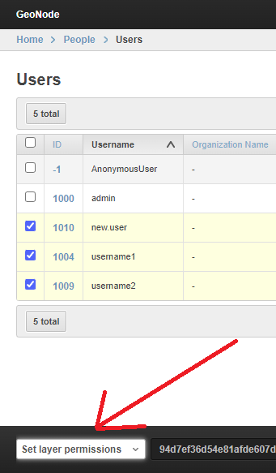
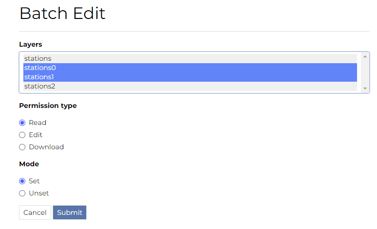
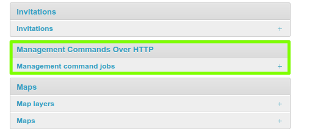
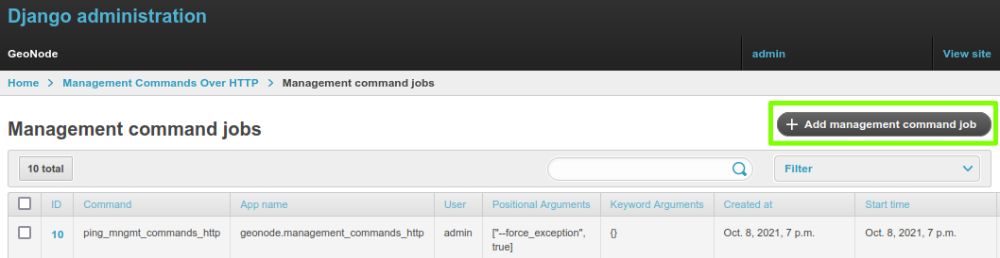
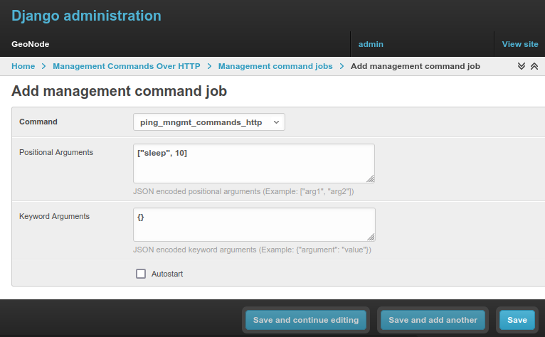
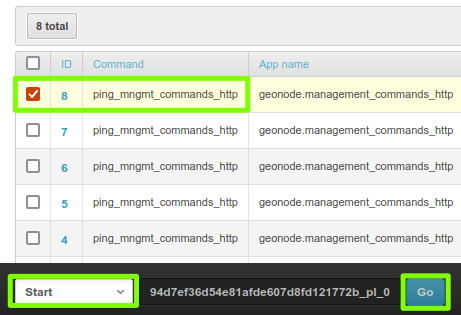
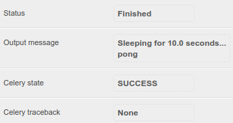
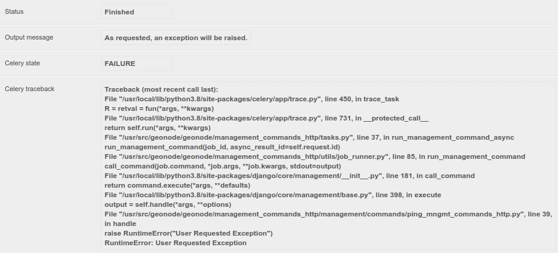

.. _migrate_baseurl:

Migrate GeoNode Base URL
========================

The ``migrate_baseurl`` :guilabel:`Management Command` allows you to fix all the GeoNode Links whenever, for some reason,
you need to change the :guilabel:`Domain Name` of :guilabel:`IP Address` of GeoNode.

This **must** be used also in the cases you'll need to change the network schema from ``HTTP`` to ``HTTPS``, as an instance.

First of all let's take a look at the :guilabel:`--help` option of the ``migrate_baseurl``
management command in order to inspect all the command options and features.

Run

.. code-block:: shell

    DJANGO_SETTINGS_MODULE=geonode.settings python manage.py migrate_baseurl --help

This will produce output that looks like the following

.. code-block:: shell

    usage: manage.py migrate_baseurl [-h] [--version] [-v {0,1,2,3}]
                                 [--settings SETTINGS]
                                 [--pythonpath PYTHONPATH] [--traceback]
                                 [--no-color] [-f]
                                 [--source-address SOURCE_ADDRESS]
                                 [--target-address TARGET_ADDRESS]

    Migrate GeoNode VM Base URL

    optional arguments:
    -h, --help            show this help message and exit
    --version             show program's version number and exit
    -v {0,1,2,3}, --verbosity {0,1,2,3}
                            Verbosity level; 0=minimal output, 1=normal output,
                            2=verbose output, 3=very verbose output
    --settings SETTINGS   The Python path to a settings module, e.g.
                            "myproject.settings.main". If this isn't provided, the
                            DJANGO_SETTINGS_MODULE environment variable will be
                            used.
    --pythonpath PYTHONPATH
                            A directory to add to the Python path, e.g.
                            "/home/djangoprojects/myproject".
    --traceback           Raise on CommandError exceptions
    --no-color            Don't colorize the command output.
    -f, --force           Forces the execution without asking for confirmation.
    --source-address SOURCE_ADDRESS
                            Source Address (the one currently on DB e.g.
                            http://192.168.1.23)
    --target-address TARGET_ADDRESS
                            Target Address (the one to be changed e.g. http://my-
                            public.geonode.org)

* **Example 1**: I want to move my GeoNode instance from  ``http:\\127.0.0.1`` to ``http:\\example.org``

    .. warning:: Make always sure you are using the **correct** settings

    .. code-block:: shell

        DJANGO_SETTINGS_MODULE=geonode.settings python manage.py migrate_baseurl --source-address=127.0.0.1 --target-address=example.org

* **Example 2**: I want to move my GeoNode instance from  ``http:\\example.org`` to ``https:\\example.org``

    .. warning:: Make always sure you are using the **correct** settings

    .. code-block:: shell

        DJANGO_SETTINGS_MODULE=geonode.settings python manage.py migrate_baseurl --source-address=http:\\example.org --target-address=https:\\example.org

* **Example 3**: I want to move my GeoNode instance from  ``https:\\example.org`` to ``https:\\geonode.example.org``

    .. warning:: Make always sure you are using the **correct** settings

    .. code-block:: shell

        DJANGO_SETTINGS_MODULE=geonode.settings python manage.py migrate_baseurl --source-address=example.org --target-address=geonode.example.org

.. note:: After migrating the base URL, make sure to sanitize the links and catalog metadata also (:ref:`sync_layers_and_metadata`).

.. _sync_layers_and_metadata:

Update Permissions, Metadata, Legends and Download Links
========================================================

The following three utility :guilabel:`Management Commands`, allow to fixup:

1. :guilabel:`Users/Groups Permissions` on :guilabel:`Datasets`; those will be refreshed and synchronized with the :guilabel:`GIS Server` ones also

2. :guilabel:`Metadata`, :guilabel:`Legend` and :guilabel:`Download` links on :guilabel:`Datasets` and :guilabel:`Maps`

3. Cleanup :guilabel:`Duplicated Links` and :guilabel:`Outdated Thumbnails`

Management Command ``sync_geonode_datasets``
--------------------------------------------

This command allows to sync already existing permissions on Datasets. In order to change/set Datasets' permissions refer to the section :ref:`batch_sync_permissions`

The options are:

* **filter**; Only update data the Dataset names that match the given filter.

* **username**; Only update data owned by the specified username.

* **updatepermissions**; Update the Dataset permissions; synchronize it back to the GeoSpatial Server.
  This option is also available from the :guilabel:`Layer Details` page.

* **updateattributes**; Update the Dataset attributes; synchronize it back to the GeoSpatial Server.
  This option is also available from the :guilabel:`Layer Details` page.

* **updatethumbnails**; Update the Dataset thumbnail.
  This option is also available from the :guilabel:`Layer Details` page.

* **updatebbox**; Update the Dataset BBOX and LotLan BBOX.
  This option is also available from the :guilabel:`Layer Details` page.

* **remove-duplicates**; Removes duplicated Links.

First of all let's take a look at the :guilabel:`--help` option of the ``sync_geonode_datasets``
management command in order to inspect all the command options and features.

Run

.. code-block:: shell

    DJANGO_SETTINGS_MODULE=geonode.settings python manage.py sync_geonode_datasets --help

.. note:: If you enabled ``local_settings.py`` the command will change as following:

    .. code-block:: shell

        DJANGO_SETTINGS_MODULE=geonode.local_settings python manage.py sync_geonode_datasets --help

This will produce output that looks like the following

.. code-block:: shell

    usage: manage.py sync_geonode_datasets [-h] [--version] [-v {0,1,2,3}]
                                        [--settings SETTINGS]
                                        [--pythonpath PYTHONPATH] [--traceback]
                                        [--no-color] [-i] [-d] [-f FILTER]
                                        [-u USERNAME] [--updatepermissions]
                                        [--updatethumbnails] [--updateattributes][--updatebbox]

    Update the GeoNode Datasets: permissions (including GeoFence database),
    statistics, thumbnails

    optional arguments:
    -h, --help            show this help message and exit
    --version             show program's version number and exit
    -v {0,1,2,3}, --verbosity {0,1,2,3}
                            Verbosity level; 0=minimal output, 1=normal output,
                            2=verbose output, 3=very verbose output
    --settings SETTINGS   The Python path to a settings module, e.g.
                            "myproject.settings.main". If this isn't provided, the
                            DJANGO_SETTINGS_MODULE environment variable will be
                            used.
    --pythonpath PYTHONPATH
                            A directory to add to the Python path, e.g.
                            "/home/djangoprojects/myproject".
    --traceback           Raise on CommandError exceptions
    --no-color            Don't colorize the command output.
    -i, --ignore-errors   Stop after any errors are encountered.
    -d, --remove-duplicates
                            Remove duplicates first.
    -f FILTER, --filter FILTER
                            Only update data the Datasets that match the given
                            filter.
    -u USERNAME, --username USERNAME
                            Only update data owned by the specified username.
    --updatepermissions   Update the Dataset permissions.
    --updatethumbnails    Update the Dataset styles and thumbnails.
    --updateattributes    Update the Dataset attributes.
    --updatebbox          Update the Dataset BBOX.

* **Example 1**: I want to update/sync all Datasets permissions and attributes with the GeoSpatial Server

    .. warning:: Make always sure you are using the **correct** settings

    .. code-block:: shell

        DJANGO_SETTINGS_MODULE=geonode.settings python manage.py sync_geonode_datasets --updatepermissions --updateattributes

* **Example 2**: I want to regenerate the Thumbnails of all the Datasets belonging to ``afabiani``

    .. warning:: Make always sure you are using the **correct** settings

    .. code-block:: shell

        DJANGO_SETTINGS_MODULE=geonode.settings python manage.py sync_geonode_datasets -u afabiani --updatethumbnails

Management Command ``sync_geonode_maps``
----------------------------------------

This command is basically similar to the previous one, but affects the :guilabel:`Maps`; with some limitations.

The options are:

* **filter**; Only update data the maps titles that match the given filter.

* **username**; Only update data owned by the specified username.

* **updatethumbnails**; Update the map styles and thumbnails.
  This option is also available from the :guilabel:`Map Details` page.

* **remove-duplicates**; Removes duplicated Links.

First of all let's take a look at the :guilabel:`--help` option of the ``sync_geonode_maps``
management command in order to inspect all the command options and features.

Run

.. code-block:: shell

    DJANGO_SETTINGS_MODULE=geonode.settings python manage.py sync_geonode_maps --help

.. note:: If you enabled ``local_settings.py`` the command will change as following:

    .. code-block:: shell

        DJANGO_SETTINGS_MODULE=geonode.local_settings python manage.py sync_geonode_maps --help

This will produce output that looks like the following

.. code-block:: shell

    usage: manage.py sync_geonode_maps [-h] [--version] [-v {0,1,2,3}]
                                    [--settings SETTINGS]
                                    [--pythonpath PYTHONPATH] [--traceback]
                                    [--no-color] [-i] [-d] [-f FILTER]
                                    [-u USERNAME] [--updatethumbnails]

    Update the GeoNode maps: permissions, thumbnails

    optional arguments:
    -h, --help            show this help message and exit
    --version             show program's version number and exit
    -v {0,1,2,3}, --verbosity {0,1,2,3}
                            Verbosity level; 0=minimal output, 1=normal output,
                            2=verbose output, 3=very verbose output
    --settings SETTINGS   The Python path to a settings module, e.g.
                            "myproject.settings.main". If this isn't provided, the
                            DJANGO_SETTINGS_MODULE environment variable will be
                            used.
    --pythonpath PYTHONPATH
                            A directory to add to the Python path, e.g.
                            "/home/djangoprojects/myproject".
    --traceback           Raise on CommandError exceptions
    --no-color            Don't colorize the command output.
    -i, --ignore-errors   Stop after any errors are encountered.
    -d, --remove-duplicates
                            Remove duplicates first.
    -f FILTER, --filter FILTER
                            Only update data the maps that match the given filter.
    -u USERNAME, --username USERNAME
                            Only update data owned by the specified username.
    --updatethumbnails    Update the map styles and thumbnails.

* **Example 1**: I want to regenerate the Thumbnail of the Map ``This is a test Map``

    .. warning:: Make always sure you are using the **correct** settings

    .. code-block:: shell

        DJANGO_SETTINGS_MODULE=geonode.settings python manage.py sync_geonode_maps --updatethumbnails -f 'This is a test Map'

Management Command ``set_all_datasets_metadata``
----------------------------------------------

This command allows to reset **Metadata Attributes** and **Catalogue Schema** on Datasets. The command will also update the :guilabel:`CSW Catalogue` XML and Links of GeoNode.

The options are:

* **filter**; Only update data the Datasets that match the given filter.

* **username**; Only update data owned by the specified username.

* **remove-duplicates**; Update the map styles and thumbnails.

* **delete-orphaned-thumbs**; Removes duplicated Links.
* 
* **set-uuid**; will refresh the UUID based on the UUID_HANDLER if configured (Default False).
* 
* **set_attrib**; If set will refresh the attributes of the resource taken from Geoserver. (Default True).
* 
* **set_links**; If set will refresh the links of the resource. (Default True).

First of all let's take a look at the :guilabel:`--help` option of the ``set_all_datasets_metadata``
management command in order to inspect all the command options and features.

Run

.. code-block:: shell

    DJANGO_SETTINGS_MODULE=geonode.settings python manage.py set_all_datasets_metadata --help

.. note:: If you enabled ``local_settings.py`` the command will change as following:

    .. code-block:: shell

        DJANGO_SETTINGS_MODULE=geonode.local_settings python manage.py set_all_datasets_metadata --help

This will produce output that looks like the following

.. code-block:: shell

    usage: manage.py set_all_datasets_metadata [-h] [--version] [-v {0,1,2,3}]
                                            [--settings SETTINGS]
                                            [--pythonpath PYTHONPATH]
                                            [--traceback] [--no-color] [-i] [-d]
                                            [-t] [-f FILTER] [-u USERNAME]

    Resets Metadata Attributes and Schema to All Datasets

    optional arguments:
    -h, --help            show this help message and exit
    --version             show program's version number and exit
    -v {0,1,2,3}, --verbosity {0,1,2,3}
                            Verbosity level; 0=minimal output, 1=normal output,
                            2=verbose output, 3=very verbose output
    --settings SETTINGS   The Python path to a settings module, e.g.
                            "myproject.settings.main". If this isn't provided, the
                            DJANGO_SETTINGS_MODULE environment variable will be
                            used.
    --pythonpath PYTHONPATH
                            A directory to add to the Python path, e.g.
                            "/home/djangoprojects/myproject".
    --traceback           Raise on CommandError exceptions
    --no-color            Don't colorize the command output.
    -i, --ignore-errors   Stop after any errors are encountered.
    -d, --remove-duplicates
                            Remove duplicates first.
    -t, --delete-orphaned-thumbs
                            Delete Orphaned Thumbnails.
    -f FILTER, --filter FILTER
                            Only update data the Datasets that match the given
                            filter
    -u USERNAME, --username USERNAME
                            Only update data owned by the specified username

* **Example 1**: After having changed the Base URL, I want to regenerate all the Catalogue Schema and eventually remove all duplicates.

    .. warning:: Make always sure you are using the **correct** settings

    .. code-block:: shell

        DJANGO_SETTINGS_MODULE=geonode.settings python manage.py set_all_datasets_metadata -d

.. _load_data_into_geonode:

Loading Data into GeoNode
=========================

There are situations where it is not possible or not convenient to use the
:guilabel:`Upload Form` to add new Datasets to GeoNode via the web interface.
For instance:

* The dataset is too big to be uploaded through a web interface.

* Import data from a mass storage programmatically.

* Import tables from a database.

This section will walk you through the various options available to load data into your
GeoNode from GeoServer, from the command-line or programmatically.

.. warning:: Some parts of this section have been taken from the `GeoServer <https://geoserver.geo-solutions.it/edu/en>`_ project and training documentation.

.. _importlayers:

Management Command ``importlayers``
-----------------------------------

The ``geonode.geoserver`` Django app includes 2 management commands that you can use to
load data in your GeoNode.

Both of them can be invoked by using the ``manage.py`` script.

First of all let's take a look at the :guilabel:`--help` option of the ``importlayers``
management command in order to inspect all the command options and features.

Run

.. code-block:: shell

    DJANGO_SETTINGS_MODULE=geonode.settings python manage.py importlayers --help

.. note:: If you enabled ``local_settings.py`` the command will change as following:

    .. code-block:: shell

        DJANGO_SETTINGS_MODULE=geonode.local_settings python manage.py importlayers --help

This will produce output that looks like the following

.. code-block:: shell

    usage: manage.py importlayers [-h] [-hh HOST] [-u USERNAME] [-p PASSWORD] 
                                  [--version] [-v {0,1,2,3}] [--settings SETTINGS] 
                                  [--pythonpath PYTHONPATH] [--traceback] [--no-color]
                                  [--force-color] [--skip-checks]
                                  [path [path ...]]

    Brings files from a local directory, including subfolders, into a GeoNode site.
    The datasets are added to the Django database, the GeoServer configuration, and the
    pycsw metadata index. At this moment only files of type Esri Shapefile (.shp) and GeoTiff (.tif) are supported.
    In order to perform the import, GeoNode must be up and running.

    positional arguments:
    path                  path [path...]

    optional arguments:
    -h, --help            show this help message and exit
    --version             show program's version number and exit
    -v {0,1,2,3}, --verbosity {0,1,2,3}
                            Verbosity level; 0=minimal output, 1=normal output,
                            2=verbose output, 3=very verbose output
    --settings SETTINGS   The Python path to a settings module, e.g.
                            "myproject.settings.main". If this isn't provided, the
                            DJANGO_SETTINGS_MODULE environment variable will be
                            used.
    --pythonpath PYTHONPATH
                            A directory to add to the Python path, e.g.
                            "/home/djangoprojects/myproject".
    -hh HOST, --host HOST
                            Geonode host url
    -u USERNAME, --username USERNAME
                            Geonode username
    -p PASSWORD, --password PASSWORD
                            Geonode password

While the description of most of the options should be self explanatory, its worth
reviewing some of the key options a bit more in details.

- The :guilabel:`-hh` Identifies the GeoNode server where we want to upload our Datasets. The default value is :guilabel:`http://localhost:8000`.
- The :guilabel:`-u` Identifies the username for the login. The default value is :guilabel:`admin`.
- The :guilabel:`-p` Identifies the password for the login. The default value is :guilabel:`admin`.

The import Datasets management command is invoked by specifying options as described
above and specifying the path to a directory that contains multiple files. For purposes of this exercise, let's use the default set of testing Datasets that ship with geonode.
You can replace this path with a directory to your own shapefiles.

.. code-block:: shell
    First let's run the GeoNode server:
    DJANGO_SETTINGS_MODULE=geonode.settings python manage.py runserver

    Then let's import the files:
    DJANGO_SETTINGS_MODULE=geonode.settings python manage.py importlayers /home/user/.virtualenvs/geonode/lib/python3.8/site-packages/gisdata/data/good/vector/

This command will produce the following output to your terminal

.. code-block:: shell

    san_andres_y_providencia_poi.shp: 201
    san_andres_y_providencia_location.shp: 201
    san_andres_y_providencia_administrative.shp: 201
    san_andres_y_providencia_coastline.shp: 201
    san_andres_y_providencia_highway.shp: 201
    single_point.shp: 201
    san_andres_y_providencia_water.shp: 201
    san_andres_y_providencia_natural.shp: 201

    1.7456605294117646 seconds per Dataset

    Output data: {
        "success": [
            "san_andres_y_providencia_poi.shp",
            "san_andres_y_providencia_location.shp",
            "san_andres_y_providencia_administrative.shp",
            "san_andres_y_providencia_coastline.shp",
            "san_andres_y_providencia_highway.shp",
            "single_point.shp",
            "san_andres_y_providencia_water.shp",
            "san_andres_y_providencia_natural.shp"
        ],
        "errors": []
    }

As output the command will print:

.. code-block:: shell
    layer_name: status code for each Layer
    
    upload_time spent of each Dataset

    A json with the representation of the Datasets uploaded or with some errors.

The status code, is the response coming from GeoNode. For example 201 means that the Dataset has been correctly uploaded

If you encounter errors while running this command, please check the GeoNode logs for more information.

.. _updatelayers:

Management Command ``updatelayers``
-----------------------------------

While it is possible to import Datasets directly from your servers filesystem into your
GeoNode, you may have an existing GeoServer that already has data in it, or you may
want to configure data from a GeoServer which is not directly supported by uploading data.

GeoServer supports a wide range of data formats and connections to database, some of them 
may not be supported as GeoNode upload formats. You can add them to your GeoNode by following the procedure described below.

GeoServer supports 4 types of data: :guilabel:`Raster`, :guilabel:`Vector`, :guilabel:`Databases` and :guilabel:`Cascaded`.

For a list of the supported formats for each type of data, consult the following pages:

- https://docs.geoserver.org/latest/en/user/data/vector/index.html
- https://docs.geoserver.org/latest/en/user/data/raster/index.html
- https://docs.geoserver.org/latest/en/user/data/database/index.html
- https://docs.geoserver.org/latest/en/user/data/cascaded/index.html

.. note:: Some of these raster or vector formats or database types require that you install specific plugins in your GeoServer in order to use the. Please consult the GeoServer documentation for more information.

Data from a PostGIS database
^^^^^^^^^^^^^^^^^^^^^^^^^^^^

Lets walk through an example of configuring a new PostGIS database in GeoServer and then
configuring those Datasets in your GeoNode.

First visit the GeoServer administration interface on your server. This is usually on port 8080 and is available at http://localhost:8080/geoserver/web/

1. You should login with the superuser credentials you setup when you first configured your GeoNode instance.

    Once you are logged in to the GeoServer Admin interface, you should see the following.

    .. figure:: img/geoserver_admin.png
       :align: center

    .. note:: The number of stores, Datasets and workspaces may be different depending on what you already have configured in your GeoServer.

2. Next you want to select the "Stores" option in the left hand menu, and then the "Add new Store" option. The following screen will be displayed.

    .. figure:: img/geoserver_new_store.png
       :align: center

3. In this case, we want to select the PostGIS store type to create a connection to our existing database. On the next screen you will need to enter the parameters to connect to your PostGIS database (alter as necessary for your own database).

    .. figure:: img/geoserver_postgis_params.png
       :align: center

    .. note:: If you are unsure about any of the settings, leave them as the default.

4. The next screen lets you configure the Datasets in your database. This will of course be different depending on the Datasets in your database.

    .. figure:: img/geoserver_publish_layers.png
       :align: center

5. Select the "Publish" button for one of the Datasets and the next screen will be displayed where you can enter metadata for this Dataset. Since we will be managing this metadata in GeoNode, we can leave these alone for now.

    .. figure:: img/geoserver_layer_params.png
       :align: center

6. The things that *must* be specified are the Declared SRS and you must select the "Compute from Data" and "Compute from native bounds" links after the SRS is specified.

    .. figure:: img/geoserver_srs.png
       :align: center

    .. figure:: img/geoserver_srs_2.png
       :align: center

7. Click save and this Dataset will now be configured for use in your GeoServer.

    .. figure:: img/geoserver_layers.png
       :align: center

8. The next step is to configure these Datasets in GeoNode. The ``updatelayers`` management command can be used for this purpose. As with ``importlayers``, it's useful to look at the command line options for this command by passing the :guilabel:`--help` option

    Run

    .. code-block:: shell

        DJANGO_SETTINGS_MODULE=geonode.settings python manage.py updatelayers --help

    .. note:: If you enabled ``local_settings.py`` the command will change as following:

        .. code-block:: shell

            DJANGO_SETTINGS_MODULE=geonode.local_settings python manage.py updatelayers --help

    This will produce output that looks like the following

    .. code-block:: shell

        usage: manage.py updatelayers [-h] [--version] [-v {0,1,2,3}]
                                    [--settings SETTINGS] [--pythonpath PYTHONPATH]
                                    [--traceback] [--no-color] [-i]
                                    [--skip-unadvertised]
                                    [--skip-geonode-registered] [--remove-deleted]
                                    [-u USER] [-f FILTER] [-s STORE] [-w WORKSPACE]
                                    [-p PERMISSIONS]

        Update the GeoNode application with data from GeoServer

        optional arguments:
        -h, --help            show this help message and exit
        --version             show program's version number and exit
        -v {0,1,2,3}, --verbosity {0,1,2,3}
                                Verbosity level; 0=minimal output, 1=normal output,
                                2=verbose output, 3=very verbose output
        --settings SETTINGS   The Python path to a settings module, e.g.
                                "myproject.settings.main". If this isn't provided, the
                                DJANGO_SETTINGS_MODULE environment variable will be
                                used.
        --pythonpath PYTHONPATH
                                A directory to add to the Python path, e.g.
                                "/home/djangoprojects/myproject".
        --traceback           Raise on CommandError exceptions
        --no-color            Don't colorize the command output.
        -i, --ignore-errors   Stop after any errors are encountered.
        --skip-unadvertised   Skip processing unadvertised Datasets from GeoSever.
        --skip-geonode-registered
                                Just processing GeoServer Datasets still not registered
                                in GeoNode.
        --remove-deleted      Remove GeoNode Datasets that have been deleted from
                                GeoSever.
        -u USER, --user USER  Name of the user account which should own the imported
                                Datasets
        -f FILTER, --filter FILTER
                                Only update data the Datasets that match the given
                                filter
        -s STORE, --store STORE
                                Only update data the Datasets for the given geoserver
                                store name
        -w WORKSPACE, --workspace WORKSPACE
                                Only update data on specified workspace
        -p PERMISSIONS, --permissions PERMISSIONS
                                Permissions to apply to each Dataset

The update procedure includes the following steps:

    - The process fetches from GeoServer the relevant WMS layers (all, by store or by workspace)

    - If a filter is defined, the GeoServer layers are filtered

    - For each of the layers, a GeoNode dataset is created based on the metadata registered on GeoServer (title, abstract, bounds)

    - New layers are added, existing layers are replaced, unless the :guilabel:`--skip-geonode-registered` option is used

    - The GeoNode layers, added in previous runs of the update process, which are no longer available in GeoServer are removed, if the :guilabel:`--remove-delete` option is set

.. warning:: One of the :guilabel:`--workspace` or :guilabel:`--store` must be always specified if you want to ingest Datasets belonging to a specific ``Workspace``. As an instance, in order to ingest the Datasets present into the ``geonode`` workspace, you will need to specify the option ``-w geonode``.

9. Let's ingest the Dataset ``geonode:_1_SARMIENTO_ENERO_2018`` from the ``geonode`` workspace.

    .. code-block:: shell

        DJANGO_SETTINGS_MODULE=geonode.settings python manage.py updatelayers -w geonode -f _1_SARMIENTO_ENERO_2018

    .. code-block:: shell

        Inspecting the available Datasets in GeoServer ...
        Found 1 Datasets, starting processing
        /usr/local/lib/python2.7/site-packages/owslib/iso.py:117: FutureWarning: the .identification and .serviceidentification properties will merge into .identification being a list of properties.  This is currently implemented in .identificationinfo.  Please see https://github.com/geopython/OWSLib/issues/38 for more information
        FutureWarning)
        /usr/local/lib/python2.7/site-packages/owslib/iso.py:495: FutureWarning: The .keywords and .keywords2 properties will merge into the .keywords property in the future, with .keywords becoming a list of MD_Keywords instances. This is currently implemented in .keywords2. Please see https://github.com/geopython/OWSLib/issues/301 for more information
        FutureWarning)
        Content-Type: text/html; charset="utf-8"
        MIME-Version: 1.0
        Content-Transfer-Encoding: 7bit
        Subject: [master.demo.geonode.org] A new Dataset has been uploaded
        From: webmaster@localhost
        To: mapadeldelito@chubut.gov.ar
        Reply-To: webmaster@localhost
        Date: Tue, 08 Oct 2019 12:26:17 -0000
        Message-ID: <20191008122617.28801.94967@d3cf85425231>

        <body>
        You have received the following notice from master.demo.geonode.org:
        

        The user <i><a href="http://master.demo.geonode.org/people/profile/admin">admin</a></i> uploaded the following Dataset: 
        <strong>_1_SARMIENTO_ENERO_2018</strong> 
        You can visit the Dataset's detail page here: http://master.demo.geonode.org/Datasets/geonode:_1_SARMIENTO_ENERO_2018

        

        

        To change how you receive notifications, please go to http://master.demo.geonode.org
        

        </body>

        -------------------------------------------------------------------------------
        Content-Type: text/html; charset="utf-8"
        MIME-Version: 1.0
        Content-Transfer-Encoding: 7bit
        Subject: [master.demo.geonode.org] A new Dataset has been uploaded
        From: webmaster@localhost
        To: giacomo8vinci@gmail.com
        Reply-To: webmaster@localhost
        Date: Tue, 08 Oct 2019 12:26:17 -0000
        Message-ID: <20191008122617.28801.53784@d3cf85425231>

        <body>
        You have received the following notice from master.demo.geonode.org:
        

        The user <i><a href="http://master.demo.geonode.org/people/profile/admin">admin</a></i> uploaded the following Dataset: 
        <strong>_1_SARMIENTO_ENERO_2018</strong> 
        You can visit the Dataset's detail page here: http://master.demo.geonode.org/Datasets/geonode:_1_SARMIENTO_ENERO_2018

        

        

        To change how you receive notifications, please go to http://master.demo.geonode.org
        

        </body>

        -------------------------------------------------------------------------------
        Content-Type: text/html; charset="utf-8"
        MIME-Version: 1.0
        Content-Transfer-Encoding: 7bit
        Subject: [master.demo.geonode.org] A new Dataset has been uploaded
        From: webmaster@localhost
        To: fmgagliano@gmail.com
        Reply-To: webmaster@localhost
        Date: Tue, 08 Oct 2019 12:26:17 -0000
        Message-ID: <20191008122617.28801.26265@d3cf85425231>

        <body>
        You have received the following notice from master.demo.geonode.org:
        

        The user <i><a href="http://master.demo.geonode.org/people/profile/admin">admin</a></i> uploaded the following Dataset: 
        <strong>_1_SARMIENTO_ENERO_2018</strong> 
        You can visit the Dataset's detail page here: http://master.demo.geonode.org/Datasets/geonode:_1_SARMIENTO_ENERO_2018

        

        

        To change how you receive notifications, please go to http://master.demo.geonode.org
        

        </body>

        -------------------------------------------------------------------------------
        Found geoserver resource for this Dataset: _1_SARMIENTO_ENERO_2018
        ... Creating Default Resource Links for Layer [geonode:_1_SARMIENTO_ENERO_2018]
        -- Resource Links[Prune old links]...
        -- Resource Links[Prune old links]...done!
        -- Resource Links[Compute parameters for the new links]...
        -- Resource Links[Create Raw Data download link]...
        -- Resource Links[Create Raw Data download link]...done!
        -- Resource Links[Set download links for WMS, WCS or WFS and KML]...
        -- Resource Links[Set download links for WMS, WCS or WFS and KML]...done!
        -- Resource Links[Legend link]...
        -- Resource Links[Legend link]...done!
        -- Resource Links[Thumbnail link]...
        -- Resource Links[Thumbnail link]...done!
        -- Resource Links[OWS Links]...
        -- Resource Links[OWS Links]...done!
        Content-Type: text/html; charset="utf-8"
        MIME-Version: 1.0
        Content-Transfer-Encoding: 7bit
        Subject: [master.demo.geonode.org] A Dataset has been updated
        From: webmaster@localhost
        To: mapadeldelito@chubut.gov.ar
        Reply-To: webmaster@localhost
        Date: Tue, 08 Oct 2019 12:26:20 -0000
        Message-ID: <20191008122620.28801.81598@d3cf85425231>

        <body>
        You have received the following notice from master.demo.geonode.org:
        

        The following Dataset was updated: 
        <strong>_1_SARMIENTO_ENERO_2018</strong>, owned by <i><a href="http://master.demo.geonode.org/people/profile/admin">admin</a></i> 
        You can visit the Dataset's detail page here: http://master.demo.geonode.org/Datasets/geonode:_1_SARMIENTO_ENERO_2018

        

        

        To change how you receive notifications, please go to http://master.demo.geonode.org
        

        </body>

        -------------------------------------------------------------------------------
        Content-Type: text/html; charset="utf-8"
        MIME-Version: 1.0
        Content-Transfer-Encoding: 7bit
        Subject: [master.demo.geonode.org] A Dataset has been updated
        From: webmaster@localhost
        To: giacomo8vinci@gmail.com
        Reply-To: webmaster@localhost
        Date: Tue, 08 Oct 2019 12:26:20 -0000
        Message-ID: <20191008122620.28801.93778@d3cf85425231>

        <body>
        You have received the following notice from master.demo.geonode.org:
        

        The following Dataset was updated: 
        <strong>_1_SARMIENTO_ENERO_2018</strong>, owned by <i><a href="http://master.demo.geonode.org/people/profile/admin">admin</a></i> 
        You can visit the Dataset's detail page here: http://master.demo.geonode.org/Datasets/geonode:_1_SARMIENTO_ENERO_2018

        

        

        To change how you receive notifications, please go to http://master.demo.geonode.org
        

        </body>

        -------------------------------------------------------------------------------
        Content-Type: text/html; charset="utf-8"
        MIME-Version: 1.0
        Content-Transfer-Encoding: 7bit
        Subject: [master.demo.geonode.org] A Dataset has been updated
        From: webmaster@localhost
        To: fmgagliano@gmail.com
        Reply-To: webmaster@localhost
        Date: Tue, 08 Oct 2019 12:26:20 -0000
        Message-ID: <20191008122620.28801.58585@d3cf85425231>

        <body>
        You have received the following notice from master.demo.geonode.org:
        

        The following Dataset was updated: 
        <strong>_1_SARMIENTO_ENERO_2018</strong>, owned by <i><a href="http://master.demo.geonode.org/people/profile/admin">admin</a></i> 
        You can visit the Dataset's detail page here: http://master.demo.geonode.org/Datasets/geonode:_1_SARMIENTO_ENERO_2018

        

        

        To change how you receive notifications, please go to http://master.demo.geonode.org
        

        </body>

        -------------------------------------------------------------------------------
        Found geoserver resource for this Dataset: _1_SARMIENTO_ENERO_2018
        /usr/local/lib/python2.7/site-packages/geoserver/style.py:80: FutureWarning: The behavior of this method will change in future versions.  Use specific 'len(elem)' or 'elem is not None' test instead.
        if not user_style:
        /usr/local/lib/python2.7/site-packages/geoserver/style.py:84: FutureWarning: The behavior of this method will change in future versions.  Use specific 'len(elem)' or 'elem is not None' test instead.
        if user_style:
        ... Creating Default Resource Links for Layer [geonode:_1_SARMIENTO_ENERO_2018]
        -- Resource Links[Prune old links]...
        -- Resource Links[Prune old links]...done!
        -- Resource Links[Compute parameters for the new links]...
        -- Resource Links[Create Raw Data download link]...
        -- Resource Links[Create Raw Data download link]...done!
        -- Resource Links[Set download links for WMS, WCS or WFS and KML]...
        -- Resource Links[Set download links for WMS, WCS or WFS and KML]...done!
        -- Resource Links[Legend link]...
        -- Resource Links[Legend link]...done!
        -- Resource Links[Thumbnail link]...
        -- Resource Links[Thumbnail link]...done!
        -- Resource Links[OWS Links]...
        -- Resource Links[OWS Links]...done!
        [created] Layer _1_SARMIENTO_ENERO_2018 (1/1)

        Finished processing 1 Datasets in 5.0 seconds.

        1 Created Datasets
        0 Updated Datasets
        0 Failed Datasets
        5.000000 seconds per Dataset

.. note:: In case you don't specify the :guilabel:`-f` option, the Datasets that already exists in your GeoNode will be just updated and the configuration synchronized between GeoServer and GeoNode.

.. warning:: When updating **from** GeoServer, the configuration on GeoNode will be changed!

.. _gdal_ogr_data_processing:

Using ``GDAL`` and ``OGR`` to convert your Data for use in GeoNode
------------------------------------------------------------------

GeoNode supports uploading data in :guilabel:`ESRI shapefiles`, :guilabel:`GeoTIFF`, :guilabel:`CSV`, :guilabel:`GeoJSON`, :guilabel:`ASCII-GRID` and :guilabel:`KML / KMZ` formats (for the last three formats only if you are using the ``geonode.importer`` backend).

* If your data is in other formats, you will need to convert it into one of these formats for use in GeoNode.

* If your :guilabel:`Raster` data is not correctly processed, it might be almost unusable with GeoServer and GeoNode. You will need to process it using `GDAL`.

You need to make sure that you have the GDAL library installed on your system.
On Ubuntu you can install this package with the following command:

.. code-block:: shell

    sudo apt-get install gdal-bin

OGR (Vector Data)
^^^^^^^^^^^^^^^^^

OGR is used to manipulate vector data. In this example, we will use MapInfo .tab files and convert them to shapefiles with the ogr2ogr command. We will use sample MapInfo files from the website linked below.

http://services.land.vic.gov.au/landchannel/content/help?name=sampledata

You can download the Admin;(Postcode) Dataset by issuing the following command::

    $ wget http://services.land.vic.gov.au/sampledata/shape/admin_postcode_vm.zip

You will need to unzip this dataset by issuing the following command::

    $ unzip admin_postcode_vm.zip

This will leave you with the following files in the directory where you executed the above commands::

    |-- ANZVI0803003025.htm
    |-- DSE_Data_Access_Licence.pdf
    |-- VMADMIN.POSTCODE_POLYGON.xml
    |-- admin_postcode_vm.zip
    --- vicgrid94
        --- mif
            --- lga_polygon
                --- macedon\ ranges
                    |-- EXTRACT_POLYGON.mid
                    |-- EXTRACT_POLYGON.mif
                    --- VMADMIN
                        |-- POSTCODE_POLYGON.mid
                        --- POSTCODE_POLYGON.mif

First, lets inspect this file set using the following command::

    $ ogrinfo -so vicgrid94/mif/lga_polygon/macedon\ ranges/VMADMIN/POSTCODE_POLYGON.mid POSTCODE_POLYGON

The output will look like the following::

    Had to open data source read-only.
    INFO: Open of `vicgrid94/mif/lga_polygon/macedon ranges/VMADMIN/POSTCODE_POLYGON.mid'
        using driver `MapInfo File' successful.

    Layer name: POSTCODE_POLYGON
    Geometry: 3D Unknown (any)
    Feature Count: 26
    Extent: (2413931.249367, 2400162.366186) - (2508952.174431, 2512183.046927)
    Layer SRS WKT:
    PROJCS["unnamed",
        GEOGCS["unnamed",
            DATUM["GDA94",
                SPHEROID["GRS 80",6378137,298.257222101],
                TOWGS84[0,0,0,-0,-0,-0,0]],
            PRIMEM["Greenwich",0],
            UNIT["degree",0.0174532925199433]],
        PROJECTION["Lambert_Conformal_Conic_2SP"],
        PARAMETER["standard_parallel_1",-36],
        PARAMETER["standard_parallel_2",-38],
        PARAMETER["latitude_of_origin",-37],
        PARAMETER["central_meridian",145],
        PARAMETER["false_easting",2500000],
        PARAMETER["false_northing",2500000],
        UNIT["Meter",1]]
    PFI: String (10.0)
    POSTCODE: String (4.0)
    FEATURE_TYPE: String (6.0)
    FEATURE_QUALITY_ID: String (20.0)
    PFI_CREATED: Date (10.0)
    UFI: Real (12.0)
    UFI_CREATED: Date (10.0)
    UFI_OLD: Real (12.0)

This gives you information about the number of features, the extent, the projection and the attributes of this Dataset.

Next, lets go ahead and convert this Dataset into a shapefile by issuing the following command::

    $ ogr2ogr -t_srs EPSG:4326 postcode_polygon.shp vicgrid94/mif/lga_polygon/macedon\ ranges/VMADMIN/POSTCODE_POLYGON.mid POSTCODE_POLYGON

Note that we have also reprojected the Dataset to the WGS84 spatial reference system with the -t_srs ogr2ogr option.

The output of this command will look like the following::

    Warning 6: Normalized/laundered field name: 'FEATURE_TYPE' to 'FEATURE_TY'
    Warning 6: Normalized/laundered field name: 'FEATURE_QUALITY_ID' to 'FEATURE_QU'
    Warning 6: Normalized/laundered field name: 'PFI_CREATED' to 'PFI_CREATE'
    Warning 6: Normalized/laundered field name: 'UFI_CREATED' to 'UFI_CREATE'

This output indicates that some of the field names were truncated to fit into the constraint that attributes in shapefiles are only 10 characters long.

You will now have a set of files that make up the postcode_polygon.shp shapefile set. We can inspect them by issuing the following command::

    $ ogrinfo -so postcode_polygon.shp postcode_polygon

The output will look similar to the output we saw above when we inspected the MapInfo file we converted from::

    INFO: Open of `postcode_polygon.shp'
          using driver `ESRI Shapefile' successful.

    Layer name: postcode_polygon
    Geometry: Polygon
    Feature Count: 26
    Extent: (144.030296, -37.898156) - (145.101137, -36.888878)
    Layer SRS WKT:
    GEOGCS["GCS_WGS_1984",
        DATUM["WGS_1984",
            SPHEROID["WGS_84",6378137,298.257223563]],
        PRIMEM["Greenwich",0],
        UNIT["Degree",0.017453292519943295]]
    PFI: String (10.0)
    POSTCODE: String (4.0)
    FEATURE_TY: String (6.0)
    FEATURE_QU: String (20.0)
    PFI_CREATE: Date (10.0)
    UFI: Real (12.0)
    UFI_CREATE: Date (10.0)
    UFI_OLD: Real (12.0)

These files can now be loaded into your GeoNode instance via the normal uploader.

Visit the upload page in your GeoNode, drag and drop the files that composes the shapefile that you have generated using the GDAL ogr2ogr command (postcode_polygon.dbf, postcode_polygon.prj, postcode_polygon.shp, postcode_polygon.shx). Give the permissions as needed and then click the "Upload files" button.

.. figure:: img/upload_shapefile.png
   :align: center

As soon as the import process completes, you will have the possibility to go straight to the Dataset info page ("Layer Info" button), or to edit the metadata for that Dataset ("Edit Metadata" button), or to manage the styles for that Dataset ("Manage Styles").

.. figure:: img/layer_info_vector.png
   :align: center

GDAL (Raster Data)
^^^^^^^^^^^^^^^^^^

Let's see several examples on how to either convert raster data into different formats and/or process it to get the best performances.

References:

a) https://geoserver.geo-solutions.it/edu/en/raster_data/processing.html

b) https://geoserver.geo-solutions.it/edu/en/raster_data/advanced_gdal/

Raster Data Conversion: Arc/Info Binary and ASCII Grid data into GeoTIFF format.
++++++++++++++++++++++++++++++++++++++++++++++++++++++++++++++++++++++++++++++++

Let's assume we have a sample ASCII Grid file compressed as an archive.

.. code-block:: shell

    # Un-tar the files
    tar -xvf sample_asc.tar

You will be left with the following files on your filesystem:

.. code-block:: shell

    |-- batemans_ele
    |   |-- dblbnd.adf
    |   |-- hdr.adf
    |   |-- metadata.xml
    |   |-- prj.adf
    |   |-- sta.adf
    |   |-- w001001.adf
    |   |-- w001001x.adf
    |-- batemans_elevation.asc

The file ``batemans_elevation.asc`` is an Arc/Info ASCII Grid file and the files in
the batemans_ele directory are an Arc/Info Binary Grid file.

You can use the ``gdalinfo`` command to inspect both of these files by executing the
following command:

.. code-block:: shell

    gdalinfo batemans_elevation.asc

The output should look like the following:

.. code-block:: shell

    Driver: AAIGrid/Arc/Info ASCII Grid
    Files: batemans_elevation.asc
    Size is 155, 142
    Coordinate System is `'
    Origin = (239681.000000000000000,6050551.000000000000000)
    Pixel Size = (100.000000000000000,-100.000000000000000)
    Corner Coordinates:
    Upper Left  (  239681.000, 6050551.000)
    Lower Left  (  239681.000, 6036351.000)
    Upper Right (  255181.000, 6050551.000)
    Lower Right (  255181.000, 6036351.000)
    Center      (  247431.000, 6043451.000)
    Band 1 Block=155x1 Type=Float32, ColorInterp=Undefined
        NoData Value=-9999

You can then inspect the batemans_ele files by executing the following command:

.. code-block:: shell

    gdalinfo batemans_ele

And this should be the corresponding output:

.. code-block:: shell

    Driver: AIG/Arc/Info Binary Grid
    Files: batemans_ele
        batemans_ele/dblbnd.adf
        batemans_ele/hdr.adf
        batemans_ele/metadata.xml
        batemans_ele/prj.adf
        batemans_ele/sta.adf
        batemans_ele/w001001.adf
        batemans_ele/w001001x.adf
    Size is 155, 142
    Coordinate System is:
    PROJCS["unnamed",
        GEOGCS["GDA94",
            DATUM["Geocentric_Datum_of_Australia_1994",
                SPHEROID["GRS 1980",6378137,298.257222101,
                    AUTHORITY["EPSG","7019"]],
                TOWGS84[0,0,0,0,0,0,0],
                AUTHORITY["EPSG","6283"]],
            PRIMEM["Greenwich",0,
                AUTHORITY["EPSG","8901"]],
            UNIT["degree",0.0174532925199433,
                AUTHORITY["EPSG","9122"]],
            AUTHORITY["EPSG","4283"]],
        PROJECTION["Transverse_Mercator"],
        PARAMETER["latitude_of_origin",0],
        PARAMETER["central_meridian",153],
        PARAMETER["scale_factor",0.9996],
        PARAMETER["false_easting",500000],
        PARAMETER["false_northing",10000000],
        UNIT["METERS",1]]
    Origin = (239681.000000000000000,6050551.000000000000000)
    Pixel Size = (100.000000000000000,-100.000000000000000)
    Corner Coordinates:
    Upper Left  (  239681.000, 6050551.000) (150d 7'28.35"E, 35d39'16.56"S)
    Lower Left  (  239681.000, 6036351.000) (150d 7'11.78"E, 35d46'56.89"S)
    Upper Right (  255181.000, 6050551.000) (150d17'44.07"E, 35d39'30.83"S)
    Lower Right (  255181.000, 6036351.000) (150d17'28.49"E, 35d47'11.23"S)
    Center      (  247431.000, 6043451.000) (150d12'28.17"E, 35d43'13.99"S)
    Band 1 Block=256x4 Type=Float32, ColorInterp=Undefined
        Min=-62.102 Max=142.917
    NoData Value=-3.4028234663852886e+38

You will notice that the ``batemans_elevation.asc`` file does *not* contain projection information while the ``batemans_ele`` file does.
Because of this, let's use the ``batemans_ele`` files for this exercise and convert them to a GeoTiff for use in GeoNode.
We will also reproject this file into WGS84 in the process. This can be accomplished with the following command.

.. code-block:: shell

    gdalwarp -t_srs EPSG:4326 batemans_ele batemans_ele.tif

The output will show you the progress of the conversion and when it is complete,
you will be left with a ``batemans_ele.tif`` file that you can upload to your GeoNode.

You can inspect this file with the gdalinfo command:

.. code-block:: shell

    gdalinfo batemans_ele.tif

Which will produce the following output:

.. code-block:: shell

    Driver: GTiff/GeoTIFF
    Files: batemans_ele.tif
    Size is 174, 130
    Coordinate System is:
    GEOGCS["WGS 84",
        DATUM["WGS_1984",
            SPHEROID["WGS 84",6378137,298.257223563,
                AUTHORITY["EPSG","7030"]],
            AUTHORITY["EPSG","6326"]],
        PRIMEM["Greenwich",0],
        UNIT["degree",0.0174532925199433],
        AUTHORITY["EPSG","4326"]]
    Origin = (150.119938943722502,-35.654598806259330)
    Pixel Size = (0.001011114155919,-0.001011114155919)
    Metadata:
        AREA_OR_POINT=Area
    Image Structure Metadata:
        INTERLEAVE=BAND
    Corner Coordinates:
    Upper Left  ( 150.1199389, -35.6545988) (150d 7'11.78"E, 35d39'16.56"S)
    Lower Left  ( 150.1199389, -35.7860436) (150d 7'11.78"E, 35d47' 9.76"S)
    Upper Right ( 150.2958728, -35.6545988) (150d17'45.14"E, 35d39'16.56"S)
    Lower Right ( 150.2958728, -35.7860436) (150d17'45.14"E, 35d47' 9.76"S)
    Center      ( 150.2079059, -35.7203212) (150d12'28.46"E, 35d43'13.16"S)
    Band 1 Block=174x11 Type=Float32, ColorInterp=Gray

Raster Data Optimization: Optimizing and serving big raster data
++++++++++++++++++++++++++++++++++++++++++++++++++++++++++++++++

(ref: https://geoserver.geo-solutions.it/edu/en/raster_data/advanced_gdal/example5.html)

When dealing with big raster datasets it could be very useful to use tiles.

Tiling allows large raster datasets to be broken-up into manageable pieces and are fundamental
in defining and implementing a higher level raster I/O interface.

In this example we will use the original dataset of the ``chiangMai_ortho_optimized`` public raster Dataset which
is currently available on the Thai `CHIANG MAI Urban Flooding GeoNode platform <https://urbanflooding.geo-solutions.it/>`_.

This dataset contains an orthorectified image stored as RGBa GeoTiff with 4 bands,
three bands for the RGB and one for transparency (the alpha channel).

Calling the gdalinfo command to see detailed information:

.. code-block:: shell

    gdalinfo chiangMai_ortho.tif

It will produce the following results:

.. code-block:: shell

    Driver: GTiff/GeoTIFF
    Files: chiangMai_ortho.tif
    Size is 63203, 66211
    Coordinate System is:
    PROJCS["WGS 84 / UTM zone 47N",
        GEOGCS["WGS 84",
            DATUM["WGS_1984",
                SPHEROID["WGS 84",6378137,298.257223563,
                    AUTHORITY["EPSG","7030"]],
                AUTHORITY["EPSG","6326"]],
            PRIMEM["Greenwich",0,
                AUTHORITY["EPSG","8901"]],
            UNIT["degree",0.0174532925199433,
                AUTHORITY["EPSG","9122"]],
            AUTHORITY["EPSG","4326"]],
        PROJECTION["Transverse_Mercator"],
        PARAMETER["latitude_of_origin",0],
        PARAMETER["central_meridian",99],
        PARAMETER["scale_factor",0.9996],
        PARAMETER["false_easting",500000],
        PARAMETER["false_northing",0],
        UNIT["metre",1,
            AUTHORITY["EPSG","9001"]],
        AXIS["Easting",EAST],
        AXIS["Northing",NORTH],
        AUTHORITY["EPSG","32647"]]
    Origin = (487068.774750000040513,2057413.889810000080615)
    Pixel Size = (0.028850000000000,-0.028850000000000)
    Metadata:
    AREA_OR_POINT=Area
    TIFFTAG_SOFTWARE=pix4dmapper
    Image Structure Metadata:
    COMPRESSION=LZW
    INTERLEAVE=PIXEL
    Corner Coordinates:
    Upper Left  (  487068.775, 2057413.890) ( 98d52'38.72"E, 18d36'27.34"N)
    Lower Left  (  487068.775, 2055503.702) ( 98d52'38.77"E, 18d35'25.19"N)
    Upper Right (  488892.181, 2057413.890) ( 98d53'40.94"E, 18d36'27.38"N)
    Lower Right (  488892.181, 2055503.702) ( 98d53'40.98"E, 18d35'25.22"N)
    Center      (  487980.478, 2056458.796) ( 98d53' 9.85"E, 18d35'56.28"N)
    Band 1 Block=63203x1 Type=Byte, ColorInterp=Red
    NoData Value=-10000
    Mask Flags: PER_DATASET ALPHA
    Band 2 Block=63203x1 Type=Byte, ColorInterp=Green
    NoData Value=-10000
    Mask Flags: PER_DATASET ALPHA
    Band 3 Block=63203x1 Type=Byte, ColorInterp=Blue
    NoData Value=-10000
    Mask Flags: PER_DATASET ALPHA
    Band 4 Block=63203x1 Type=Byte, ColorInterp=Alpha
    NoData Value=-10000

As you can see, this GeoTiff has not been tiled. For accessing subsets though, tiling can make a difference. With tiling, data are stored and compressed in blocks (tiled) rather than line by line (stripped).

In the command output above it is visible that each band has blocks with the same width of the image (63203) and a unit length. The grids in the picture below show an image with equally sized tiles (left) and the same number of strips (right). To read data from the red subset, the intersected area will have to be decompressed.

    .. figure:: img/tiled_vs_stripped.png
       :align: center

In the tiled image we will have to decompress only 16 tiles, whereas in the stripped image on the right we’ll have to decompress many more strips.

Drone images data usually have a stripped structure so, in most cases, they need to be optimized to increase performances.

Let’s take a look at the gdal_translate command used to optimize our GeoTiff:

.. code-block:: shell

    gdal_translate -co TILED=YES -co COMPRESS=JPEG -co PHOTOMETRIC=YCBCR
                --config GDAL_TIFF_INTERNAL_MASK YES -b 1 -b 2 -b 3 -mask 4
                chiangMai_ortho.tif
                chiangMai_ortho_optimized.tif

.. note:: For the details about the command parameters see https://geoserver.geo-solutions.it/edu/en/raster_data/advanced_gdal/example5.html

Once the process ended, call the gdalinfo command on the resulting tif file:

.. code-block:: shell

    gdalinfo chiangMai_ortho_optimized.tif

The following should be the results:

.. code-block:: shell

    Driver: GTiff/GeoTIFF
    Files: chiangMai_ortho_optimized.tif
    Size is 63203, 66211
    Coordinate System is:
    PROJCS["WGS 84 / UTM zone 47N",
        GEOGCS["WGS 84",
            DATUM["WGS_1984",
                SPHEROID["WGS 84",6378137,298.257223563,
                    AUTHORITY["EPSG","7030"]],
                AUTHORITY["EPSG","6326"]],
            PRIMEM["Greenwich",0,
                AUTHORITY["EPSG","8901"]],
            UNIT["degree",0.0174532925199433,
                AUTHORITY["EPSG","9122"]],
            AUTHORITY["EPSG","4326"]],
        PROJECTION["Transverse_Mercator"],
        PARAMETER["latitude_of_origin",0],
        PARAMETER["central_meridian",99],
        PARAMETER["scale_factor",0.9996],
        PARAMETER["false_easting",500000],
        PARAMETER["false_northing",0],
        UNIT["metre",1,
            AUTHORITY["EPSG","9001"]],
        AXIS["Easting",EAST],
        AXIS["Northing",NORTH],
        AUTHORITY["EPSG","32647"]]
    Origin = (487068.774750000040513,2057413.889810000080615)
    Pixel Size = (0.028850000000000,-0.028850000000000)
    Metadata:
    AREA_OR_POINT=Area
    TIFFTAG_SOFTWARE=pix4dmapper
    Image Structure Metadata:
    COMPRESSION=YCbCr JPEG
    INTERLEAVE=PIXEL
    SOURCE_COLOR_SPACE=YCbCr
    Corner Coordinates:
    Upper Left  (  487068.775, 2057413.890) ( 98d52'38.72"E, 18d36'27.34"N)
    Lower Left  (  487068.775, 2055503.702) ( 98d52'38.77"E, 18d35'25.19"N)
    Upper Right (  488892.181, 2057413.890) ( 98d53'40.94"E, 18d36'27.38"N)
    Lower Right (  488892.181, 2055503.702) ( 98d53'40.98"E, 18d35'25.22"N)
    Center      (  487980.478, 2056458.796) ( 98d53' 9.85"E, 18d35'56.28"N)
    Band 1 Block=256x256 Type=Byte, ColorInterp=Red
    NoData Value=-10000
    Mask Flags: PER_DATASET
    Band 2 Block=256x256 Type=Byte, ColorInterp=Green
    NoData Value=-10000
    Mask Flags: PER_DATASET
    Band 3 Block=256x256 Type=Byte, ColorInterp=Blue
    NoData Value=-10000
    Mask Flags: PER_DATASET

Our GeoTiff is now tiled with 256x256 tiles, has 3 bands and a 1-bit mask for nodata.

We can also add internal overviews to the file using the gdaladdo command:

.. code-block:: shell

    gdaladdo -r average chiangMai_ortho_optimized.tif 2 4 8 16 32 64 128 256 512

Overviews are duplicate versions of your original data, but resampled to a lower resolution, they can also be compressed with various algorithms, much in the same way as the original dataset.

By default, overviews take the same compression type and transparency masks of the input dataset (applied through the gdal_translate command), so the parameters to be specified are:

 * :guilabel:`-r average`: computes the average of all non-NODATA contributing pixels
 * :guilabel:`2 4 8 16 32 64 128 256 512`: the list of integral overview levels to build (from gdal version 2.3 levels are no longer required to build overviews)

Calling the gdalinfo command again:

.. code-block:: shell

    gdalinfo chiangMai_ortho_optimized.tif

It results in:

.. code-block:: shell

    Driver: GTiff/GeoTIFF
    Files: chiangMai_ortho_optimized.tif
    Size is 63203, 66211
    Coordinate System is:
    PROJCS["WGS 84 / UTM zone 47N",
        GEOGCS["WGS 84",
            DATUM["WGS_1984",
                SPHEROID["WGS 84",6378137,298.257223563,
                    AUTHORITY["EPSG","7030"]],
                AUTHORITY["EPSG","6326"]],
            PRIMEM["Greenwich",0,
                AUTHORITY["EPSG","8901"]],
            UNIT["degree",0.0174532925199433,
                AUTHORITY["EPSG","9122"]],
            AUTHORITY["EPSG","4326"]],
        PROJECTION["Transverse_Mercator"],
        PARAMETER["latitude_of_origin",0],
        PARAMETER["central_meridian",99],
        PARAMETER["scale_factor",0.9996],
        PARAMETER["false_easting",500000],
        PARAMETER["false_northing",0],
        UNIT["metre",1,
            AUTHORITY["EPSG","9001"]],
        AXIS["Easting",EAST],
        AXIS["Northing",NORTH],
        AUTHORITY["EPSG","32647"]]
    Origin = (487068.774750000040513,2057413.889810000080615)
    Pixel Size = (0.028850000000000,-0.028850000000000)
    Metadata:
    AREA_OR_POINT=Area
    TIFFTAG_SOFTWARE=pix4dmapper
    Image Structure Metadata:
    COMPRESSION=YCbCr JPEG
    INTERLEAVE=PIXEL
    SOURCE_COLOR_SPACE=YCbCr
    Corner Coordinates:
    Upper Left  (  487068.775, 2057413.890) ( 98d52'38.72"E, 18d36'27.34"N)
    Lower Left  (  487068.775, 2055503.702) ( 98d52'38.77"E, 18d35'25.19"N)
    Upper Right (  488892.181, 2057413.890) ( 98d53'40.94"E, 18d36'27.38"N)
    Lower Right (  488892.181, 2055503.702) ( 98d53'40.98"E, 18d35'25.22"N)
    Center      (  487980.478, 2056458.796) ( 98d53' 9.85"E, 18d35'56.28"N)
    Band 1 Block=256x256 Type=Byte, ColorInterp=Red
    NoData Value=-10000
    Overviews: 31602x33106, 15801x16553, 7901x8277, 3951x4139, 1976x2070, 988x1035, 494x518, 247x259, 124x130
    Mask Flags: PER_DATASET
    Overviews of mask band: 31602x33106, 15801x16553, 7901x8277, 3951x4139, 1976x2070, 988x1035, 494x518, 247x259, 124x130
    Band 2 Block=256x256 Type=Byte, ColorInterp=Green
    NoData Value=-10000
    Overviews: 31602x33106, 15801x16553, 7901x8277, 3951x4139, 1976x2070, 988x1035, 494x518, 247x259, 124x130
    Mask Flags: PER_DATASET
    Overviews of mask band: 31602x3Results in:3106, 15801x16553, 7901x8277, 3951x4139, 1976x2070, 988x1035, 494x518, 247x259, 124x130
    Band 3 Block=256x256 Type=Byte, ColorInterp=Blue
    NoData Value=-10000
    Overviews: 31602x33106, 15801x16553, 7901x8277, 3951x4139, 1976x2070, 988x1035, 494x518, 247x259, 124x130
    Mask Flags: PER_DATASET
    Overviews of mask band: 31602x33106, 15801x16553, 7901x8277, 3951x4139, 1976x2070, 988x1035, 494x518, 247x259, 124x130

Notice that the transparency masks of internal overviews have been applied (their compression does not show up in the file metadata).

UAVs usually provide also two other types of data: ``DTM (Digital Terrain Model)`` and ``DSM (Digital Surface Model)``.

Those data require different processes to be optimized. Let’s look at some examples to better understand how to use gdal to accomplish that task.

From the `CHIANG MAI Urban Flooding GeoNode platform <https://urbanflooding.geo-solutions.it/>`_ platform it is currently available the ``chiangMai_dtm_optimized`` Dataset,
let’s download its original dataset.

This dataset should contain the DTM file ``chiangMai_dtm.tif``.

Calling the gdalinfo command on it:

.. code-block:: shell

    gdalinfo chiangMai_dtm.tif

The following information will be displayed:

.. code-block:: shell

    Driver: GTiff/GeoTIFF
    Files: chiangMai_dtm.tif
    Size is 12638, 13240
    Coordinate System is:
    PROJCS["WGS 84 / UTM zone 47N",
        GEOGCS["WGS 84",
            DATUM["WGS_1984",
                SPHEROID["WGS 84",6378137,298.257223563,
                    AUTHORITY["EPSG","7030"]],
                AUTHORITY["EPSG","6326"]],
            PRIMEM["Greenwich",0,
                AUTHORITY["EPSG","8901"]],
            UNIT["degree",0.0174532925199433,
                AUTHORITY["EPSG","9122"]],
            AUTHORITY["EPSG","4326"]],
        PROJECTION["Transverse_Mercator"],
        PARAMETER["latitude_of_origin",0],
        PARAMETER["central_meridian",99],
        PARAMETER["scale_factor",0.9996],
        PARAMETER["false_easting",500000],
        PARAMETER["false_northing",0],
        UNIT["metre",1,
            AUTHORITY["EPSG","9001"]],
        AXIS["Easting",EAST],
        AXIS["Northing",NORTH],
        AUTHORITY["EPSG","32647"]]
    Origin = (487068.774750000040513,2057413.889810000080615)
    Pixel Size = (0.144270000000000,-0.144270000000000)
    Metadata:
    AREA_OR_POINT=Area
    TIFFTAG_SOFTWARE=pix4dmapper
    Image Structure Metadata:
    COMPRESSION=LZW
    INTERLEAVE=BAND
    Corner Coordinates:
    Upper Left  (  487068.775, 2057413.890) ( 98d52'38.72"E, 18d36'27.34"N)
    Lower Left  (  487068.775, 2055503.755) ( 98d52'38.77"E, 18d35'25.19"N)
    Upper Right (  488892.059, 2057413.890) ( 98d53'40.94"E, 18d36'27.37"N)
    Lower Right (  488892.059, 2055503.755) ( 98d53'40.98"E, 18d35'25.22"N)
    Center      (  487980.417, 2056458.822) ( 98d53' 9.85"E, 18d35'56.28"N)
    Band 1 Block=12638x1 Type=Float32, ColorInterp=Gray
    NoData Value=-10000

Reading this image could be very slow because it has not been tiled yet. So, as discussed above, its data need to be stored and compressed in tiles to increase performances.

The following gdal_translate command should be appropriate for that purpose:

.. code-block:: shell

    gdal_translate -co TILED=YES -co COMPRESS=DEFLATE chiangMai_dtm.tif chiangMai_dtm_optimized.tif

When the data to compress consists of imagery (es. aerial photographs, true-color satellite images, or colored maps) you can use lossy algorithms such as JPEG. We are now compressing data where the precision is important, the band data type is Float32 and elevation values should not be altered, so a lossy algorithm such as JPEG is not suitable. JPEG should generally only be used with Byte data (8 bit per channel) so we have choosen the lossless DEFLATE compression through the COMPRESS=DEFLATE creation option.

Calling the gdalinfo command again:

.. code-block:: shell

    gdalinfo chiangMai_dtm_optimized.tif

We can observe the following results:

.. code-block:: shell

    Driver: GTiff/GeoTIFF
    Files: chiangMai_dtm_optimized.tif
    Size is 12638, 13240
    Coordinate System is:
    PROJCS["WGS 84 / UTM zone 47N",
        GEOGCS["WGS 84",
            DATUM["WGS_1984",
                SPHEROID["WGS 84",6378137,298.257223563,
                    AUTHORITY["EPSG","7030"]],
                AUTHORITY["EPSG","6326"]],
            PRIMEM["Greenwich",0,
                AUTHORITY["EPSG","8901"]],
            UNIT["degree",0.0174532925199433,
                AUTHORITY["EPSG","9122"]],
            AUTHORITY["EPSG","4326"]],
        PROJECTION["Transverse_Mercator"],
        PARAMETER["latitude_of_origin",0],
        PARAMETER["central_meridian",99],
        PARAMETER["scale_factor",0.9996],
        PARAMETER["false_easting",500000],
        PARAMETER["false_northing",0],
        UNIT["metre",1,
            AUTHORITY["EPSG","9001"]],
        AXIS["Easting",EAST],
        AXIS["Northing",NORTH],
        AUTHORITY["EPSG","32647"]]
    Origin = (487068.774750000040513,2057413.889810000080615)
    Pixel Size = (0.144270000000000,-0.144270000000000)
    Metadata:
    AREA_OR_POINT=Area
    TIFFTAG_SOFTWARE=pix4dmapper
    Image Structure Metadata:
    COMPRESSION=DEFLATE
    INTERLEAVE=BAND
    Corner Coordinates:
    Upper Left  (  487068.775, 2057413.890) ( 98d52'38.72"E, 18d36'27.34"N)
    Lower Left  (  487068.775, 2055503.755) ( 98d52'38.77"E, 18d35'25.19"N)
    Upper Right (  488892.059, 2057413.890) ( 98d53'40.94"E, 18d36'27.37"N)
    Lower Right (  488892.059, 2055503.755) ( 98d53'40.98"E, 18d35'25.22"N)
    Center      (  487980.417, 2056458.822) ( 98d53' 9.85"E, 18d35'56.28"N)
    Band 1 Block=256x256 Type=Float32, ColorInterp=Gray
    NoData Value=-10000

We need also to create overviews through the gdaladdo command:

.. code-block:: shell

    gdaladdo -r nearest chiangMai_dtm_optimized.tif 2 4 8 16 32 64

Unlike the previous example, overviews will be created with the **nearest resampling algorithm**. That is due to the nature of the data we are representing: we should not consider the average between two elevation values but simply the closer one, it is more reliable regarding the conservation of the original data.

Calling the gdalinfo command again:

.. code-block:: shell

    gdalinfo chiangMai_dtm_optimized.tif

We can see the following information:

.. code-block:: shell

    Driver: GTiff/GeoTIFF
    Files: chiangMai_dtm_optimized.tif
    Size is 12638, 13240
    Coordinate System is:
    PROJCS["WGS 84 / UTM zone 47N",
        GEOGCS["WGS 84",
            DATUM["WGS_1984",
                SPHEROID["WGS 84",6378137,298.257223563,
                    AUTHORITY["EPSG","7030"]],
                AUTHORITY["EPSG","6326"]],
            PRIMEM["Greenwich",0,
                AUTHORITY["EPSG","8901"]],
            UNIT["degree",0.0174532925199433,
                AUTHORITY["EPSG","9122"]],
            AUTHORITY["EPSG","4326"]],
        PROJECTION["Transverse_Mercator"],
        PARAMETER["latitude_of_origin",0],
        PARAMETER["central_meridian",99],
        PARAMETER["scale_factor",0.9996],
        PARAMETER["false_easting",500000],
        PARAMETER["false_northing",0],
        UNIT["metre",1,
            AUTHORITY["EPSG","9001"]],
        AXIS["Easting",EAST],
        AXIS["Northing",NORTH],
        AUTHORITY["EPSG","32647"]]
    Origin = (487068.774750000040513,2057413.889810000080615)
    Pixel Size = (0.144270000000000,-0.144270000000000)
    Metadata:
    AREA_OR_POINT=Area
    TIFFTAG_SOFTWARE=pix4dmapper
    Image Structure Metadata:
    COMPRESSION=DEFLATE
    INTERLEAVE=BAND
    Corner Coordinates:
    Upper Left  (  487068.775, 2057413.890) ( 98d52'38.72"E, 18d36'27.34"N)
    Lower Left  (  487068.775, 2055503.755) ( 98d52'38.77"E, 18d35'25.19"N)
    Upper Right (  488892.059, 2057413.890) ( 98d53'40.94"E, 18d36'27.37"N)
    Lower Right (  488892.059, 2055503.755) ( 98d53'40.98"E, 18d35'25.22"N)
    Center      (  487980.417, 2056458.822) ( 98d53' 9.85"E, 18d35'56.28"N)
    Band 1 Block=256x256 Type=Float32, ColorInterp=Gray
    NoData Value=-10000
    Overviews: 6319x6620, 3160x3310, 1580x1655, 790x828, 395x414, 198x207

Overviews have been created. By default, they inherit the same compression type of the original dataset (there is no evidence of it in the gdalinfo output).

Other Raster Data Use Cases
^^^^^^^^^^^^^^^^^^^^^^^^^^^

* `Serving a large number of GrayScale GeoTiff with Palette <https://geoserver.geo-solutions.it/edu/en/raster_data/advanced_gdal/example1.html>`_
* `Serving a large number of DTM ASCII Grid Files <https://geoserver.geo-solutions.it/edu/en/raster_data/advanced_gdal/example2.html>`_
* `Serving a large number of Cartographic Black/White GeoTiff with Palette <https://geoserver.geo-solutions.it/edu/en/raster_data/advanced_gdal/example3.html>`_
* `Serving a large number of satellite/aerial RGB GeoTiff with compression <https://geoserver.geo-solutions.it/edu/en/raster_data/advanced_gdal/example4.html>`_
* `Optimizing and serving UAV data <https://geoserver.geo-solutions.it/edu/en/raster_data/advanced_gdal/example5.html>`_
* `Optimizing and serving 16-bits satellite/aerial RGB GeoTiff <https://geoserver.geo-solutions.it/edu/en/raster_data/advanced_gdal/example6.html>`_

Process Raster Datasets Programmatically
^^^^^^^^^^^^^^^^^^^^^^^^^^^^^^^^^^^^^^^^

In this section we will provide a set of :guilabel:`shell` scripts which might be very useful to batch process a lot of raster datasets programmatically.

1. ``process_gray.sh``

    .. code-block:: shell

        for filename in *.tif*; do echo gdal_translate -co TILED=YES -co COMPRESS=DEFLATE $filename ${filename//.tif/.optimized.tif}; done > gdal_translate.sh
        chmod +x gdal_translate.sh
        ./gdal_translate.sh

    .. code-block:: shell

        for filename in *.optimized.tif*; do echo gdaladdo -r nearest $filename 2 4 8 16 32 64 128 256 512; done > gdaladdo.sh
        for filename in *.optimized.tif*; do echo mv \"$filename\" \"${filename//.optimized.tif/.tif}\"; done > rename.sh
        chmod +x *.sh
        ./gdaladdo.sh
        ./rename.sh

2. ``process_rgb.sh``

    .. code-block:: shell

        for filename in *.tif*; do echo gdal_translate -co TILED=YES -co COMPRESS=JPEG -co PHOTOMETRIC=YCBCR -b 1 -b 2 -b 3 $filename ${filename//.tif/.optimized.tif}; done > gdal_translate.sh
        chmod +x gdal_translate.sh
        ./gdal_translate.sh

    .. code-block:: shell

        for filename in *.optimized.tif*; do echo gdaladdo -r average $filename 2 4 8 16 32 64 128 256 512; done > gdaladdo.sh
        for filename in *.optimized.tif*; do echo mv \"$filename\" \"${filename//.optimized.tif/.tif}\"; done > rename.sh
        chmod +x *.sh
        ./gdaladdo.sh
        ./rename.sh

3. ``process_rgb_alpha.sh``

    .. code-block:: shell

        for filename in *.tif*; do echo gdal_translate -co TILED=YES -co COMPRESS=JPEG -co PHOTOMETRIC=YCBCR --config GDAL_TIFF_INTERNAL_MASK YES -b 1 -b 2 -b 3 -mask 4 $filename ${filename//.tif/.optimized.tif}; done > gdal_translate.sh
        chmod +x gdal_translate.sh
        ./gdal_translate.sh

    .. code-block:: shell

        for filename in *.optimized.tif*; do echo gdaladdo -r average $filename 2 4 8 16 32 64 128 256 512; done > gdaladdo.sh
        for filename in *.optimized.tif*; do echo mv \"$filename\" \"${filename//.optimized.tif/.tif}\"; done > rename.sh
        chmod +x *.sh
        ./gdaladdo.sh
        ./rename.sh

4. ``process_rgb_palette.sh``

    .. code-block:: shell

        for filename in *.tif*; do echo gdal_translate -co TILED=YES -co COMPRESS=DEFLATE $filename ${filename//.tif/.optimized.tif}; done > gdal_translate.sh
        chmod +x gdal_translate.sh
        ./gdal_translate.sh

    .. code-block:: shell

        for filename in *.optimized.tif*; do echo gdaladdo -r average $filename 2 4 8 16 32 64 128 256 512; done > gdaladdo.sh
        for filename in *.optimized.tif*; do echo mv \"$filename\" \"${filename//.optimized.tif/.tif}\"; done > rename.sh
        chmod +x *.sh
        ./gdaladdo.sh
        ./rename.sh

.. _createsuperuser:

Thesaurus Import and Export
===========================

See :ref:`load_thesaurus` and :ref:`dump_thesaurus`.

Create Users and Super Users
============================

Your first step will be to create a user. There are three options to do so, depending on which kind of user you want to create you may
choose a different option. We will start with creating a *superuser*, because this user is the most important. A superuser
has all the permissions without explicitly assigning them.

The easiest way to create a superuser (in linux) is to open your terminal and type:

    .. code-block:: shell

        $ DJANGO_SETTINGS_MODULE=geonode.settings python manage.py createsuperuser

    .. note:: If you enabled ``local_settings.py`` the command will change as following:

        .. code-block:: shell

            $ DJANGO_SETTINGS_MODULE=geonode.local_settings python manage.py createsuperuser

You will be asked a username (in this tutorial we will call the superuser you now create *your_superuser*), an email address and a password.

Now you've created a superuser you should become familiar with the *Django Admin Interface*. As a superuser you are having
access to this interface, where you can manage users, Datasets, permission and more. To learn more detailed about this interface
check this LINK. For now it will be enough to just follow the steps. To attend the *Django Admin Interface*, go to your geonode website and *sign in* with *your_superuser*. Once you've logged in, the name of your user will appear on the top right. Click on it and the following menu
will show up:

    .. figure:: img/menu_admin.png
       :align: center

Clicking on *Admin* causes the interface to show up.

    .. figure:: img/admin_interface.png
       :align: center

Go to *Auth* -> *Users* and you will see all the users that exist at the moment. In your case it will only be *your_superuser*. Click on it, and you will see a section on *Personal Info*, one on *Permissions* and one on *Important dates*. For the moment, the section on *Permissions* is the most important.

    .. figure:: img/permissions_django_admin.png
       :align: center

As you can see, there are three boxes that can be checked and unchecked. Because you've created a superuser, all three boxes
are checked as default. If only the box *active* would have been checked, the user would not be a superuser and would not be able to
access the *Django Admin Interface* (which is only available for users with the *staff* status). Therefore keep the following
two things in mind:

* a superuser is able to access the *Django Admin Interface* and he has all permissions on the data uploaded to GeoNode.
* an ordinary user (created from the GeoNode interface) only has *active* permissions by default. The user will not have the ability to access the *Django Admin Interface* and certain permissions have to be added for him.

Until now we've only created superusers. So how do you create an ordinary user? You have two options:

#. Django Admin Interface

   First we will create a user via the *Django Admin Interface* because we've still got it open. Therefore go back to *Auth* -> *Users* and      	you should find a button on the right that says *Add user*.

   .. figure:: img/add_user.png
      :align: center

   Click on it and a form to fill out will appear. Name the new user test_user, choose a password and click *save* at the right bottom of the  site.

   .. figure:: img/add_test_user.png
      :align: center

   Now you should be directed to the site where you could
   change the permissions on the user *test_user*. As default only *active* is checked. If you want this user also to be able to attend this admin interface
   you could also check *staff status*. But for now we leave the settings as they are!

   .. todo:: groups and permissions!

   To test whether the new user was successfully created, go back to the GeoNode web page and try to sign in.

#. GeoNode website

   To create an ordinary user you could also just use the GeoNode website. If you installed GeoNode using a release, you should
    see a *Register* button on the top, beside the *Sign in* button (you might have to log out before).

   .. figure:: img/register.png
      :align: center

   Hit the button and again a form will appear for you to fill out. This user will be named *geonode_user*

   .. figure:: img/sign_up_test_user.png
      :align: center

   .. todo:: NEW IMAGE WITH GEONODE USER!

   By hitting *Sign up* the user will be signed up, as default only with the status *active*.

.. _batch_sync_permissions:

Batch Sync Permissions
======================

GeoNode provides a very useful management command ``set_layers_permisions`` allowing an administrator to easily add / remove permissions to groups and users on one or more Datasets.

The ``set_layers_permisions`` command arguments are:

- **permissions** to set/unset --> read, download, edit, manage

    .. code-block:: python

        READ_PERMISSIONS = [
            'view_resourcebase'
        ]
        DOWNLOAD_PERMISSIONS = [
            'view_resourcebase',
            'download_resourcebase'
        ]
        EDIT_PERMISSIONS = [
            'view_resourcebase',
            'change_dataset_style',
            'download_resourcebase',
            'change_resourcebase_metadata',
            'change_dataset_data',
            'change_resourcebase'
        ]
        MANAGE_PERMISSIONS = [
            'delete_resourcebase',
            'change_resourcebase',
            'view_resourcebase',
            'change_resourcebase_permissions',
            'change_dataset_style',
            'change_resourcebase_metadata',
            'publish_resourcebase',
            'change_dataset_data',
            'download_resourcebase'
        ]

NB: the above permissions list may change with the ADVANCED_WORKFLOW enabled. For additional info: https://docs.geonode.org/en/master/admin/admin_panel/index.html#how-to-enable-the-advanced-workflow

- **resources** (Datasets) which permissions will be assigned on --> type the Dataset id, multiple choices can be typed with comma separator, if no ids are provided all the Datasets will be considered
- **users** who permissions will be assigned to, multiple choices can be typed with a comma separator
- **groups** who permissions will be assigned to, multiple choices can be typed with a comma separator
- **delete** flag (optional) which means the permissions will be unset

Usage examples:
---------------

1. Assign **edit** permissions on the Datasets with id **1** and **2** to the users **username1** and **username2** and to the group **group_name1**.

    .. code-block:: shell

        python manage.py set_layers-permissions -p edit -u username1,username2 -g group_name1 -r 1,2

2. Assign **manage** permissions on all the Datasets to the group **group_name1**.

    .. code-block:: shell

        python manage.py set_layers-permissions -p manage -g group_C

3. Unset **download** permissions on the Dataset with id **1** for the user **username1**.

    .. code-block:: shell

        python manage.py set_layers-permissions -p download -u username1 -r 1 -d

The same functionalities, with some limitations, are available also from the :guilabel:`Admin Dashboard >> Users` or :guilabel:`Admin Dashboard >> Groups >> Group profiles`.

An action named :guilabel:`Set layer permissions` is available from the list, redirecting the administrator to a form to set / unset read, edit, download permissions on the selected Users/group profile.

Is enough to select the dataset and press "Submit". If the async mode is activated, the permission assign is asyncronous

.. _delete_resources:

Delete Certain GeoNode Resources
================================

The ``delete_resources`` :guilabel:`Management Command` allows to remove resources meeting a certain condition,
specified in a form of a serialized django Q() expression.

First of all let's take a look at the ``--help`` option of the ``delete_resources``
management command in order to inspect all the command options and features.

Run

.. code-block:: shell

    DJANGO_SETTINGS_MODULE=geonode.settings python manage.py delete_resources --help

.. note:: If you enabled ``local_settings.py`` the command will change as following:

    .. code-block:: shell

        DJANGO_SETTINGS_MODULE=geonode.local_settings python manage.py delete_resources --help

This will produce output the following output:

.. code-block:: shell

    usage: manage.py delete_resources [-h] [-c CONFIG_PATH]
                                      [-l LAYER_FILTERS [LAYER_FILTERS ...]]
                                      [-m MAP_FILTERS [MAP_FILTERS ...]]
                                      [-d DOCUMENT_FILTERS [DOCUMENT_FILTERS ...]]
                                      [--version] [-v {0,1,2,3}]
                                      [--settings SETTINGS]
                                      [--pythonpath PYTHONPATH] [--traceback]
                                      [--no-color] [--force-color]

    Delete resources meeting a certain condition

    optional arguments:
      -h, --help            show this help message and exit
      -c CONFIG_PATH, --config CONFIG_PATH
                            Configuration file path. Default is:
                            delete_resources.json
      -l LAYER_FILTERS [LAYER_FILTERS ...], --layer_filters LAYER_FILTERS [LAYER_FILTERS ...]
      -m MAP_FILTERS [MAP_FILTERS ...], --map_filters MAP_FILTERS [MAP_FILTERS ...]
      -d DOCUMENT_FILTERS [DOCUMENT_FILTERS ...], --document_filters DOCUMENT_FILTERS [DOCUMENT_FILTERS ...]
      --version             show program's version number and exit
      -v {0,1,2,3}, --verbosity {0,1,2,3}
                            Verbosity level; 0=minimal output, 1=normal output,
                            2=verbose output, 3=very verbose output
      --settings SETTINGS   The Python path to a settings module, e.g.
                            "myproject.settings.main". If this isn't provided, the
                            DJANGO_SETTINGS_MODULE environment variable will be
                            used.
      --pythonpath PYTHONPATH
                            A directory to add to the Python path, e.g.
                            "/home/djangoprojects/myproject".
      --traceback           Raise on CommandError exceptions
      --no-color            Don't colorize the command output.
      --force-color         Force colorization of the command output.

There are two ways to declare Q() expressions filtering which resources should be deleted:

1. With a JSON configuration file: passing ``-c`` argument specifying the path to the JSON configuration file.

* **Example 1**: Relative path to the config file (to ``manage.py``)

    .. code-block:: shell

        DJANGO_SETTINGS_MODULE=geonode.settings python manage.py delete_resources -c geonode/base/management/commands/delete_resources.json

* **Example 2**: Absolute path to the config file

    .. code-block:: shell

        DJANGO_SETTINGS_MODULE=geonode.settings python manage.py delete_resources -c /home/User/Geonode/configs/delete_resources.json

2. With CLI: passing ``-l`` ``-d`` ``-m`` list arguments for each of resources (Datasets, documents, maps)

* **Example 3**: Delete resources without configuration file

    .. code-block:: shell

        DJANGO_SETTINGS_MODULE=geonode.settings python manage.py delete_resources -l 'Q(pk__in: [1, 2]) | Q(title__icontains:"italy")' 'Q(owner__name=admin)' -d '*' -m "Q(pk__in=[1, 2])"

Configuration File
------------------

The JSON configuration file should contain a single `filters` object, which consists of `Dataset`, `map` and `document` lists.
Each list specifies the filter conditions applied to a corresponding queryset, defining which items will be deleted.
The filters are evaluated and directly inserted into Django .filter() method, which means the filters occurring as
separated list items are treated as AND condition. To create OR query ``|`` operator should be used. For more info please check Django
[documentation](https://docs.djangoproject.com/en/3.2/topics/db/queries/#complex-lookups-with-q-objects)).
The only exception is passing a list with ``'*'`` which will cause deleting all the queryset of the resource.

* **Example 4**: Example content of the configuration file, which will delete Datasets with ID's 1, 2, and 3, those owned by `admin` user, along with all defined maps.

    .. code-block:: shell

        {
          "filters": {
          "Dataset": [
              "Q(pk__in=[1, 2, 3]) | Q(title__icontains='italy')",
              "Q(user__name=admin)"
            ],
          "map": ["*"],
          "document": []
          }
        }

CLI
---

The CLI configuration can be specified with ``-l`` ``-d`` ``-m`` list arguments, which in fact are a translation
of the configuration JSON file. ``-l`` ``-d`` ``-m`` arguments are evaluated in the same manner as filters.Dataset,
filters.map and filter.document accordingly from the Example 4.
The following example's result will be equivalent to Example 4:

* **Example 5**: Example CLI configuration, which will delete Datasets with ID's 1, 2, and 3, along with all maps.

    .. code-block:: shell

        DJANGO_SETTINGS_MODULE=geonode.settings python manage.py delete_resources -l 'Q(pk__in: [1, 2, 3]) | Q(title__icontains:"italy")' 'Q(owner__name=admin)' -m '*'

Async execution over http
=========================

It is possible to expose and run management commands over http.

To run `custom django management commands <https://docs.djangoproject.com/en/3.2/howto/custom-management-commands/>`_ usually we make make use of the command line:

.. code-block:: shell

    python manage.py ping_mngmt_commands_http
    $> pong

The ``management_commands_http`` app allows us to run commands when we have no access to the command line.
It's possible to run a command using the API or the django admin GUI.

For security reasons, only admin users can access the feature and the desired command needs to be explicitly exposed.
By default the following commands are exposed: *ping_mngmt_commands_http*, *updatelayers*, *sync_geonode_datasets*, *sync_geonode_maps*, *importlayers* and *set_all_datasets_metadata*.

To expose more command you can change the environment variable ``MANAGEMENT_COMMANDS_EXPOSED_OVER_HTTP`` and the added commands will be exposed in your application.

The list of exposed commands is available by the endpoint ``list_management_commands`` and also presented by the form in the admin page ``create management command job``.

.. note:: To use the commands in an asyncronous approach ``ASYNC_SIGNALS`` needs to be set to ``True`` and celery should be running.

Manage using django admin interface
-----------------------------------

Creating a job
^^^^^^^^^^^^^^

Access the admin panel: ``http://<your_geonode_host>/admin`` and go to "Management command jobs".

    *Management command admin section*

You will arrive at http://<your_geonode_host>/en/admin/management_commands_http/managementcommandjob/,
then click on the buttton ``+ Add management command job`` (``http://<your_geonode_host>/en/admin/management_commands_http/managementcommandjob/add/``).

    *Add management command job*

Select the command and fill the form, with the arguments and/or key-arguments if needed.
Save you job and in the list select the ``start`` action, alterantively you can mark the ``autostart`` option and the command will be automatic started when created.

    *Creating a management command job form*

Starting a job
^^^^^^^^^^^^^^

To start a job:

    *Starting a job*

1. Select the job to be started.
2. Select the ``start`` action.
3. Click in ``Go``.
4. The page will refresh and the job status will have changed. If it takes a long to run, refresh the page to see the updated the status.
5. A ``stop`` option is also available.

.. note::
    If it takes too long to load the page, ``ASYNC_SIGNALS`` may not be activated.
    If its status gets stuck at ``QUEUED``, verify if celery is running and properly configured.

Job status
^^^^^^^^^^

Clicking at the link in the ID of a job, we can see the details of this job.
For the job we just created, we can verify the output message and celery job status.

    *Example job status*

When we have an error during execution the traceback message will be available in the ``Celery traceback``.
In the next image a ``ping_mngmt_commands_http`` job was created with the arguments ``["--force_exception", true]``.
Checking the text in this field can be useful when troubleshooting errors.

    *Example job traceback message*

Manage using API endpoints
--------------------------

The execution of the management commands can be handled by http requests to an API: ``http://<your_geonode_host>/api/v2/management/``.

All the requests need to be authenticated with administrative permissions (*superuser*).

You can find here a postman collection with all the exemples listed here and other available endpoints:

:download:`geonode_mngmt_commands.postman_collection.json <data/geonode_mngmt_commands.postman_collection.json>`

List exposed commands
^^^^^^^^^^^^^^^^^^^^^

Getting a list of the exposed commands:

.. code-block:: shell

    curl --location --request GET 'http://<your_geonode_host>/api/v2/management/commands/' --header 'Authorization: Basic YWRtaW46YWRtaW4='

Response:

.. code-block:: json

    {
        "success": true,
        "error": null,
        "data": [
            "ping_mngmt_commands_http",
            "updatelayers",
            "set_all_datasets_metadata",
            "sync_geonode_maps",
            "importlayers",
            "sync_geonode_datasets"
        ]
    }

.. note:: You should change the header ``Authorization`` (``Basic YWRtaW46YWRtaW4=``) to your Auth token, in this example I am using a token for ``admin`` as username and ``admin`` as password.

Creating a job
^^^^^^^^^^^^^^

Optionally, before creating the job you can get its *help message* with the following call:

.. code-block:: shell

    curl --location --request GET 'http://<your_geonode_host>/api/v2/management/commands/ping_mngmt_commands_http/' --header 'Authorization: Basic YWRtaW46YWRtaW4='

Creating a job for running ``ping_mngmt_commands_http`` with 30 seconds of sleep time: 

.. code-block:: shell

    curl --location --request POST 'http://<your_geonode_host>/api/v2/management/commands/ping_mngmt_commands_http/jobs/' \
    --header 'Authorization: Basic YWRtaW46YWRtaW4=' \
    --header 'Content-Type: application/json' \
    --data-raw '{
        "args": ["--sleep", 30],
        "kwargs": {},
        "autostart": false
    }'

Response:

.. code-block:: json

    {
        "success": true,
        "error": null,
        "data": {
            "id": 8,
            "command": "ping_mngmt_commands_http",
            "app_name": "geonode.management_commands_http",
            "user": 1000,
            "status": "CREATED",
            "created_at": "2021-10-08T18:17:25.045752Z",
            "start_time": null,
            "end_time": null,
            "args": [
                "--sleep",
                30
            ],
            "kwargs": {},
            "celery_result_id": null,
            "output_message": null
        }
    }

.. note:: Alterantively you can omit the ``jobs`` part of the url to create a job. (Using ``http://<your_geonode_host>/api/v2/management/commands/ping_mngmt_commands_http/`` as url)

Start/Stop actions
^^^^^^^^^^^^^^^^^^

To start the created job:

.. code-block:: shell

    curl --location --request PATCH 'http://<your_geonode_host>/api/v2/management/jobs/8/start/' --header 'Authorization: Basic YWRtaW46YWRtaW4='

Response:

.. code-block:: json

    {
        "success": true,
        "error": null,
        "data": {
            "id": 8,
            "command": "ping_mngmt_commands_http",
            "app_name": "geonode.management_commands_http",
            "user": 1000,
            "status": "QUEUED",
            "created_at": "2021-10-08T18:17:25.045752Z",
            "start_time": null,
            "end_time": null,
            "args": [
                "--sleep",
                30
            ],
            "kwargs": {},
            "celery_result_id": null,
            "output_message": null
        }
    }

.. note:: During execution the job can be interrupted using the following call:

    .. code-block:: shell

        curl --location --request PATCH 'http://<your_geonode_host>/api/v2/management/jobs/8/stop/' --header 'Authorization: Basic YWRtaW46YWRtaW4='

Note that the status changed from **CREATED** to **QUEUED**, during execution it will be **STARTED** and at the end **FINISHED**.

Jobs list and status
^^^^^^^^^^^^^^^^^^^^

You can verify your job status and details with the following call:

.. code-block:: shell

    curl --location --request GET 'http://<your_geonode_host>/api/v2/management/jobs/8/status/' --header 'Authorization: Basic YWRtaW46YWRtaW4='
    
Response:

.. code-block:: json

    {
        "id": 8,
        "command": "ping_mngmt_commands_http",
        "app_name": "geonode.management_commands_http",
        "user": 1000,
        "status": "FINISHED",
        "created_at": "2021-10-08T18:17:25.045752Z",
        "start_time": "2021-10-08T18:20:02.761475Z",
        "end_time": "2021-10-08T18:20:32.802007Z",
        "args": [
            "--sleep",
            30
        ],
        "kwargs": {},
        "celery_result_id": "fe7359a6-5f8c-47bf-859a-84351b5ed80c",
        "output_message": "Sleeping for 30.0 seconds...\npong\n",
        "celery_task_meta": {
            "date_done": "2021-10-08T18:20:32.810649Z",
            "status": "SUCCESS",
            "traceback": null,
            "worker": "worker1@4f641ffa9c0b"
        }
    }

When runing multiple jobs and to audit already ran jobs. A list of jobs can be retrieved using the following call:

.. code-block:: shell

    curl --location --request GET 'http://<your_geonode_host>/api/v2/management/jobs/' --header 'Authorization: Basic YWRtaW46YWRtaW4='
    
Response:

.. code-block:: json

    {
        "links": {
            "next": null,
            "previous": null
        },
        "total": 1,
        "page": 1,
        "page_size": 10,
        "data": [
            {
                "id": 1,
                "command": "ping_mngmt_commands_http",
                "app_name": "geonode.management_commands_http",
                "user": 1000,
                "status": "FINISHED",
                "created_at": "2021-10-08T18:17:25.045752Z"
            }
        ]
    }

.. note:: This list can be filtered by the fields "celery_result_id", "command", "app_name", "status", "user" and "user__username".

