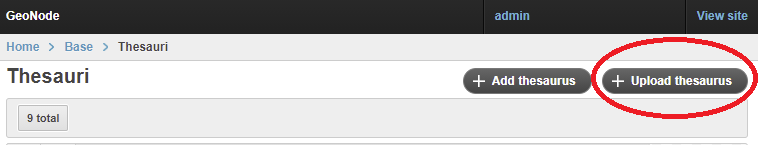
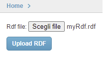
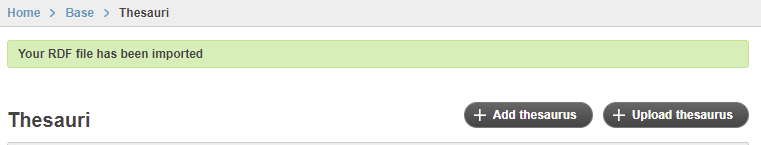
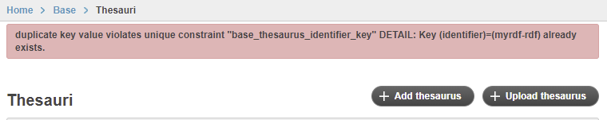
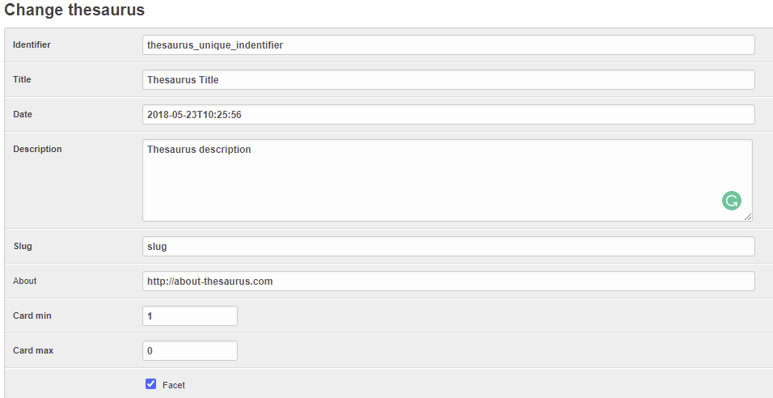
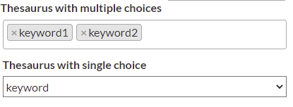

Loading a thesaurus
===================

There are 2 possible ways to upload a Thesaurus in geonode:

- Admin panel
- Django command-line
- settings.py (deprecated)

Admin panel
===========
You can add a thesaurus into you GeoNode using the ``upload thesaurus`` available in the Admin panel

Navigate to the thesaurus page in the admin panel ``http://<your_geonode_host>/admin/base/thesaurus``. On the top-right of the page a button named `Upload thesaurus` will be available:

After clicking on it, a simple form for the upload will be shown. In order to let the upload works, is required to choose an `RDF` file

By clicking on `Upload CSV`, the system will load the thesaurus by assigning to it a `slugify` name based on the file name.
The name can be easily change later in the edit page.

If everything goes fine, a successfull message will be shown:

Otherwise the UI will show the error message:

Command line
================

A thesaurus can be loaded into GeoNode by using the ``load_thesaurus`` command:

.. code-block:: shell

    python manage.py load_thesaurus --help

    -d, --dry-run         Only parse and print the thesaurus file, without perform insertion in the DB.
    --name=NAME           Identifier name for the thesaurus in this GeoNode instance.
    --file=FILE           Full path to a thesaurus in RDF format.

In order add the inspire-themes thesaurus into a geonode instance, download it as file ``inspire-theme.rdf``  with the command:

.. code-block:: shell

    wget -O inspire-theme.rdf https://raw.githubusercontent.com/geonetwork/core-geonetwork/master/web/src/test/resources/thesaurus/external/thesauri/theme/httpinspireeceuropaeutheme-theme.rdf

and then issue the command:

.. code-block:: shell

    python manage.py load_thesaurus --file inspire-theme.rdf --name inspire_themes

The ``name`` is the identifier you'll use to refer to this thesaurus in your GeoNode instance.

If you only want to make sure that a thesaurus file will be properly parsed, give the ``--dry-run`` parameter, so that nothing will be added to the DB.

*Note*: if the ``name`` starts with the string ``fake``, the file will not be accessed at all, and some test keywords will be added to a fake new thesaurus. In this case the ``dry-run`` param will not be used.

Configure a thesaurus in GeoNode
================================
Configuration from `Admin`

After you loaded a thesaurus into GeoNode, it should be configured in the :guilabel:`Admin` panel.

The panel can be reached from :guilabel:`Admin` link of the *User Menu* in the navigation bar or through this URL: ``http://<your_geonode_host>/admin/base/thesaurus``.

Once you are on the Thesaurus lists, select one thesaurus to open the Edit page

     *The GeoNode Thesaurus edit Interface*

- ``identifier``: (mandatory string) the identifier you used in the ``load_thesaurus`` commands.
- ``title``: (mandatory string) The title of the thesaurus, is ingested by the ``load_thesaurus`` command.
- ``date``: (mandatory date) The Date of the thesaurus, is ingested by the ``load_thesaurus`` command.
- ``description``: (mandatory string) The description of the thesaurus, is ingested by the ``load_thesaurus`` command.
- ``slug``: (mandatory string) The slug of the thesaurus, is ingested by the ``load_thesaurus`` command.
- ``about``: (optional string) The about of the thesaurus, is ingested by the ``load_thesaurus`` command.
- ``card min``: (optional integer) Decide the minimun cardinality, default = 0
- ``card max``: (optional integer) Decide the maximun cardinality, default = -1
- ``facet``: (boolean) Decide if the thesaurus will be shown in the facet list. default: True
- ``order``: (integer) Decide the listing order of the thesaurus in the facet list and in the metadta editor. default: 0, asc order from 0 to N

Cardinality:

- `card_max=0` --> Disabled, The Thesaurus will not appear in the GUI
- `card_max=1` & `card_min = 0` --> Single choice, optional.
- `card_max=1` & `card_min = 1` --> Single choice, required
- `card_max=-1` & `card_min = 0`  --> [0..N] Multiple choices, optional
- `card_max=-1` & `card_min = 1` --> [1..N] Multiple choices, required

After the setup, in `Editing Tools -> Metadata -> Wizard` the thesaurus block will be shown like the following image:

     *The metadata interface with the Thesaurus enabled*

================================

Configuration via `settings.py`

.. warning:: *Deprecated* The Thesaurus configuration via settings is deprecated, will be removed in the future.

After you loaded a thesaurus into GeoNode, it should be configured in the ``settings.py`` file (or in the ``local_settings``) in this way:

.. code-block:: shell

    THESAURUS = {'name':'THESAURUS NAME', 'required':True|False, 'filter':True|False,}

- ``name``: (mandatory string) the identifier you used in the ``load_thesaurus`` commands.
- ``required``: (optional boolean) if ``True``, a keyword of this thesaurus is mandatory to complete the metadata. *Currently not implemented.*
- ``filter``: (optional boolean) if ``True``, a faceted list of keywords of this thesaurus will be presented on the search page.

So, in order to set up the INSPIRE themes thesaurus you may set the THESAURUS value as:

.. code-block:: shell

    THESAURUS = {'name': 'inspire_themes', 'required': True, 'filter': True}

Apply a thesaurus to a resource
===============================

After you've finished the setup you should find a new input widget in each resource metadata wizard allowing you to choose a thesaurus for your resource.

After applying a thesaurus to resources those should be listed in the filter section in GeoNodes resource list views.

.. figure:: ./img/thesaurus_filter.png
    :align: center
    :width: 350px
    :alt: thesauarus
