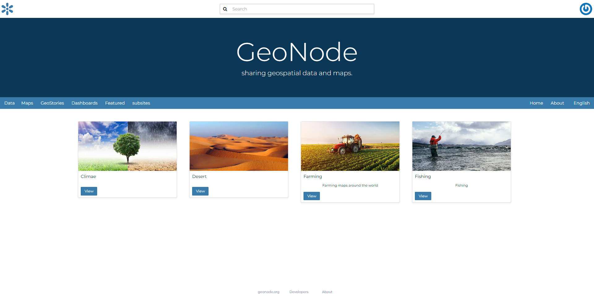
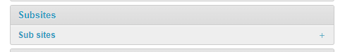
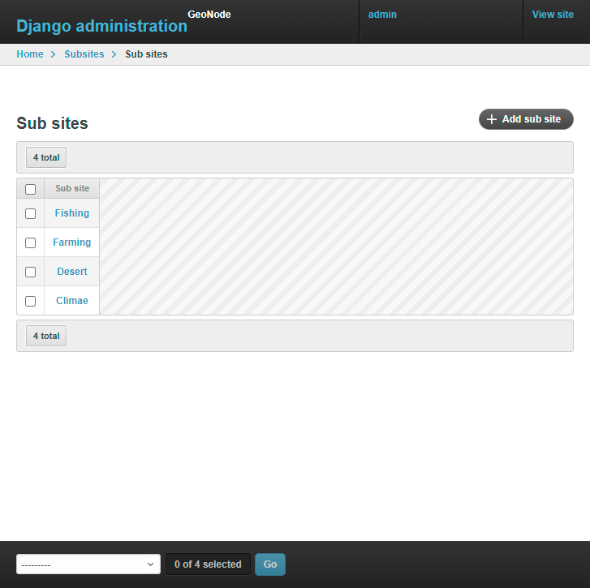
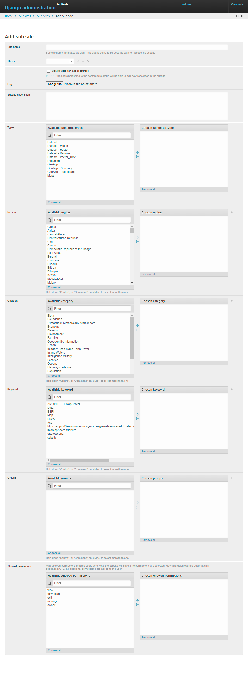

Geonode Subsites
================

Enable creating subsites in GeoNode without deploying additional instances. The subsite is virtual, no additional code is required.

For example

.. code-block::

        http://localhost:8000/ # <-- geonode homepage
        http://localhost:8000/subsite_1/ # <--- same geonode, but it can be used as a different geonode
        http://localhost:8000/subsite_2/ # <--- same geonode, but it can be used as a different geonode
        http://localhost:8000/subsite_3/ # <--- same geonode, but it can be used as a different geonode
        http://localhost:8000/subsite_4/ # <--- same geonode, but it can be used as a different geonode

Installation
------------

The subsite application should be added to the project's ``requirements.txt`` file as an add-on.

.. code-block:: shell

      
        git+https://github.com/geosolutions-it/geonode-subsites@main#egg=geonode-subsites
      
To make changes to the Django project settings, open the ``settings.py`` file and add the following lines of code

.. code-block:: python

      
        INSTALLED_APPS += ("subsites",)
        ENABLE_SUBSITE_CUSTOM_THEMES=True/False
        SUBSITE_READ_ONLY=True/False
        ENABLE_CATALOG_HOME_REDIRECTS_TO

- `INSTALLED_APPS` (required): include the app in the Django application registry
- `ENABLE_SUBSITE_CUSTOM_THEMES` (optional): If ``True`` Can be set a different GeoNode theme for each subsite
- `SUBSITE_READ_ONLY` (optional): If ``True`` the subsite will be in read-only mode
- `ENABLE_CATALOG_HOME_REDIRECTS_TO` (optional): If ``True`` the user is not allowed to see the catalog but will be redirected to the home page

The last step is to add in the ``urls.py`` file the registration of the subsite ``urls``

.. code-block:: python

      
        url(r"", include("subsites.urls")),

If the file is not available, you can create it in the path ``src/<project_name>/urls.py``

.. code-block:: python

      
        from geonode.urls import urlpatterns
        from django.conf.urls import url, include
        """
        # You can register your own urlpatterns here

        """
        urlpatterns += [
            url(r"", include("subsites.urls")),
        ]

*NOTE:* never forget to run the ``migration`` to ensure the correct installation of the library.

.. code-block:: python

      
        python src/manage.py migrate

Configuration via admin
-----------------------

After completing the installation procedure, you can begin creating the subsites.

The homepage of geonode, with the subsite enabled, has a different look and feel compared to the default installation.

Instead of displaying the catalog on the homepage, a list of configured subsites is displayed.

     *Example of homepage with subsite configured*

Let's configure a new subsite.

1. Login as administrator in the django admin panel top-right
2. Scroll down until the subsite application is shown

     *Subsite topic*

3. After clicking on it, the subsite panel is shown

     *add subsite page*

4. on the top-right click on the :guilabel:`add sub-site` button
5. The page below is displayed. Let's examine its objectives in detail.

     *subsite configuration detail*

- ``SITE NAME: (required)`` is a unique identifier. This is going to be used as a path to navigate to the subsite. Is saved as a ``slug``, so space is not allowed.
For example

.. code-block::
      
        Slug: subsite_1

        subsite_url: `http://{host}/subsite_1/`

        Slug: Italy

        subsite_url: `http://{host}/italy/`

- ``THEME: (optional)`` assign a theme to the subsite. The theme can be created in the :guilabel:`GeoNode Themes`. More information about :doc:`themes </admin/admin_panel/index>`
- ``Contributor can add resource (optional)``: boolean filed if TRUE the `add resource` the user receives the `add_resourcebase` permissions
- ``Logo (optional)``: Let the user upload a specific logo for the subsite. The logo is used in the homepage to show the subsite. In the example above, is (for example) the desert
- ``Types (optional)``: Filter resources by assigned resource type. For example, if :guilabel:`Dataset` is selected, only the resources with that specific `resource_type` are shown
- ``Region (optional)``: Filter resources by assigned region via :guilabel:`Metadata editor` or automatically via the ``geonode.resource.regions_storer.spatial_predicate_region_assignor``
- ``Keyword (optional)``: Filter resources by assigned keyword. Add keywords via :guilabel:`Metadata editor`
- ``Groups (optional)``: Filter resources by assigned group via :guilabel:`Metadata editor`
- ``Allowed Permissions (optional)``: Configuration of which permission the user will have while navigating in the subsite. By default ``view`` and ``download`` are given.

Subsite filtering logic
-----------------------

The filter works in ``OR`` if multiple fields of the same kind are selected, and in ``AND`` between all the filters:

.. code-block::

      
        (category==x || category==y || ...) && (keyword==x || keyword==y || ...) && (region==x|| region==y|| ...)

Example 1

.. code-block::

      
        subsite name: subsite_1
        filter selected:
            - type -> Dataset
        Result: the catalog is going to be pre-filtered, by including ONLY the resource with `Dataset` as the resource type.
        NOTE: the filter is valid only for that specific subsite

Example 2

.. code-block::

      
        subsite name: subsite_2
        filter selected: 
            - type -> Dataset, Document
            - region -> Europe
        Result: The catalog is going to be pre-filtered, by including ONLY the resource with Dataset OR Document as resource type and with have EUROPE in the regions assigned
        
        NOTE: the filter is valid only for that specific subsite

Example 3

.. code-block::

      
        subsite name: subsite_3
        filter selected:
            - region -> Europe
            - keyword -> country
            - Allowed permissions -> View
        Result: The catalog is going to be pre-filtered, by including ONLY the resource with a region equal to EUROPE and with a keyword with the value COUNTRY. 
        Plus the users which will navigate the subsite will have ONLY the view permission, so they will not be able to download any dataset
        
        NOTE: the filter is valid only for that specific subsite

**NOTE:**

This logic is applied to ALL the geonode APIv2 then a subsite is called.

In a few words, the catalog is going to be pre-filtered. Only the resources that match the subsite filtering are going to be shown in the API response

Advanced: Cache
---------------

To improve the performance, the subsite configuration is cached in memory.

The cache is cleaned if one of the following actions is taken:

- The subsite configuration is updated via the Django admin panel
- The expiration time of the cache is reached (300 seconds)
- The subsite is deleted so that, the cache related to that specific subsite is deleted along with the subsite

.. code-block:: python

      
        settings.CACHES["subsite_cache"] = {
                "BACKEND": "django.core.cache.backends.locmem.LocMemCache",
                "TIMEOUT": 300,
                "OPTIONS": {"MAX_ENTRIES": 10000},
        }

Advanced: How to override a specific URL
----------------------------------------

Not all the GeoNode URLs are eligible to be used in the subsite. If a new url is required to work with the subsite, it must added manually to the subsite codebase.

The `URLs` that support the subsite are listed in the file ``subsites/urls.py`` which briefly are:

- All the API v2
- user info
- token info
- facets
- catalog listing
- homepage

To register a new URL is enough to modify the ``subsites/urls.py``. Follow an example of a URL:

.. code-block:: python

        re_path(r"^(?P<subsite>[^/]*)", views.subsite_home, name="subsite_home")

NOTE: All the `URLs` **must** have the subsite parameter, otherwise the system is not able to retrieve the subsite information.

The view will be defined as follows:

.. code-block:: python
        
        def subsite_home(request, subsite):
                slug = extract_subsite_slug_from_request(request, return_object=False)
                if not slug:
                        raise Http404

                return subsite_render(request, "index.html", slug=slug)

Advanced: template rendering logic
----------------------------------

The :guilabel:`geonode-subsite` provides two different way to override the default templates:

- subsite specific
- subsite common

Subsite specific:

Let the developer define a specific set of templates that are going to be used only for a specific subsite. The templates are rendered only when the subsite is called.

Subsite common:

Let the developer define a common template used by **ALL** the subsites. These templates are ignored by the default geonode instance but will have an effect only in the subsites.

But how these templates are rendered?

The backend follows this logic to render the templates following this order:

1. subsite specific template
2. common subsite template
3. geonode project override
4. default geonode deplete

To let this work, is required that all the new views will use the custom ``subsite_render`` function and not the django default ``render`` function

For example:

.. code-block:: python
        
        def subsite_home(request, subsite):
                slug = extract_subsite_slug_from_request(request, return_object=False)
                if not slug:
                        raise Http404

                return subsite_render(request, "index.html", slug=slug)

Advanced: template configuration
--------------------------------

One of the most important features that :guilabel:`geonode-subsite` provides is the ability to customize the template for each subsite, allowing for unique designs for each one.

However, the process of making template changes can be a bit complicated and requires familiarity with Django and its template system.

To help make this process easier, we have provided an example folder that demonstrates how to organize the subsite template folder. This will enable you to create a custom template for each subsite.

**How to create the correct template subsite folder**

1. Navigate to the ``templates`` folder of the project
2. Create a new folder named ``subsites``
3. inside subsite, create a new folder that is named as the subsite. The *subsite-slug* and the *folder name* must match
4. Use the normal geonode project template folder structure to override the template. The folder structure must be repeated for each subsite

Let's make an example.

We have a subsite called "desert" and we want to override the ``navbar.html`` template for that specific subsite.

The default geonode project view is the following

.. code-block::
        
        templates/
        ├── geonode-mapstore-client/
        │   └── _geonode_config.html

Let's create the ``subsites`` folder

.. code-block::
        
        templates/
        ├── geonode-mapstore-client/
        │   └── _geonode_config.html
        ├── subsites/

Now is time to create the folder for our specific subsite:

.. code-block::
        
        templates/
        ├── geonode-mapstore-client/
        │   └── _geonode_config.html
        ├── subsites/
        │   └── desert/

Once the subsite folder is created, we can replicate the default template structure to override the :guilabel:`geonode-mapstore-client` templates

.. code-block::
        
        templates/
        ├── geonode-mapstore-client/
        │   └── _geonode_config.html
        ├── subsites/
        │   └── desert/
        |       └── geonode-mapstore-client/
        │           └── snippets/
        │               └── topbar.html

In this way, ONLY the subsite named **desert** will use the specific topbar.html

Advanced: common template override
----------------------------------

Is also possible to define a ``common`` template folder where all the subsites will check for any template override.

The folder for the common template is the following:

.. code-block::

        templates/
        ├── geonode-mapstore-client/
        │   ├── _geonode_config.html
        │   ├── index.html
        │   └── snippets/
        │       ├── brand_navbar.html
        ├── subsites/
        ├───── common/
        │       └── geonode-mapstore-client
        │       └── snippets
        │           └── topbar.html

All the subsites defined in the administration panel will use the template defined in the `common` folder.
