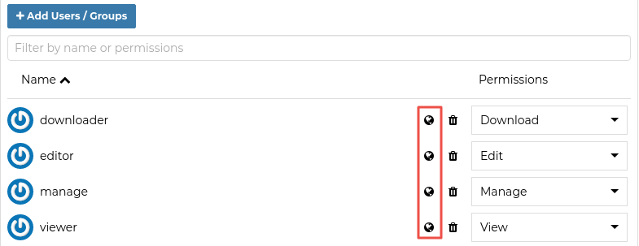
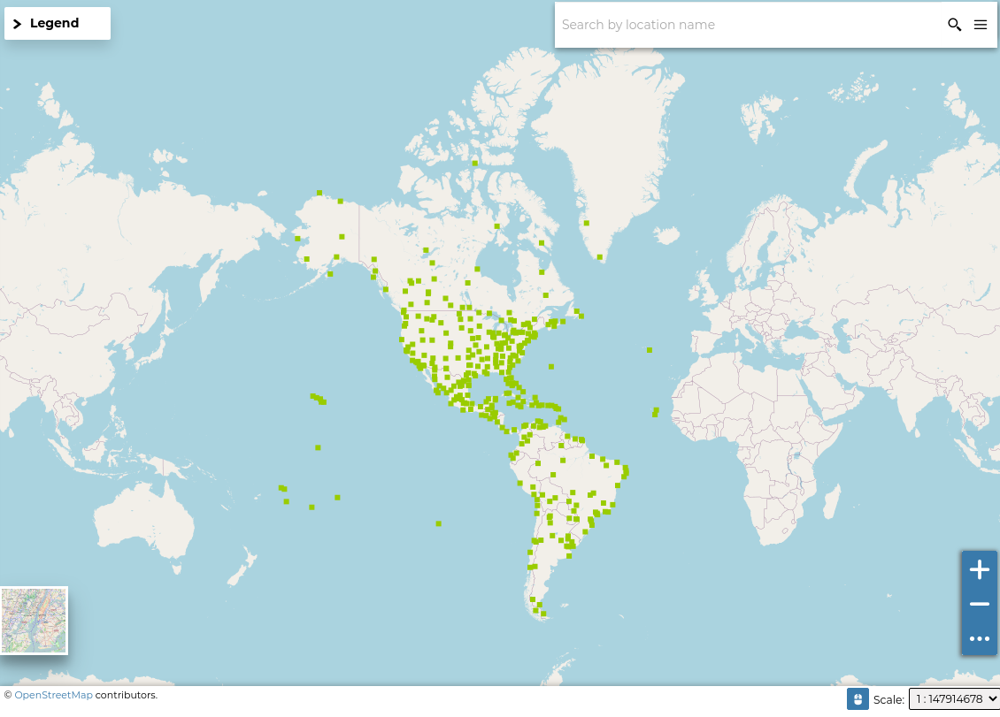

.. _permissions:

===========
Permissions
===========

| Permissions in GeoNode are set per resource, where a resource can be a dataset, a map, a document, a service or a geoapp. The way the permissions are set is the same for all of them.

.. warning::

  GeoNode has a set of default permissions that are applied on resource creation **when** you don't explicitly declare them.
  This is particularly relevant when creating and saving a map, where you won't have the possibility to set the its permissions during the creation phase.
  GeoNode can be tuned to make sure that by default the new created resource are not public, this can be done by changing two settings, see `Default view permissions <../settings/index.html#default-anonymous-view-permission>`_ and `Default download permissions <../settings/index.html#default-anonymous-download-permission>`_

Single Resource permissions
---------------------------

| Resource permissions can be generally set from the *resource detail* page. The detail page has a menu item *Share* which is visible to people who are permitted to set permissions on a resource.
The share link opens a page on the right with a provision to edit user and group permissions on the resource. see picture below


    *Change Dataset Permissions*

| The page for setting the permissions, allows addition of users/groups and selection of a permission to assign each of them.

.. figure:: img/resource_permissions_dialogue.png
    :align: center
    :width: 500

    *Resource Permission Dialogue*

You can set the following types of permissions:

* *View:* allows to view the resource;
* *Download* allows to download the resource;
* *Edit:* allows to change attributes, properties of the datasets features, styles and metadata for the specified resource;
* *Manage:* allows to update, delete, change permissions, publish and unpublish the resource.

.. warning:: When assigning permissions to a group, all the group members will have those permissions. Be careful in case of editing permissions.

Geo Limits permissions
----------------------

.. note:: This feature is available **only** when enabling ```GeoServer``` as geospatial backend. Also make sure that the properties ```GEONODE_SECURITY_ENABLED```, ```GEOFENCE_SECURITY_ENABLED``` and ```GEOFENCE_URL``` are correctly set for the ```OGC_SERVER```.

:guilabel:`Geo Limits` are an extension of the GeoNode standard permissions. :guilabel:`Geo Limits` allows the owner of the resource, or the administrator, to restrict users or groups to a specific geographical area, in order to limit the access to the dataset to only the portions contained within that geographic restriction, excluding data outside of it.

In order to be able to set :guilabel:`Geo Limits` you must be an ```administrator``` of the system or the ```owner``` of the resource or you must have ```Manage Permissions``` rights to the resource.

If you have the permissions to set the :guilabel:`Geo Limits`, you should be able to see the permissions section and the globe icon on each user or group.



    *Geo Limits Icon*

You should be able to see an interactive preview of the resource along with few small drawing tools, that allows you to start creating limits on the map manually if you want.

This opens a map dialog, with 3 options at the top:

.. figure:: img/geo_limits_002.png
    :align: center
    :width: 500

    *Geo Limits: Preview Window with Drawing Tools*


The |edit_icon| icon allows you to draw limits on a map for which a user will be able to see. Click on it to start drawing on the map. Once you are done drawing, click on it again to deactivate drawing mode.

.. |edit_icon| image:: img/edit_icon.png
    :width: 30px
    :height: 30px
    :align: middle

The |delete_icon| icon enables you to remove the limits you have drawn. Click on the limit drawn, and then click the delete icon.

.. |delete_icon| image:: img/delete_icon.png
    :width: 30px
    :height: 30px
    :align: middle

The |refresh_icon| icon removes all changes that are not saved.

.. |refresh_icon| image:: img/refresh_icon.png
    :width: 30px
    :height: 30px
    :align: middle


.. figure:: img/geo_limits_003.png
    :align: center
    :width: 500

    *Geo Limits: Editing the Geometries*

Once you finished editing your geometries, save them into the DB using the *Save* link in the resource menu.

The user with the specified geometries won't be able from now on to access the whole dataset data.



    *Geo Limits: Geospatial restrictions applies for the user*

.. warning :: The :guilabel:`Geo Limits` will be persisted on GeoNode DB for that resource. That means that everytime you will update the general permissions, also the geospatial restrictions will be applied.
    
    In order to remove the :guilabel:`Geo Limits` for a certain user or group, you can just :guilabel:`Save` an **empty geometry**. This will **delete** the entry from the DB also.
