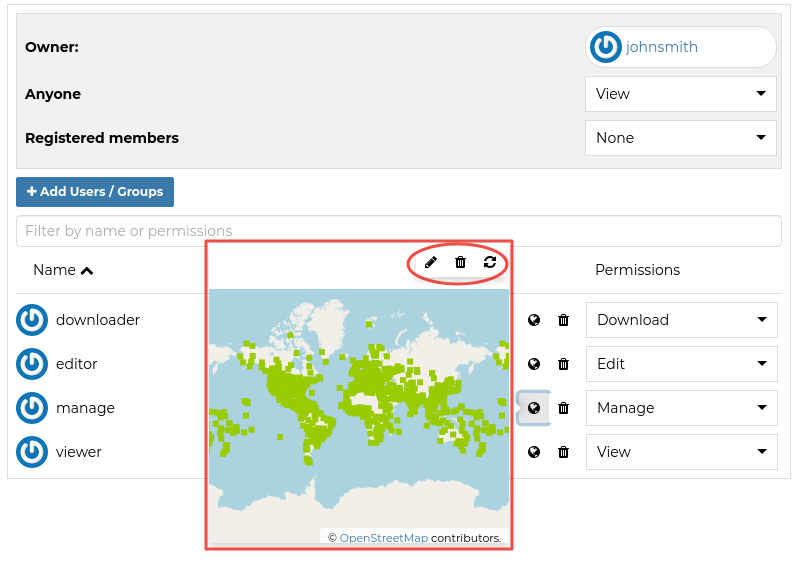

.. _permissions:

===========
Permissions
===========

| Permissions in GeoNode are set per resource, where a resource can be a layer, a map, a document or a service. The way the permissions are set is the same for all of them.

.. warning::

  GeoNode has a set of default permissions that are applied on resource creation **when** you don't explicitly declare them.
  This is particularly relevant when creating and saving a map, where you won't have the possibility to set the its permissions during the creation phase.
  GeoNode can be tuned to make sure that by default the new created resource are not public, this can be done by changing two settings, see `Default view permissions <../settings/index.html#default-anonymous-view-permission>`_ and `Default download permissions <../settings/index.html#default-anonymous-download-permission>`_

Single Resource permissions
---------------------------

| Resource permissions can be generally set from the *resource detail* page. The following figure shows how to open the dialog to set permissions on a layer, the same concept applies to documents and maps.

.. figure:: img/change_layer_permissions.png
    :align: center
    :width: 500

    *Change Layer Permissions*

| The dialog for setting the permission allow a granular selection of each permission type to be applied for users and/or groups, each permission type is grouped in tabs that are expanded on click.
| The text boxes have an autosuggest feature to help the compilation of user names and groups, it starts upon typing.

.. figure:: img/resource_permissions_dialogue.png
    :align: center
    :width: 500

    *Resource Permission Dialogue*

You can set the following types of permissions:

* *View* allows to view the layer;
* *Download* allows to download the layer;
* *Change Metadata* allows to change the layer metadata;
* *Edit Data* allows to change attributes and properties of the layers features;
* *Edit Style* allows to change the layer style;
* *Manage* allows to update, delete, change permissions, publish and unpublish the layer.

.. warning:: When assigning permissions to a group, all the group members will have those permissions. Be careful in case of editing permissions.

Geo Limits permissions
----------------------

.. note:: This feature is available **only** when enabling ```GeoServer``` as geospatial backend. Also make sure that the properties ```GEONODE_SECURITY_ENABLED```, ```GEOFENCE_SECURITY_ENABLED``` and ```GEOFENCE_URL``` are correctly set for the ```OGC_SERVER```.

:guilabel:`Geo Limits` are an extension of the GeoNode standard permissions. :guilabel:`Geo Limits` allows the owner of the resource, or the administrator, to restrict users or groups to a specific geographical area, in order to limit the access to the layer to only the portions contained within that geographic restriction, excluding data outside of it.

In order to be able to set :guilabel:`Geo Limits` you must be an ```administrator``` of the system or the ```owner``` of the resource or you must have ```Manage Permissions``` rights to the resource.

Go to the :guilabel:`Layer Details` page and scroll down to the :guilabel:`Change Layer Permissions` button, as we have seen on the previous section.

If you have the permissions to set the :guilabel:`Geo Limits`, you should be able to see the limits tab beside the permissions one.

.. figure:: img/geo_limits_001.png
    :align: center
    :width: 500

    *Geo Limits Tab*

You should be able to see an interactive preview of the layers along with few small drawing tools, that allow you to start creating limits on the map manually if you want.

Moreover at the bottom of the panel, there are two other tabs, one listing the available :guilabel:`Users` and another one listing the available :guilabel:`Groups`.

.. warning :: You will be able to access only :guilabel:`Public` groups and the :guilabel:`Private` ones you belong to.



    *Geo Limits: Preview Window with Drawing Tools*

For each entry of the :guilabel:`Users` and :guilabel:`Groups` tabs, you will have 3 options:

1. Load :guilabel:`Geo Limits`

    .. figure:: img/geo_limits_003.png
        :align: center
        :width: 200

        *Geo Limits: Load from DB*

    This button allows you to load the :guilabel:`Geo Limits` already stored on the DB.

    .. warning :: By clicking this button, the geometries present into the map will be cleared. You can add/remove more geometries later on if needed.

2. Upload :guilabel:`Geo Limits`

    .. figure:: img/geo_limits_004.png
        :align: center
        :width: 200

        *Geo Limits: Upload from a SHAPEFILE*

    This button allows you to upload the :guilabel:`Geo Limits` from a ```SHAPEFILE``` on your hard disk. This button **won't** save anything yet. It will **only** load the geometries into the map.

    .. warning :: Be careful using big ```SHAPEFILES```. The geometries will be loaded in memory, and your browser might slow down a lot if you load huge / complex geometries.

    .. warning :: By clicking this button, the geometries present into the map will be cleared. You can add/remove more geometries later on if needed.

    .. figure:: img/geo_limits_005.png
        :align: center
        :width: 200

        *Geo Limits: Upload from a SHAPEFILE*

    .. figure:: img/geo_limits_006.png
        :align: center
        :width: 400

        *Geo Limits: Upload from a SHAPEFILE*

3. Save :guilabel:`Geo Limits`

    .. figure:: img/geo_limits_007.png
        :align: center
        :width: 200

        *Geo Limits: Store the Geo Limits into the DB*

    This button allows you to store the :guilabel:`Geo Limits` into the DB. The geometries will be associated to the current ```resource``` and selected ```user``` or ```group```.

    .. note :: By saving the geometries into the DB, the geospatial restrictions won't be applied yet. In order to apply the restrictions you need to:

        a) Set the general permissions to the user / group on the general :guilabel:`Permissions` dialog.

        b) Click on :guilabel:`Apply Changes` button

        See the next paragraph for more details.

Once you finished editing your geometries, save them into the DB.

.. figure:: img/geo_limits_008.png
    :align: center
    :width: 500

    *Geo Limits: Editing the Geometries*

.. figure:: img/geo_limits_009.png
    :align: center
    :width: 500

    *Geo Limits: Saving the Geometries for the user afabiani*

What you have to do now, in order to apply the :guilabel:`Geo Limits` correctly, is to go back to the :guilabel:`Permissions` tab and select :guilabel:`View` and / or :guilabel:`Download` permissions for the users / groups you want to apply the restrictions.

.. figure:: img/geo_limits_010.png
    :align: center
    :width: 500

    *Geo Limits: Set View/Download Permissions for the user afabiani*

When you are happy with your changes, click on :guilabel:`Apply Changes` button.

.. figure:: img/geo_limits_011.png
    :align: center
    :width: 500

    *Geo Limits: Apply Permissions and Restrictions to the users and groups*

The user ```afabiani``` won't be able from now on to access the whole layer data.

.. figure:: img/geo_limits_012.png
    :align: center
    :width: 500

    *Geo Limits: Geospatial restrictions applies for the user afabiani*

.. warning :: The :guilabel:`Geo Limits` will be persisted on GeoNode DB for that resource. That means that everytime you will update the general permissions, also the geospatial restrictions will be applied.
    
    In order to remove the :guilabel:`Geo Limits` for a certain user or group, you can just :guilabel:`Save` an **empty geometry**. This will **delete** the entry from the DB also.


Bulk permissions
----------------

| GeoNode offers the possibility to set permissions in bulk, this can be done in any *list* page.
| In order to set bulk permissions you have first to fill the *shopping cart* with the resources you are interested with by clicking the :guilabel:`+` button on the resource snippet.

.. figure:: img/add_to_shopping_cart.png
    :align: center
    :width: 500

    *Add Resource To Shopping Cart*

| Once happy with the selection you can click the :guilabel:`Set Permissions` button under the shopping cart to open the permissions dialogue that will apply the chosen permission to all selected resources.

.. figure:: img/shopping_cart_permissions.png
    :align: center
    :width: 500

    *Sopping Cart Permissions*
