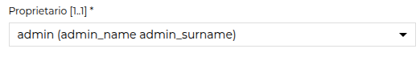
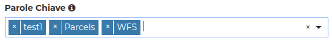

Metadata editor client
======================

The metadata editor client is basically implemented using the `react-jsonschema-form <https://github.com/rjsf-team/react-jsonschema-form>`__ library.

Some improvements have been made, in order to better integrate with GeoNode, such as handling autocomplete, error reporting etc.

In order to do, some custom annotation have been added.

``geonode:after``
-----------------

This annotation is used server side, to place a field just after another.

In the metadata editor the fields are presented in the same order as they are declared in the schema; this annotation allows to add a new declared field after an existing one:

.. code-block:: json

	 "short_name": {
	    "type": ["string", "null"],
	    "geonode:after": "title",
	    "geonode:handler": "sparse"
	  },

Text widget
-----------

Be default `react-jsonschema-form` presents the string elements in text fields.
If your text is multiline, you may want to edit it in a text area. 

This is how it is declared:

.. code-block:: json

    "ui:options": {
      "widget": "textarea",
      "rows": 5
    },

.. _metadata_dropdown:

Dropdown menus
--------------

In case you have a field that should be populated with the content of a service, you may use the autocomplete feature:

.. code-block:: json

   "ui:options": {
      "geonode-ui:autocomplete": "/api/v2/metadata/autocomplete/users"
   }

This is an improvement to `react-jsonschema-form` implemented within GeoNode.

The client will present a dropdown menu with the content got from the autocomplete service.

Please note that in order to handle such kind of dropdown, the service shall provide a list of entries having ``id`` and ``label`` as fields.

According to the field type, different widgets will be shown.

Single choice
_____________

Here an example of an object: the widget will be a single choice dropdown menu:

.. code-block:: json

    "owner": {
        "type": "object",
        "title": "Proprietario",
        "properties": {
            "id": {
                "type": "string",
                "ui:widget": "hidden"
            },
            "label": {
                "type": "string",
            }
        },
        "ui:options": {
            "geonode-ui:autocomplete": "/api/v2/metadata/autocomplete/users"
        },
    },

And this is how it is rendered:

     *Single choice dropdown*

Multi choice
____________

In case the field is an array, the dropdown will be multichoice:

.. code-block:: json

    "EOVsReference": {
        "type": "array",
        "items": {
            "type": "object",
            "properties": {
                "id": {
                    "type": "string"
                },
                "label": {
                    "type": "string"
                }
            }
        },
        "ui:options": {
            "geonode-ui:autocomplete": "/api/v2/metadata/autocomplete/thesaurus/eov/keywords"
        }
    },

And this is how it is rendered:

     *Multi choice dropdown*

.. _metadata_dropdown_codelist:

Codelists
---------

In case a dropdown is fed with a codelist stored in a Thesaurus, you may use the ``geonode:thesaurus`` annotation, that will create an ``autocomplete`` entry pointing to the defined thesaurus. The dropdown can be either *single* or *multi* choice, as documented in the sections above.

For instance, feeding the ``SparseHandler`` this subschema:

.. code-block:: json

  "p_data_level": {
    "type": "object",
    "properties": {
      "id": {"type": "string"},
      "label": {"type": "string"}
    },
    "geonode:handler": "sparse",
    "geonode:thesaurus": "prj1_data_level"
  },

it will give back toward the client:

.. code-block:: json

   "p_data_level": {
        "type": "object",
        "properties": {
            "id": {"type": "string"},
            "label": {"type": "string"}
        },
        "geonode:handler": "sparse",
        "geonode:thesaurus": "prj1_data_level",
        "title": "Data Level",
        "ui:options": {
            "geonode-ui:autocomplete": "/api/v2/metadata/autocomplete/thesaurus/prj1_data_level/keywords"
        }
    },
