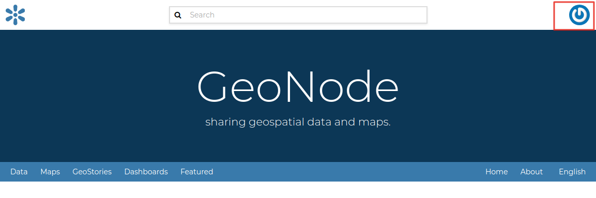
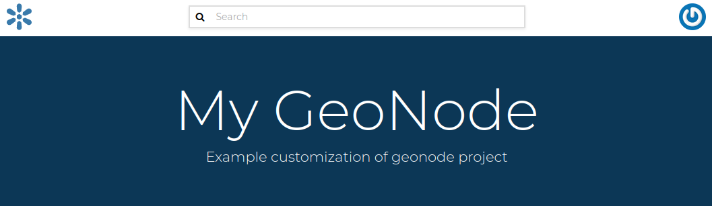
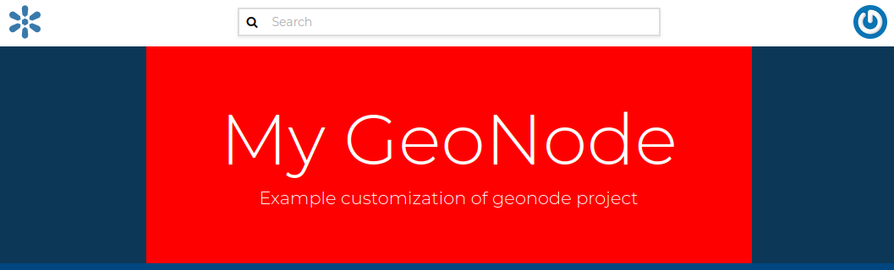
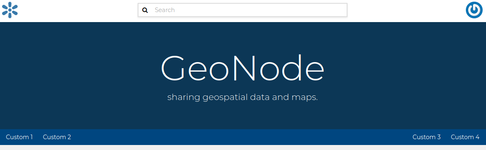

Workshops
==============================================

The workshops documentation demonstrates few examples on how to utilize GeoNode-Project in order to extend/customize GeoNode's functionalities according to your business. The covered topics include the following:

1- Customize your GeoNode with the geonode-project

2- Customize the look and feel

3- Create your ResourceBase Metadata

4- Create your own django app

5- Add a custom model

6- Permissions and APIs

7- Deploy your GeoNode

1- Customize your GeoNode with the geonode-project
--------------------------------------------------

In this example, GeoNode-Project is cloned to create a template instance in which the rest of the examples will be building on top of it.

1- Assuming you already installed GeoNode-Core, firstly we need to create a GeoNode-Project template and this can be achieved from the following command:

.. code-block:: shell
    
    $ django-admin.py startproject my_geonode --template=https://github.com/GeoNode/geonode-project/archive/master.zip -e py,rst,json,yml,ini,env,sample -n Dockerfile

Here, django-admin is used with startproject option to create my_geonode project copying the template which is passed as GeoNode-project Github repo. It also includes "py,rst,json,yml,ini,env,sample" extensions

2- Once the cloning finished, the next step is to install the GeoNode-Project we just downloaded as follows: 

.. code-block:: shell
    
    $ pip install -e my_geonode

3- Install geoserver using paver as follows

.. code-block:: shell
    
    $ cd /home/geonode/my_geonode/src
    $ paver setup

4- Note the GeoNode database connection parameters mentioned in the .env.sample.py file. Rename it to .env then use psql to create the required user and grant the required privileges as follows:

.. code-block:: shell
    
    $ su postgres 
    $ createdb geonode
    $ psql
	postgres=# CREATE USER geonode WITH PASSWORD 'geonode';
	CREATE ROLE  
	postgres=# GRANT ALL PRIVILEGES ON DATABASE "geonode" to geonode;
	GRANT
	postgres=# \q

.. warning:: Don't forget to exit from postgres user before executing the following commands 

5- Run GeoNode using paver 

.. code-block:: shell
    
    $ cd /home/geonode/my_geonode/src
    $ paver start

.. note:: You may find this warning message: You have 132 unapplied migration(s). Your project may not work properly until you apply the migrations for app(s): account, actstream, admin, agon_ratings, announcements, auth, avatar, base, contenttypes, dialogos, documents, favorite, geonode_client, geonode_themes, groups, guardian, invitations, layers, maps, mapstore2_adapter, monitoring, oauth2_provider, people, pinax_notifications, services, sessions, sites, socialaccount, taggit, tastypie, upload, user_messages. Which means you have some sql statements not executed yet and you need to run the "migrate" to sync your database first then "paver start" again as follows:

.. code-block:: shell
    
    $ python manage.py migrate
    $ paver start

.. warning:: If encountered this message: ``(Invalid HTTP_HOST header: '0.0.0.0:8000'. You may need to add u'0.0.0.0' to ALLOWED_HOSTS)`` It can be fixed in the settings.py file. You will need to add: ``ALLOWED_HOSTS = ['0.0.0.0']`` in settings.py

6- Once the previous step is done, you can visit 0.0.0.0:8000 to view the GUI of GeoNode. However, we still don't have an account in order to login from the GUI. This can be done using "paver sync". The command will create sync with latest fixtures and also creates a superuser "admin" with default password "admin"

7- Use the created account to login from the GUI through localhost:8000 or 0.0.0.0:8000

2- Customize the look and feel
------------------------------

In this section we will change the look and feel of GeoNode, in particular we will do some customization to help understanding how the template inheritance works and how to add new stuff to your GeoNode. The changes will include the home page, the top menu, the footer and a generic GeoNode page.

**Homepage:**

The geonode-project provides some predefined templates to change the home page and the general site content.

In the "my_geonode/src/my_geonode/templates/geonode-mapstore-client/snippets" directory we can files with similar names as the geonode-mapstore-client. This way we can override the different parts of the site eg the header, menu, body content and the footer.

Create a file name hero.html and add the following.

.. code:: html 
    

        

            

                <h1>My GeoNode</h1>
                
Example customization of geonode project

            

            

            

        

    

**The theme:**

To change the theme of our geonode-project we can act on the site_base.css file available in the "my_geonode/my_geonode/static/css" folder.

The file is empty so we can inspect elements of the home page with the browser's developer tools and define css rules in there.

For example, if we want to change the background of the jumbotron, in this file we can add

.. code:: css 
   
   .msgapi .gn-hero .jumbotron { background: red }

Then once we refreshed the browser, we should see the change as follows:

**The top menu:**

Now we can make some changes that will apply to the whole site. We can add an item to both the left and right side of the top menu bar.

This can be done by creating a get_menu_json.py under templatetags folder to override GeoNodes default menu.

.. code-block:: python
    
    @register.simple_tag(takes_context=True)
    def get_base_right_topbar_menu(context):

        is_mobile = _is_mobile_device(context)

        if is_mobile:
            return []
        
        return [
            {
                "type": "link",
                "href": "/",
                "label": "Custom 3"
            },
            {
                "type": "link",
                "href": "/",
                "label": "Custom 4"
            },
        ]
    @register.simple_tag(takes_context=True)
    def get_base_left_topbar_menu(context):

        is_mobile = _is_mobile_device(context)

        return [
            {
                "type": "link",
                "href": "/",
                "label": "Custom 1"
            },
            {
                "type": "link",
                "href": "/",
                "label": "Custom 2"
            },
        ]

On browser refresh you will see a new entry in the nav bar which is persistent to the whole site. 

**Modify functionality**

In this section, we will patch the ResourceBase of GeoNode and update the Templates in order to add one more field to the Metadata Schema.

We will add a DOI field to the ResourceBase model and modify the Templates in order to show the new field both into the Metadata Wizard page.

.. Note:: Make sure to be inside "my_geonode" directory to execute the following commands

Customizing metadata can be achieved from the model which is defined in the core at "geonode/geonode/base/models.py" as follows:

.. code-block:: python
    
    # internal fields
    uuid = models.CharField(max_length=36)
    owner = models.ForeignKey(
        settings.AUTH_USER_MODEL,
        blank=True,
        null=True,
        related_name='owned_resource',
        verbose_name=_("Owner"))
    contacts = models.ManyToManyField(
        settings.AUTH_USER_MODEL,
        through='ContactRole')
    title = models.CharField(_('title'), max_length=255, help_text=_(
        'name by which the cited resource is known'))
    alternate = models.CharField(max_length=128, null=True, blank=True)
    date = models.DateTimeField(
        _('date'),
        default=now,
        help_text=date_help_text)
    date_type = models.CharField(
        _('date type'),
        max_length=255,
        choices=VALID_DATE_TYPES,
        default='publication',
        help_text=date_type_help_text)
    edition = models.CharField(
        _('edition'),
        max_length=255,
        blank=True,
        null=True,
        help_text=edition_help_text)
    abstract = models.TextField(
        _('abstract'),
        max_length=2000,
        blank=True,
        help_text=abstract_help_text)
    purpose = models.TextField(
        _('purpose'),
        max_length=500,
        null=True,
        blank=True,
        help_text=purpose_help_text)
    maintenance_frequency = models.CharField(
        _('maintenance frequency'),
        max_length=255,
        choices=UPDATE_FREQUENCIES,
        blank=True,
        null=True,
        help_text=maintenance_frequency_help_text)

To add fields directly to the ResourceBase Class without actually modifying it, this can be done from "my_geonode/src/my_geonode/apps.py" file

The "ready" method is invoked at initialization time and can be currently used to tweak your app in several ways

.. code-block:: python
    
    
    class AppConfig(BaseAppConfig):
    
        name = "my_geonode"
        label = "my_geonode"
    
        def ready(self):
            super(AppConfig, self).ready()
            run_setup_hooks()

Now we will add the "patch_resource_base" method to the AppConfig and execute it from the ready method as follows:

.. code-block:: python
    
    from django.db import models
    from django.utils.translation import ugettext_lazy as _
    
    
    class AppConfig(BaseAppConfig):
    
        name = "my_geonode"
        label = "my_geonode"
    
        def _get_logger(self):
            import logging
            return logging.getLogger(self.__class__.__module__)
        
        def patch_resource_base(self, cls):
            self._get_logger().info("Patching Resource Base")
            doi_help_text = _('a DOI will be added by Admin before publication.')
            doi = models.TextField(
                _('DOI'),
                blank=True,
                null=True,
                help_text=doi_help_text)
            cls.add_to_class('doi', doi)
        
        def ready(self):
            super(AppConfig, self).ready()
            run_setup_hooks()
            
            from geonode.base.models import ResourceBase
            self.patch_resource_base(ResourceBase)

.. note:: you will need to perform migrations as follows: - Add field doi to resourcebase

Once you run ``python manage.py migrate``:

.. code-block:: shell
   
   Running migrations:
   Applying announcements.0002_auto_20200119_1257... OK
   Applying base.0031_resourcebase_doi... OK
   Applying people.0027_auto_20200119_1257... OK

Till now, we have patched the DB. however, it is not yet sufficient as we still need to display the added field.

Let's extend the default templates so that we can show the newly added field

3- Create your own django app
-----------------------------

In this section, we will demonstrate how to create and setup the skeleton of a custom app using the django facilities. The app will add a geocollections functionality to our GeoNode.

The Geocollections app allows to present in a single page, resources and users grouped by a GeoNode Group. We can assign arbitrary resources to a Geocollection, a Group and a name that will be also used to build a dedicated URL. 

.. Note:: Make sure to be inside "my_geonode" directory to execute the following commands

Create the django app

Django gives us an handy command to create apps. We already used startproject to create our geonode-project, now we can use startapp to create the app.

.. code:: shell

    python manage.py startapp geocollections

This will create a folder named geocollections that contains empty models and views.

We need to add the new app to the INSTALLED_APPS of our project. inside "my_geonode/src/my_geonode/settings.py":

.. code:: python
   
   INSTALLED_APPS += (PROJECT_NAME,) to be:  INSTALLED_APPS += (PROJECT_NAME, 'geocollections',)

**Add a custom model**

In this section, we will add a custom model and the related logic as follows:

- Add a new model
- Add urls and views
- Add admin panel
- Add the template

.. code-block:: shell
    
    vim geocollections/models.py

.. code-block:: python
    
    from django.db import models
    
    from geonode.base.models import ResourceBase
    from geonode.groups.models import GroupProfile
    
    
    class Geocollection(models.Model):
        """
        A collection is a set of resources linked to a GeoNode group
        """
        group = models.ForeignKey(GroupProfile, related_name='group_collections')
        resources = models.ManyToManyField(ResourceBase, related_name='resource_collections')
        name = models.CharField(max_length=128, unique=True)
        slug = models.SlugField(max_length=128, unique=True)
        
        def __unicode__(self):
            return self.name

At this point we need to ask django to create the database table. Django since version 1.8 has embedded migrations mechanism and we need to use them in order to change the state of the db.

.. Note:: Make sure to be inside "my_geonode" directory to execute the following commands

.. code-block:: shell
    
    python manage.py makemigrations
    
    # the above command informs you with the migrations to be executed on the database
    
    python manage.py migrate

Next we will use django generic view to show the collections detail. Add the following code in the views.py file:

.. code-block:: shell
    
    vim geocollections/views.py

.. code-block:: python
    
    from django.views.generic import DetailView
    
    from .models import Geocollection
    
    class GeocollectionDetail(DetailView):
        model = Geocollection

Add url configuration

In order to access the created view we also need url mapping. We can create a urls.py file containing a url mapping to our generic view:

.. code-block:: shell
    
    vim geocollections/urls.py

.. code-block:: python
    
    from django.conf.urls import url
    
    from .views import GeocollectionDetail
    
    urlpatterns = [
        url(r'^(?P<slug>[-\w]+)/$',
            GeocollectionDetail.as_view(),
            name='geocollection-detail'),
    ]

We also need to register the app urls in the project urls. So let's modify the "my_geonode" urls.py file adding the following:

.. code-block:: shell
    
    vim my_geonode/src/my_geonode/urls.py
    
.. code-block:: python
    
    ...
    urlpatterns += [
    ## include your urls here
        url(r'^geocollections/', include('geocollections.urls')),
    ]
    ...

**Enable the admin panel**

We need a user interface where we can create geocollections. Django makes this very easy, we just need the admin.py file as follows:

.. code-block:: shell
    
    vim geocollections/admin.py

.. code-block:: python
    
    from django.contrib import admin
    
    from .models import Geocollection
    
    
    class GeocollectionAdmin(admin.ModelAdmin):
        prepopulated_fields = {"slug": ("name",)}
        filter_horizontal = ('resources',)
    
    admin.site.register(Geocollection, GeocollectionAdmin)

Now we can visit the admin page and create a geocollection from there as follows:

.. image:: ./img/geocollections-admin.png

**Adding the template**

Now we need the template where the geocollection detail will be rendered. Let's create a geocollections directory inside the "my_geonode/templates" directory with a file named geocollection_detail.html:

.. code-block:: shell
    
    mkdir -p my_geonode/templates/geocollections/
    
    vim my_geonode/templates/geocollections/geocollection_detail.html

.. code-block:: python
    
    
    
        <h2>Geocollection {{ object.name }}</h2>
        
Group: {{ object.group.title }}

        
Resources:

        <ul>
            
                <li>{{ resource.title }}</li>
            
        </ul>
    

To check the results, create a group in the geonode ui interface and load one or more layers/documents

login into the admin panel -> geocollections and create a geocollections

Visit http://localhost:8000/geocollections/<the-name-of-the-created-geocollection> and view the results.

Now that you know how to customize an html template, you can tune the page as you prefer.

**Permissions and APIs**

In this section we will add some more advanced logic like permissions and APIs. The permissions in GeoNode are managed with django-guardian, a library which allow to set object level permissions (django has table level authorization).

The APIs are implemented through django-tastypie.

The topics to be covered include:

- Permissions on who can view the geocollection
- How to add templated and js to embed a permission ui in our geocollection detail page
- API to serve json serialized searchable endpoint

Permissions logic (permissions objects)

We need to add the permissions object to the database. We can do this by adding the following meta class to our Geocollection model, guardian will take care of creating the objects for us.

.. code-block:: shell
    
    vim geocollections/models.py

.. code-block:: python
    
    class Meta:
        permissions = (
            ('view_geocollection', 'Can view geocollection'),
        )

Then run "python manage.py makemigrations" and "python manage.py migrate" to install them

**Permissions logic (set_default)**

Let's add a method that will be used to set the default permissions on the Geocollections. We can add this logic to the Geocollection model but could also be a generic Mix-in similar to how it is implemented in GeoNode.

.. code-block:: shell
    
    vim geocollections/models.py

.. code-block:: python
    
    
    from django.contrib.auth.models import Group
    from django.contrib.auth import get_user_model
    from django.contrib.contenttypes.models import ContentType
    from django.conf import settings
    from guardian.shortcuts import assign_perm
    
    def set_default_permissions(self):
            """
            Set default permissions.
            """
            
            self.remove_object_permissions()
            
            # default permissions for anonymous users
            anonymous_group, created = Group.objects.get_or_create(name='anonymous')
            
            if settings.DEFAULT_ANONYMOUS_VIEW_PERMISSION:
                assign_perm('view_geocollection', anonymous_group, self)
                
            # default permissions for group members
            assign_perm('view_geocollection', self.group, self)

**Permissions logic (methods)**

Now we need a method to add generic permissions, we want to be able to assign view permissions to groups and single users. We can add this to our Geocollection model

.. code-block:: shell
    
    vim geocollections/models.py

.. code-block:: python
    
    def set_permissions(self, perm_spec):
        anonymous_group = Group.objects.get(name='anonymous')
        self.remove_object_permissions()
        if 'users' in perm_spec and "AnonymousUser" in perm_spec['users']:
            assign_perm('view_geocollection', anonymous_group, self)
        if 'users' in perm_spec:
            for user, perms in perm_spec['users'].items():
                user = get_user_model().objects.get(username=user)
                assign_perm('view_geocollection', user, self)
        if 'groups' in perm_spec:
            for group, perms in perm_spec['groups'].items():
                group = Group.objects.get(name=group)
                assign_perm('view_geocollection', group, self)
    def remove_object_permissions(self):
        from guardian.models import UserObjectPermission, GroupObjectPermission
        UserObjectPermission.objects.filter(content_type=ContentType.objects.get_for_model(self),
                                            object_pk=self.id).delete()
        GroupObjectPermission.objects.filter(content_type=ContentType.objects.get_for_model(self),
                                             object_pk=self.id).delete()

Permissions logic (views.py)

We can add now a view to receive and set our permissions, in views.py:

.. code-block:: shell
    
    vim geocollections/views.py

.. code-block:: python
    
    import json
    from django.core.exceptions import PermissionDenied
    from django.http import HttpResponse
    from django.contrib.auth import get_user_model
    
    
    User = get_user_model()

    def geocollection_permissions(request, collection_id):
        
        collection = Geocollection.objects.get(id=collection_id)
        user = User.objects.get(id=request.user.id)
        
        if user.has_perm('view_geocollection', collection):
           return HttpResponse(
              'You have the permission to view. please customize a template for this view'',
              content_type='text/plain')
              
        if request.method == 'POST':
            success = True
            message = "Permissions successfully updated!"
            try:
                permission_spec = json.loads(request.body)
                collection.set_permissions(permission_spec)
                
                return HttpResponse(
                    json.dumps({'success': success, 'message': message}),
                    status=200,
                    content_type='text/plain'
                )
            except:
                success = False
                message = "Error updating permissions :("
                return HttpResponse(
                    json.dumps({'success': success, 'message': message}),
                    status=500,
                    content_type='text/plain'
                )

**Permissions logic (url)**

Lastly we need a url to map our client to our view, in urls.py

.. code-block:: shell
    
    vim geocollections/urls.py

.. code-block:: python
    
    from django.conf.urls import url
    
    from .views import GeocollectionDetail, geocollection_permissions
    
    urlpatterns = [
        url(r'^(?P<slug>[-\w]+)/$',
            GeocollectionDetail.as_view(),
            name='geocollection-detail'),
            
        url(r'^permissions/(?P<collection_id>\d+)$',
            geocollection_permissions,
            name='geocollection_permissions'),
    ]

This url will be called with the id of the geocollection, the id will be passed to the view in order to get the permissions. 

.. image:: ./img/view-permission.png

.. warning:: 
    
    A note on the client part, the server side logic is just one part necessary to implement permissions.
    
    A checklist of what is necessary:
    
    - A template snippet that can be embedded in the geocollection_detail.html, you can copy and simplify: _permissions_form.html and _permissions.html (in geonode/templates)
    
    - A javascript file that will collect permissions settings and send them to the server, you can copy and simplify: _permissions_form_js.html (in geonode/templates)
    
**API**

The GeoNode API system easily allows to plug in new APIs. This section demonstrates the required steps:

We need first to create an api.py file in our geocollection app.

.. code-block:: shell
    
    vim geocollections/api.py

.. code-block:: python
    
    import json
    from tastypie.resources import ModelResource
    from tastypie import fields
    from tastypie.constants import ALL_WITH_RELATIONS, ALL
    
    from geonode.api.api import ProfileResource, GroupResource
    from geonode.api.resourcebase_api import ResourceBaseResource
    
    from .models import Geocollection
    class GeocollectionResource(ModelResource):
        
        users = fields.ToManyField(ProfileResource, attribute=lambda bundle: bundle.obj.group.group.user_set.all(), full=True)
        group = fields.ToOneField(GroupResource, 'group', full=True)
        resources = fields.ToManyField(ResourceBaseResource, 'resources', full=True)
        
        class Meta:
            queryset = Geocollection.objects.all().order_by('-group')
            ordering = ['group']
            allowed_methods = ['get']
            resource_name = 'geocollections'
            filtering = {
                'group': ALL_WITH_RELATIONS,
                'id': ALL
            }

**API authorization**

We want the API to respect our custom permissions, we can easily achieve this by adding the following to the beginning of api.py:

.. code-block:: shell
    
    vim geocollections/api.py

.. code-block:: python
    
    from tastypie.authorization import DjangoAuthorization
    from guardian.shortcuts import get_objects_for_user
    
    class GeocollectionAuth(DjangoAuthorization):
        
        def read_list(self, object_list, bundle):
            permitted_ids = get_objects_for_user(
                bundle.request.user,
                'geocollections.view_geocollection').values('id')
                
            return object_list.filter(id__in=permitted_ids)
            
        def read_detail(self, object_list, bundle):
            return bundle.request.user.has_perm(
                'view_geocollection',
                bundle.obj)

And this to the GeocollectionResource Meta class:

.. code-block:: python
    
    authorization = GeocollectionAuth()

**Add a url for our API**

In order to publish our API we need a url and we want that url to appear under the GeoNode's /api domain.

The final url for our API has to be /api/geocollections.

We can inject the url into the GeoNode API by adding the following lines to "my_geonode/urls.py" file:

.. code-block:: shell
    
    vim my_geonode/urls.py

.. code-block:: python
    
    from geonode.api.urls import api
    
    from geocollections.api import GeocollectionResource
    
    api.register(GeocollectionResource())

And add the following in the urlpatterns:

.. code-block:: python
    
    url(r'', include(api.urls)),

The final result will be:

.. code-block:: python
    
    from django.conf.urls import url, include
    from django.views.generic import TemplateView
    
    from geonode.urls import urlpatterns
    
    from geonode.api.urls import api
    from geocollections.api import GeocollectionResource
    
    api.register(GeocollectionResource())
    
    urlpatterns += [
    ## include your urls here
    url(r'', include(api.urls)),
    url(r'^geocollections/', include('geocollections.urls')),
    ]

Let's test permissions on API

We can test the permissions on API by manually set a permission from the command line and check that the API respects it.

With running ``python manage.py shell`` from inside our "my_geonode" folder, it opens a geonode shell.

A perm spec could look like this:

.. code:: python
   
   perms = {
   'users': {
   'AnonymousUser': ['view_geocollection'],
   'alessio': ['view_geocollection']}
   }

and we can assign the permissions with:

.. code-block:: python
    
    from geocollections.models import Geocollection
    
    Geocollection.objects.first().set_permissions(perms)

our http://localhost:8000/api/geocollections should now list the geocollection.

If you remove the 'AnonymousUser' line from perms and assign again the permissions it will disappear.

.. code:: python
   
   perms = {
   'users': {
   'alessio': ['view_geocollection']
   }

**Deploy your GeoNode**
  

So far we demonstrated how to modify, extend and style our GeoNode in dev mode but now it's time to go on production. In this section we will clarify how to:

- commit your work on GitHub

- setup your server

- setup your GeoNode for production
  
  

Push to GitHub
It is always a good practice to keep your code in a remote repository, GithHub is one of the options and is indeed the most used.

It is assumed that you already have a GitHub account and that you have git installed and configured with your name and email.

We will push only the my_geonode folder to GitHub and as we knew earlier, GeoNode for us is a dependency and we'll just reinstall it as it is on the server.

Steps to push your code to GitHub:

- Create an empty repository in GitHub and copy it's address

- In my_geonode, run git init to initialize an empty repository

- Add your remote repository address with ``git remote add yourname yourremoteaddress``

- edit .gitignore adding all *.pyc files

- ``git add *`` to add all content of my_geonode

- ``git commit -m 'initial import'`` to make the initial commit

- ``git push yourname master`` to push the code to the GitHub repository

**Setup the server**

There are several options for deploying GeoNode projects on servers. In this section, we explain how to deploy it on Ubuntu server 18.04 using system-wide installation

.. note:: For quick installation, follow the INSTALLING documentation at http://docs.geonode.org/en/master/install/core/index.html

**Setup our my_geonode**

We need now to install the developed "my_geonode" project following these steps:

- git clone from your repository (in the folder of your preference)

- ``sudo pip install -e my_geonode``

- edit the settings where needed

- edit ``/etc/apache2/sites-enabled/geonode.conf`` replacing the wsgi path to the ``my_geonode/my_geonode/wsgi.py`` file

- add the apache rights to the "my_geonode" folder with a directory like

.. code:: apache
   
   <Directory "/path/to/my_geonode/">
     Order allow,deny
     Require all granted
   </Directory>

- Test your server.
