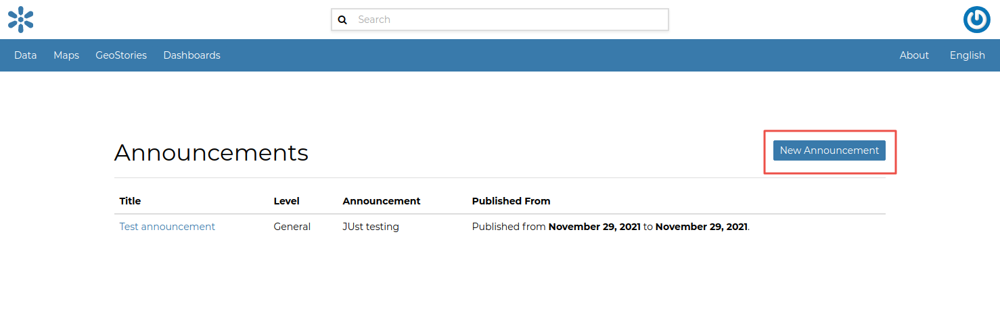
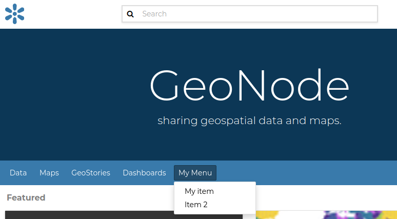

# Accessing the panel

| The *Admin Panel* is a model-centric interface where trusted users can manage content on GeoNode.
| Only the staff users can access the admin interface.

::: note
::: title
Note
:::

The "staff" flag, which controls whether the user is allowed to log in to the admin interface, can be set by the admin panel itself.
:::

The panel can be reached from `Admin`{.interpreted-text role="guilabel"} link of the *User Menu* in the navigation bar (see the picture below) or through this URL: `http://<your_geonode_host>/admin`.

<figure>

<figcaption><em>The Admin Link of the User Menu</em></figcaption>
</figure>

When clicking on that link the Django-based *Admin Interface* page opens and shows you all the Django models registered in GeoNode.

<figure>

<figcaption><em>The GeoNode Admin Interface</em></figcaption>
</figure>

# Reset or Change the admin password

From the *Admin Interface* you can access the `Change password`{.interpreted-text role="guilabel"} link by clicking on the username on the right side of the navigation bar. which will open a dropdown.

<figure>

<figcaption><em>The Change Password Link</em></figcaption>
</figure>

It allows you to access the *Change Password Form* through which you can change your password.

<figure>

<figcaption><em>The Change Password Form</em></figcaption>
</figure>

Once the fields have been filled out, click on `Change my password`{.interpreted-text role="guilabel"} to perform the change.

# Simple Theming

GeoNode provides by default some theming options manageable directly from the Administration panel.
Most of the times those options allows you to easily change the GeoNode look and feel without touching a single line of [HTML]{.title-ref} or [CSS]{.title-ref}.

As an [administrator]{.title-ref} go to `http://<your_geonode_host>/admin/geonode_themes/geonodethemecustomization/`.

<figure>

<figcaption><em>List of available Themes</em></figcaption>
</figure>

The panel shows all the available GeoNode themes, if any, and allows you to create new ones.

::: warning
::: title
Warning
:::

Only one theme at a time can be **activated** (aka *enabled*). By disabling or deleting all the available themes, GeoNode will turn the gui back to the default one.
:::

Editing or creating a new Theme, will actually allow you to customize several properties.

At least you\'ll need to provide a `Name` for the Theme. Optionally you can specify also a `Description`, which will allow you to better
identify the type of Theme you created.

<figure>

<figcaption><em>Theme Name and Description</em></figcaption>
</figure>

Just below the `Description` field, you will find the `Enabled` checkbox, allowing you to toggle the Theme.

<figure>

<figcaption><em>Theme Name and Description</em></figcaption>
</figure>

## Jumbotron and Get Started link

::: note
::: title
Note
:::

Remember, everytime you want to apply some changes to the Theme, you **must** save the Theme and reload the GeoNode browser tab.
In order to quickly switch back to the Home page, you can just click the `VIEW SITE` link on the top-right corner of the Admin dashboard.

{.align-center}
:::

The next section, allows you to define the first important Theme properties. This part involves the GeoNode main page sections.

<figure>

<figcaption><em>Jumbotron and Logo options</em></figcaption>
</figure>

By changing those properties as shown above, you will easily change your default home page from this

<figure>

<figcaption><em>GeoNode Default Home</em></figcaption>
</figure>

to this

<figure>

<figcaption><em>Updating Jumbotron and Logo</em></figcaption>
</figure>

It is possible to optionally **hide** the `Jumbotron text`.

{.align-center}

<figure>

<figcaption><em>Hide Jumbotron text</em></figcaption>
</figure>

## Slide show

To switch between a slide show and a jumbotron, flip the value of the welcome theme from \"slide show\" to \"jumbotron\" and vice versa to either display a jumbotron with content or a slide show in the home page

For example, to display a slide show, change the welcome theme from jumbotron background

{.align-center}

to slide show

{.align-center}

Before creating a slide show, make sure you have slides to select from (in the multi-select widget) to make up the slide show.

{.align-center}

If no slides exist, click the plus (+) button beside the slide show multi-select widget to add a new slide.

{.align-center}

Fill in the slide name, slide content using markdown formatting, and upload a slide image (the image that will be displayed when the slide is in view).

{.align-center}

For slide images that already contain text, hide slide content by checking the checkbox labeled \"Hide text in the jumbotron slide\" as shown below, then save the slide.

{.align-center}

It is also possible to hide a slide from all slide show themes that use it by unchecking the checkbox labeled \"Is enabled\" as shown below.

{.align-center}

Selecting the above slide in a slide show and enabling slide show (using the \"welcome theme\" configuration) will create a slide show with a slide as shown below:

{.align-center}

## Switching between different themes

In the case you have defined more Themes, switching between them is as easy as `enabling` one and `disabling` the others.

Remember to save the Themes everytime and refresh the GeoNode home page on the browser to see the changes.

It is also important that there is **only one** Theme enabled **at a time**.

In order to go back to the standard GeoNode behavior, just disable or delete all the available Themes.

# Add a new user

In GeoNode, administrators can manage other users. For example, they can *Add New Users* through the following form.

<figure>

<figcaption><em>Adding New Users</em></figcaption>
</figure>

The form above can be reached from the *Admin Panel* at the following path: *Home \> People \> Users*. Click on `+  Add user`{.interpreted-text role="guilabel"} to open the form page.

<figure>

<figcaption><em>The Add User button in the Users List page</em></figcaption>
</figure>

It is also available, in the GeoNode UI, the `Add User`{.interpreted-text role="guilabel"} link of the *About* menu in the navigation bar.

<figure>

<figcaption><em>Add User Link</em></figcaption>
</figure>

To perform the user creation fill out the required fields (*username* and *password*) and click on `Save`{.interpreted-text role="guilabel"}.
You will be redirected to the *User Details Page* which allows to insert further information about the user.

<figure>

<figcaption><em>The User Details Page</em></figcaption>
</figure>

The user will be visible into the *Users List Page* of the *Admin Panel* and in the *People Page* (see `user-info`{.interpreted-text role="ref"}).

<figure>

<figcaption><em>The User in the People page</em></figcaption>
</figure>

# Activate/Disable a User

When created, new users are *active* by default.
You can check that in the *User Details Page* from the *Admin Panel* (see the picture below).

<figure>

<figcaption><em>New Users Active by default</em></figcaption>
</figure>

| *Active* users can interact with other users and groups, can manage resources and, more in general, can take actions on the GeoNode platform.
| Untick the *Active* checkbox to disable the user. It will be not considered as user by the GeoNode system.

<figure>

<figcaption><em>Disabled Users</em></figcaption>
</figure>

# Change a User password

GeoNode administrators can also change/reset the password for those users who forget it.
As shown in the picture below, click on `this form` link from the *User Details Page* to access the *Change Password Form*.

<figure>

<figcaption><em>Changing Users Passwords</em></figcaption>
</figure>

The *Change User Password Form* should looks like the following one.
Insert the new password two times and click on `CHANGE PASSWORD`{.interpreted-text role="guilabel"}.

<figure>

<figcaption><em>Changing Users Passwords</em></figcaption>
</figure>

# Promoting a User to Staff member or superuser

Active users have not access to admin tools.
GeoNode makes available those tools only to *Staff Members* who have the needed permissions.
*Superusers* are staff members with full access to admin tools (all permissions are assigned to them).

Administrators can promote a user to *Staff Member* by ticking the **Staff status** checkbox in the *User Details Page*.
To make some user a *Superuser*, the **Superuser status** checkbox should be ticked. See the picture below.

<figure>

<figcaption><em>Staff and Superuser permissions</em></figcaption>
</figure>

# Creating a Group

| In GeoNode is possible to create new groups with set of permissions which will be inherited by all the group members.
| The creation of a Group can be done both on the GeoNode UI and on the *Admin Panel*, we will explain how in this paragraph.

The `Create Groups`{.interpreted-text role="guilabel"} link of *About* menu in the navigation bar allows administrators to reach the *Group Creation Page*.

<figure>

<figcaption><em>The Create Group Link</em></figcaption>
</figure>

The following form will open.

<figure>

<figcaption><em>The Group Creation Form</em></figcaption>
</figure>

Fill out all the required fields and click `Create`{.interpreted-text role="guilabel"} to create the group.
The *Group Details Page* will open.

<figure>

<figcaption><em>The Group Details Page</em></figcaption>
</figure>

The new created group will be searchable in the *Groups List Page*.

<figure>

<figcaption><em>The Groups List Page</em></figcaption>
</figure>

::: note
::: title
Note
:::

The `Create a New Group`{.interpreted-text role="guilabel"} button on the *Groups List Page* allows to reach the *Group Creation Form*.
:::

| As already mentioned above, groups can also be created from the Django-based *Admin Interface* of GeoNode.
| The *Groups* link of the *AUTHENTICATION AND AUTHORIZATION* section allows to manage basic Django groups which only care about permissions.
| To create a GeoNode group you should take a look at the *GROUPS* section.

<figure>

<figcaption><em>The Groups Section on the Admin Panel</em></figcaption>
</figure>

As you can see, GeoNode provides two types of groups. You will learn more about that in the next paragraph.

## Types of Groups

In GeoNode users can be grouped through a *Group Profile*, an enhanced Django group which can be enriched with some further information such as a description, a logo, an email address, some keywords, etc.
It also possible to define some *Group Categories* based on which those group profiles can be divided and filtered.

A new **Group Profile** can be created as follow:

-   click on the *Group Profile* `+ Add`{.interpreted-text role="guilabel"} button

-   fill out all the required fields (see the picture below), *Group Profiles* can be explicitly related to group categories

    <figure>
    
    <figcaption><em>A new Group Profile</em></figcaption>
    </figure>

-   click on `Save`{.interpreted-text role="guilabel"} to perform the creation, the new created group profile will be visible in the *Group Profiles List*

    <figure>
    
    <figcaption><em>The Group Profiles List</em></figcaption>
    </figure>

## Group Categories

*Group Profiles* can also be related to *Group Categories* which represents common topics between groups.
In order to add a new **Group Category** follow these steps:

-   click on the *Group Categories* `+ Add group category`{.interpreted-text role="guilabel"} button

-   fill out the creation form (type *name* and *description*)

    <figure>
    
    <figcaption><em>A new Group Category</em></figcaption>
    </figure>

-   click on `Save`{.interpreted-text role="guilabel"} to perform the creation, the new created category will be visible in the *Group Categories List*

    <figure>
    
    <figcaption><em>The Group Categories List</em></figcaption>
    </figure>

# Managing a Group

Through the `Groups`{.interpreted-text role="guilabel"} link of *About* menu in the navigation bar, administrators can reach the *Groups List Page*.

<figure>

<figcaption><em>The Groups Link in the navigation bar</em></figcaption>
</figure>

In that page all the GeoNode *Group Profiles* are listed.

<figure>

<figcaption><em>Group Profiles List Page</em></figcaption>
</figure>

For each group some summary information (such as the *title*, the *description*, the number of *members* and *managers*) are displayed near the *Group Logo*.

Administrators can manage a group from the *Group Profile Details Page* which is reachable by clicking on the *title* of the group.

<figure>

<figcaption><em>Group Profile Details Page</em></figcaption>
</figure>

As shown in the picture above, all information about the group are available on that page:

-   the group *Title*;
-   the *Last Editing Date* which shows a timestamp corresponding to the last editing of the group properties;
-   the *Keywords* associated with the group;
-   *Permissions* on the group (Public, Public(invite-only), Private);
-   *Members* who join the group;
-   *Managers* who manage the group.

There are also four links:

-   The `Edit Group Details`{.interpreted-text role="guilabel"} link opens the *Group Profile Form* through which the following properties can be changed:

    -   *Title*.
    -   *Logo* (see next paragraphs).
    -   *Description*.
    -   *Email*, to contact one or all group members.
    -   *Keywords*, a comma-separated list of keywords.
    -   *Access*, which regulates permissions:
        -   *Public*: any registered user can view and join a public group.
        -   *Public (invite-only)*: only invited users can join, any registered user can view the group.
        -   *Private*: only invited users can join the group, registered users cannot see any details about the group, including membership.
    -   *Categories*, the group categories the group belongs to.

-   `Manage Group Members`{.interpreted-text role="guilabel"} (see next paragraphs).

-   the `Delete this Group`{.interpreted-text role="guilabel"}, click on it to delete the Group Profile. GeoNode requires you to confirm this action.

    <figure>
    
    <figcaption><em>Confirm Group Deletion</em></figcaption>
    </figure>

-   the `Group Activities`{.interpreted-text role="guilabel"} drives you to the *Group Activities Page* where you can see all datasets, maps and documents associated with the group. There is also a *Comments* tab which shows comments on those resources.

    <figure>
    
    <figcaption><em>Group Activities</em></figcaption>
    </figure>

## Group Logo

Each group represents something in common between its members.
So each group should have a *Logo* which graphically represents the idea that identify the group.

On the *Group Profile Form* page you can insert a logo from your disk by click on `Browse...`{.interpreted-text role="guilabel"}.

<figure>

<figcaption><em>Editing the Group Logo</em></figcaption>
</figure>

| Click on `Update`{.interpreted-text role="guilabel"} to apply the changes.
| Take a look at your group now, you should be able to see that logo.

<figure>

<figcaption><em>The Group Logo</em></figcaption>
</figure>

## Managing Group members

The `Manage Group Members`{.interpreted-text role="guilabel"} link opens the *Group Members Page* which shows *Group Members* and *Group Managers*.
**Managers** can edit group details, can delete the group, can see the group activities and can manage memberships.
Other **Members** can only see the group activities.

| In Public Groups, users can join the group without any approval. Other types of groups require the user to be invited by the group managers.
| Only group managers can *Add new members*. In the picture below, you can see the manager can search for users by typing their names into the *User Identifiers* search bar. Once found, he can add them to the group by clicking the `Add Group Members`{.interpreted-text role="guilabel"} button. The *Assign manager role* flag implies that all the users found will become managers of the group.

<figure>

<figcaption><em>Adding a new Member to the Group</em></figcaption>
</figure>

The following picture shows you the results.

<figure>

<figcaption><em>New Members of the Group</em></figcaption>
</figure>

If you want to change the role of group members after adding them, you can use the \"promote\" button to make a member into a manager, and the \"demote\" button to make a manager into a regular member.

# Group based advanced data workflow

By default GeoNode is configured to make every resource suddenly available to everyone, i.e. publicly accessible
even from anonymous/non-logged in users.

It is actually possible to change few configuration settings in order to allow GeoNode to enable an advanced publication workflow.

With the advanced workflow enabled, your resources won\'t be automatically published (i.e. made visible and accessible for all, contributors or simple users).

For now, your item is only visible by yourself, the manager of the group to which the resource is linked (this information is filled in the metadata), the members of this group, and the GeoNode Administrators.

Before being published, the resource will follow a two-stage review process, which is described below:

<figure>

<figcaption><em>From upload to publication: the review process on GeoNode</em></figcaption>
</figure>

## How to enable the advanced workflow

You have to tweak the GeoNode settings accordingly.

Please see the details of the following GeoNode `Settings`:

-   [RESOURCE_PUBLISHING](../../basic/settings/index.html#resource-publishing)
-   [ADMIN_MODERATE_UPLOADS](../../basic/settings/index.html#admin-moderate-uploads)
-   [GROUP_PRIVATE_RESOURCES](../../basic/settings/index.html#group-private-resources)

Summarizing, when all the options above of the Advanced Workflow are enabled, upon a new upload we will have:

> -   The **\"unpublished\"** resources will be **hidden** to **anonymous users only**. The **registered users** will be still able to access the resources (if they have the rights to do that, of course).
> -   The **\"unpublished\"** resources will remain hidden to users if the permission (see *Admin Guide section: \'Manage Permissions\'*) will be explicitly removed
> -   During the upload, whenever the advanced workflow is enabled, the **owner\'s Groups** are automatically allowed to access the resource, even if the **\"anonymous\"** flag has been disabled. Those permissions can be removed later on
> -   During the upload, **\"managers\"** of the owner\'s Groups associated to the resource, are always allowed to edit the resource, the same as they are admin for that resource
> -   **\"managers\"** of the owner\'s Groups associated to the resource are allowed to **\"publish\"** also the resources, not only to **\"approve\"** them

## Change the owner rights in case of advanced workflow is on

After switching `ADMIN_MODERATE_UPLOADS` to True and resource is approved owner is no longer able
to modify it. He will see new button on the resource detail page: Request change. After clicking this, view with short
form is shown.
On this view user can write short message why he want to modify the resource.

This message will be sent through messaging and email system to administrators:

After administrator unapprove the resource owner is again able to modify it.

## The group Manager approval

Here, the role of the Manager of the group to which your dataset, document or map is linked is to check that the uploaded item is correct.
Particularly, in the case of a dataset or a map, it consists of checking that the chosen cartographic representation and the style are
fitting but also that the discretization is appropriate.

The Manager must also check that the metadata are properly completed and that the mandatory information
(Title, Abstract, Edition, Keywords, Category, Group, Region) are filled.

If needed, the Manager can contact the contributor responsible of the dataset, document or map in order to report potential comments or
request clarifications.

Members of the group can also take part in the reviewing process and give some potential inputs to the responsible of the
dataset, document or map.

When the Manager considers that the resource is ready to be published, he should approve it.
To do so, the Manager goes to the resource detail page, then opens the `Edit Metadata`{.interpreted-text role="guilabel"}.
In the `Settings`{.interpreted-text role="guilabel"} tab, the manager checks the `Approved`{.interpreted-text role="guilabel"} box, and then updates the metadata and saves the changes:

Following this approval, the GeoNode Administrators receive a notification informing them that an item is now waiting for publication

## The publication by the GeoNode Administrator

Prior to the public release of an approved resource, the Administrator of the platform performs a final validation of
the item and its metadata, notably to check that it is in line with license policies.

If needed, the GeoNode Administrator can contact the Manager who has approved the resource, as well as its responsible.

Once the resource is validated, the item is made public by the Administrator.
It can now be viewed, accessed, and downloaded in accordance with the `Permissions` set by the responsible contributor.

## Promotion, Demotion and Removal of Group Members

If the owner is a group Manager, They have permissions to edit, approve, and publish the resource.

When a group member is promoted to a manager role, they gain permissions to edit, approve and publish the resource.

When a group manager is demoted to a member role, they lose edit permissions of the resource and only remain with view and download permissions.

When a member is removed from the group, they can nolonger access the unpublished resource anymore.

# Manage profiles using the admin panel

So far GeoNode implements two distinct roles, that can be assigned to resources such as datasets, maps or documents:

-   party who authored the resource
-   party who can be contacted for acquiring knowledge about or acquisition of the resource

These two profiles can be set in the GeoNode interface by accessing the metadata page and setting the `Point of Contact` and `Metadata Author` fields respectively.

Is possible for an administrator to add new roles if needed, by clicking on the `Add contact role`{.interpreted-text role="guilabel"} button in the `Base -> Contact Roles`{.interpreted-text role="guilabel"} section:

{.align-center}

Clicking on the `People`{.interpreted-text role="guilabel"} section (see figure) will open a web for with some personal information plus a section called `Users`{.interpreted-text role="guilabel"}.


Is important that this last section is not modified here unless the administrator is very confident in that operation.

{.align-center}

Manage datasets using the admin panel
===================================

Some of the datasets information can be edited directly through the admin interface although the best place is in the `Dataset -> Metadata Edit`{.interpreted-text role="guilabel"} in GeoNode.

Clicking on the `Admin > Dataset > Datasets`{.interpreted-text role="guilabel"} link will show the list of available datasets.

{.align-center}

::: warning
::: title
Warning
:::

It is not recommended to modify the Datasets\' `Attributes` or `Styles` directly from the Admin dashboard unless you are aware of your actions.
:::

The `Metadata` information can be changed for multiple datasets at once through the `Metadata batch edit`{.interpreted-text role="guilabel"} action. Select the datasets you want to edit in the batch and at the bottom, enter the [Metadata batch edit]{.title-ref} action then click `Go`{.interpreted-text role="guilabel"}.

{.align-center}

This will open a form with the information you can edit in a batch. see picture below.

{.align-center}

By clicking over one Dataset link, it will show a detail page allowing you to modify some of the resource info like the metadata, the keywords, the title, etc.

::: note
::: title
Note
:::

It is strongly recommended to always use the GeoNode resource `Edit Metadata`{.interpreted-text role="guilabel"} or `Advanced Metadata`{.interpreted-text role="guilabel"} tools in order to edit the metadata info.
:::

The `Permissions` can be changed also for multiple Datasets at once through the `Set permissions`{.interpreted-text role="guilabel"} action.

{.align-center}

By clicking over one Dataset link, it will show a detail page allowing you to modify the permissions for the selected resources.

# Manage the maps using the admin panel

Similarly to the Datasets, it is possible to manage the available GeoNode Maps through the Admin panel also.

Move to `Admin > Maps`{.interpreted-text role="guilabel"} to access the Maps list.

{.align-center}

Notice that by enabling the `Featured` option here, will allow GeoNode to show the Map thumbnail and the Map detail link at the top under featured resources on the `Home Page`{.interpreted-text role="guilabel"}

{.align-center}

{.align-center}

# Manage the documents using the admin panel

Similarly to the Datasets and Maps, it is possible to manage the available GeoNode Documents through the Admin panel also.

Move to `Admin > Documents`{.interpreted-text role="guilabel"} to access the Documents list.

{.align-center}

By clicking over one Document link, it will show a detail page allowing you to modify some of the resource info like the metadata, the keywords, the title, etc.

# Manage the base metadata choices using the admin panel

`Admin > Base`{.interpreted-text role="guilabel"} contains almost all the objects you need to populate the resources metadata choices.

<figure>

<figcaption><em>Admin dashboard Base Panel</em></figcaption>
</figure>

In other words the options available from the `select-boxes`{.interpreted-text role="guilabel"} of the resource `Edit Metadata`{.interpreted-text role="guilabel"} and `Advanced Metadata`{.interpreted-text role="guilabel"} forms.

<figure>

<figcaption><em>Metadata Form</em></figcaption>
</figure>

<figure>

<figcaption><em>Advanced Metadata Form</em></figcaption>
</figure>

::: note
::: title
Note
:::

When editing the resource metadata through the `Edit Metadata`{.interpreted-text role="guilabel"}, some fields are marked as `mandatory` and by filling those information
the `Completeness` progress will advance accordingly.

<figure>

<figcaption><em>Metadata Completeness</em></figcaption>
</figure>

Even if not all the fields have been filled, the system won\'t prevent you to update the metadata; this is why the `Mandatory` fields are
mandatory to be fully compliant with an `ISO 19115` metadata schema, but are only recommended to be compliant with GeoNode.

Also the `Completeness` indicates how far the metadata is to be compliant with an `ISO 19115` metadata schema.

Of course, it is **highly** recommended to always fill as much as possible at least all the metadata fields marked as `Mandatory`.

This will improve not only the quality of the data stored into the system, but will help the users to easily search for them on GeoNode.

All the `Search & Filter` panels and options of GeoNode are, in fact, based on the resources metadata fields. Too much generic descriptions and
too empty metadata fields, will give highly un-precise and very wide search results to the users.
:::

## Hierarchical keywords

Through the `Admin > Base > Hierarchical keywords`{.interpreted-text role="guilabel"} panel it will be possible to manage all the keywords associated to the resources.

<figure>

<figcaption><em>Hierarchical keywords list</em></figcaption>
</figure>

<figure>

<figcaption><em>Hierarchical keywords edit</em></figcaption>
</figure>

-   The `Name`{.interpreted-text role="guilabel"} is the human readable text of the keyword, what users will see.
-   The `Slug`{.interpreted-text role="guilabel"} is a unique label used by the system to identify the keyword; most of the times it is equal to the name.

Notice that through the `Position`{.interpreted-text role="guilabel"} and `Relative to`{.interpreted-text role="guilabel"} selectors, it is possible to establish a hierarchy between the available keywords.
The hierarchy will be reflected in the form of a tree from the metadata panels.

By default each user with editing metadata rights on any resource, will be able to insert new keywords into the system by simply typing a free text on the keywords metadata field.

It is possible to force the user to select from a fixed list of keywords through the [FREETEXT_KEYWORDS_READONLY](../../basic/settings/index.html#freetext-keywords-readonly) setting.

When set to [True]{.title-ref} keywords won\'t be writable from users anymore. Only admins can will be able to manage them through the `Admin > Base > Hierarchical keywords`{.interpreted-text role="guilabel"} panel.

## Licenses

Through the `Admin > Base > Licenses`{.interpreted-text role="guilabel"} panel it will be possible to manage all the licenses associated to the resources.

<figure>

<figcaption><em>Metadata editor Licenses</em></figcaption>
</figure>

::: warning
::: title
Warning
:::

It is **strongly** recommended to not publish resources without an appropriate license. Always make sure the data provider specifies the correct license and that all the restrictions have been honored.
:::

## Metadata Regions

Through the `Admin > Base > Metadata Regions`{.interpreted-text role="guilabel"} panel it will be possible to manage all the admin areas associated to the resources.

<figure>

<figcaption><em>Resource Metadata Regions</em></figcaption>
</figure>

Notice that those regions are used by GeoNode to filter search results also through the resource list view.

::: note
::: title
Note
:::

GeoNode tries to guess the `Regions` intersecting the data bounding boxes when uploading a new dataset. Those should be refined by the user dataset on anyway.
:::

## Metadata Restriction Code Types and Spatial Representation Types

Through the `Admin > Base > Metadata Restriction Code Types`{.interpreted-text role="guilabel"} and `Admin > Base > Metadata Spatial Representation Types`{.interpreted-text role="guilabel"} panels, it will
be possible to **update only** the metadata descriptions for restrictions and spatial representation types.

Such lists are *read-only* by default since they have been associated to the specific codes of the `ISO 19115` metadata schema.
Changing them would require the system to provide a custom dictionary through the metadata catalog too. Such functionality is not supported actually by GeoNode.

## Metadata Topic Categories

Through the `Admin > Base > Metadata Topic Categories`{.interpreted-text role="guilabel"} panel it will be possible to manage all the resource metadata categories avaialble into the system.

Notice that by default, GeoNode provides the standard topic categories available with the `ISO 19115` metadata schema. Changing them means that the system won\'t be
compliant with the standard `ISO 19115` metadata schema anymore. `ISO 19115` metadata schema extensions are not currently supported natively by GeoNode.

It is worth notice that GeoNode allows you to associate [Font Awesome Icons](https://fontawesome.com/icons?d=gallery) to each topic category through their `fa-icon` code.
Those icons will be used by GeoNode to represent the topic category on both the `Search & Filter` menus and `Metadata`{.interpreted-text role="guilabel"} panels.

::: warning
::: title
Warning
:::

The list of the `Metadata Topic Categories` on the home page is currently fixed. To change it you will need to update or override the GeoNode `index.html` HTML template.
:::

By default the `Metadata Topic Categories` are *writable*. Meaning that they can be removed or created by the `Admin`{.interpreted-text role="guilabel"} panel.

It is possible to make them fixed (it will be possible to update their descriptions and icons only) through the [MODIFY_TOPICCATEGORY](../../basic/settings/index.html#modify-topiccategory) setting.

# Announcements

As an Administrator you might need to broadcast announcements to the world about your portal or simply to the internal contributors.

GeoNode `Announcements` allow actually to do that; an admin has the possibility to create three types of messages, accordingly to their severity,
decide their validity in terms of time period (start date and expiring date of the announcement), who can view them or not (everyone or just the
registerd members) and whenever a user can hide the message or not and how long.

There are three types of announcements accordingly to their severity level: `General`, `Warning` and `Critical`
The difference is mainly the color of the announcement box.

Only administrators and staff members can create and manage announcements.

Currently there two ways to access and manage the announcements list:

1.  Via the GeoNode interface, from the `Profile`{.interpreted-text role="guilabel"} panel

    > ::: note
    > ::: title
    > Note
    > :::
    >
    > Those are accessible by both admins and staff members.
    > :::
    >
    > <figure>
    > 
    > <figcaption><em>Announcements from the Profile panel</em></figcaption>
    > </figure>

2.  Via the GeoNode `Admin`{.interpreted-text role="guilabel"} panel

    > ::: note
    > ::: title
    > Note
    > :::
    >
    > Those are accessible by admins only.
    > :::
    >
    > <figure>
    > 
    > <figcaption><em>Announcements from the Admin panel</em></figcaption>
    > </figure>

The functionalities are almost the same for both the interfaces, except that from the `Admin`{.interpreted-text role="guilabel"} panel it is possible to manage the
dismissals too.

`Dismissals` are basically records of members that have read the announcement and closed the message box. An announcement can have one
`dismissal type` among the three below:

1.  `No Dismissal Allowed`{.interpreted-text role="guilabel"} it won\'t be possible to close the announcement\'s message box at all.
2.  `Session Only Dismissal`{.interpreted-text role="guilabel"} (\*) the default one, it will be possible to close the announcement\'s message box for the current browser session. It will show up again at next access.
3.  `Permanent Dismissal Allowed`{.interpreted-text role="guilabel"} once the announcement\'s message box is closed, it won\'t appear again for the current member.

## How to create and manage Announcements

From the `Profile`{.interpreted-text role="guilabel"} panel, click on `Announcements` link

<figure>

<figcaption><em>Announcements List from the Profile panel</em></figcaption>
</figure>

Click either on `New Announcement`{.interpreted-text role="guilabel"} to create a new one or over a title of an existing one to manage its contents.

Create a new announcement is quite straight; you have to fill the fields provided by the form.

::: warning
::: title
Warning
:::

In order to be visible, you will need to check the `Site wide`{.interpreted-text role="guilabel"} option **in any case**. You might want to hide the message to *anonymous* users by enabling the `Members only`{.interpreted-text role="guilabel"} option too.
:::

<figure>

<figcaption><em>Create Announcement from the Profile panel</em></figcaption>
</figure>

Managing announcements form the `Admin`{.interpreted-text role="guilabel"} panel, is basically the same; the fields for the form will be exactly the same.

<figure>

<figcaption><em>Create Announcement from the Admin panel</em></figcaption>
</figure>

Accessing announcements options from the `Admin`{.interpreted-text role="guilabel"} panel, allows you to manage dismissals also.
Through this interface you will be able to selectively decide members which can or cannot view a specific announcement, or force them to visualize the messages again by deleting the dismissals accordingly.

<figure>

<figcaption><em>Create Dismissal from the Admin panel</em></figcaption>
</figure>

# Menus, Items and Placeholders

GeoNode provides some integrated functionalities allowing you to quickly and easily customize the top-bar menu (see the example below).

<figure>

<figcaption><em>GeoNode Top-Bar Menu customization</em></figcaption>
</figure>

With minor changes of the `basic.html` template, potentially, it could be possible to use the same approach for a more complex customization.
Let\'s start with the simple one.

By default GeoNode provides custom `placeholders` already defined into the `basic.html` template, called `CARDS_MENU`, `TOPBAR_MENU_RIGHT`, `TOPBAR_MENU_LEFT`, `TOPBAR_MENU`.

From the `Admin > Base`{.interpreted-text role="guilabel"} panel, it is possible to access to the `Menu`, `Menu Items` and `Menu Placeholder` options.

<figure>

<figcaption><em>Menu, Menu Items and Menu Placeholder options on the Admin panel</em></figcaption>
</figure>

The hierarchical structure of a custom `Menu` is the following one:

1.  

    `Menu Placeholder`; first of all you need to define a *placeholder* both into the `Admin > Base`{.interpreted-text role="guilabel"} panel and the `basic.html` template, using the same **keyword**.

    :   By default GeoNode provides already defined menus.

        <figure>
        
        <figcaption><em>The default ``TOPBAR_MENU`` Menu Placeholder on the Admin panel</em></figcaption>
        </figure>

2.  

    `Menu`; second thing to do is to create a new *menu* associated to the corresponding *placeholder*.

    :   This is still possible from the `Admin > Base`{.interpreted-text role="guilabel"} panel

        <figure>
        
        <figcaption><em>Create a new Menu from the Admin panel</em></figcaption>
        </figure>

        You will need to provide:

        -   A `Title`, representing the name of the `Menu` visible by the users

            ::: warning
            ::: title
            Warning
            :::

            By using this approach, internationalization won\'t be supported. For the time being GeoNode does not support this for menus created from the `Admin > Base`{.interpreted-text role="guilabel"} panel.
            :::

        -   A `Menu Placeholder` from the existing ones.

        -   A `Order` in the case you\'ll create more menus associated to the same placeholder.

3.  `Menu Item`; finally you will need to create voices belonging to the *menu*. For the time being, GeoNode allows you to create only `href` links.

    > <figure>
    > 
    > <figcaption><em>Create a new Menu Item from the Admin panel</em></figcaption>
    > </figure>
    >
    > ::: warning
    > ::: title
    > Warning
    > :::
    >
    > The `Menu` won\'t be visible until you add more than one `Menu Item`, If you have 1, item, the item will be showed(but not under the menu).
    > :::

# OAuth2 Access Tokens {#oauth2_admin_panel_access_tokens}

This small section won\'t cover entirely the GeoNode OAuth2 security integration, this is explained in detail in other sections of the documentation
(refer to `oauth2_fixtures_and_migration`{.interpreted-text role="ref"} and `oauth2_tokens_and_sessions`{.interpreted-text role="ref"}).

Here we will focus mainly on the `Admin > DJANGO/GEONODE OAUTH TOOLKIT`{.interpreted-text role="guilabel"} panel items with a specific attention to the `Access tokens` management.

The `Admin > DJANGO/GEONODE OAUTH TOOLKIT`{.interpreted-text role="guilabel"} panel (as shown in the figure below) allows an admin to manage everything related to
GeoNode OAuth2 grants and permissions.

As better explained in other sections of the documentation, this is needed to correctly handle the communication between GeoNode and GeoServer.

<figure>

<figcaption><em>DJANGO/GEONODE OAUTH TOOLKIT Admin panel</em></figcaption>
</figure>

Specifically from this panel an admin can create, delete or extend OAuth2 `Access tokens`.

The section `oauth2_tokens_and_sessions`{.interpreted-text role="ref"} better explains the concepts behind OAuth2 sessions; we want just to refresh the mind here
about the basic concepts:

-   If the [SESSION_EXPIRED_CONTROL_ENABLED](../../basic/settings/index.html#session-expired-control-enabled) setting is set to [True]{.title-ref} (by default it is set to [True]{.title-ref})
    a registered user cannot login to neither GeoNode nor GeoServer without a valid `Access token`.
-   When logging-in into GeoNode through the sign-up form, GeoNode checks if a valid `Access token` exists and it creates a new one if not, or extends
    the existing one if expired.
-   New `Access tokens` expire automatically after [ACCESS_TOKEN_EXPIRE_SECONDS](../../basic/settings/index.html#access-token-expire-seconds) setting (by default 86400)
-   When an `Access token` expires, the user will be kicked out from the session and forced to login again

## Create a new token or extend an existing one

It is possible from the `Admin > DJANGO/GEONODE OAUTH TOOLKIT`{.interpreted-text role="guilabel"} panel to create a new `Access token` for a user.

In order to do that, just click on the `Add`{.interpreted-text role="guilabel"} button beside `Access tokens` topic

<figure>

<figcaption><em>Add a new ``Access token``</em></figcaption>
</figure>

On the new form

<figure>

<figcaption><em>Create an ``Access token``</em></figcaption>
</figure>

select the followings:

1.  `User`; use the search tool in order to select the correct user. The form want the user PK, which is a number, and **not** the username.
    The search tool will do everything for you.

    > <figure>
    > 
    > <figcaption><em>Select a User</em></figcaption>
    > </figure>

2.  `Source refresh token`; this is not mandatory, leave it blank.

3.  `Token`; write here any alphanumeric string. This will be the `access_token` that the member can use to access the OWS services.
    We suggest to use a service like <https://passwordsgenerator.net/> in order to generate a strong token string.

    > <figure>
    > 
    > <figcaption><em>Select a Token</em></figcaption>
    > </figure>

4.  `Application`; select **GeoServer**, this is mandatory

    > <figure>
    > 
    > <figcaption><em>Select the GeoServer Application</em></figcaption>
    > </figure>

5.  `Expires`; select an expiration date by using the `date-time`{.interpreted-text role="guilabel"} widgets.

    > <figure>
    > 
    > <figcaption><em>Select the Token Expiration</em></figcaption>
    > </figure>

6.  `Scope`; select **write**, this is mandatory.

    > <figure>
    > 
    > <figcaption><em>Select the Application Scope</em></figcaption>
    > </figure>

Do not forget to `Save`{.interpreted-text role="guilabel"}.

From now on, GeoNode will use this `Access Token` to control the user session (notice that the user need to login again if closing the browser session),
and the user will be able to access the OWS Services by using the new `Access Token`, e.g.:

``` shell
https://dev.geonode.geo-solutions.it/geoserver/ows?service=wms&version=1.3.0&request=GetCapabilities&access_token=123456
```

Notice the `...quest=GetCapabilities&access_token=123456` (**access_token**) parameter at the end of the URL.

## Force a User Session to expire

Everything said about the creation of a new `Access Token`, applies to the deletion of the latter.

From the same interface an admin can either select an expiration date or delete all the `Access Tokens` associated to a user, in order to
force its session to expire.

Remember that the user could activate another session by logging-in again on GeoNode with its credentials.

In order to be sure the user won\'t force GeoNode to refresh the token, reset first its password or de-activate it.
