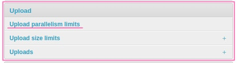
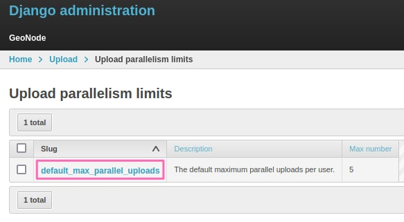

# Upload Parallelism Limit {#upload-parallelism-limits}

Default: `5`

When [uploading datasets](../../usage/managing_datasets/uploading_datasets.html#datasets-uploading), this value limits the number os parallel uploads.

You will get the following message in case of error: `The number of active parallel uploads exceeds 5. Wait for the pending ones to finish.`

This means that you to finish current active uploads before creating a new one.
The default maximum number is set during installation by [DEFAULT_MAX_PARALLEL_UPLOADS_PER_USER](../../basic/settings/index.html#default-max-parallel-uploads-per-user), usually 5 parallel uploads.

After installation, only an user with administrative rights can change it by the admin painel or [accessing by api](../../devel/api/V2/index.html#get--api-v2-upload-parallelism-limits-).

# Accessing the limits in the admin panel

Access the admin panel, scroll until you find the \"Upload Parallelism limits\" option.

> {.align-center}

Click at it, and you will be redirected to the limits list.

> {.align-center}

To change it, click at the slug of the limit, then you can change its description and the max_number value. Changing the slug will not produce any effect.
