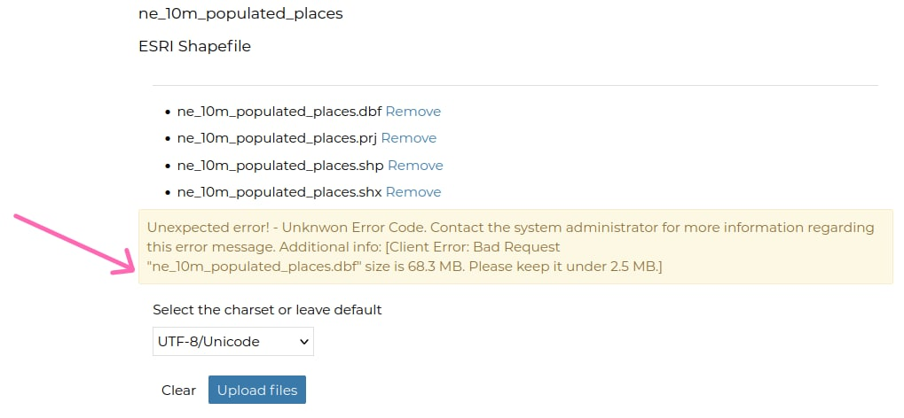
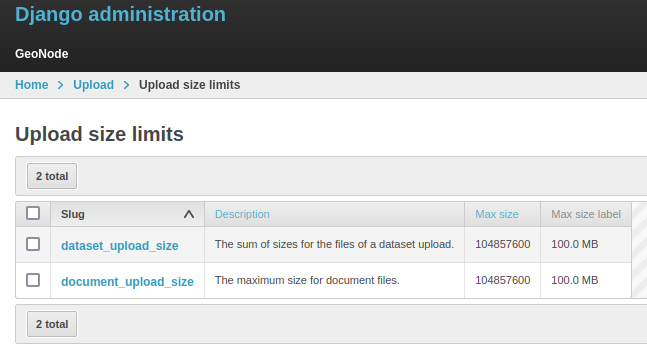

# Upload Size Limits

Default: `104857600` (100 MB in total bytes)

When [uploading datasets](../../usage/managing_datasets/uploading_datasets.html#datasets-uploading)
or [uploading documents](../../usage/managing_documents/uploading_documents.html#uploading-documents),
the total size of the uploaded files is verified.

If it passes a limit value, you will get something similar to the following error:

:   {.align-center}

With the following message: `Total upload size exceeds 100.0 MB. Please try again with smaller files.`

This means that the file you tried to upload is too large. It consider the sum of sizes in the case of datasets/layers with multiple files (ESRI Shapefile).
The default maximum value is set during installation by [DEFAULT_MAX_UPLOAD_SIZE](../../basic/settings/index.html#default-max-upload-size), usually 100 MB.

After installation, only an user with administrative rights can change it by the admin painel or [accessing by api](../../devel/api/V2/index.html#get--api-v2-upload-size-limits-).

# Accessing the limits in the admin panel

Access the admin panel, scroll until you find the \"Upload Size limits\" option.

> {.align-center}

Click at it, and you will be redirected to the limits list.

> {.align-center}

We have two limits here, one for datasets/layers and other for documents.

# Changing a Limit

To change it, click at the slug of one of the limits.

> {.align-center}

You can change its description and the max_size value. Changing the slug will not produce any effect.

Max size value should be entered in bytes, this means that 200 MB is around 200000000 bytes, or 200 \* 1024 \* 1024 = 209715200 if you want to use exact values.
After editing, remember to save and verify in the list if the value is the expected one.

If you try to upload a dataset/layer larger than 100 MB again (but smaller than the new limit) it won\'t raise any errors.

# Advanced notes for developers

When uploading a file there is an additional validation step, to avoid the creation of big temporary files.
This happens with the use of a custom [File Upload Handler](https://docs.djangoproject.com/en/4.0/ref/settings/#std:setting-FILE_UPLOAD_HANDLERS).

During this step we verify the total size of the request, if it\'s considerably bigger than the defined limit, an empty file with a fake large number set as its size is created when processing the request.
Later, during the form validation, the related error will be raised.

The threshould for this to happen is set to `2 * MAX_UPLOAD_SIZE + 2 MB` where MAX_UPLOAD_SIZE is the Upload Size Limit defined by the admin user.
When changing the processes related to the upload size limiting, the upload handlers should also be taken into account. Otherwise, this can lead to the creating of empty datasets and documents.
