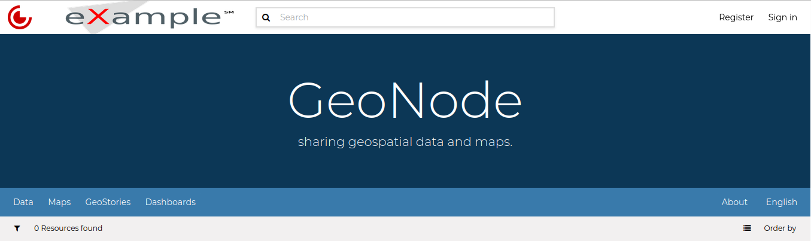
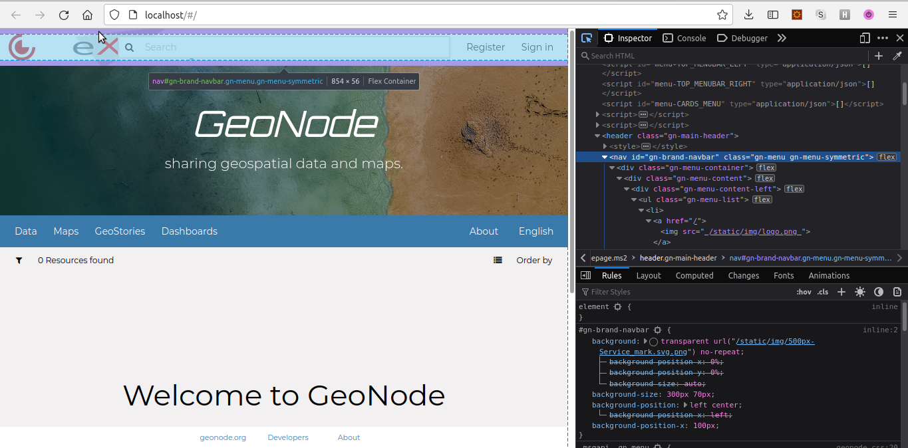
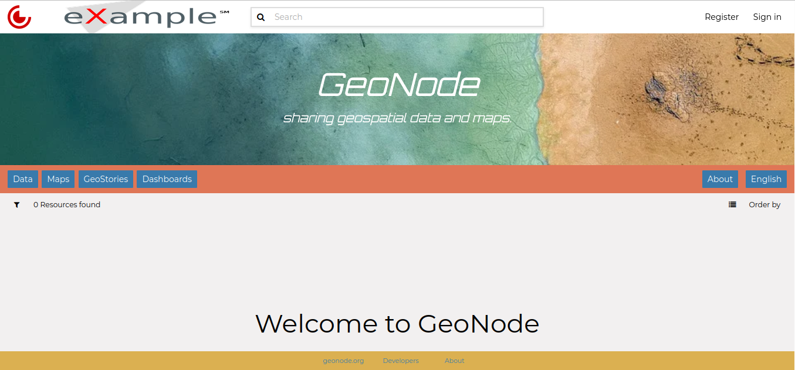
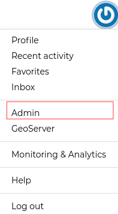
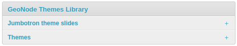
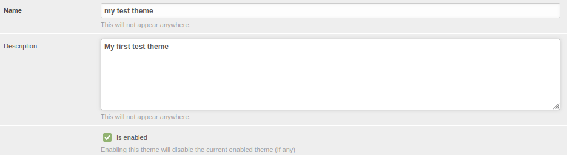
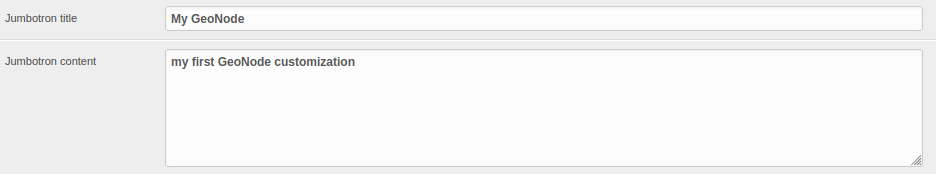
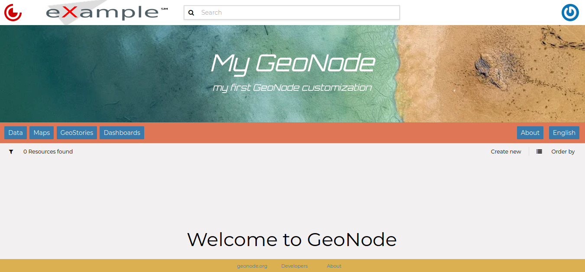

# GeoNode Themes

| We have already explained in `simple-theming`{.interpreted-text role="ref"} how to change the GeoNode theme directly from the *Admin Interface*. This is an easy way for customizing GeoNode appearance but, in some cases, you might want to have more control on it.
| In those cases, you have to venture into the code and it is highly recommended to use a GeoNode Project and customize it instead of the GeoNode default HTML/CSS code. See the following sections to learn more about that.

# Theming your GeoNode Project

There are a range of options available to you if you want to change the default look and feel of your `geonode-project`{.interpreted-text role="ref"}.

## Logos and graphics

GeoNode intentionally does not include a large number of graphics files in its interface.
This keeps page loading time to a minimum and makes for a more responsive interface.
That said, you are free to customize your GeoNode's interface by simply changing the default logo, or by adding your own images and graphics to deliver a GeoNode experience the way you envision it.

Your GeoNode project has a directory already set up for storing your own images at `<my_geonode>/static/img`.
You should place any image files that you intend to use for your project in this directory.

Let's walk through an example of the steps necessary to change the default logo.

1.  Change to the `img`{.interpreted-text role="file"} directory:

    ``` console
    $ cd <my_geonode>/static/img
    ```

2.  If you haven\'t already, obtain your logo image. The URL below is just an example, so you will need to change this URL to match the location of your file or copy it to this location:

    ``` console
    $ wget https://upload.wikimedia.org/wikipedia/commons/thumb/a/ac/Service_mark.svg/500px-Service_mark.svg.png
    $ wget https://upload.wikimedia.org/wikipedia/commons/thumb/c/c8/Wikimapia_logo_without_label.svg/426px-Wikimapia_logo_without_label.svg.png -O logo.png
    ```

3.  Create snippets directory :

    ``` console
    $ cd ../../..
    $ mkdir <my_geonode>/templates/geonode-mapstore-client/snippets
    $ cd <my_geonode>/templates/geonode-mapstore-client/snippets
    ```

4.  Create a new HTML file named `brand_navbar.html`{.interpreted-text role="file"}

    ``` console
    $ sudo vi brand_navbar.html
    ```

    ``` css
    
    
    
    <style>
     #gn-brand-navbar {
       background: transparent url("/static/img/500px-Service_mark.svg.png") no-repeat;
       background-size: 300px 70px;
       background-position: left center;
       background-position-x: 100px;
     }
    </style>
    
    
    
    
    ```

5.  Restart your GeoNode project and look at the page in your browser:

    ``` console
    $ cd /home/geonode
    $ sudo rm -Rf geonode/geonode/static_root/*
    $ cd my_geonode
    $ python manage.py collectstatic
    $ sudo service apache2 restart
    ```

    ::: note
    ::: title
    Note
    :::

    It is a good practice to cleanup the **static_folder** and the Browser Cache before reloading in order to be sure that the changes have been correctly taken and displayed on the screen.
    :::

Visit your site at <http://localhost/> or the remote URL for your site.

> <figure>
> 
> <figcaption><em>Custom logo</em></figcaption>
> </figure>

In the following sections you will learn how to customize this header to make it as you want.

::: note
::: title
Note
:::

You should commit these changes to your repository as you progress through this section, and get in the habit of committing early and often so that you and others can track your project on GitHub.
Making many atomic commits and staying in sync with a remote repository makes it easier to collaborate with others on your project.
:::

## Cascading Style Sheets

In the last section you already learned how to override GeoNode's default CSS rules to include your own logo.
You are able to customize any aspect of GeoNode's appearance this way.
In the last screenshot, you saw that the main area in the homepage is covered up by the expanded header.

First, we'll walk through the steps necessary to displace it downward so it is no longer hidden, then change the background color of the header to match the color in our logo graphic.

1.  Reopen `<my_geonode>/static/css/brand_navbar.html`{.interpreted-text role="file"} in your editor:

> ``` console
> $ cd <my_geonode>/templates/geonode-mapstore-client/snippets
> $ sudo vi brand_navbar.html
> ```

1.  Append a rule to change the background color of the header to match the logo graphic:

> ``` css
> #gn-brand-navbar {
>     ....
>     background-color: #ff0000 !important;
> }
> ```

1.  Create new file to manipulate *hero* section:

> ``` console
> $ cd <my_geonode>/templates/geonode-mapstore-client/snippets
> $ sudo vi hero.html
> ```

1.  Add the following code to change the background image and font for the *hero* section:

> ``` css
> 
> 
>   <style>
>     #gn-hero {
>       background-image: url('https://cdn.pixabay.com/photo/2017/09/16/16/09/sea-2755908_960_720.jpg');
>       background-size: cover;
>       background-position: center center;
>       background-repeat: no-repeat;
>       background-color: rgb(156, 156, 156);
>       background-blend-mode: multiply;
>       background-size: 100%;
>     }
>     .msgapi .gn-hero .jumbotron .gn-hero-description h1 {
>       font-weight: lighter;
>       word-break: break-word;
>       font-style: oblique;
>       font-family: orbitron;
>       font-size: 3.4rem;
>     }
>   </style>
> 
> ```

1.  Collect the static files into STATIC_ROOT, restart the development server and reload the page:

    > ``` console
    > $ python manage.py collectstatic
    > $ sudo service apache2 restart
    > ```
    >
    > <figure>
    > 
    > <figcaption><em>CSS override</em></figcaption>
    > </figure>

You can continue adding rules to this file to override the styles that are in the GeoNode base CSS file which is built from [base.less](https://github.com/GeoNode/geonode/blob/master/geonode/static/geonode/less/base.less).

::: note
::: title
Note
:::

You may find it helpful to use your browser\'s development tools to inspect elements of your site that you want to override to determine which rules are already applied. See the screenshot below.

<figure>

<figcaption><em>Screenshot of using browser debugger to inspect the CSS overrides</em></figcaption>
</figure>
:::

## Modify GeoNode Homepage

So far we learned how to modify some template sections of your GeoNode main page.
You can do it individually per section template, adding a new page under
`<my_geonode>/templates/geonode-mapstore-client/snippets`{.interpreted-text role="file"} folder with the
section name (ex: `brand_navbar.html`{.interpreted-text role="file"}) or by extending the base template file
`custom_theme.html`{.interpreted-text role="file"} where you can add different theme settings in one place.

1.  Remove the previous [hero]{.title-ref} section `hero.html`{.interpreted-text role="file"} file:

> ``` console
> $ rm <my_geonode>/templates/geonode-mapstore-client/snippets/hero.html
> ```

1.  Create a new `custom_theme.html`{.interpreted-text role="file"} file:

> ``` console
> $ cd <my_geonode>/templates/geonode-mapstore-client/snippets
> $ sudo vi custom_theme.html
> ```

1.  Add the following content to this page:

> ``` css
> 
> 
> <style>
>     .msgapi .gn-theme {
>         --gn-primary: #df7656;
>         --gn-primary-contrast: #e3dcdc;
>         --gn-link-color: #fcd823;
>         --gn-focus-color: rgba(57, 122, 171, 0.4);
>         --gn-footer-bg: #dbb051;
>     }
>
>     #gn-hero {
>       background: url('https://cdn.pixabay.com/photo/2017/09/16/16/09/sea-2755908_960_720.jpg');
>       background-position: center center;
>       background-repeat: no-repeat;
>       background-blend-mode: multiply;
>       background-size: 100%;
>     }
>
>     .msgapi .gn-hero .jumbotron .gn-hero-description h1 {
>       font-weight: bolder;
>       word-break: break-word;
>       font-style: oblique;
>       font-family: orbitron;
>       font-size: 3.4rem;
>     }
>
>     .msgapi .gn-hero .jumbotron .gn-hero-description p {
>       font-weight: lighter;
>       word-break: break-word;
>       font-style: oblique;
>       font-family: orbitron;
>       font-size: 2.2rem;
>     }
>
> </style>
> 
> ```

1.  Restart httpd server

> ``` console
> $ python manage.py collectstatic
> $ sudo service apache2 restart
> ```

1.  Your customized layout should be similar to the next picture:

> {.align-center}

1.  Edit title and intro message

Login as administrator on GeoNode and go to `Admin` page:

> {.align-center}

Create a new theme under [GeoNode Themes Library]{.title-ref} and `Themes`:

> {.align-center}

Add a `Name`, `Description` and turn on `Is enabled` option.
At the bottom, add a `Jumbotron title` and `Jumbotron content`.
This will override the default GeoNode welcome title and message.
Click `Save` at the bottom in the end.

> {.align-center}
>
> {.align-center}

After this, reload your GeoNode homepage. The output should be similar to this:

> {.align-center}
