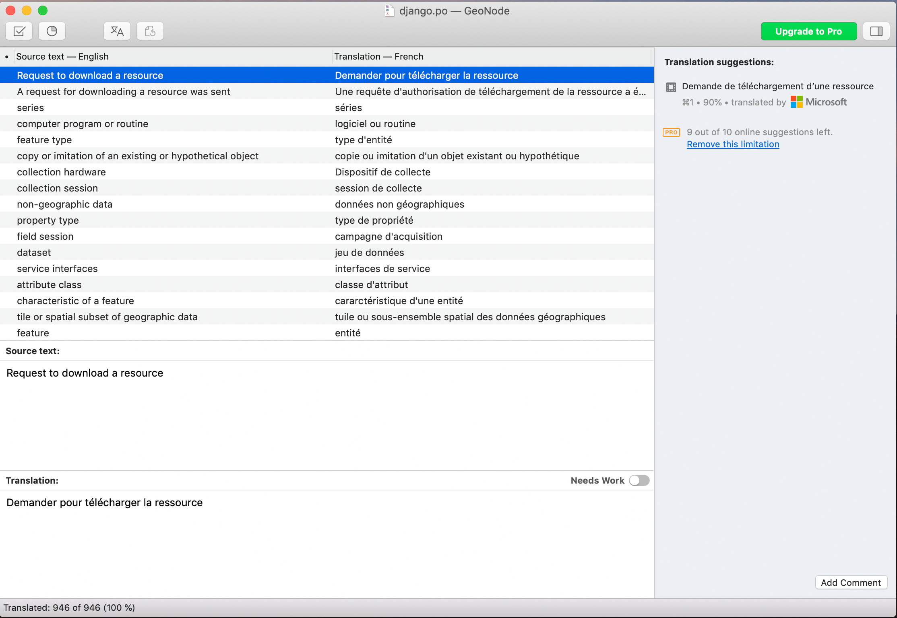
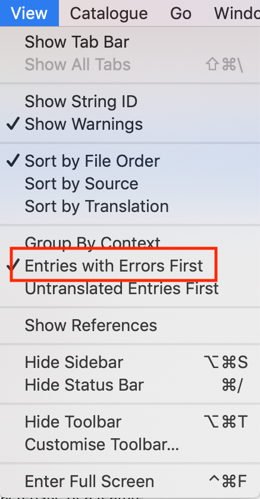
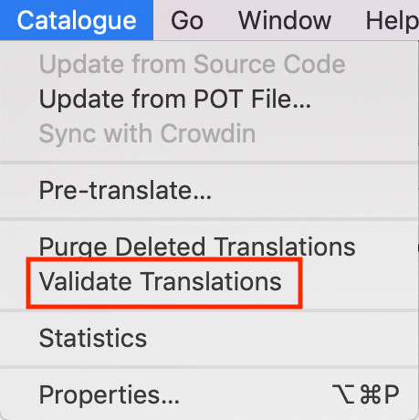
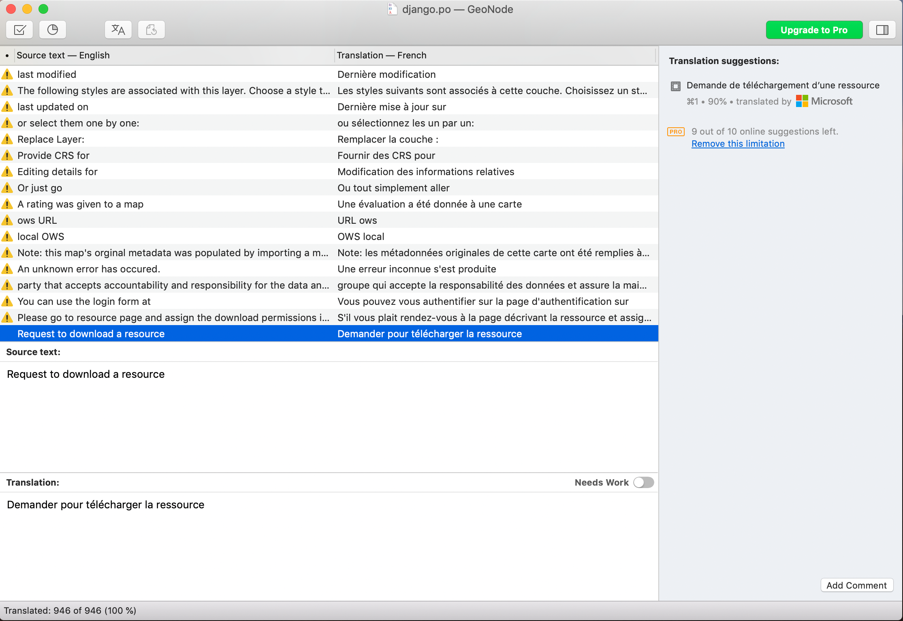
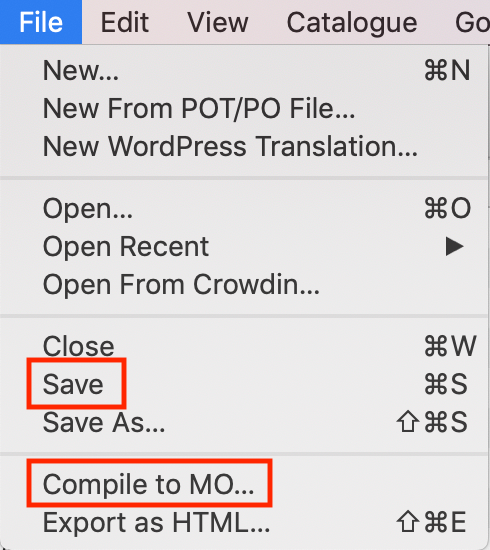
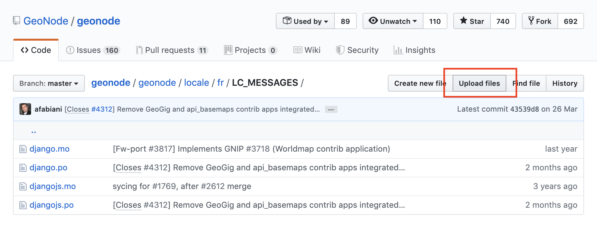
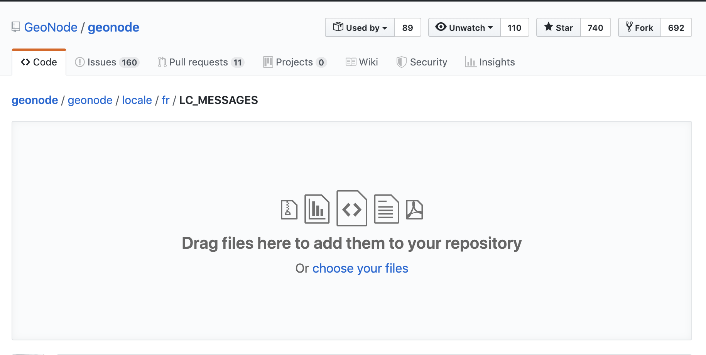
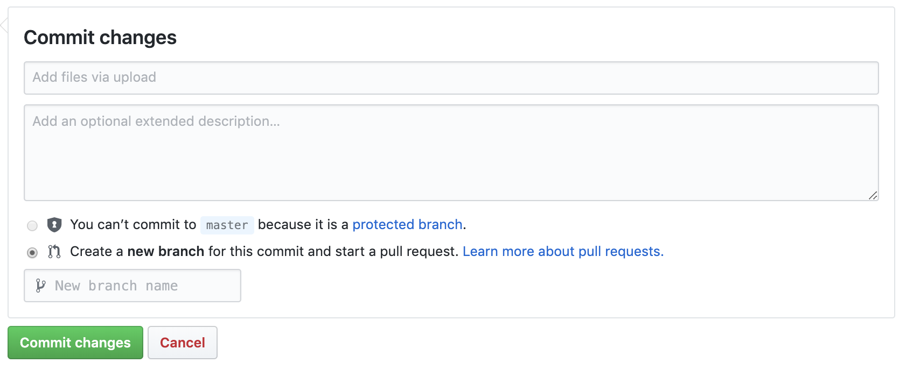

# Contribute to Translations

Behind the scenes, GeoNode is using a software called GNU gettext further text-based translation files (django.po and djangojs.po) for translating content. If you\'d like to know more about how all of this works you\'ll find a full description at the [Django Docs](https://docs.djangoproject.com/en/3.2/topics/i18n/translation/).
Following will concentrate on what is needed for edit existing or contribute a new translation.

## Download the translation File

All language files live in a specific subfolder called after their [iso code](https://en.wikipedia.org/wiki/List_of_ISO_639-1_codes/) within the [locale folder](https://github.com/GeoNode/geonode/tree/master/geonode/locale/).
For example, for French, the main translation file called django.po can be downloaded from [here](https://github.com/GeoNode/geonode/blob/master/geonode/locale/fr/LC_MESSAGES/django.po/).

Next, to download the language file, we need to install an OpenSource Editor called \"poedit\" for editing from: <https://poedit.net/download>

## Translation process

Make a copy of the file before starting the translation so that you can revert in case of errors.

After installing \'poedit\', you should be able to double click on the \'.po\' file to open it. Poedit's interface should look similar to the one shown in the picture below:

{.align-center width="680px"}

## Identifying translation issues

From the \'poedit\' menu \'View\', make sure that \'Entries with Errors first\' is checked:

{.align-center width="280px"}

Next click on \'Validate Translations\' from the \'Catalogue\' menu:

{.align-center width="280px"}

\'Poedit\' will place translations which may require additional consideration on top of the list.
A warning mark means that the interpretation might be not entirely consistent with the original phrase. This is not necessarily an error, just a warning asking the user to double check.

{.align-center width="680px"}

Following to marked phrases, \'Poedit\' will show untranslated sentences. When clicking on one, it can be translated through the bottom panel.

During translation pay special attention to the button saying \'needs work\'. In case this button is checked, the phrase will be marked as \'fuzzy\' and ignored in GeoNode.

{.align-center}

## Saving translations

As soon as the translation is complete, it must be saved and compiled.
Saving is straightforward. All you have to do is clicking the \'Save\' button from the top menu.

As a last step we compile the file. Compiling the translation means to create a binary \".mo\" file out of the edited \".po\" file. To do so, click on \"Compile to MO\"

{.align-center width="280px"}

Poedit will ask where to write the \".mo\" file to, by default, this is the same folder as the edited \'.po\' resides in. The \'.mo\' file can be overwritten if necessary.

## Push translations to the repository

For sharing our updates, we must upload the files to GeoNode's GitHub repository.
Go to the correct file position which, in case for French is:
<https://github.com/GeoNode/geonode/tree/master/geonode/locale/fr/LC_MESSAGES>

Click on \"Upload Files\"

{.align-center width="680px"}

Drag the updated files into the Upload form, and write a title/description of the changes

{.align-center width="680px"}

Click on \"Create a new branch for this commit...\" and then click on the green button.

{.align-center width="680px"}

The last step will create a [PULL REQUEST]{.title-ref} which can be reviewed and then approved by a developer.

## Activate updated translation at your server

Once the files have been pushed to GitHub, it will be necessary to update your server to respect changed files.

At this time, this can be done only by an administrator. From the server \'shell\' following commands need to be executed:

``` shell
workon geonode
cd /opt/geonode
DJANGO_SETTINGS_MODULE=geonode.settings python -W ignore manage.py collectstatic --noinput
sudo service uwsgi restart
```

## Texts not listed in .po files

In case you find a template output without corresponding translation you can add it as follows:

Identify the corresponding template file which is responsible for outputting the text. Add a `` tag. Save the template file and run the following:

``` shell
django-admin makemessages --no-location -l en -d django -e "html,txt,py" -i docs
django-admin makemessages --no-location -l en -d djangojs -e "js" -i docs -i node_modules -i lib
```

This will update the english .po file. also to update the language which should be edited by settings the `-l fr` parameter. Continue with updating the .po file as described above.
