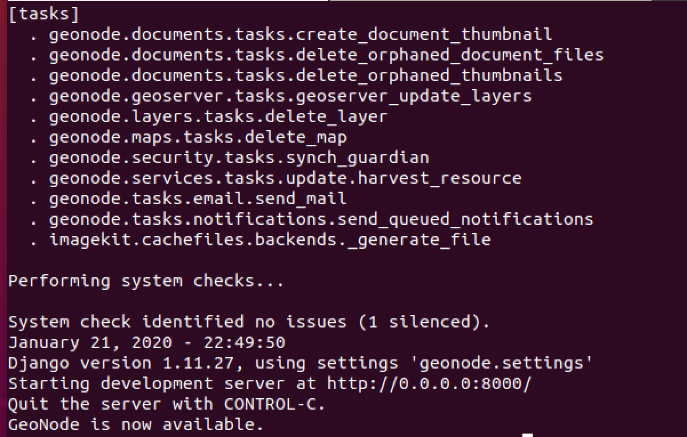
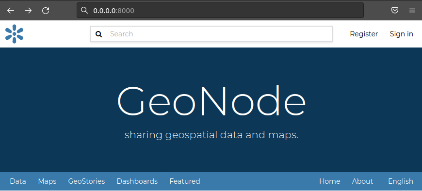

# How to Install GeoNode-Core for development

## Summary of installation

This section demonstrates a summarization of the steps to be followed in order to install GeoNode-Core for development using Ubuntu 18.04. The following steps will be customized to fit both GeoNode-Project and GeoNode-Core for development purpose.

## The steps to be followed are:

1- Install build tools and libraries

2- Install dependencies and supporting tools

3- Setup Python virtual environment

4- Clone and install GeoNode from Github

5- Install and start Geoserver

6- Start GeoNode

::: note
::: title
Note
:::

The following commands/steps will be executed on your terminal
:::

::: warning
::: title
Warning
:::

If you have a running GeoNode service, you will need to stop it before starting the following steps. To stop GeoNode you will need to run:
:::

``` shell
service apache2 stop   # or your installed server
service tomcat7 stop  # or your version of tomcat
```

### Install GeoNode-Core for development

GeoNode-Core installation is considered the most basic form of GeoNode. It doesn\'t require any external server to be installed and it can run locally against a file-system based Spatialite database.

## Installation steps

1- Install build tools and libraries

::: warning
::: title
Warning
:::

Those instructions might be outdated. Please refer to `install_dep`{.interpreted-text role="ref"}
:::

``` shell
$ sudo apt-get install -y build-essential libxml2-dev libxslt1-dev libpq-dev zlib1g-dev
```

2- Install dependencies and supporting tools

> Install python native libraries and tools

::: warning
::: title
Warning
:::

Those instructions might be outdated. Please refer to `install_dep`{.interpreted-text role="ref"}
:::

``` shell
$ sudo apt-get install -y python3-dev python3-pil python3-lxml python3-pyproj python3-shapely python3-nose python3-httplib2 python3-pip software-properties-common
```

Install python virtual environment

::: warning
::: title
Warning
:::

Those instructions might be outdated. Please refer to `install_venv`{.interpreted-text role="ref"}
:::

``` shell
$ sudo pip install virtualenvwrapper
```

Install postgresql and postgis

::: warning
::: title
Warning
:::

Those instructions might be outdated. Please refer to `configure_dbs_core`{.interpreted-text role="ref"}
:::

``` shell
$ sudo apt-get install postgresql-10 postgresql-10-postgis-2.4
```

Change postgres password expiry and set a password

``` shell
$ sudo passwd -u postgres # change password expiry infromation
$ sudo passwd postgres # change unix password for postgres
```

Create geonode role and database

``` shell
$ su postgres
$ createdb geonode_dev
$ createdb geonode_dev-imports
$ psql
$ postgres=#
$ postgres=# CREATE USER geonode_dev WITH PASSWORD 'geonode_dev'; # should be same as password in setting.py
$ postgres=# GRANT ALL PRIVILEGES ON DATABASE "geonode_dev" to geonode_dev;
$ postgres=# GRANT ALL PRIVILEGES ON DATABASE "geonode_dev-imports" to geonode_dev;
$ postgres=# \q
$ psql -d geonode_dev-imports -c 'CREATE EXTENSION postgis;'
$ psql -d geonode_dev-imports -c 'GRANT ALL ON geometry_columns TO PUBLIC;'
$ psql -d geonode_dev-imports -c 'GRANT ALL ON spatial_ref_sys TO PUBLIC;'
$ exit
```

Edit PostgreSQL configuration file

``` shell
sudo gedit /etc/postgresql/10/main/pg_hba.conf
```

Scroll to the bottom of the file and edit this line

``` shell
# "local" is for Unix domain socket connections only
local   all             all                            peer
```

To be as follows

``` shell
# "local" is for Unix domain socket connections only
local   all             all                                trust
```

Then restart PostgreSQL to make the changes effective

``` shell
sudo service postgresql restart
```

Java dependencies

``` shell
$ sudo apt-get install -y openjdk-11-jdk --no-install-recommends
```

Install supporting tools

``` shell
$ sudo apt-get install -y ant maven git gettext
```

3- Setup Python virtual environment (Here is where Geonode will be running)

Add the virtualenvwrapper to your new environment.

Since we are using Ubuntu, you can add the following settings to your .bashrc file. Please note that the Ubuntu account here is called \"geonode\". So you will need to change it according to the name you picked.

``` shell
$ echo export VIRTUALENVWRAPPER_PYTHON=/usr/bin/python >> ~/.bashrc
$ echo export WORKON_HOME=/home/geonode/dev/.venvs >> ~/.bashrc
$ echo source /usr/local/bin/virtualenvwrapper.sh >> ~/.bashrc
$ echo export PIP_DOWNLOAD_CACHE=$HOME/.pip-downloads >> ~/.bashrc

And reload the settings by running
$ source ~/.bashrc
```

Set up the local virtual environment for Geonode

``` shell
$ vim ~/.bashrc
# add the following line to the bottom
$ source /usr/share/virtualenvwrapper/virtualenvwrapper.sh
```

``` shell
$ source /usr/share/virtualenvwrapper/virtualenvwrapper.sh
$ mkvirtualenv --python=/usr/bin/python3 geonode
$ workon geonode # or $ source /home/geonode/dev/.venvs/geonode/bin/activate
This creates a new directory where you want your project to be and creates a new virtualenvironment

Alterantively you can also create the virtual env like below
$ python3.8 -m venv /home/geonode/dev/.venvs/geonode
$ source /home/geonode/dev/.venvs/geonode/bin/activate
```

4- Download/Clone GeoNode from Github

To download the latest geonode version from github, the command \"git clone\" is used

::: note
::: title
Note
:::

If you are following the GeoNode training, skip the following command. You can find the cloned repository in /home/geonode/dev
:::

``` shell
$ git clone https://github.com/GeoNode/geonode.git -b 4.1.x
```

Install Nodejs PPA and other tools required for static development

This is required for static development

::: note
::: title
Note
:::

If you are following GeoNode's training, nodejs is already installed in the Virtual Machine skip the first three command and jump to cd geonode/geonode/static
:::

``` shell
$ sudo apt-get install nodejs npm
$ cd geonode/geonode/static
$ npm install --save-dev
```

::: note
::: title
Note
:::

Every time you want to update the static files after making changes to the sources, go to geonode/static and run 'grunt production'.
:::

::: warning
::: title
Warning
:::

Starting from the following step, you have to make sure that you installed GDAL correctly according to the documentation page \"Install GDAL for Development\"
:::

Install GeoNode in the new active local virtualenv

``` shell
$ cd /home/geonode/dev  # or to the directory containing your cloned GeoNode 
$ pip install -e geonode
$ cd geonode/geonode
```

Create local_settings.py

Copy the sample file /home/geonode/dev/geonode/geonode/local_settings.py.geoserver.sample and rename it to be local_settings.py

``` shell
$ cd /home/geonode/dev/geonode
$ cp geonode/local_settings.py.geoserver.sample geonode/local_settings.py
$ gedit geonode/local_settings.py
```

In the local_settings.py file, add the following line after the import statements:

``` python
SITEURL = "http://localhost:8000/"
```

In the DATABASES dictionary under the \'default\' key, change only the values for the keys NAME, USER and PASSWORD to be as follows:

``` python
DATABASES = {
'default': {
    'ENGINE': 'django.db.backends.postgresql_psycopg2',
    'NAME': 'geonode_dev',
    'USER': 'geonode_dev',
    'PASSWORD': 'geonode_dev',
    .......
    ......
    .....
    ....
    ...
 }...}
```

In the DATABASES dictionary under the \'datastore\' key, change only the values for the keys NAME, USER and PASSWORD to be as follows:

``` python
# vector datastore for uploads
'datastore' : {
    'ENGINE': 'django.contrib.gis.db.backends.postgis',
    #'ENGINE': '', # Empty ENGINE name disables
    'NAME': 'geonode_dev-imports',
    'USER' : 'geonode_dev',
    'PASSWORD' : 'geonode_dev',
    .......
    ......
    .....
    ....
    ...
}
```

In the CATALOGUE dictionary under the \'default\' key, uncomment the USER and PASSWORD keys to activate the credentials for GeoNetwork as follows:

``` python
CATALOGUE = {
'default': {
    # The underlying CSW implementation
    # default is pycsw in local mode (tied directly to GeoNode Django DB)
    'ENGINE': 'geonode.catalogue.backends.pycsw_local',
    # pycsw in non-local mode
    # 'ENGINE': 'geonode.catalogue.backends.pycsw_http',
    # GeoNetwork opensource
    # 'ENGINE': 'geonode.catalogue.backends.geonetwork',
    # deegree and others
    # 'ENGINE': 'geonode.catalogue.backends.generic',
    # The FULLY QUALIFIED base url to the CSW instance for this GeoNode
    'URL': urljoin(SITEURL, '/catalogue/csw'),
    # 'URL': 'http://localhost:8080/geonetwork/srv/en/csw',
    # 'URL': 'http://localhost:8080/deegree-csw-demo-3.0.4/services',
    # login credentials (for GeoNetwork)
    'USER': 'admin',
    'PASSWORD': 'admin',
    # 'ALTERNATES_ONLY': True,
    }}
```

5- Install and Start Geoserver

From the virtual environment, first you need to align the database structure using the following command :

``` shell
$ cd /home/geonode/dev/geonode
$ python manage.py migrate
```

::: warning
::: title
Warning
:::

If the start fails because of an import error related to osgeo or libgeos, then please consult the [Install GDAL for Development](https://training.geonode.geo-solutions.it/005_dev_workshop/004_devel_env/gdal_install.html)
:::

then setup GeoServer using the following command:

``` shell
$ paver setup

$ paver sync
```

6- Now we can start our geonode instance

::: warning
::: title
Warning
:::

Don't forget to stop the GeoNode Production services if enabled
:::

``` shell
service apache2 stop
service tomcat7 stop
```

``` shell
$ paver start
```

The starting process will take around 20 seconds (depends on your machine) and at the end it shows the following message:



Now you can visit the geonode site by typing <http://0.0.0.0:8000> into your browser window



### Install GeoNode-Project for development after installing GeoNode-Core

Geonode-Project gives the user flexibility to customize the installation of the GeoNode. Geonode itself will be installed as a requirement of your project. Inside the project structure it is possible to extend, replace or modify all geonode components (e.g. css and other static files, templates, models..) and even register new django apps without touching the original Geonode code.
In order to install GeoNode-Project, the following steps need to be executed alongside the previous GeoNode-Core installation steps.

1- Use django-admin.py to create a project \"my_geonode\" from a GeoNode-Project template as follows:

::: note
::: title
Note
:::

Before running the following command, make sure that you are currently working on the virtual environment and just outside geonode directory. The command will create a new project called \"my_geonode\" which should be located at the level of geonode-core installation directory \"inside /home/geonode/dev\"
:::

``` shell
$ django-admin.py startproject my_geonode --template=https://github.com/GeoNode/geonode-project/archive/master.zip -e py,rst,json,yml,ini,env,sample -n Dockerfile

$ ls /home/geonode/dev  # should output:  geonode  my_geonode
```

::: note
::: title
Note
:::

Although the following command might show that the majority of requirements are already satisfied \"because GeoNode-Core was already installed\", it is recommended to still execute it as it might update or install any missing package.
:::

2- Install all the required packages/tools for GeoNode-Project as follows:

``` shell
$ pip install -e my_geonode
```

::: note
::: title
Note
:::

As mentioned earlier, GeoNode will be installed as requirement for the GeoNode-Project in order to be able to extend it
:::

### Install GeoNode-Project directly from scratch

If you didn\'t install GeoNode-Core earlier and you wanted to install GeoNode-Project directly, please follow these steps

1- Create a virtual environment as follows:

``` shell
$ vim ~/.bashrc
# add the following line to the bottom
$ source /usr/share/virtualenvwrapper/virtualenvwrapper.sh
```

``` shell
$ source /usr/share/virtualenvwrapper/virtualenvwrapper.sh
$ mkvirtualenv --python=/usr/bin/python3 my_geonode

Alterantively you can also create the virtual env like below
$ python3.8 -m venv /home/geonode/dev/.venvs/my_geonode
$ source /home/geonode/dev/.venvs/my_geonode/bin/activate
```

2- Clone the geonode-project repo from Github

``` shell
$ git clone https://github.com/GeoNode/geonode-project.git -b 4.1.x
```

3- Install Django framework as follows

``` shell
$ pip install Django==3.2.13
```

4- Use django-admin.py to create a project \"my_geonode\" from a GeoNode-Project template as follows:

``` shell
$ django-admin startproject --template=./geonode-project -e py,sh,md,rst,json,yml,ini,env,sample,properties -n monitoring-cron -n Dockerfile my_geonode
```

5- Install all the requirements for the GeoNode-Project and install the GeoNode-Project using pip

``` shell
$ cd my_geonode
$ pip install -r requirements.txt --upgrade
$ pip install -e . --upgrade
```

6- Install GDAL Utilities for Python

``` shell
$ pip install pygdal=="`gdal-config --version`.*"  # or refer to the link <Install GDAL for Development <https://training.geonode.geo-solutions.it/005_dev_workshop/004_devel_env/gdal_install.html>
```

7- Install GeoServer and Tomcat using paver

``` shell
$ paver setup

$ paver sync

$ paver start
```

8- Visit <http://localhost:8000/>
