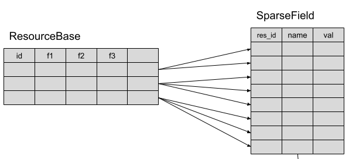

# Metadata app design

The idea is to use a well-estabilished standard to document the metadata schema and to return the metadata info.

The metadata schema is presented using the [JSON schema](https://json-schema.org/) conventions.

The GeoNode API has been extended to provide:

-   `/api/v2/metadata/schema` metadata schema
-   `/api/v2/metadata/instance/<PK | UUID>` resource metadata instances handling (GET/PUT)
-   `/api/v2/metadata/<...>` other utility calls for the metadata handling (autocomplete endpoints referred into the schema, etc)

One of the basic driving features has been the simplification of **customization of the schema**. The implementation relies on a set of **metadata handlers** that can be easily extended.

The optional [geonode-inspire](https://github.com/geosolutions-it/geonode-inspire) module is a working showcase that documents how the GeoNode base model can be customized.

# Implementation

The package `geonode.metadata` contains all the code related to metadata handling.

The `manager` module contains the base engine that calls methods on the registered field handlers.

## Handlers overview

**Handlers** are the objects that manage the field lifecycle, i.e.:

-   create the the json **sub-schema** of the field
-   take care of **loading data** from the database and convert it into json schema instance
-   parse the json schema instance value sent from the client and store it in the database format

A single handler may handle one or more fields.

## `MetadataManager`

The `geonode.metadata.manager.MetadataManager` class handles requests from the view, and delegates the work on the fields to the declared handlers.

The MetadataManager provides these main methods:

``` 
def get_schema(self, lang=None)
```

**Builds and returns the metadata json schema.**

This method is called by the `/api/v2/metadata/schema` endpoint.

The schema is created by looping on the sorted set of metadata handlers, asking them to update the json schema incrementally via `def update_schema(self, jsonschema: dict, context, lang=None)`.

Handlers may add their own field, remove or modify fields added by previously called handlers.

The schema localization is only related to the [title]{.title-ref} and [description]{.title-ref} annotations. Localization of dropdown lists is an handler-specific task, and usually carried out via thesauri codelists (see `thesauri`{.interpreted-text role="ref"}).

The default language used is the one set in the cookies, or it can be overriden by adding the query param [lang]{.title-ref}.

``` 
def build_schema_instance(self, resource: ResourceBase, lang=None)
```

**Builds and returns the json schema instance related to a resource.**

The instance is created by examining the json schema and looping on each field.
For each field, the related handler is called to fill in the serialized value for such field.

Called handlers\' methods:

-   `def load_serialization_context(resource: ResourceBase, jsonschema: dict, context: dict)`
    Allow an handler to pre-load some common info for all of its handled fields
-   `def get_jsonschema_instance(resource: ResourceBase, field_name, context, errors, lang=None)`
    Returns the instance of the sub-schema associated with the field [field_name]{.title-ref}.

``` 
def update_schema_instance(self, resource, request_obj, lang=None) -> dict:   
```

**Parses the incoming json schema instance and stores the value into the DB.**

Persistence is done by examining the json schema and looping on each field.
For each field, the related handler is called to parse and store the deserialized value(s) for such field.
If the field is a complex object, it\'s up to the handler to parse and handle it.

Called handlers\' methods:

-   `def load_deserialization_context(self, resource: ResourceBase, jsonschema: dict, context: dict)`
    Allow handlers to pre-load some common info for all the handled fields
-   `def update_resource(resource: ResourceBase, field_name: str, json_instance: dict, context: dict, errors: dict, **kwargs)`
    Logic to parse and persist the field

## Handlers

The list of handlers is declared in `geonode.metadata.settings.METADATA_HANDLERS`.

**Order is important** since later declared handlers may want to customize previously defined fields.

Within each field subschema there are some geonode-specific annotations (custom annotation are allowed by the json schema standard), some are needed for backend logic (for instance `geonode:handler`), other for the client UI (e.g. `ui:options`)

### `BaseHandler`

`BaseHandler` handles most of the fields declared inside the `ResourceBase` class.

The `BaseHandler` will read the main schema from a file ([metadata/schemas/base.json](https://github.com/GeoNode/geonode/blob/metadata_manager/geonode/metadata/schemas/base.json)), augmenting programmatically some info that can not be statically set (such as autocomplete URLs).

### `SparseHandler`

This handler is not actively used by the core GeoNode schema, since it\'s more aimed at customizations.

You may see an example of its use in the [geonode-inspire]{.title-ref} package.

The basic idea for the SparseField (the single model change in metadata) is to have a \"vertical\" table with free form fields:

<figure>

<figcaption><em>ResourceBase and its Sparse fields</em></figcaption>
</figure>

In the default case, its use is as simple as declaring the field:

``` json
"prj1_distance": {
  "type": "numeric"
}
```

or even a complex structure as

``` json
"prj1_instrumentations": {
  "type": "array",
  "title": "instrumentations",
  "description": "Provides information about any instruments used in the data collection. The description should include vendor, model number, optional equipment, etc.",
  "items": {
    "type": "string",
    "minLength": 1,
    "default": ""
  },
  "minItems": 1,
  "geonode:handler": "sparse"
}
```

When the type is `array` or `object` the SparseHandler will encode the whole content as a json object

## Some custom annotations

-   `geonode:handler`: key to the handler defined in `METADATA_HANDLERS`; tells which is the handler to be called to handle the field\'s content. Please note that this annotation may be replaced by subsequent handlers if they want to handle the field differently.
-   `geonode:required`: the jsonschema specs wants the `required` array outside the subschema definition. By defining this annotation as `true`, the metadata manager will add the current field in the `required` list.
