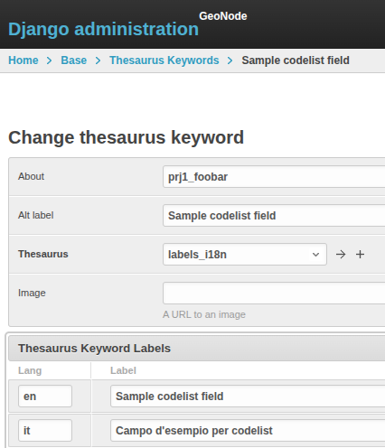

# Examples: Adding a metadata field

To wrap up the metadata doumentation, here we will present some examples about how to add a brand new field to the metedat editor.

## Example 1: minimal field

Some points related to this field:

-   We do not need any special behaviour (i.e. logic for checking internal consistency, updating other fields according to the content of this field, etc)
-   The field is declared as a simple type (numeric)

In this case, where we don\'t need any specific logic, we can rely on the existing [SparseHandler](https://github.com/GeoNode/geonode/blob/master/geonode/metadata/handlers/sparse.py).

The SparseHandler has its own register of handled field, where custom apps can add their own, so in order to add a numerical field it will be enough to add it in the register, by specifying its name and the JSON sub-schema, e.g.:

``` python
from geonode.metadata.handlers.sparse import sparse_field_registry

sparse_field_registry.register("accuracy", {"type": "number"})
```

This simple code will add the sparse field \"accuracy\", typed as \"numeric\", in the schema.

Please note that the SparseHandler will return to the manager a possibly modified subschema, and not the registered one.
For instance:

-   the `"geonode:handler". "sparse"` will be added, in order to mark the handler for the field
-   annotations `title` and `description` may be added or modified (see `metadata_fields_localization`{.interpreted-text role="ref"}).

e.g.

``` json
"accuracy": {
    "type": "number",
    "geonode:handler": "sparse",
    "title": "Positional accuracy"
}
```

## Example 2: complex json field

-   No special behaviour
-   The field may be as much complex as JSON schema specification allows.

For instance, we want a list of persons defined by 2 fields, one containing the full name, and the other a URI.

``` json
"prj1_data_creator": {
     "type": "array",
     "title": "Resource creator",
     "minItems": 1,
     "items": {
         "type": "object",
         "properties": {
             "fullname": {
                 "type": "string",
                 "maxLength": 255,
                 "title": "Name surname",
                 "description": "Insert the full name of the person who created the resource"
             },
             "orcid": {
                 "type": "string",
                 "format": "uri",
                 "title": "ORCID",
                 "description": "Insert the ORCID of the person who created the resource"
             }
         }
     },
     "geonode:after": "abstract",
     "geonode:handler": "sparse"
 },
```

Since the type is a complex one (in this case it\'s `array`, but also `object` is handled the same way), the SparseHandler will treat the content as a json object. Hera a sample for the content of the above structure:

``` json
"prj1_data_creator": [
      {
         "fullname": "John Doe",
         "orcid": "http://sampleid"
      },
   ],
```

## Example 3: codelist

You can add a field with a dropdown menu by using thesauri (see `metadata_dropdown`{.interpreted-text role="ref"})

-   creating a brand new thesaurus with the items you needs (see `thesaurus_add`{.interpreted-text role="ref"});

    -   for instance, create a thesaurus with identifier `project1_codelist_foobar` and add some ThesaurusKeywords to it.

-   create a field (either single or multiple entry) and referencing the thesaurus (see `metadata_dropdown_codelist`{.interpreted-text role="ref"})

    -   es:

        > ``` json
        > "prj1_foobar": {
        >   "type": "object",
        >   "properties": {
        >     "id": {"type": "string"},
        >     "label": {"type": "string"}
        >   },
        >   "geonode:handler": "sparse",
        >   "geonode:thesaurus": "project1_codelist_foobar"
        > },
        > ```

-   you may also add the label for the new field by adding a ThesaurusKeyword to the Thesaurus `labels_i18n`,

    > {width="250px"}
