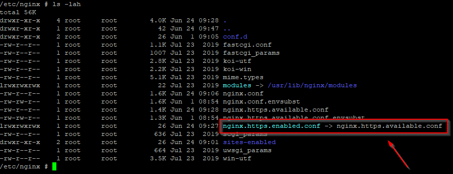

# GeoNode Basic Installation {#geonode-project-basic}

## Overview

The followings are the easiest and recommended ways to deploy a full-stack GeoNode server on your host.

1.  **First Step**: Deploy `GeoNode on a local server`{.interpreted-text role="guilabel"}, running as `http://localhost/` service. `GeoServer`{.interpreted-text role="guilabel"} will be also available at `http://localhost/geoserver/`
2.  **Second Step**: Deploy `GeoNode on a production server`{.interpreted-text role="guilabel"}, running as `https://my_geonode.geonode.org/` service. `GeoServer`{.interpreted-text role="guilabel"} will be also available at `https://my_geonode.geonode.org/geoserver/`
3.  **Third Step**: Customize `.env`{.interpreted-text role="guilabel"} to match your needs
4.  **Fourth Step**: Secure your production deployment; change the `admin`{.interpreted-text role="guilabel"} passwords and `OAUth2`{.interpreted-text role="guilabel"} keys
5.  **Further Production Enhancements**

## First Step: Deploy GeoNode on a local server

### Docker Setup for Ubuntu (22.04) {#Ubuntu (22.04) Basic Setup}

``` shell
# install OS level packages..
sudo add-apt-repository universe
sudo apt-get update -y
sudo apt-get install -y git-core git-buildpackage debhelper devscripts python3.10-dev python3.10-venv virtualenvwrapper
sudo apt-get install -y apt-transport-https ca-certificates curl lsb-release gnupg gnupg-agent software-properties-common vim

# add docker repo and packages...
sudo mkdir -p /etc/apt/keyrings
curl -fsSL https://download.docker.com/linux/ubuntu/gpg | sudo gpg --dearmor -o /etc/apt/keyrings/docker.gpg
sudo chmod a+r /etc/apt/keyrings/docker.gpg
echo "deb [arch=$(dpkg --print-architecture) signed-by=/etc/apt/keyrings/docker.gpg] https://download.docker.com/linux/ubuntu $(lsb_release -cs) stable" | sudo tee /etc/apt/sources.list.d/docker.list > /dev/null

sudo apt-get update -y
sudo apt-get install -y docker-ce docker-ce-cli containerd.io docker-compose
sudo apt autoremove --purge

# add your user to the docker group...
sudo usermod -aG docker ${USER}
su ${USER}
```

### Create an instance of your `geonode-project`

Let\'s say your project is named `my_geonode`{.interpreted-text role="guilabel"} perform the following steps:

``` shell
git clone https://github.com/GeoNode/geonode-project.git

# Checkout the desired branch. For example, 4.2.2 to generate a project for GeoNode 4.2.2

git checkout -b 4.2.2

# Ubuntu
source /usr/share/virtualenvwrapper/virtualenvwrapper.sh
mkvirtualenv --python=/usr/bin/python3 my_geonode

Alterantively you can also create the virtual env like below
python3.8 -m venv /home/geonode/dev/.venvs/my_geonode
source /home/geonode/dev/.venvs/my_geonode/bin/activate

pip install Django==3.2.13

# CentOS
virtualenv -p python3 my_geonode
source my_geonode/bin/activate

django-admin startproject --template=./geonode-project -e py,sh,md,rst,json,yml,ini,env,sample,properties -n monitoring-cron -n Dockerfile my_geonode

# If the previous command does not work for some reason, try the following one
python -m django startproject --template=./geonode-project -e py,sh,md,rst,json,yml,ini,env,sample,properties -n monitoring-cron -n Dockerfile my_geonode
```

### Prepare the .env file {#Docker create env file}

GeoNode uses an `.env` where the environment variables required by Docker and GeoNode itself must be configured.
A simple way to generate a basic `.env` is using the `create-envfile.py` utility command. If run without arguments it will generate a valid `.env` for a local deployment.

``` shell
cd my_geonode
python create-envfile.py
```

The command accepts the following arguments:

-   \`\--https\`: Enable SSL. It\'s disabled by default

-   

    \`\--env_type\`:

    :   -   When set to [prod]{.title-ref} [DEBUG]{.title-ref} is disabled and the creation of a valid [SSL]{.title-ref} is requested to Letsencrypt\'s ACME server
        -   When set to [test]{.title-ref} [DEBUG]{.title-ref} is disabled and a test [SSL]{.title-ref} certificate is generated for local testing
        -   When set to [dev]{.title-ref} [DEBUG]{.title-ref} is enabled and no [SSL]{.title-ref} certificate is generated

-   \`\--hostname\`: The URL that will serve GeoNode ([localhost]{.title-ref} by default)

-   \`\--email\`: The administrator\'s email. Notice that a real email and valid SMPT configurations are required if [\--env_type]{.title-ref} is set to [prod]{.title-ref}. Letsencrypt uses email for issuing the SSL certificate

-   \`\--geonodepwd\`: GeoNode\'s administrator password. A random value is set if left empty

-   \`\--geoserverpwd\`: GeoNode\'s administrator password. A random value is set if left empty

-   \`\--pgpwd\`: PostgreSQL\'s administrator password. A random value is set if left empty

-   \`\--dbpwd\`: GeoNode DB user role\'s password. A random value is set if left empty

-   \`\--geodbpwd\`: GeoNode data DB user role\'s password. A random value is set if left empty

-   \`\--clientid\`: Client id of Geoserver\'s GeoNode Oauth2 client. A random value is set if left empty

-   \`\--clientsecret\`: Client secret of Geoserver\'s GeoNode Oauth2 client. A random value is set if left empty

### Build and run {#Docker build and run}

``` shell
docker compose build
docker compose up -d
```

-   You can follow the containers startup by running the following commands from `my_geonode` root folder:

    > ``` shell
    > # GeoNode Container
    > docker-compose logs -f django
    >
    > # GeoServer Container
    > docker-compose logs -f geoserver
    >
    > # DB Container
    > docker-compose logs -f db
    >
    > # NGINX Container
    > docker-compose logs -f geonode
    > ```

-   If any error occurs, try to catch the error stacktrace by running the following commands from `my_geonode` root folder:

    > ``` shell
    > # GeoNode “entrypoint.sh” Logs
    > tail -F -n 300 invoke.log
    > ```

### Connect to `http://localhost/`{.interpreted-text role="guilabel"}

The startup typically takes some time, so be patient...

If everything goes well, you should be able to see from the `geonode startup logs` a line similar to the following one:

``` shell
<some date> [UWSGI] Uwsgi running...
```

Connect to `http://localhost/`{.interpreted-text role="guilabel"}

The default credentials are:

> -   GeoNode (`http://localhost/`{.interpreted-text role="guilabel"}) `admin`{.interpreted-text role="guilabel"}:
>
>     > `username: admin`
>     > `password: admin`
>
> -   GeoServer (`http://localhost/geoserver/`{.interpreted-text role="guilabel"}) `admin`{.interpreted-text role="guilabel"}:
>
>     > `username: admin`
>     > `password: geoserver`

## Second Step: Deploy GeoNode on a production server {#Docker deploy to production}

In the case you would like to deploy to, let\'s say, `https://my_geonode.geonode.org/`{.interpreted-text role="guilabel"}, you will need to change `.env` as follows:

``` diff
DOCKER_ENV=production
SITEURL=https://my_geonode.geonode.org/
NGINX_BASE_URL=https://my_geonode.geonode.org/
ALLOWED_HOSTS=['django',]
GEOSERVER_WEB_UI_LOCATION=https://my_geonode.geonode.org/geoserver/
GEOSERVER_PUBLIC_LOCATION=https://my_geonode.geonode.org/geoserver/
HTTP_HOST=
HTTPS_HOST=my_geonode.geonode.org
HTTP_PORT=80
HTTPS_PORT=443
LETSENCRYPT_MODE=production # This will use Letsencrypt and the ACME server to generate valid SSL certificates
```

These variables are automatically set by the `create-envfile.py` script if the `--https` and `--hostname` variables are used.

::: warning
::: title
Warning
:::

When `LETSENCRYPT_MODE` is set to `production` a valid email and email SMPT server are required to make the system generate a valid certificate.
:::

### Restart the containers

Whenever you change someting on `.env`{.interpreted-text role="guilabel"} file, you will need to rebuild the container

::: warning
::: title
Warning
:::

Notche that the following command drops any change you might have done manually inside the containers, except for the static volumes.
:::

``` shell
docker-compose up -d
```

### Troubleshooting

If for some reason you are not able to reach the server on the `HTTPS`{.interpreted-text role="guilabel"} channel, please check the `NGINX`{.interpreted-text role="guilabel"} configuration files below:

1.  Enter the `NGINX`{.interpreted-text role="guilabel"} container

    > ``` shell
    > docker-compose exec geonode sh
    > ```

2.  Install an editor if not present

    > ``` shell
    > apk add nano
    > ```

3.  Double check that the `nginx.https.enabled.conf` link has been correctly created

    > ``` shell
    > ls -lah
    > ```
    >
    > {.align-center}
    >
    > If the list does not match exactly the figure above, please run the following commands, and check again
    >
    > ``` shell
    > rm nginx.https.enabled.conf
    > ln -s nginx.https.available.conf nginx.https.enabled.conf
    > ```

4.  Inspect the `nginx.https.enabled.conf` contents

    > ``` shell
    > nano nginx.https.enabled.conf
    > ```
    >
    > Make sure the contents match the following
    >
    > ::: warning
    > ::: title
    > Warning
    > :::
    >
    > Change the `Hostname`{.interpreted-text role="guilabel"} accordingly. **This is only an example!**
    > :::
    >
    > ``` shell
    > # NOTE : $VARIABLES are env variables replaced by entrypoint.sh using envsubst
    > # not to be mistaken for nginx variables (also starting with $, but usually lowercase)
    >
    > # This file is to be included in the main nginx.conf configuration if HTTPS_HOST is set
    > ssl_session_cache   shared:SSL:10m;
    > ssl_session_timeout 10m;
    >
    > # this is the actual HTTPS host
    > server {
    >     listen              443 ssl;
    >     server_name         my_geonode.geonode.org;
    >     keepalive_timeout   70;
    >
    >     ssl_certificate     /certificate_symlink/fullchain.pem;
    >     ssl_certificate_key /certificate_symlink/privkey.pem;
    >     ssl_protocols       TLSv1 TLSv1.1 TLSv1.2;
    >     ssl_ciphers         HIGH:!aNULL:!MD5;
    >
    >     include sites-enabled/*.conf;
    > }
    >
    > # if we try to connect from http, we redirect to https
    > server {
    >     listen 80;
    >     server_name  my_geonode.geonode.org; # TODO : once geoserver supports relative urls, we should allow access though both HTTP and HTTPS at the same time and hence remove HTTP_HOST from this line
    >
    >     # Except for let's encrypt challenge
    >     location /.well-known {
    >         alias /geonode-certificates/.well-known;
    >         include  /etc/nginx/mime.types;
    >     }
    >
    >     # Redirect to https
    >     location / {
    >     return 302 https://my_geonode.geonode.org/$request_uri; # TODO : we should use 301 (permanent redirect, but not practical for debug)
    >     }
    > }
    > ```
    >
    > ::: warning
    > ::: title
    > Warning
    > :::
    >
    > **Save the changes, if any, and exit!**
    > :::

5.  Reload the NGINX configuration

    > ``` shell
    > nginx -s reload
    > 2020/06/24 10:00:11 [notice] 112#112: signal process started
    > /etc/nginx# exit
    > ```

6.  It may be helpful to disable https to isolate the source of errors. After reverting the HTTPS-related changes in the [.env]{.title-ref} file, repeat the above steps and ensure that the `nginx.http.enabled.conf` link has been correctly created.

    > ``` shell
    > ln -s nginx.conf nginx.http.enabled.conf
    > nano nginx.http.enabled.conf
    > ```

## Customize `.env`{.interpreted-text role="guilabel"} to match your needs

In the case you would like to modify the GeoNode behavior, always use the `.env`{.interpreted-text role="guilabel"} file in order to update the `settings`{.interpreted-text role="guilabel"}.

If you need to change a setting which does not exist in `.env`{.interpreted-text role="guilabel"}, you can force the values inside `my_geonode/settings.py`{.interpreted-text role="guilabel"}

Refer to the section: `settings`{.interpreted-text role="ref"}

You can add here any property referred as

> | Env: `PROPERTY_NAME`

### Restart the containers

Whenever you change someting on `.env`{.interpreted-text role="guilabel"} file, you will need to rebuild the containers.

::: warning
::: title
Warning
:::

**Be careful!** The following command drops any change you might have done manually inside the containers, except for the static volumes.
:::

``` shell
docker-compose up -d django
```

\[Optional\] Configure your SSL Certificates
\^\^\^\^\^\^\^\^\^\^\^\^\^\^\^\^\^\^\^\^\^\^\^\^\^\^\^\^\^\^\^\^\^\^\^\^\^\^\^

In production deployment mode, GeoNode uses by default `Let's Encrypt`{.interpreted-text role="guilabel"} certificates

You may want to provide your own certificates to GeoNode

``` shell
docker exec -it nginx4my_geonode_geonode sh -c 'mkdir /geonode-certificates/my_geonode'

wget --no-check-certificate 'http://<url_to_your_chain.crt>' \
    -O chain.crt

wget --no-check-certificate 'http://<url_to_your_key.key>' \
    -O my_geonode.key

docker cp chain.crt nginx4my_geonode_geonode:/geonode-certificates/my_geonode

docker cp my_geonode.key nginx4my_geonode_geonode:/geonode-certificates/my_geonode

docker-compose exec geonode sh
apk add vim

vim nginx.https.enabled.conf
```

``` diff
-ssl_certificate     /certificate_symlink/fullchain.pem;
-ssl_certificate_key /certificate_symlink/privkey.pem;
+ssl_certificate       /geonode-certificates/my_geonode/chain.crt;
+ssl_certificate_key   /geonode-certificates/my_geonode/my_geonode.key;
```

``` shell
nginx -s reload
exit
```
