# Full GeoNode Backup & Restore {#backup_restore_geonode}

The admin command to backup and restore GeoNode, allows to extract consistently the GeoNode and GeoServer data models in a serializable
meta-format which is being interpreted later by the restore procedure in order to exactly rebuild the whole structure.

In particular the tool helps developers and administrators to correctly extract and serialize the following resources:

-   **GeoNode** (Resource Base Model):

    > 1.  Layers (both raster and vectors)
    > 2.  Maps
    > 3.  Documents
    > 4.  People with Credentials
    > 5.  Permissions
    > 6.  Associated Styles
    > 7.  Static data and templates

-   **GeoServer** (Catalog):

    > 1.  OWS Services configuration and limits
    > 2.  Security model along with auth filters configuration, users and credentials
    > 3.  Workspaces
    > 4.  Stores (both DataStores and CoverageStores)
    > 5.  Layers
    > 6.  Styles

The tool exposes two GeoNode Management Commands, \'backup\' and \'restore\'.

The commands allow to:

1.  Fully backup GeoNode data and fixtures on a zip archive
2.  Fully backup GeoServer configuration (physical datasets - tables, shapefiles, geotiffs)
3.  Fully restore GeoNode and GeoServer fixtures and catalog from the zip archive

The usage of those commands is quite easy and straightforward.

The first step is to ensure that everything is correctly configured and the requisites respected in order to successfully
perform a backup and restore of GeoNode.

::: warning
::: title
Warning
:::

It is worth to notice that this functionality requires the latest [GeoServer Extension](https://build.geo-solutions.it/geonode/geoserver/latest/) (2.9.x or greater) for GeoNode in order to correctly work.
:::

::: note
::: title
Note
:::

GeoServer full documentation is also available here [GeoServer Docs](https://docs.geoserver.org/stable/en/user/community/backuprestore/index.html)
:::

## Requisites and Setup

**Before** running a GeoNode backup / restore, it is necessary to ensure everything is correctly configured and setup.

### Settings

Accordingly to the admin needs, the file `settings.ini` must be ceated before running a backup or restore.

The default files can be found at `geonode/br/management/commands/settings_sample.ini` and `geonode/br/management/commands/settings_docker_sample.ini`
for the classic and Docker environments accordingly. The content is similar in both of them (an example from `settings_sample.ini`):

``` ini
[database]
pgdump = pg_dump
pgrestore = pg_restore

[geoserver]
datadir = geoserver/data
dumpvectordata = yes
dumprasterdata = yes

[fixtures]
# NOTE: Order is important
apps  = contenttypes,auth,people,groups,account,guardian,admin,actstream,announcements,avatar,base,dialogos,documents,geoserver,invitations,pinax_notifications,layers,maps,oauth2_provider,services,sites,socialaccount,taggit,tastypie,upload,user_messages
dumps = contenttypes,auth,people,groups,account,guardian,admin,actstream,announcements,avatar,base,dialogos,documents,geoserver,invitations,pinax_notifications,layers,maps,oauth2_provider,services,sites,socialaccount,taggit,tastypie,upload,user_messages
```

The `settings.ini` file can be created in any directory accessible by GeoNode, and it\'s path can be passed to the backup / restore
procedures using [-c]{.title-ref} ([\--config]{.title-ref}) argument.

There are few different sections of the configuration file, that must be carefully checked before running a backup / restore command.

#### Settings: \[database\] Section

``` ini
[database]
pgdump = pg_dump
pgrestore = pg_restore
```

This section is quite simple. It contains only two properties:

-   *pgdump*; the path of the `pg_dump` local command.
-   *pgrestore*; the path of the `pg_restore` local command.

::: warning
::: title
Warning
:::

Those properties are ignored in case GeoNode is not configured to use a DataBase as backend (see `settings.py` and `local_settings.py` sections)
:::

::: note
::: title
Note
:::

Database connection settings (both for GeoNode and GeoServer) will be taken from `settings.py` and `local_settings.py` configuration files. Make sure they are correctly configured (on the target GeoNode instance, too) and the DataBase server is accessible while executing a backup / restore command.
:::

#### Settings: \[geoserver\] Section

``` ini
[geoserver]
datadir = /opt/gs_data_dir
datadir_exclude_file_path =
dumpvectordata = yes
dumprasterdata = yes
data_dt_filter =
data_layername_filter =
data_layername_exclude_filter =
```

This section allows to enable / disable a full data backup / restore of GeoServer.

-   *datadir*: the full path of GeoServer Data Dir, by default `/opt/gs_data_dir`. The path **must** be accessible and **fully writable** by the `geonode` and / or `httpd server` users when executing a backup / restore command.
-   *datadir_exclude_file_path*: comma separated list of paths to exclude from `geoserver_catalog.zip`; This list will be sent and managed directly by the GeoServer Backup REST API.
-   *dumpvectordata*: a boolean flag enabling or disabling creation of a vector data dump from GeoServer (shapefiles or DB tables). If `false` (or `no`) vector data won\'t be stored / re-stored.
-   *dumprasterdata*: a boolean flag enabling or disabling creation of a raster data dump from GeoServer (geotiffs). If `false` (or `no`) raster data won\'t be stored / re-stored.
-   *data_dt_filter*: {cmp_operator} {ISO8601} e.g. \> 2019-04-05T24:00 which means \"include on backup archive only the files that have been modified later than 2019-04-05T24:00
-   *data_layername_filter*: comma separated list of `layer names`, optionally with glob syntax e.g.: [tuscany]()*,italy; Only \`\`RASTER\`\` original data and \`\`VECTORIAL\`\` table dumps matching those filters will beincluded*\* into the backup ZIP archive
-   *data_layername_exclude_filter*: comma separated list of `layer names`, optionally with glob syntax e.g.: [tuscany]()*,italy; The \`\`RASTER\`\` original data and \`\`VECTORIAL\`\` table dumps matching those filters will beexcluded*\* from the backup ZIP archive

::: warning
::: title
Warning
:::

Enabling these options **requires** the GeoServer Data Dir to be accessible and **fully writable** for the `geonode` and / or `httpd server` users when executing a backup / restore command.
:::

#### Settings: \[fixtures\] Section

``` ini
[fixtures]
#NOTE: Order is important
apps   = people,account,avatar.avatar,base.backup,base.license,base.topiccategory,base.region,base.resourcebase,base.contactrole,base.link,base.restrictioncodetype,base.spatialrepresentationtype,guardian.userobjectpermission,guardian.groupobjectpermission,layers.uploadsession,layers.style,layers.layer,layers.attribute,layers.layerfile,maps.map,maps.maplayer,maps.mapsnapshot,documents.document,taggit

dumps  = people,accounts,avatars,backups,licenses,topiccategories,regions,resourcebases,contactroles,links,restrictioncodetypes,spatialrepresentationtypes,useropermissions,groupopermissions,uploadsessions,styles,layers,attributes,layerfiles,maps,maplayers,mapsnapshots,documents,tags
```

This section is the most complex one. Usually you don\'t need to modify it. Only an expert user who knows Python and GeoNode model structure should modify this section.

What its properties mean:

-   *apps*; an ordered list of GeoNode Django applications. The backup / restore procedure will dump / restore the fixtures in a portable format.
-   *dumps*; this is the list of `files` associated to the Django applications. The order **must** be the same as in the *apps* property above. Each name represents the `file name` where to dump to / read from the single app\'s fixtures.

## Executing from the CLI

The following sections shows instructions on how to perform backup / restore from the command line by using the Django Admin Management Commands.

In order to obtain a basic user guide for the management command from the command line, just run

> ``` shell
> python manage.py backup --help
>
> python manage.py restore --help
> ```

`--help` will provide the list of available command line options with a brief description.

By default both procedures activate [Read Only]{.title-ref} mode, disabling any content modifying requests, which is reverted
to the previous state (from before the execution) after finish, regardless of the command\'s result (success or failure).
To disable activation of this mode, `--skip-read-only` argument can be passed to the command.

It is worth notice that both commands allows the following option

> ``` shell
> python manage.py backup --force / -f
>
> python manage.py restore --force / -f
> ```

Which enables a non-interactive mode, meaning the user will not be asked for an explicit confirmation.

### Backup

In order to perform a backup just run the command:

> ``` shell
> python manage.py backup --backup-dir=<target_bk_folder_path> --config=</path/to/settings.ini>
> ```

The management command will automatically generate a `.zip` archive file on the target folder in case of success. In the target directory
`.md5` file with the same name as backup will be created. It contains the MD5 hash of the backup file, which can be used to check archive\'s
integrity before restoration.

It is worth to mention that `br` (Backup & Restore GeoNode application) will not be dumped, even if specified in the `settings.ini` as
its content is strictly related to the certain GeoNode instance.

Currently, GeoNode does not support any automatic extraction of the backup file. It should be manually transferred, if needed to the target
instance environment.

### Restore

The `restore` command has a number of arguments, modifying its execution:

\# `-c` / `--config`: path to the `settings.ini` configuration file. If the Backup archive is provided with his settings, the latter will be used by the restore command and this option won\'t be mandatory anymore

1.  `--skip-geoserver`: the GeoServer backup restoration won\'t be performed
2.  `--skip-geoserver-info`: {Default: True} Skips GeoServer Global Infos, like the proxy base url and other global GeoServer metadata info
3.  `--skip-geoserver-security`: {Default: True} Skips GeoServer all the Security Settings
4.  `--backup-file`: (exclusive together with `--backup-files-dir`) path to the backup `.zip` archive
5.  `--backup-files-dir`: (exclusive together with `--backup-file`) directory containing backup archives. The directory may contain a number of files, but **only** backup archives are allowed with a `.zip` extension. In case multiple archives are present in the directory, the newest one, created after the last already restored backup creation time, will be restored. This option was implemented with a thought of automated restores.
6.  `--recovery-file`: Backup archive containing GeoNode data to restore in case of failure.
7.  `-l` / `--with-logs`: the backup file will be checked against the restoration logs (history). In case this backup has already been restored (MD5 based comparision), RuntimeError is raised, preventing restore execution.
8.  `-n` / `--notify`: the restore procedure outcome will be send by an e-mail notification to the superusers of the instance (note: notification will be sent to the superusers of the instance before restoration).
9.  `--skip-read-only`: the restore procedure will be conducted without setting [Read Only]{.title-ref} mode during execution.
10. `--soft-reset`: the restore procedure will preserve geoserver table / resources during the restore. By default the procedure will drop tables and resources

In order to perform a default backup restoration just run the command:

> ``` shell
> python manage.py restore --backup-file=<target_restore_file_path> --config=</path/to/settings.ini>
> ```

For restore to run it requires either `--backup-file` or `--backup-files-dir` argument defined.

::: warning
::: title
Warning
:::

The Restore will **overwrite** the whole target instances of GeoNode (and by default GeoServer) including users, catalog and database, so be very careful.
:::

## GeoNode Admin GUI Inspection

The history of restored backups can be verified in the admin panel.

Login to the admin panel and select `Restored backups` table from `BACKUP/RESTORE` application.

{.align-center}

A list will be displayed with a history of all restored backups. You can select a certain backup to view it\'s data.

{.align-center}

The detailed view of the restored backup shows backup archive\'s name, it\'s MD5 hash, it\'s creation/modification date (in the target folder), and the date of the restoration. Please note Restored Backup history cannot be modified.

{.align-center}

## B/R in Docker environment

When executing B/R in the Docker environment, creation backup to / restoration from should be executed in `/backup_restore` directory.
It is a shared volume between Geoserver and Geonode images, created for this purpose only. Pointing at another
location will fail, as one of the images won\'t have an access to the files.

::: warning
::: title
Warning
:::

When executing B/R in Docker environment **remember** to create `settings.ini` file basing on `settings_docker_sample.ini` to point at a proper Geoserver data directory! In other case configuration mismatch may cause unexpected errors.
:::

::: warning
::: title
Warning
:::

The only other volume shared between images is `/geoserver_data/data`, but backup creation **should not** be performed there, as the recursive Geoserver backups may be created in such case.
:::

## B/R Jenkins Job in Docker environment

When installing GeoNode through the `geonode-project`{.interpreted-text role="guilabel"} Docker (see `geonode-project-basic`{.interpreted-text role="ref"}), an instance of [Jenkins CI/CD](https://www.jenkins.io/) is also automatically deployed and available through `http://<geonode_host>/jenkins`{.interpreted-text role="guilabel"}.

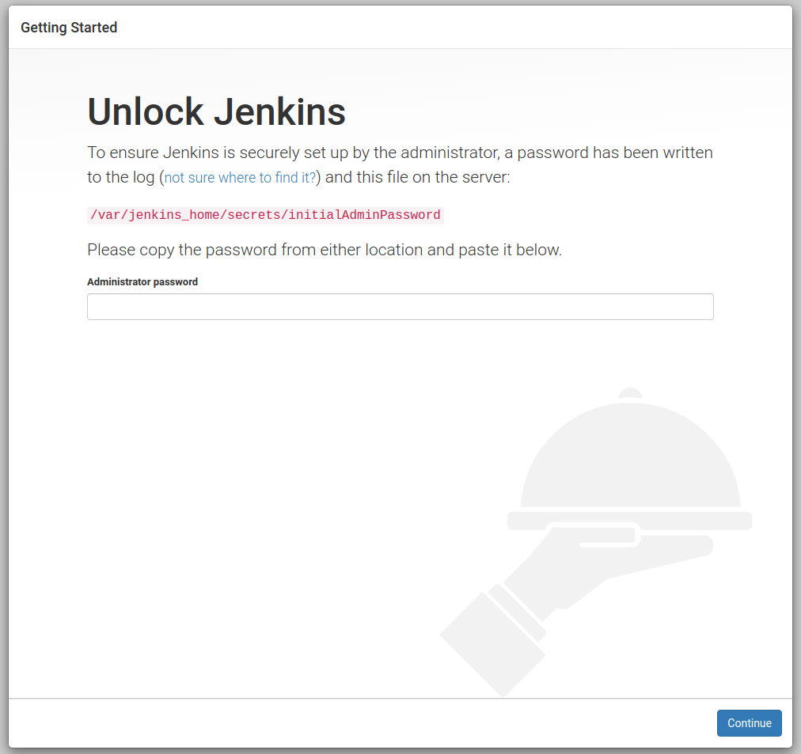{.align-center}

### Configure Jenkins at first startup

The very first time you try to access Jenkins, you will need to unlock it and generate a new administrator username and password.

In order to do that, you need to print the contents of the auto-generated file `/var/jenkins_home/secrets/initialAdminPassword`

1.  First of all search for the Jenkins container ID, usually `jenkins4{{project_name}}`{.interpreted-text role="guilabel"} where `{{project_name}}` is the name of your `geonode-project`{.interpreted-text role="guilabel"} instance (e.g. `my_geonode`)

``` shell
$> docker ps

  CONTAINER ID        IMAGE                        COMMAND                  CREATED             STATUS              PORTS                                                                                NAMES
  e9fc97a75d1a        geonode/nginx:geoserver      "/docker-entrypoint.…"   2 hours ago         Up 2 hours          0.0.0.0:80->80/tcp, 0.0.0.0:443->443/tcp                                             nginx4my_geonode
  c5496400b1b9        my_geonode_django            "/bin/sh -c 'service…"   2 hours ago         Up 2 hours                                                                                               django4my_geonode
  bc899f81fa28        my_geonode_celery            "/bin/sh -c 'service…"   2 hours ago         Up 2 hours                                                                                               celery4my_geonode
  3b213400d630        geonode/geoserver:2.17.1     "/usr/local/tomcat/t…"   2 hours ago         Up 2 hours          8080/tcp                                                                             geoserver4my_geonode
  d2f59d70a0d3        geonode/postgis:11           "docker-entrypoint.s…"   2 hours ago         Up 2 hours          5432/tcp                                                                             db4my_geonode
  3f9ce0be7f88        rabbitmq                     "docker-entrypoint.s…"   2 hours ago         Up 2 hours          4369/tcp, 5671-5672/tcp, 25672/tcp                                                   rabbitmq4my_geonode
  02fdbce9ae73        geonode/letsencrypt:latest   "./docker-entrypoint…"   2 hours ago         Up 14 seconds                                                                                            my_geonode_letsencrypt_1
  c745520fd551        jenkins/jenkins:lts          "/sbin/tini -- /usr/…"   2 hours ago         Up 2 hours          0.0.0.0:9080->9080/tcp, 8080/tcp, 0.0.0.0:50000->50000/tcp, 0.0.0.0:9443->8443/tcp   jenkins4my_geonode
```

1.  Now just `cat` the file above inside the Jenkins container

``` shell
$> docker container exec -u 0 -it jenkins4my_geonode sh -c 'cat /var/jenkins_home/secrets/initialAdminPassword'

  b91e9d*****************373834
```

1.  Copy the hash code you just got form the print above, and copy-and-paste to the browser window

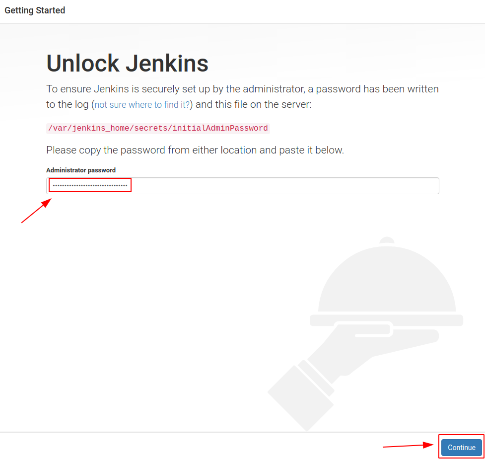{.align-center}

In the next step just install the `Default Plugins`{.interpreted-text role="guilabel"}. You can install more of them later on from the management page.

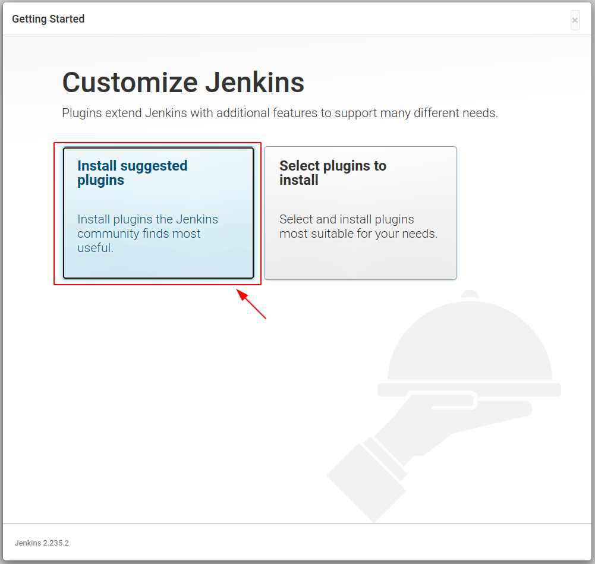{.align-center}

Wait until Jenkins has finished configuring the plugins

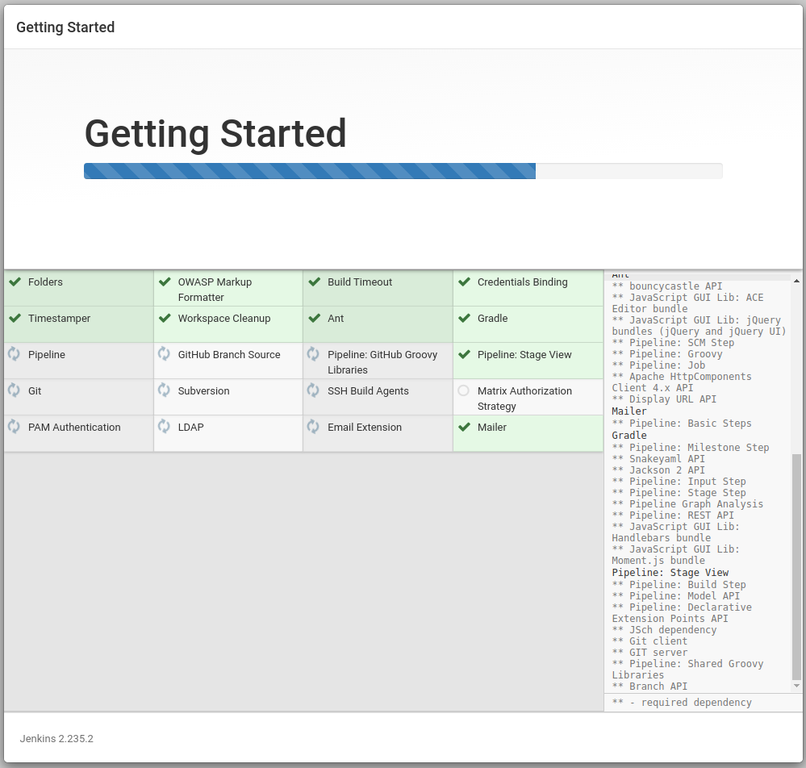{.align-center}

Provide the administrator credentials as requested

{.align-center}

Confirm the Jenkins instance URL, this can be changed form the configuration later in case you will need to update the server address

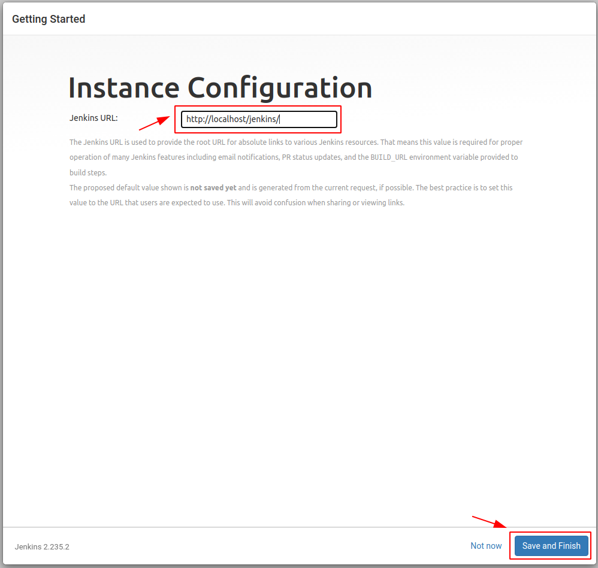{.align-center}

Well done, Jenkins is ready now

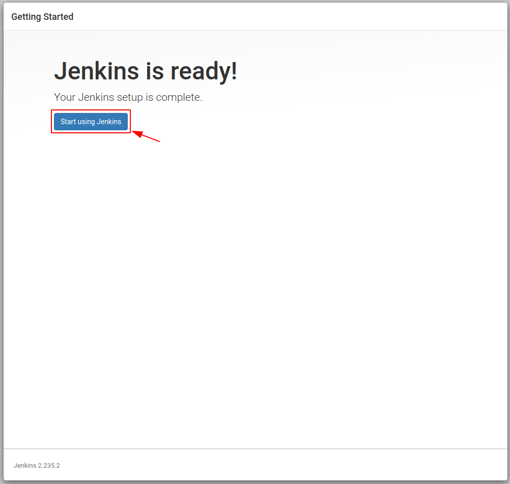{.align-center}

The next step is to configure a Jenkins Job able to interact with the Django Docker container and run a full backup

{.align-center}

### Configure a Jenkins Job to run a full backup on the Django Container

Before creating the new Jenkins job, we need to install and configure a new plugin, [Publish over SSH](https://plugins.jenkins.io/publish-over-ssh)

In order to do that, once logged in as `admin`, go to the Jenkins `Management Page > Manage Plugins`{.interpreted-text role="guilabel"} tab

{.align-center}

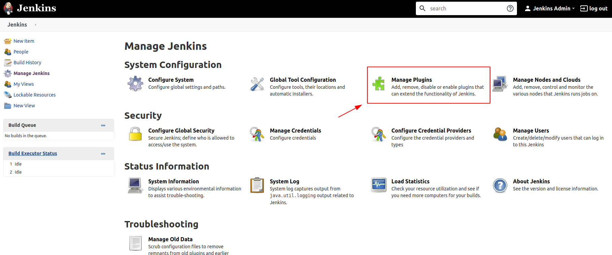{.align-center}

Click on `Available`{.interpreted-text role="guilabel"} tab and search for `SSH` available plugins

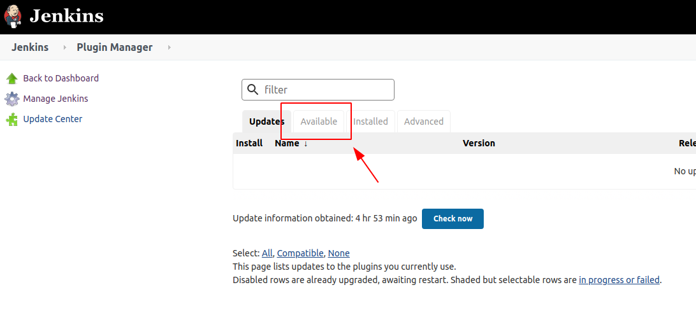{.align-center}

Select and check the `Publish over SSH` one

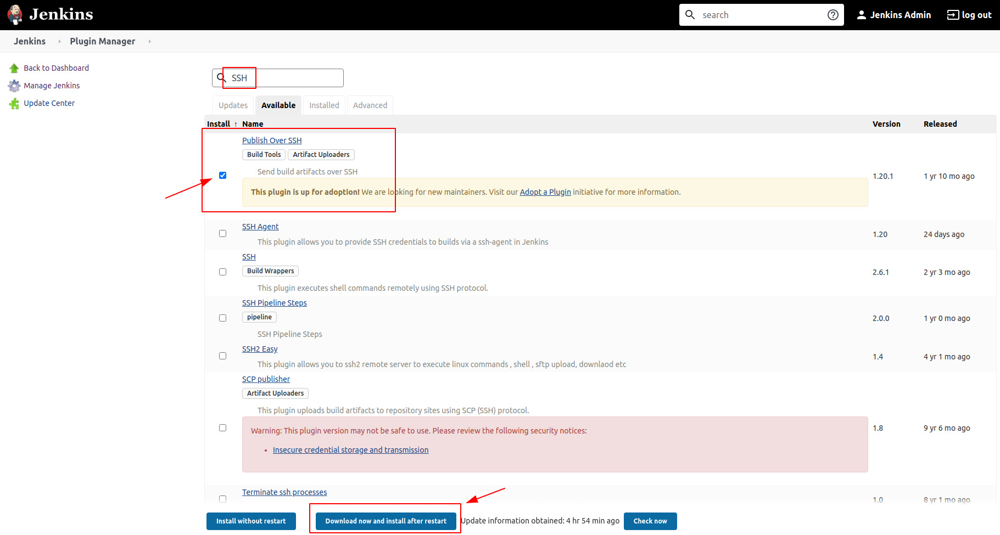{.align-center}

Install the plugins and restart Jenkins

{.align-center}

The next step is to configure the `SSH Server Connection` for the `Publish over SSH`{.interpreted-text role="guilabel"} plugin.

Move to `Jenkins Configuration`{.interpreted-text role="guilabel"}

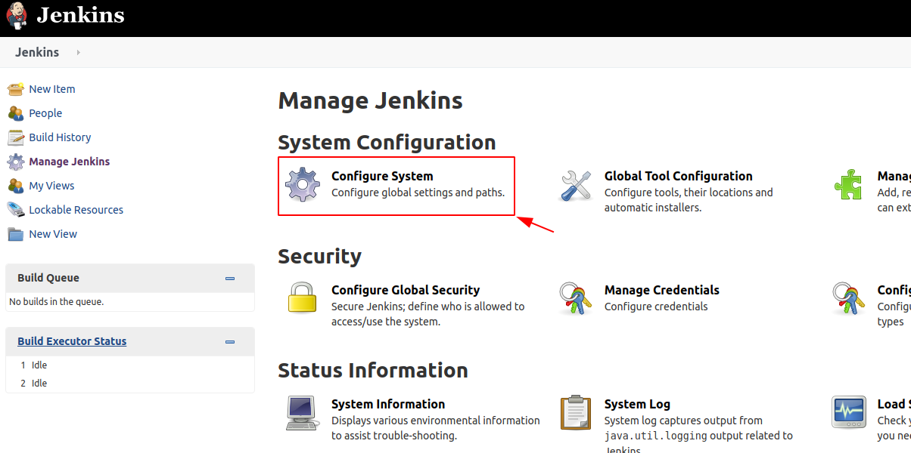{.align-center}

Scroll down until you find the `Publish over SSH`{.interpreted-text role="guilabel"} plugin section

{.align-center}

Depending on how your `HOST SSH service` has been configured, you might need several information in order to setup the connection.

Here below an example using a global host (`master.demo.geonode.org`) accepting `SSH` connections via `RSA keys`

{.align-center}

::: note
::: title
Note
:::

Before saving the configuration always ensure the connection is ok by using the `Test Configuration`{.interpreted-text role="guilabel"} button

{.align-center}
:::

It is possible also to run and configure `Jenkins`{.interpreted-text role="guilabel"} to run locally, as an instance on `localhost`{.interpreted-text role="guilabel"}.
In that case you will need to change few things in order to allow `Jenkins`{.interpreted-text role="guilabel"} to access your local network.

1.  First of all, be sure `OpenSSH Server`{.interpreted-text role="guilabel"} is correctly installed and running on your PC. Eventually check any firewall rules.

    ``` shell
    $> sudo apt install openssh-server

    # Test your connection locally
    $> ssh -p 22 user@localhost
       user@localhost's password: 
    ```

2.  You will need to do some changed to your `docker-compose.yml` file in order to enable the `host network`{.interpreted-text role="guilabel"} configuration.

    ::: note
    ::: title
    Note
    :::

    Enable `network_mode: "host"` on Jenkins container
    :::

    ``` shell
    $> vim docker-compose.yml

    ...
    jenkins:
       image: jenkins/jenkins:lts
       # image: istresearch/jenkins:latest
       container_name: jenkins4${COMPOSE_PROJECT_NAME}
       user: jenkins
       ports:
          - '${JENKINS_HTTP_PORT}:${JENKINS_HTTP_PORT}'
          - '${JENKINS_HTTPS_PORT}:${JENKINS_HTTPS_PORT}'
          - '50000:50000'
       network_mode: "host"
       volumes:
          - jenkins_data:/var/jenkins_home
          - backup-restore:/backup_restore
          # - /var/run/docker.sock:/var/run/docker.sock
       environment:
          - 'JENKINS_OPTS=--httpPort=${JENKINS_HTTP_PORT} --httpsPort=${JENKINS_HTTPS_PORT} --prefix=/jenkins'
    ...

    # Recreate the Jenkins container
    $> docker-compose stop jenkins
    $> docker-compose rm jenkins
    $> docker-compose up -d jenkins
    ```

    ::: warning
    ::: title
    Warning
    :::

    From now on, your local Jenkins instance will be accessible from `http://localhost:9080/jenkins`{.interpreted-text role="guilabel"}
    :::

3.  Add `localhost` Server to the `Publish over SSH`{.interpreted-text role="guilabel"} plugin configuration

    Mode to `http://localhost:9080/jenkins/configure`{.interpreted-text role="guilabel"} and fill the required information

    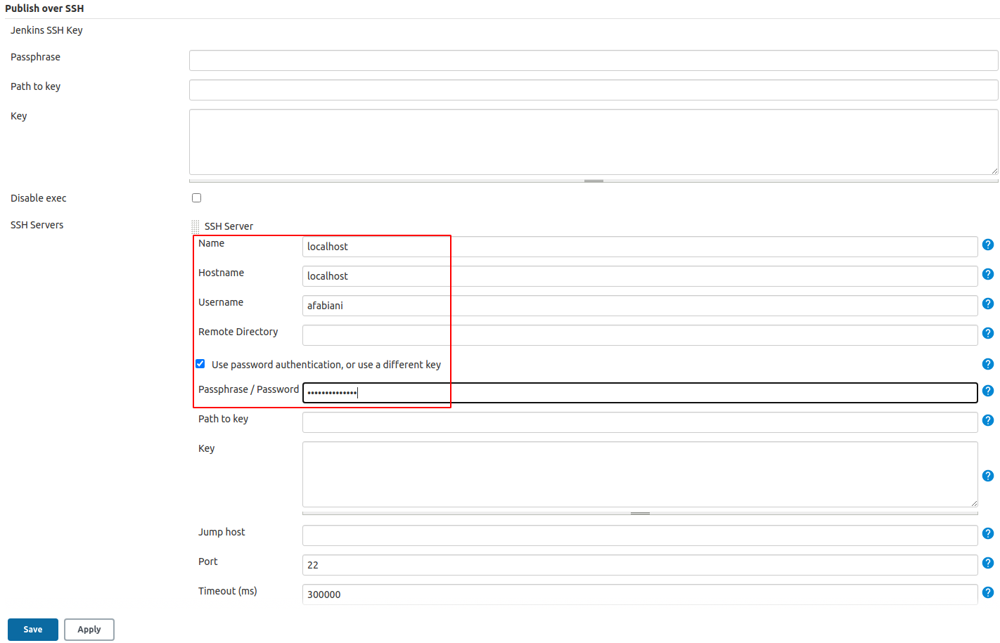{.align-center}

    ::: note
    ::: title
    Note
    :::

    Before saving the configuration always ensure the connection is ok by using the `Test Configuration`{.interpreted-text role="guilabel"} button

    {.align-center}
    :::

We are now ready to create the Jenkins Job which will run a full backup & restore of our GeoNode dockerized instance.

1.  Move to the Jenkins Home and click on `Create a Job`{.interpreted-text role="guilabel"} button

    {.align-center}

2.  Provide a name to the Job and select `Freestyle project`{.interpreted-text role="guilabel"}

    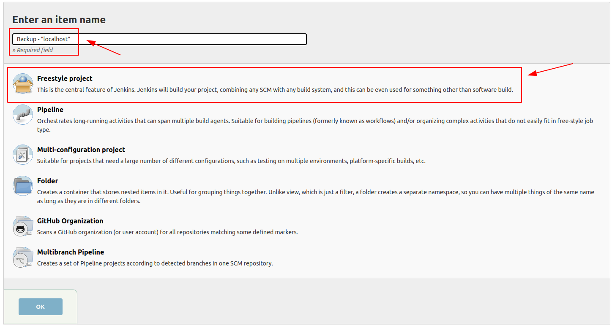{.align-center}

3.  Enable the `Log rotation`{.interpreted-text role="guilabel"} strategy if needed

    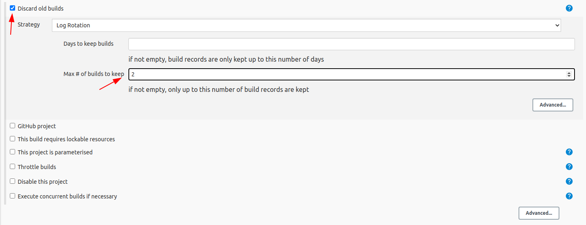{.align-center}

4.  Configure the `Job Parameters`{.interpreted-text role="guilabel"} which will be used by the script later on.

    Add three `String Parameters`{.interpreted-text role="guilabel"}

    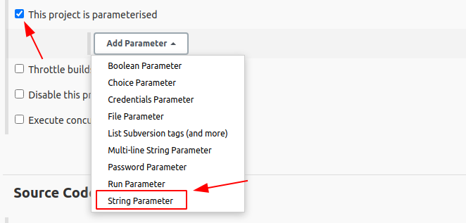{.align-center}

    as shown below

    1.  `BKP_FOLDER_NAME`{.interpreted-text role="guilabel"}

        {.align-center}

    2.  `SOURCE_URL`{.interpreted-text role="guilabel"}

        ::: warning
        ::: title
        Warning
        :::

        Provide the correct URL of your GeoNode instance
        :::

        {.align-center}

    3.  `TARGET_URL`{.interpreted-text role="guilabel"}

        ::: warning
        ::: title
        Warning
        :::

        Provide the correct URL of your GeoNode instance
        :::

        {.align-center}

5.  Enable the `Delete workspace before build starts`{.interpreted-text role="guilabel"} and `Add timestamps to the Console Output`{.interpreted-text role="guilabel"} `Build Environment`{.interpreted-text role="guilabel"} options

    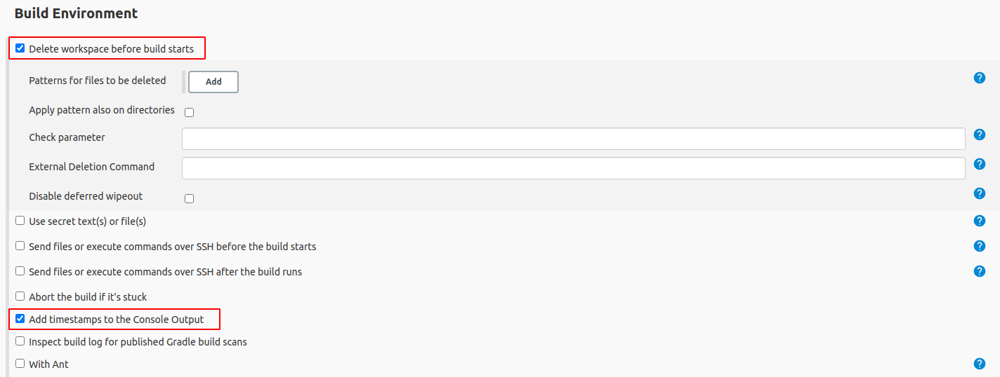{.align-center}

6.  Finally let\'s create the `SSH Build Step`{.interpreted-text role="guilabel"}

    {.align-center}

    Select the correct `SSH Server`{.interpreted-text role="guilabel"} and provide the `Exec Command`{.interpreted-text role="guilabel"} below

    > ::: warning
    > ::: title
    > Warning
    > :::
    >
    > Replace `{{project_name}}`{.interpreted-text role="guilabel"} with your `geonode-project instance name`{.interpreted-text role="guilabel"} (e.g. `my_geonode`{.interpreted-text role="guilabel"})
    > :::
    >
    > ``` shell
    > # Replace {{project_name}} with your geonode-project instance name (e.g. my_geonode)
    > # docker exec -u 0 -it django4{{project_name}} sh -c 'SOURCE_URL=$SOURCE_URL TARGET_URL=$TARGET_URL ./{{project_name}}/br/backup.sh $BKP_FOLDER_NAME'
    > # e.g.:
    > docker exec -u 0 -it django4my_geonode sh -c 'SOURCE_URL=$SOURCE_URL TARGET_URL=$TARGET_URL ./my_geonode/br/backup.sh $BKP_FOLDER_NAME'
    > ```
    >
    > 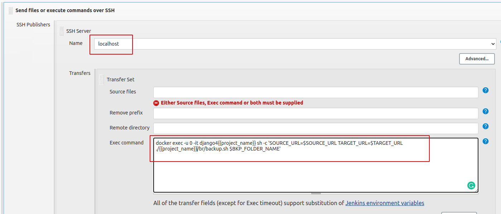{.align-center}

> Click on `Advanced`{.interpreted-text role="guilabel"} and change the parameters as shown below
>
> > {.align-center}

**Save!** You are ready to run the Job\...

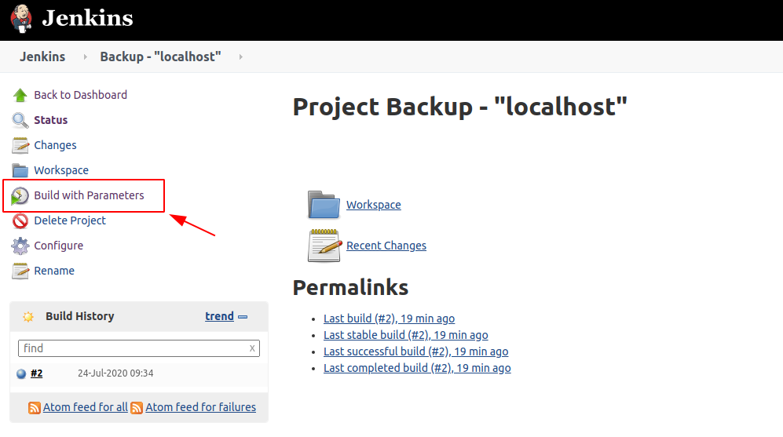{.align-center}

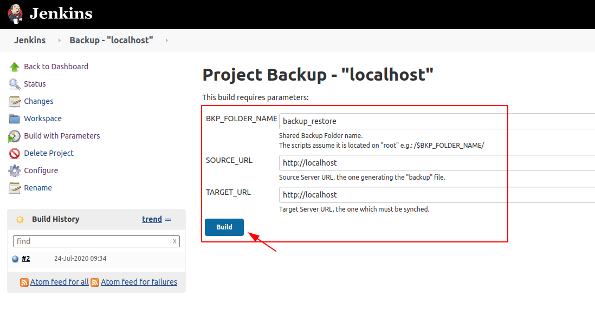{.align-center}

{.align-center}

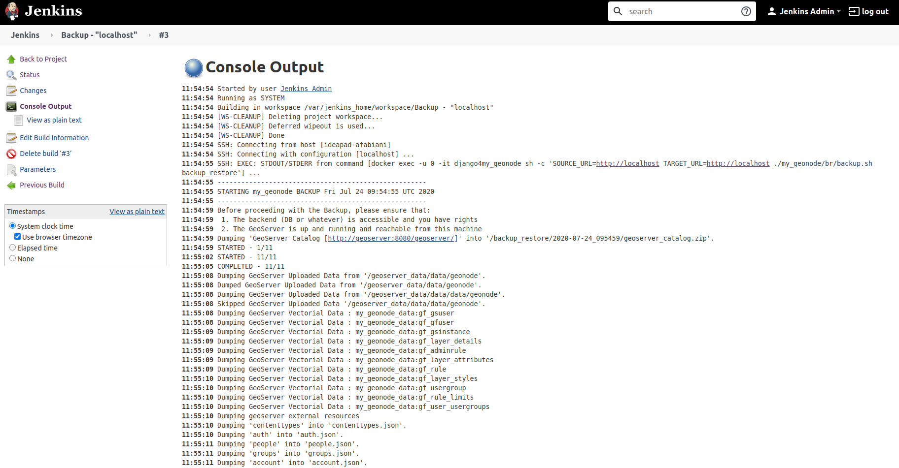{.align-center}

### Link the `backup_restore`{.interpreted-text role="guilabel"} folder to a local folder on the `HOST`{.interpreted-text role="guilabel"}

In the case you need to save the backup archives outside the docker container, there\'s the possibility to directly link the `backup_restore`{.interpreted-text role="guilabel"} folder to a local folder on the `HOST`{.interpreted-text role="guilabel"}.

In that case you won\'t need to `docker cp`{.interpreted-text role="guilabel"} the files everytime from the containers, they will be directly available on the host filesystem.

::: warning
::: title
Warning
:::

Always keep an eye to the disk space. Backups archives may be huge.
:::

::: note
::: title
Note
:::

You might want also to consider filtering the files through the backup dt filters on the `settings.ini`{.interpreted-text role="guilabel"} in order to reduce the size of the archive files, including only the new ones.
:::

Modify the `docker-compose.override.yml` as follows in order to link the backup folders outside.

::: note
::: title
Note
:::

`/data/backup_restore` is a folder physically located into the host filesystem.
:::

``` shell
$> vim docker-compose.override.yml

version: '2.2'
services:

django:
   build: .
   # Loading the app is defined here to allow for
   # autoreload on changes it is mounted on top of the
   # old copy that docker added when creating the image
   volumes:
      - '.:/usr/src/my_geonode'
      - '/data/backup_restore:/backup_restore'  # Link to local volume in the HOST

celery:
  volumes:
    - '/data/backup_restore:/backup_restore'  # Link to local volume in the HOST

geoserver:
  volumes:
    - '/data/backup_restore:/backup_restore'  # Link to local volume in the HOST

jenkins:
  volumes:
    - '/data/backup_restore:/backup_restore'  # Link to local volume in the HOST

# Restart the containers
$> docker-compose up -d
```
