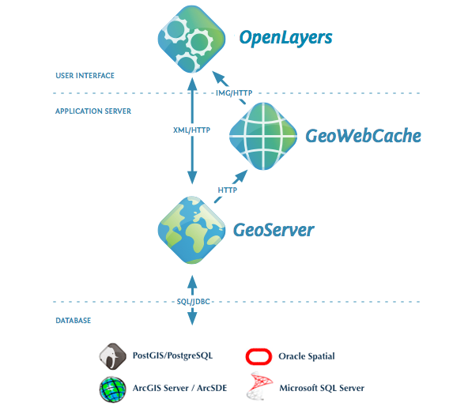

# GeoNode Basics {#geonode_basics}

> {.align-center}

is a platform for the management and publication of geospatial data.
It brings together mature open-source software projects under an easy to use interface.

> <figure>
> 
> <figcaption><em>GeoNode simplified architecture</em></figcaption>
> </figure>

## *With GeoNode, non-specialized users can share data and create interactive maps.*

> {.align-center}
>
> {.align-center}
>
> {.align-center}

## Geospatial data storage

GeoNode allows users to upload vector data (currently shapefiles, json, csv, kml and kmz) and raster data in their original projections
using a web form.

Vector data is converted into geospatial tables on a DB, satellite imagery and other kinds of raster data are retained as GeoTIFFs.

Special importance is given to standard metadata formats like ISO 19139:2007 / ISO 19115 metadata standards.

As soon as the upload is finished, the user can fill the resource metadata in order to make it suddenly available through the [CSW](http://www.opengeospatial.org/standards/cat) (OGC Catalogue Service)
endpoints and APIs.

Users may also upload a metadata XML document (ISO, FGDC, and Dublin Core format) to fill key GeoNode metadata elements automatically.

Similarly, GeoNode provides a web based styler that lets the users to change the data portrayals and preview the changes at real time.

## Data mixing, maps creation

Once the data has been uploaded, GeoNode lets the user search for it geographically or via keywords in order to create fancy maps.

All the datasets are automatically re-projected to web Mercator for maps display, making it possible to use different popular base datasets,
like Open Street Map, Google Satellite or Bing datasets.

Once the maps are saved, it is possible to embed them in any web page or get a PDF version for printing.

## GeoNode as a building block

A handful of other Open Source projects extend GeoNode\'s functionality by tapping into the re-usability of Django applications.

Visit our gallery to see how the community uses GeoNode: [GeoNode Projects](http://geonode.org/gallery/).

The development community is very supportive of new projects and contributes ideas and guidance for newcomers.

## Convinced! Where do I sign?

The next steps are:

1.  Make a ride on the `online_demo`{.interpreted-text role="ref"}
2.  Follow the `quick_setup_guide`{.interpreted-text role="ref"} in order to play with your own local instance and access all the admin functionalities
3.  Read the documentation starting from the `user guide </usage/index>`{.interpreted-text role="doc"} to the `admin guide </admin/index>`{.interpreted-text role="doc"}
4.  Subscribe to the [geonode-users](https://lists.osgeo.org/mailman/listinfo/geonode-users) and/or [geonode-devel](https://lists.osgeo.org/mailman/listinfo/geonode-devel) mailing lists to join the community.
    See also the section `get_in_touch`{.interpreted-text role="ref"} for more info.

Thanks for your interest!

# Supported Browsers {#supported_browsers}

GeoNode is known to be working on all modern web browsers.

This list includes (but is not limited to):

-   [Google Chrome](http://www.google.com/chrome/).
-   [Apple Safari](https://www.apple.com/safari/).
-   [Mozilla Firefox](https://www.mozilla.org/en-US/firefox/new/).
-   [Microsoft Edge](https://developer.microsoft.com/en-us/microsoft-edge/).

::: note
::: title
Note
:::

The vast majority of GeoNode developers prefer using Google Chrome.
:::

# Online Demo {#online_demo}

::: note
::: title
Note
:::

**Disclaimer** we do not guarantee for any data published on this Demo Site. Publish the data at your own risk.
Every dataset will be removed automatically every Sunday. If you find some dataset that shouldn\'t be there, please
write suddenly to developers and maintainers.

See the section `get_in_touch`{.interpreted-text role="ref"} for details.
:::

A live demo of the latest stable build is available at <http://stable.demo.geonode.org/>.

> <figure>
> 
> <figcaption><em>Online Demo @ master.demo.geonode.org</em></figcaption>
> </figure>

Anyone may sign up for a user account, upload and style data, create and share maps, and change permissions.

Since it is a demo site, every sunday all the datasets will be wiped out. Users, passwords and groups will be preserved.

It should hopefully allow you to easily and quickly make a tour of the main capabilities of GeoNode.

::: warning
::: title
Warning
:::

This GeoNode instance is configured with standards settings and a very low security level.
This is a demo only not to be considered a really production ready system.
For a complete list of settings, refer to the section: `settings`{.interpreted-text role="ref"}
:::

# Quick Installation Guide {#quick_setup_guide}

::: {.toctree maxdepth="3"}
quick/index
:::

- [index](quick/index.md)

