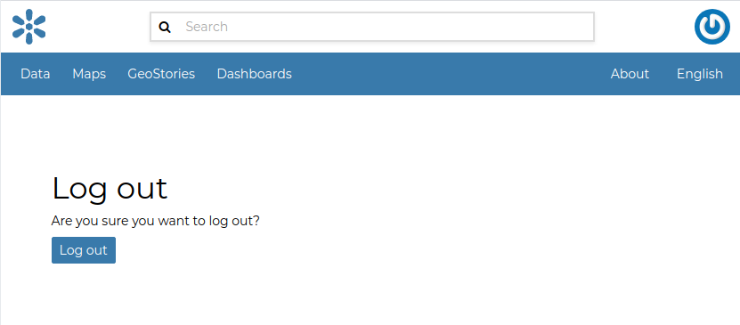

# Creating a New Account

To take full advantage of all the GeoNode features you need a user account. Follow these step to create a new one.

1.  From any page in the web interface, you will see a `Register`{.interpreted-text role="guilabel"} link. Click that link, and the register form will appear

    > ::: note
    > ::: title
    > Note
    > :::
    >
    > The registrations in GeoNode must be open, in case you don\'t see the register link then it\'s not possible to register unless the administrator of the site does that for you.
    > :::
    >
    > <figure>
    > 
    > <figcaption><em>Register Link</em></figcaption>
    > </figure>

2.  On the next page, fill out the form. Enter a username and password in the fields. Also, enter your email address for verification.

    <figure>
    
    <figcaption><em>Registering for a new account</em></figcaption>
    </figure>

3.  You will be automatically logged in and redirected to the Profile page. An email will be sent confirming that you have signed up. If no errors occur during the registration, the following alerts will appear on the screen:

    <figure>
    
    <figcaption><em>Alerts</em></figcaption>
    </figure>

To log out click on the `Log out`{.interpreted-text role="guilabel"} link of the user menu.

<figure>

<figcaption><em>Logout link</em></figcaption>
</figure>

You have to confirm this action as described in the picture below.

> <figure>
> 
> <figcaption><em>Confirm Log out</em></figcaption>
> </figure>
