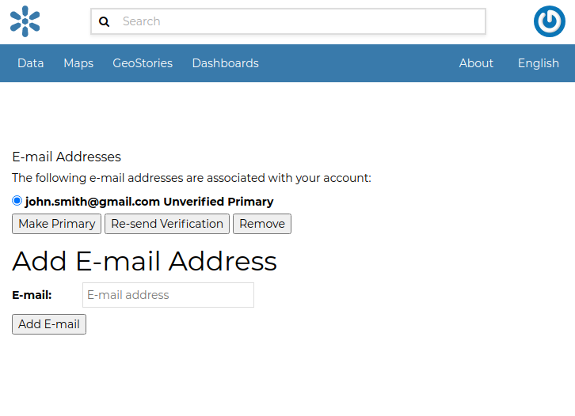
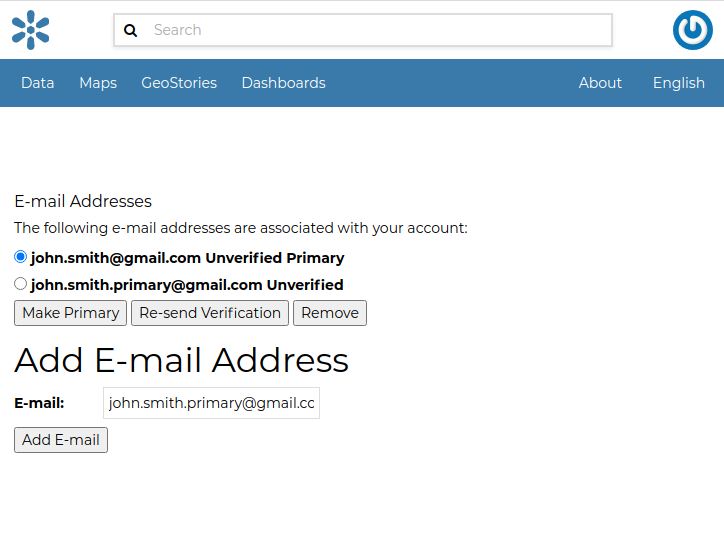
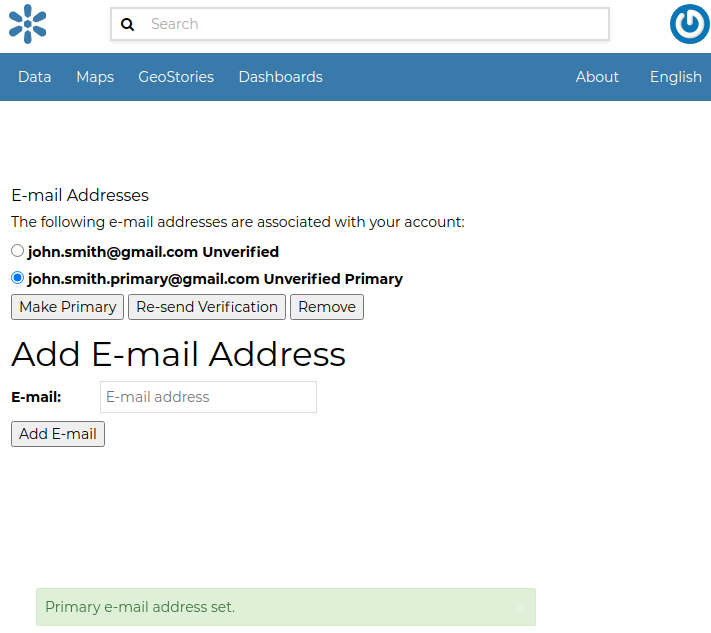

# Associating your Account with an e-mail {#associating_emails}

Your account is automatically associated with the e-mail that you used to register yourself on the platform.

<figure>

<figcaption><em>Accounts e-mail</em></figcaption>
</figure>

By clicking on `Associated e-mails`{.interpreted-text role="guilabel"} of the *Profile* page (see `editing-profile`{.interpreted-text role="ref"}), you will have the possibility to fill up a new e-mail address. Type it in the `E-mail`{.interpreted-text role="guilabel"} input filed then click on `Add E-mail`{.interpreted-text role="guilabel"} to perform a new association.

<figure>

<figcaption><em>New e-mail association</em></figcaption>
</figure>

You can make it primary if necessary, in order to receive the notification on this address. To do that, select the e-mail that you want, then click on `Make Primary`{.interpreted-text role="guilabel"}.

<figure>

<figcaption><em>Primary e-mail address</em></figcaption>
</figure>
