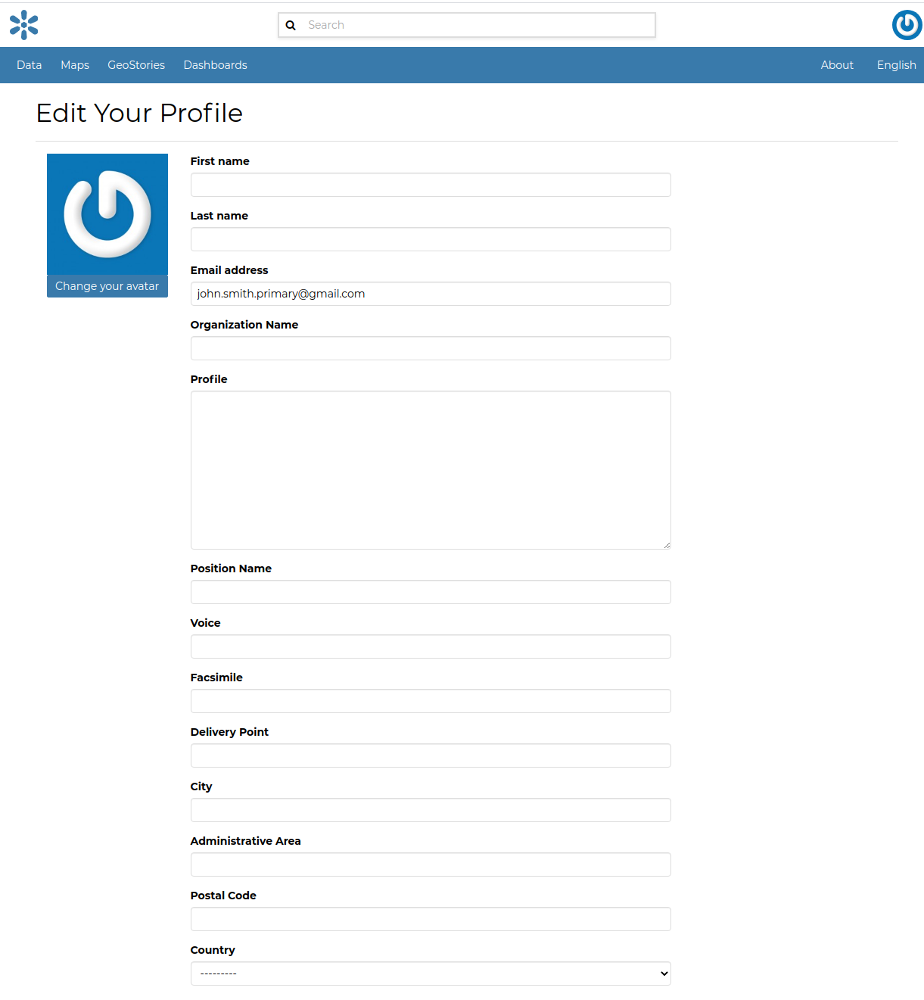

# Editing Profile Information

Your *Profile* contains personal information such as your address, your telephone number, your organization and so on but it is empty by default at the beginning.

Through the `Edit profile`{.interpreted-text role="guilabel"} button of the *Profile* page (see `editing-profile`{.interpreted-text role="ref"}) you can set your details, including your avatar.

<figure>

<figcaption><em>Updating Profile information</em></figcaption>
</figure>

| When finished, click `Update profile`{.interpreted-text role="guilabel"}. You will be redirected to the *Profile* page.
| A message will confirm the profile has been correctly updated.

<figure>

<figcaption><em>Updating Profile correctly finalized</em></figcaption>
</figure>
