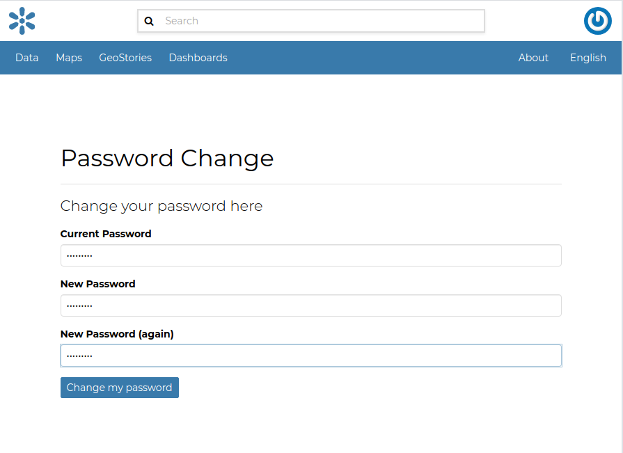
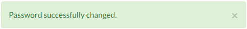

# Managing the Password

To change your password, click on the `Set/Change password`{.interpreted-text role="guilabel"} link of the *Profile* page (see `editing-profile`{.interpreted-text role="ref"}).
You will be asked to enter your current password and the new one (two times). Click on `Change my password`{.interpreted-text role="guilabel"} to perform the change.

<figure>

<figcaption><em>Change your password</em></figcaption>
</figure>

If no errors occur you will see a confirmation message.

<figure>

<figcaption><em>Change password confirmation</em></figcaption>
</figure>

Next time you signin, you will have to use the new password.
