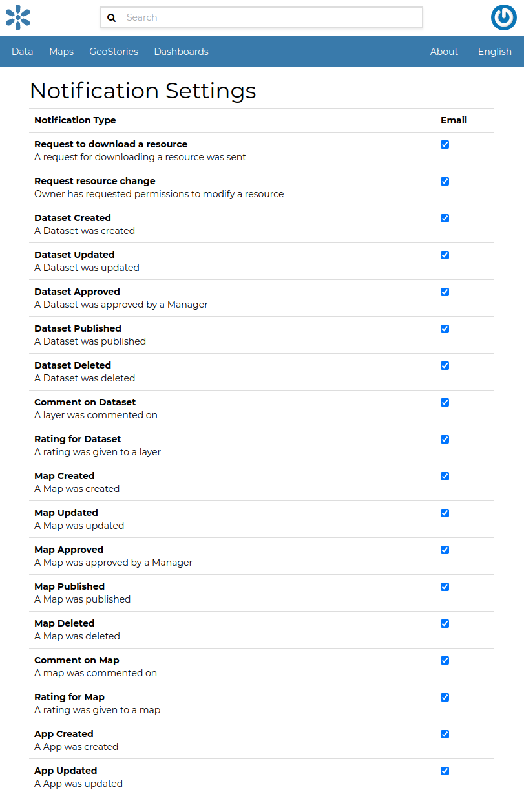
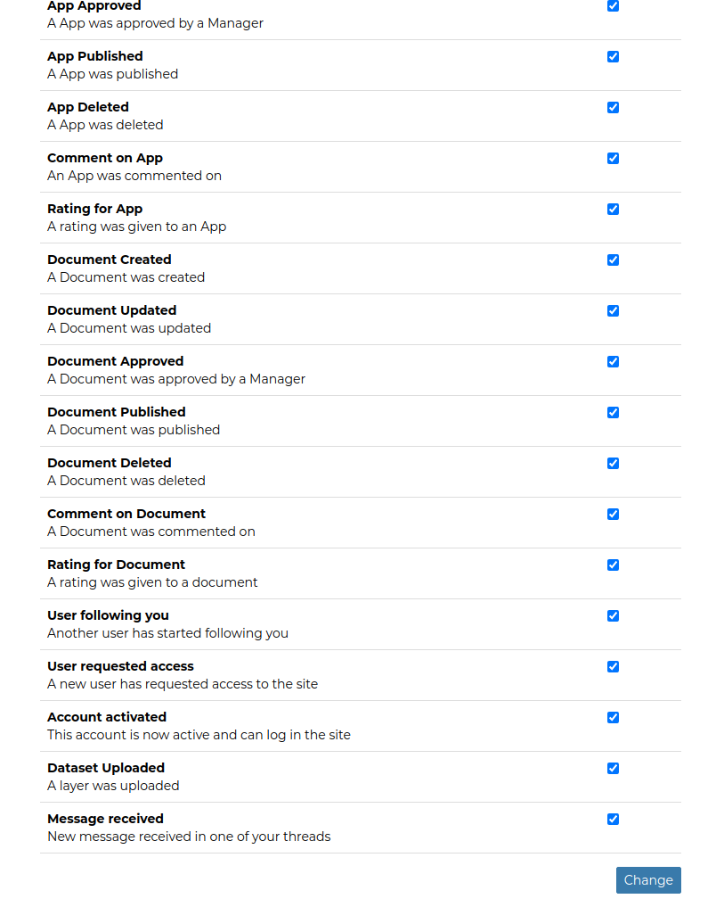

# Setting Notification Preferences

By default GeoNode sends notifications to the users for events that they could be subscribed to such as a new dataset uploaded or a new rate added to a map.
You can adjust your notification settings by clicking on the `Notifications`{.interpreted-text role="guilabel"} link of the *Profile* page (see `editing-profile`{.interpreted-text role="ref"}).

::: note
::: title
Note
:::

Make sure to have a verified email address to which notices can be sent. If not see `associating_emails`{.interpreted-text role="ref"}.
:::

Now check/uncheck the notification types you wish to receive or not receive. It is possible to be notified for the events shown in the picture below.

{.align-center}

<figure>

<figcaption><em>Notifications settings</em></figcaption>
</figure>
