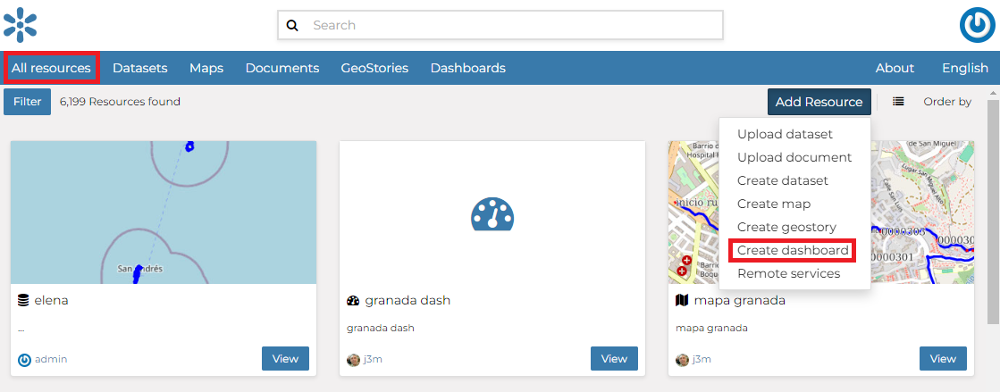
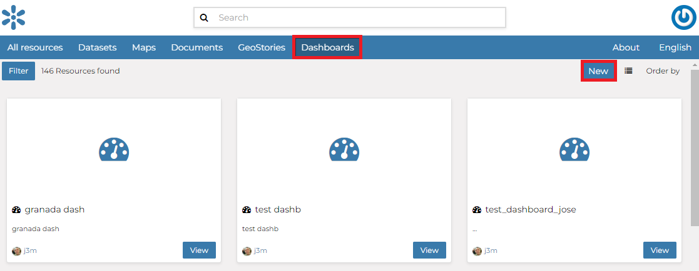

# Dashboard

Dashboard is a MapStore tool integrated in GeoNode that provides the user with a space to add many Widgets, such as charts, maps, tables, texts and counters, and can create connections between them in order to:

-   Provide an overview to better visualize a specific data context
-   Interact spatially and analytically with the data by creating connections between widgets
-   Perform analysis on involved data/layers

To build a new Dashboard go to `Add Resource`{.interpreted-text role="guilabel"} option on the *All Resources* page and choose option *Create dashboard* or select `New`{.interpreted-text role="guilabel"} option on the *Dashboards* page

> <figure>
> 
> <figcaption><em>Create dashboard from All Resources page</em></figcaption>
> </figure>

<figure>

<figcaption><em>Create dashboard from Dashboards page</em></figcaption>
</figure>

Now you landed on the Dashboard edition page that is composed of the following sections:

<figure>

<figcaption><em>New Dashboard Apps option</em></figcaption>
</figure>

## Further Reading

Follow the link below to get more detailed information about the usage of Dashboard.

[Dashboard Documentation](https://mapstore.readthedocs.io/en/latest/user-guide/exploring-dashboards)
