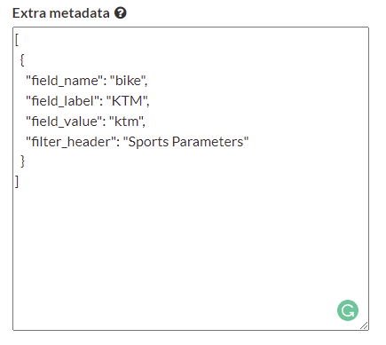
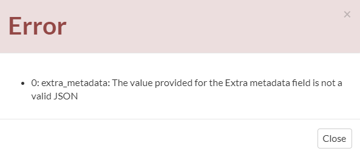
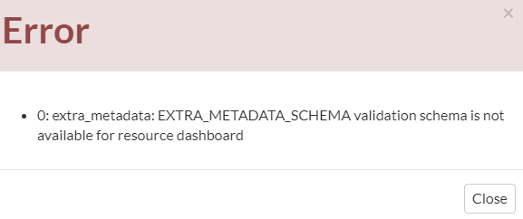
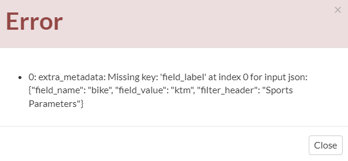
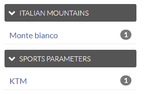

# Metadata manipulation {#data}

There are two possible ways to manipulate extra metadata in geonode:

-   via Metadata Editor (Wizard and advanced)
-   via Rest API

## Metadata Editor (wizard/advanced):

The metadata section is placed under the OPTIONAL METADATA section available for all the GeoNode resources.

The metadata must follow two specific rules to save to the resource:

-   Must always be a list of JSON. This permits to add of more than one metadata for each resource
-   The JSON must follow the schema defined in the [settings.py]{.title-ref} for the selected resource.

For example, for my document resource, I can have something like the following:

<figure>

<figcaption><em>Advanced edit wizard menù</em></figcaption>
</figure>

After pressing the save button, the system will perform the following checks:

-   Check if the text provided is a valid JSON. In case of wrong format input, the following error is shown:

<figure>

<figcaption><em>invalid JSON error</em></figcaption>
</figure>

-   Check if the metadata schema is provided for the resource if not will raise the following error

<figure>

<figcaption><em>missing schema error</em></figcaption>
</figure>

-   Check if the metadata schema is coherent with the schema defined in the settings. In case of wrong format input, the error will print the missing JSON keys

<figure>

<figcaption><em>invalid schema error</em></figcaption>
</figure>

## Facet Filtering

Automatically the web interface will create dynamically the facets if there is at least 1 metadata defined for the resource.

Suppose that a resource heve the following metadata:

``` json
[
     {
          "field_name": "bike",
          "field_label": "KTM",
          "field_value": "ktm",
          "filter_header": "Sports Parameters"
     },
     {
          "field_name": "mountain",
          "field_label": "Monte bianco",
          "field_value": "monte_bianco",
          "filter_header": "Italian Mountains"
     }
]
```

By default GeoNode will convert this metadata info in facets available for the resource

The facet will convert:
- \`filter_header\`: used as the header filter
- \`field_value\`: used to perform the search
- \`field_name\`: used for calculate the unique values (along with [field_value]{.title-ref})

After says that, the facet will be the follow:

{.align-center}
