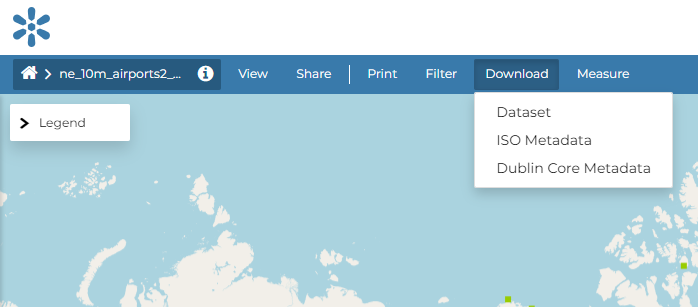
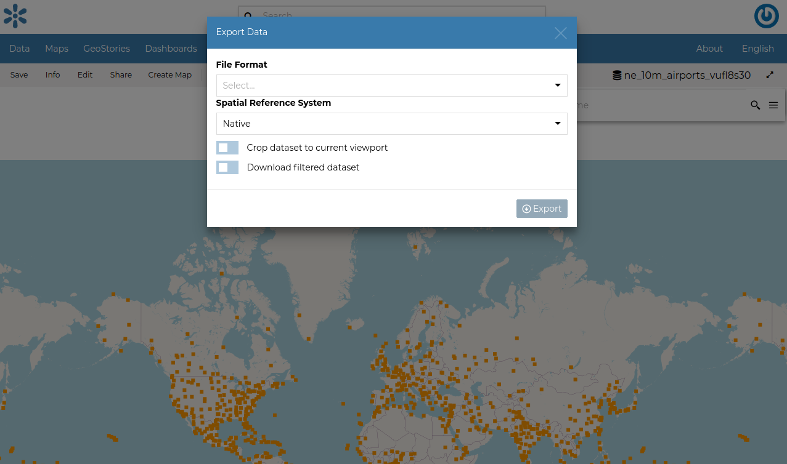
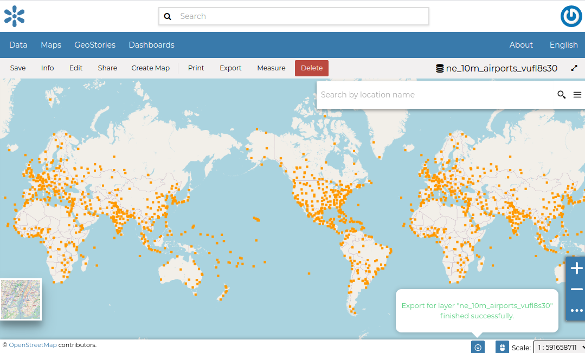
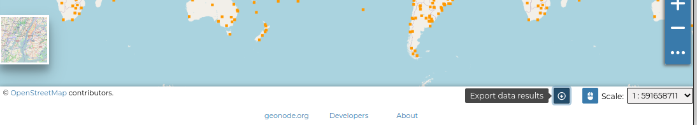
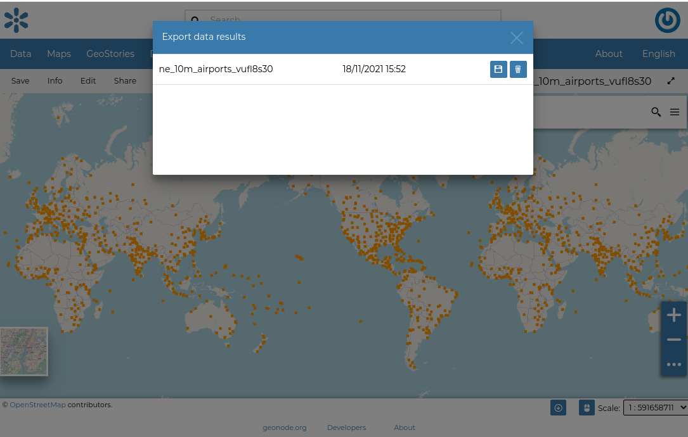
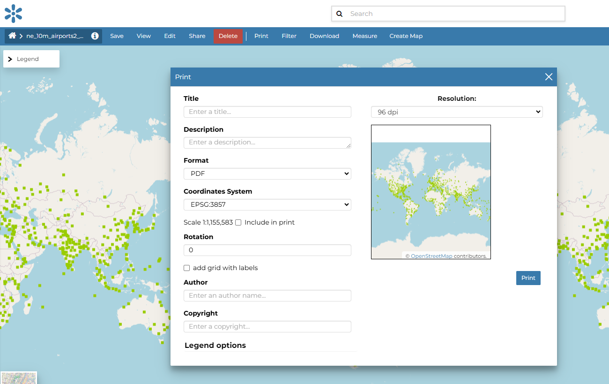
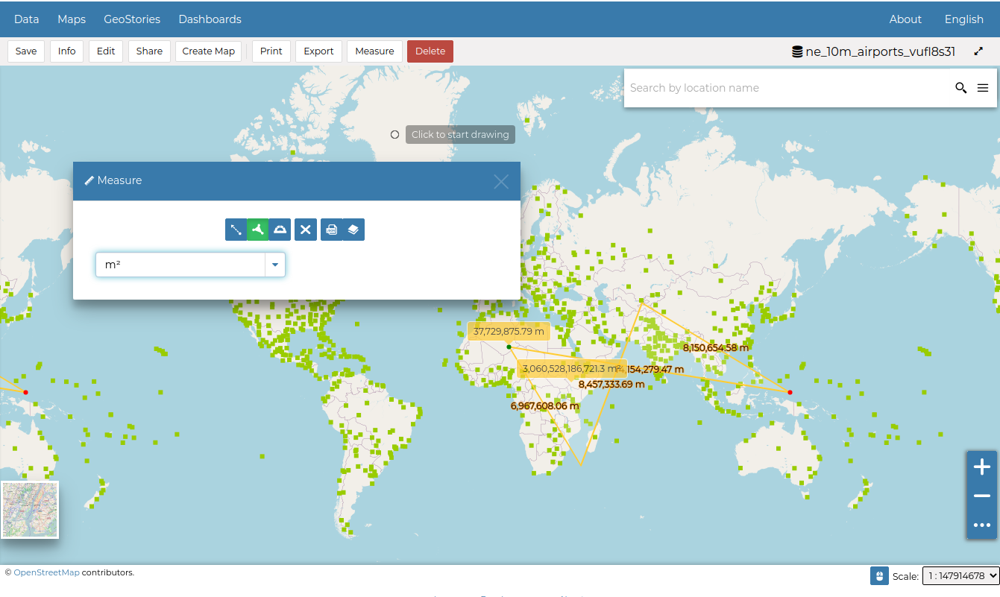

::: {#dataset-download}
Downloading Datasets
==================
:::

At the top of the *Dataset Menu* there is an `Download`{.interpreted-text role="guilabel"} link where it is possible to download:

-   Dataset
-   ISO Metadata
-   Dublin Core Metadata

Clicking the `ISO Metadata`{.interpreted-text role="guilabel"} or the `Dublin Core Metadata`{.interpreted-text role="guilabel"} exports the layer metadata in [xml]{.title-ref} format.

<figure>

<figcaption><em>Downloading Metadata</em></figcaption>
</figure>

Open the `Dataset`{.interpreted-text role="guilabel"} option you will be able to select from a list of options of the supported export file formats.

<figure>

<figcaption><em>Downloading Datasets</em></figcaption>
</figure>

As shown in the image above, GeoNode allows you to download a subset of data. Click on `Download filtered dataset`{.interpreted-text role="guilabel"} to download filtered data.

On clicking Export, the file is prepared and a notification is showed when file is ready

<figure>

<figcaption><em>Export Ready</em></figcaption>
</figure>

To download the file to your machine, click on the export dataset icon. This opens the prepared export files and you can save the files on your by clicking on the save icon on each item.

<figure>

<figcaption><em>Export Results Icon</em></figcaption>
</figure>

{.align-center}

# Printing

| The [MapStore](https://mapstore2.geo-solutions.it/mapstore/#/) based map viewer of GeoNode allows you to print the current view with a customizable layout.
| Click the `Print`{.interpreted-text role="guilabel"} option from the *Menu*, the **Printing Window** will open.

<figure>

<figcaption><em>The Printing Window</em></figcaption>
</figure>

From this window you can:

-   enter *Title* and *Description*;
-   choose the *Resolution* in dpi;
-   select the format
-   select the coordinate
-   add the scale
-   add grid with label
-   customize the *Layout*
    -   the *Sheet size* (A3, A4);
    -   if include the legend or not;
    -   if to put the legend in a separate page;
    -   the page *Orientation* (Landscape or Portrait);
-   customize the *Legend*
    -   the *Label Font*;
    -   the *Font Size*;
    -   the *Font Emphasis* (bold, italic);
    -   if *Force Labels*;
    -   if use *Anti Aliasing Font*;
    -   the *Icon Size*;
    -   the *Legend Resolution* in dpi.

To print the view click on `Print`{.interpreted-text role="guilabel"}.

# Performing Measurements

Click on the `Measure`{.interpreted-text role="guilabel"} option of the *Menu* to perform a measurement.
As you can see in the picture below, this tool allows you to measure *Distances*, *Areas* and the *Bearing* of lines.

<figure>

<figcaption><em>The Measure Tool</em></figcaption>
</figure>
