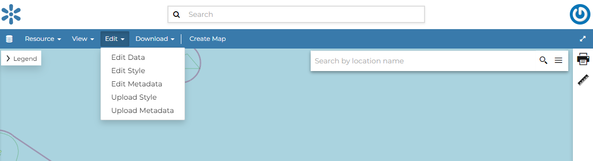
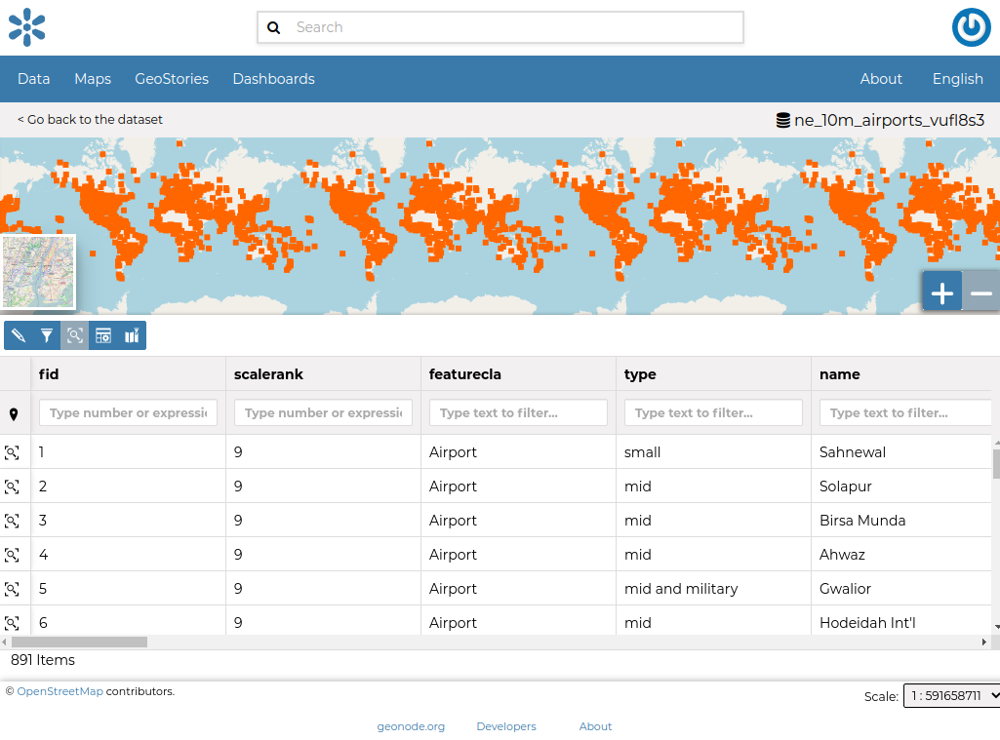
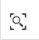
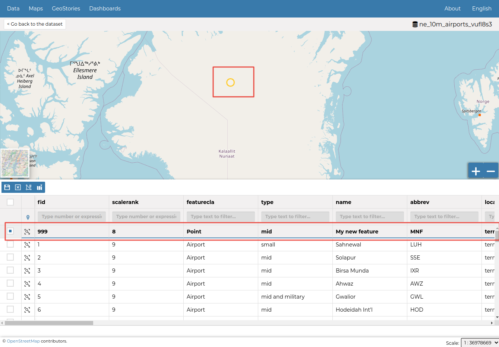

# Dataset Editing

The `Edit`{.interpreted-text role="guilabel"} link in the menu of the *Dataset Page* opens a list of options like ones shown in the picture below.

<figure>

<figcaption><em>Dataset Editing Link</em></figcaption>
</figure>

In that options list, you can see three options listed as:

1.  *Edit Data*
2.  *Edit Styles*
3.  *Edit Metadata*
4.  *Upload Style*
5.  *Upload Metadata*

In this section you will learn how to edit a *Dataset*, and its data. See `dataset-metadata`{.interpreted-text role="ref"} to learn how to explore the dataset *Metadata*, how to upload and edit them. The *Styles* will be covered in a dedicated section, see `dataset-style`{.interpreted-text role="ref"}.

## Editing the Dataset Data {#dataset-data-editing}

The `Edit data`{.interpreted-text role="guilabel"} link of the *Dataset Editing* options opens the *Dataset* within a *Map*.

<figure>

<figcaption><em>Editing the Dataset Data</em></figcaption>
</figure>

The *Attribute Table* panel of the *Dataset* will automatically appear at the bottom of the *Map*. In that panel all the features are listed. For each feature you can zoom to its extent by clicking on the corresponding *magnifying glass* icon {.align-middle width="30px" height="30px"} at the beginning of the row, you can also observe which values the feature assumes for each attribute.

Click the *Edit Mode* {.align-middle width="30px" height="30px"} button to start an editing session.

Now you can:

-   *Add new Features*

    Through the *Add New Feature* button it is possible to set up a new feature for your dataset.
    Fill the attributes fields and click to save your change.
    Your new feature doesn\'t have a shape yet, click on to draw its shape directly on the *Map* then click on to save it.

    ::: note
    ::: title
    Note
    :::

    When your new feature has a multi-vertex shape you have to double-click the last vertex to finish the drawing.
    :::

<figure>

<figcaption><em>Create New Feature</em></figcaption>
</figure>

-   *Delete Features*

    If you want to delete a feature you have to select it on the *Attribute Table* and click on .

-   *Change the Feature Shape*

    You can edit the shape of an existing geometry dragging its vertices with the mouse. A blue circle lets you know what vertex you are moving.

    Features can have *multipart shapes*. You can add parts to the shape when editing it.

-   *Change the Feature Attributes*

    When you are in *Edit Mode* you can also edit the attributes values changing them directly in the corresponding text fields. You can achieve this by going into the edit mode and double click in the values.

Once you have finished you can end the *Editing Session* by clicking on the .

By default the GeoNode map viewer is [MapStore](https://mapstore2.geo-solutions.it/mapstore/#/) based, see the [MapStore Documentation](https://docs.mapstore.geosolutionsgroup.com/en/latest/user-guide/attributes-table/) for further information.
