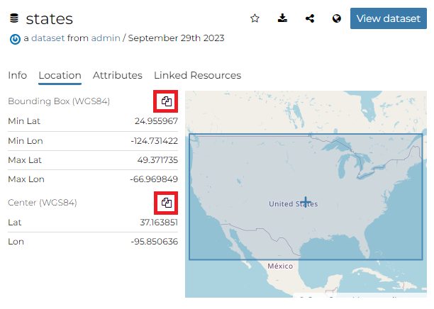

::: {#dataset-info}
Dataset Information
=================
:::

From the *Dataset Search Page* (see `finding-data`{.interpreted-text role="ref"}) you can select the dataset you are interested in and click on its name to see an overview about it.

{.align-center}

The information panel reports:

-   The *Info* tab is active by default. This tab section shows some dataset metadata such as its title, the abstract, date of publication etc. The metadata also indicates the dataset owner, what are the topic categories the dataset belongs to and which regions are affected.

<figure>

<figcaption><em>Dataset Info tab</em></figcaption>
</figure>

-   The *Location* tab shows the spacial extent of the dataset.

<figure>

<figcaption><em>Dataset Location tab</em></figcaption>
</figure>

By clicking on the copy icons you have a copy of the current *Bounding Box* or the *Center* in the clipboard which once pasted will be a WKT text.

<figure>

<figcaption><em>Bounding Box and Center</em></figcaption>
</figure>

-   The *Attributes* tab shows the data structure behind the dataset. All the attributes are listed and for each of them some statistics (e.g. the range of values) are estimated (if possible).

<figure>

<figcaption><em>Dataset Attributes tab</em></figcaption>
</figure>

-   The *Linked Resources* tab shows the resources, that can be *Documents*, *Maps*, *GeoStories* and *Dashboards*, linked to the dataset.

<figure>

<figcaption><em>Dataset Linked Resources tab</em></figcaption>
</figure>

::: note
::: title
Note
:::

When a resource is [linked from]{.title-ref} the dataset the link is shown under the *Linked by* list while when a resource is [linked to]{.title-ref} the dataset the link is shown under the *Used by* list
:::

From the right toolbar on the **Info** panel it is possible:

<figure>

<figcaption><em>Dataset Info toolbar</em></figcaption>
</figure>

-   Add dataset in your *Favorites* (see `editing-profile`{.interpreted-text role="ref"}), clicking on star icon.
-   Directly *Download* the dataset oh [ShapeFile]{.title-ref} format
-   *Share* the dataset url
-   Copy the *WMS Capabilities url*
-   Change the dataset *Title* by clicking on it

You can access the dataset details page by clicking on *View dataset* in the overview panel.
That page looks like the one shown in the picture below.

<figure>

<figcaption><em>Dataset page</em></figcaption>
</figure>
