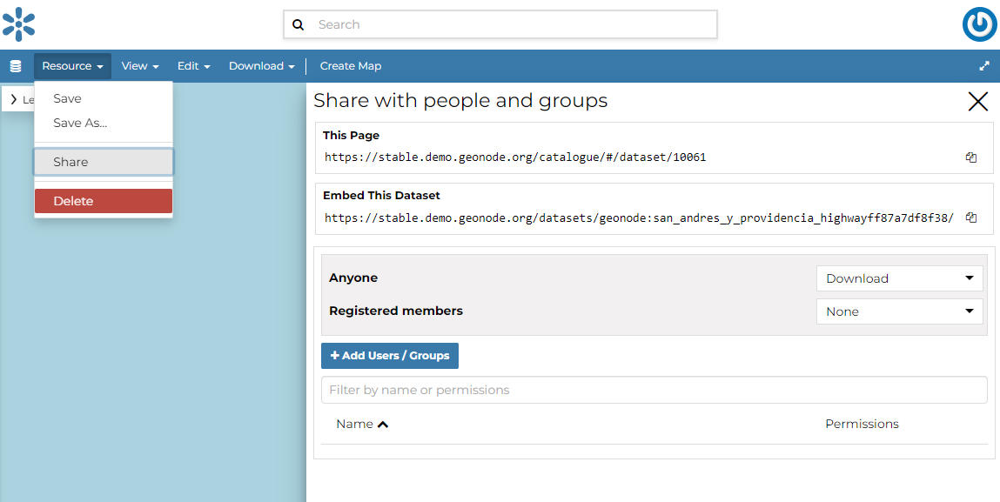

# Share Options {#dataset-permissions}

In order to modify the Dataset *Share options* settings, on the detail page of the dataset click the `Share`{.interpreted-text role="guilabel"} link in the `Resource`{.interpreted-text role="guilabel"} menu. By default only owners can edit and manage datasets, anyone can view them.

<figure>

<figcaption><em>Change Dataset Share options</em></figcaption>
</figure>

Through the *Share options Settings Panel* you can add or remove options for users and groups. The picture below shows an example.

<figure>

<figcaption><em>Dataset Share options settings for users and groups</em></figcaption>
</figure>

You can set the following share options:

-   *View* (allows to view the dataset).
-   *Download* (allows to view and download the dataset).
-   *Edit* (allows to change the dataset metadata,change attributes and properties of the datasets features and change the dataset style).
-   *Manage* (allows to update, delete, change share options, publish and unpublish the dataset).

::: warning
::: title
Warning
:::

When assigning options to a group, all the group members will have those options. Be careful in case of editing them.
:::

Click on `Save`{.interpreted-text role="guilabel"} link in the menu to save these settings.
