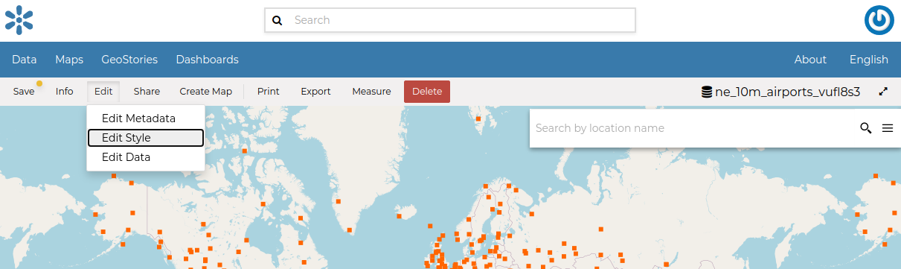
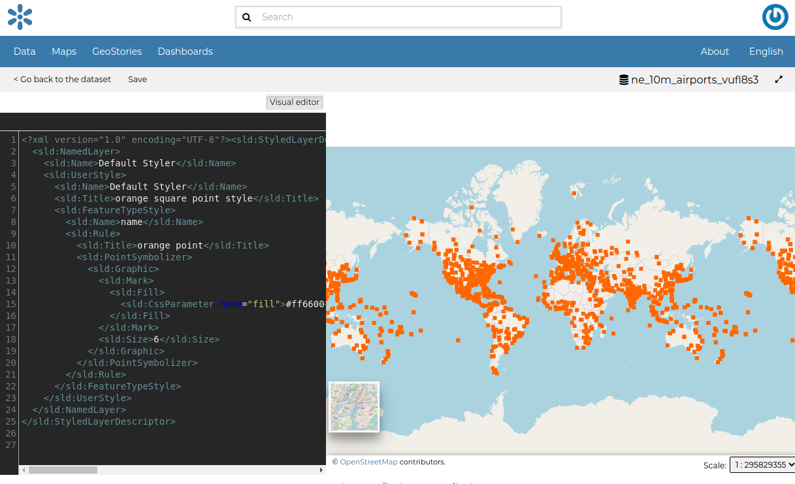
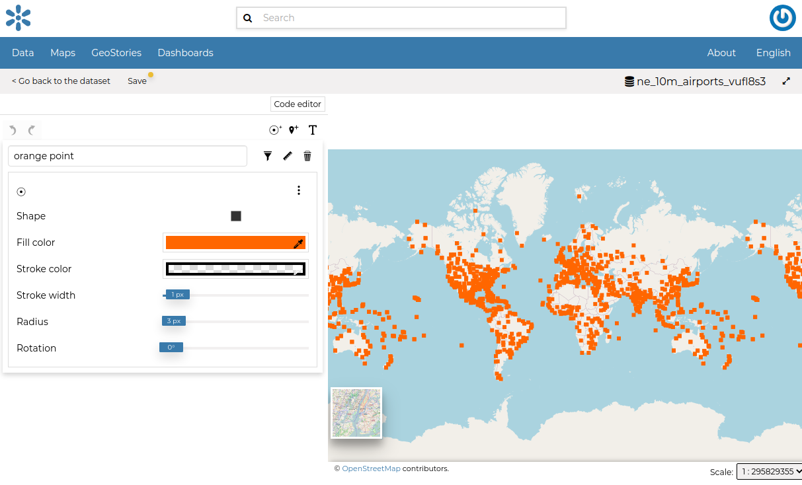
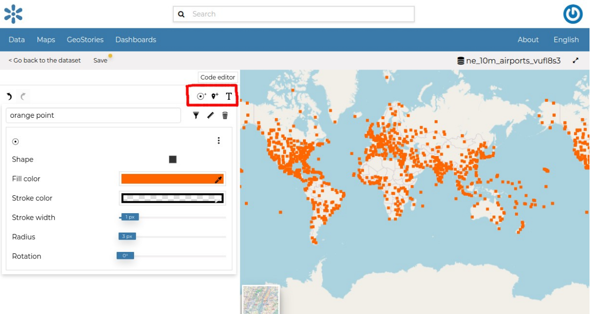
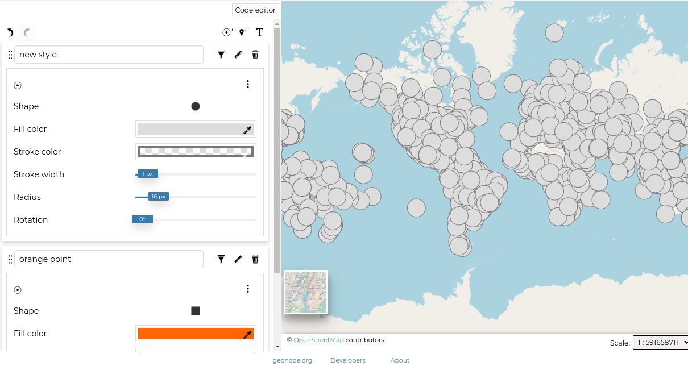
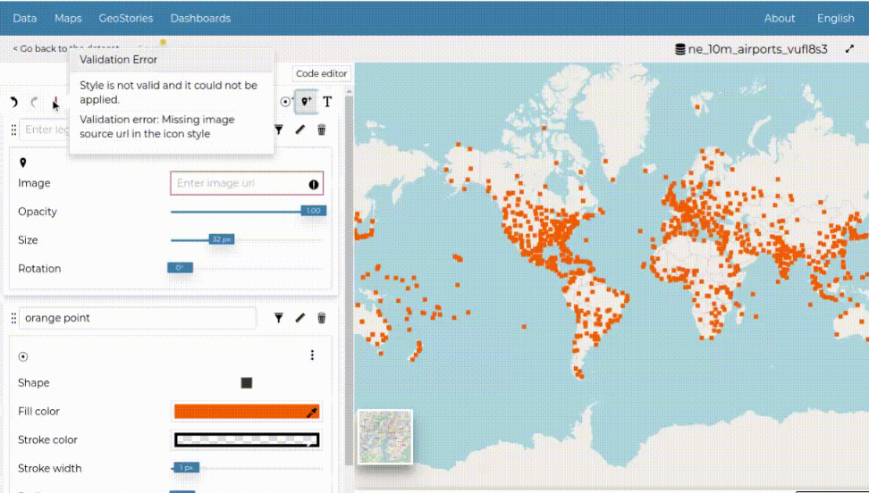

::: {#dataset-style}
Dataset Styling
=============
:::

Maps are helpful because they allow you gain a deeper understanding of your data by allowing you to visualize it in many different ways.
So you can tell different stories depending on how the data is presented.
For any given data or dataset, you should explore different styling options and choose the best style for that.

In GeoNode each dataset has one style refered to as a *Default Style* which is determined by the nature of the data you\'re mapping. When uploading a new dataset (see `uploading-datasets`{.interpreted-text role="ref"}) a new default style will be associated to it.

Editing the Dataset Style
\-\-\-\-\-\-\-\-\-\-\-\-\-\-\-\-\-\-\-\-\-\--

In order to edit a dataset style, open the *Dataset Page* (see `dataset-info`{.interpreted-text role="ref"}) and click on `Edit`{.interpreted-text role="guilabel"}. Then click the `Edit Style`{.interpreted-text role="guilabel"} link in the *options* (see the picture below).

<figure>

<figcaption><em>Edit Styles button</em></figcaption>
</figure>

The *Dataset* will open in a new *Map*. The *Styles Panel* will show you all the default style for the dataset and some useful tools. By default, the style will be showm in a text editor form.

<figure>

<figcaption><em>The Styles Panel in the Map</em></figcaption>
</figure>

You could continue to change the style with the text editor or switch to a visualized editor using the `Visual editor`{.interpreted-text role="guilabel"} above the text editor.

The visual editor looks like this

<figure>

<figcaption><em>Visual Styles Panel in the Map</em></figcaption>
</figure>

You can then edit the style by clicking on each attribute of the style.

Creating Style Rules
\-\-\-\-\-\-\-\-\-\-\-\-\-\-\-\-\-\--

In order to create a new rule, Three options are provided.

1.  Mark rule
2.  Icon rule
3.  text rule

Click on any of the buttons below to create a type of style you want.

> <figure>
> 
> <figcaption><em>Create new rule buttons</em></figcaption>
> </figure>

The rule you have chosen is now added on the top with default attributes which you can edit to your preference\*.

<figure>

<figcaption><em>New style</em></figcaption>
</figure>

If the rule has errors, the following will be shown.

<figure>

<figcaption><em>Rule Error</em></figcaption>
</figure>

You can switch the rule ordering by dragging it to the top or bottom depending on your preference.

It would be nice to change the style in order to decrease the opacity of the filling color as well as to reduce the lines width.
The embedded [MapStore](https://mapstore2.geo-solutions.it/mapstore/#/) makes available a powerful *Style Editor* to accomplish that tasks. In the next paragraph we will explain how.

Each rule has a delete icon on the top right which you can use to remove the rule on the style.

Click on `Save`{.interpreted-text role="guilabel"} on the top to save your changes.
