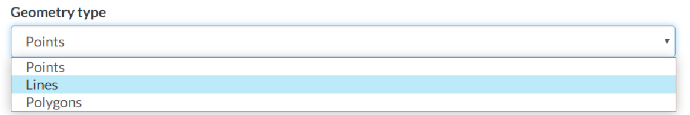

Creating a Dataset from scratch
=============================

An interesting tool that GeoNode makes available to you is the *Create dataset*. It allows you to create a new vector dataset from scratch. The *Dataset Creation Form* is reachable through the `Create dataset`{.interpreted-text role="guilabel"} link shown in the picture below.

<figure>

<figcaption><em>Create dataset link</em></figcaption>
</figure>

In order to create the new Dataset you have to fill out the required fields:

-   *Name*

-   *Title*

-   *Geometry type*

    <figure>
    
    <figcaption><em>Geometry types</em></figcaption>
    </figure>

Usually the datasets features should have some *Attributes* that enrich the amount of information associated with each of them. Through the `Add Attribute`{.interpreted-text role="guilabel"} button you can add new attributes.

<figure>

<figcaption><em>New Dataset creation from scratch</em></figcaption>
</figure>

Once the form has been filled out, click on `Create`{.interpreted-text role="guilabel"}. You will be redirected to the *Dataset Page* (see `dataset-info`{.interpreted-text role="ref"}). Now your Dataset is created but is still empty, no features have been added yet. See the `dataset-editing`{.interpreted-text role="ref"} section to learn how to add new features.
