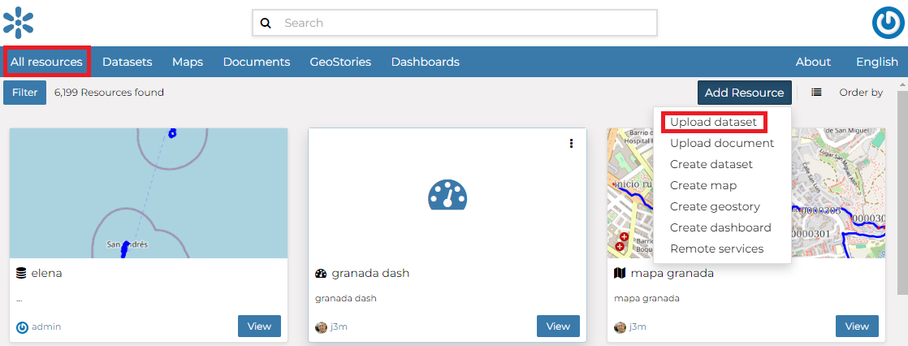
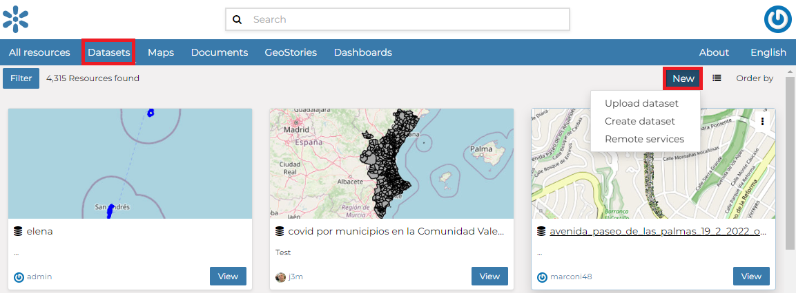
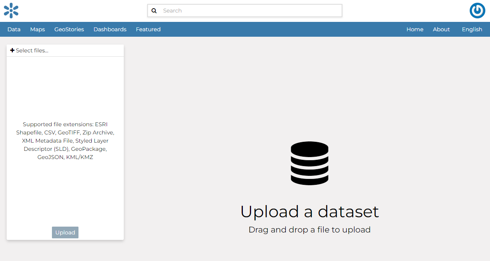
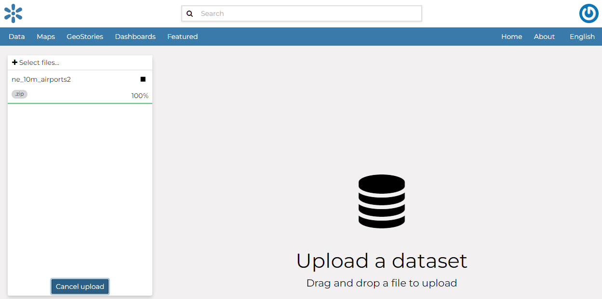
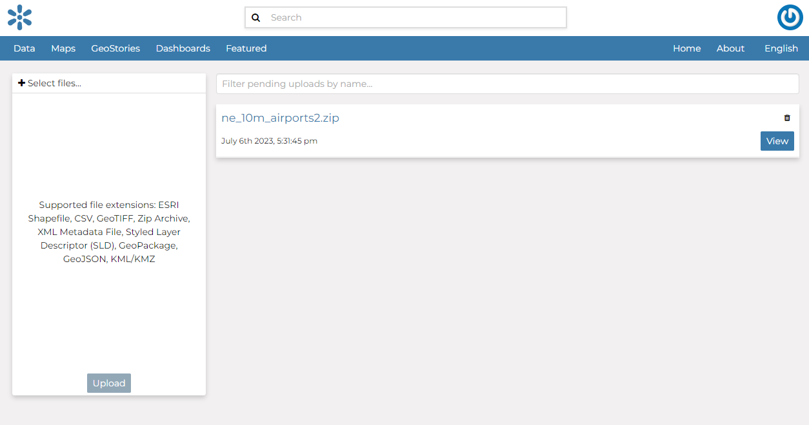

::: {#uploading-datasets}
Datasets Uploading
================
:::

| The most important resource type in GeoNode is the *Dataset*. A dataset represents spatial information so it can be displayed inside a map.
| To better understand what we are talking about lets upload your first dataset.

It is possible to upload a *Datasets* in two ways:

-   From the `All Resources`{.interpreted-text role="guilabel"} page, by clicking *Add Resource* which displays a list including [Upload dataset]{.title-ref} link:

    <figure>
    
    <figcaption><em>Dataset Upload from All Resources page</em></figcaption>
    </figure>

-   From the `Datasets`{.interpreted-text role="guilabel"} page, by clicking on *New* which displays a list including [Upload dataset]{.title-ref} link:

<figure>

<figcaption><em>Dataset Upload from Datasets page</em></figcaption>
</figure>

The *Datasets Uploading* page looks like the one in the picture below.

<figure>

<figcaption><em>The Datasets Uploading page</em></figcaption>
</figure>

| Through the `Select files`{.interpreted-text role="guilabel"} button you can select files from your disk, make sure they are valid raster or vector spatial data, then you can click to `Upload`{.interpreted-text role="guilabel"} button.

A progress bar shows the operation made during the dataset upload and alerts you when the process is over.

<figure>

<figcaption><em>Upload dataset</em></figcaption>
</figure>

In this example the `ne_10m_airports2` ESRI Shapefile, with all its mandatory files ([.shp]{.title-ref}, [.shx]{.title-ref}, [.dbf]{.title-ref} and [.prj]{.title-ref}), has been chosen.
When the process ends click on `View`{.interpreted-text role="guilabel"} button

<figure>

<figcaption><em>Dataset uploading finished</em></figcaption>
</figure>

::: note
::: title
Note
:::

There are lot of free spatial dataset available in the Internet. In this example, an extract of the Berlin city center roads map from the [BBBike extracts OpenStreetMap](https://extract.bbbike.org) dataset has been used.
:::

In the next paragraphs you will learn how to create a dataset from scratch, how to set share options, how to explore the dataset properties and how to edit them.

::: note
::: title
Note
:::

If you get the following error message:

`Total upload size exceeds 100.0 MB. Please try again with smaller files.`

This means that there is an upload size limit of 100 MB. An user with administrative access can change the upload size limits at the [admin panel for size limits](../../admin/upload-size-limits/index.html#upload-size-limits).

Similarly, for the following error message:

`The number of active parallel uploads exceeds 5. Wait for the pending ones to finish.`

You can modify the upload parallelism limits at the [admin panel for parallelism limits](../../admin/upload-parallelism-limit/index.html#upload-parallelism-limits).
:::
