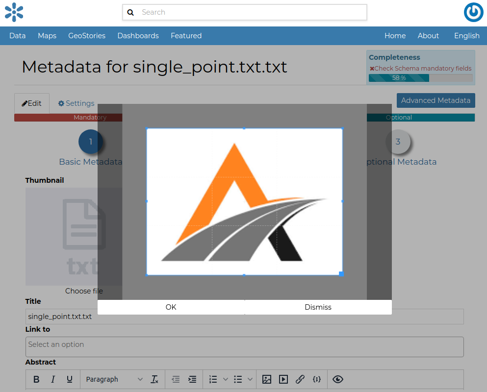
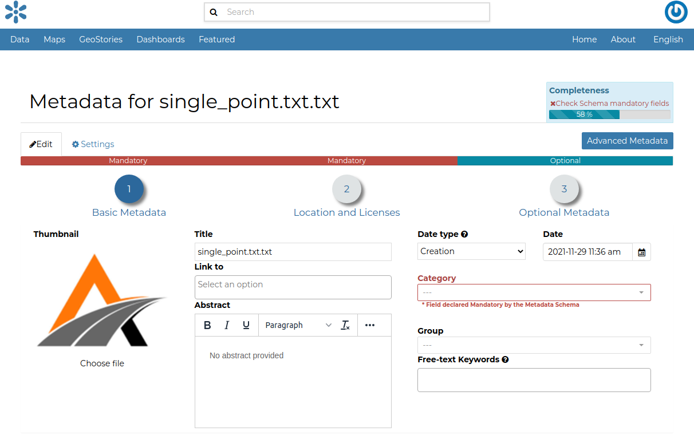
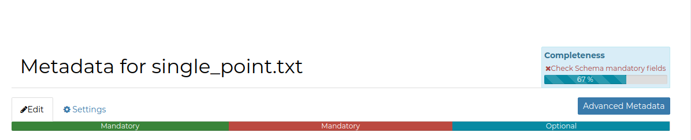
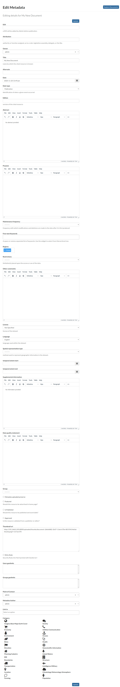
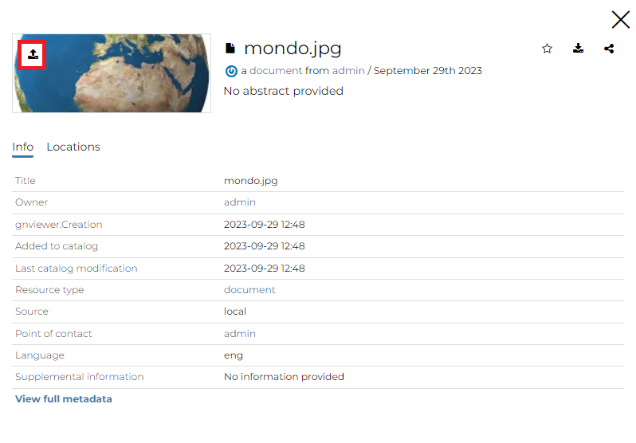
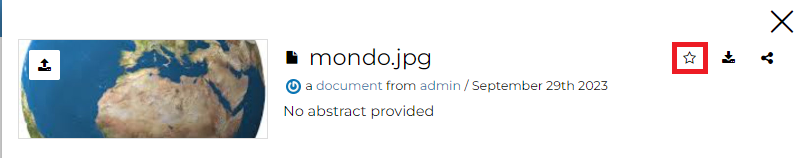
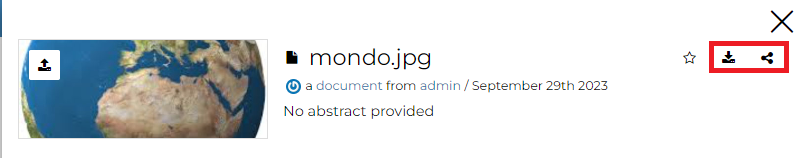
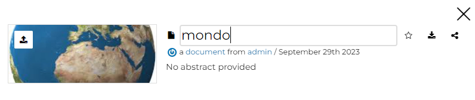
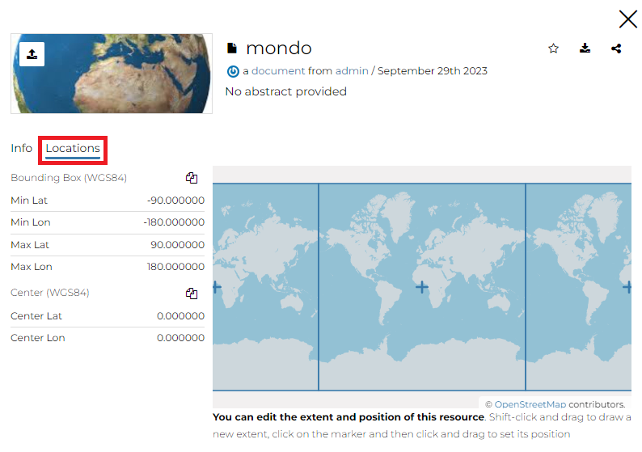
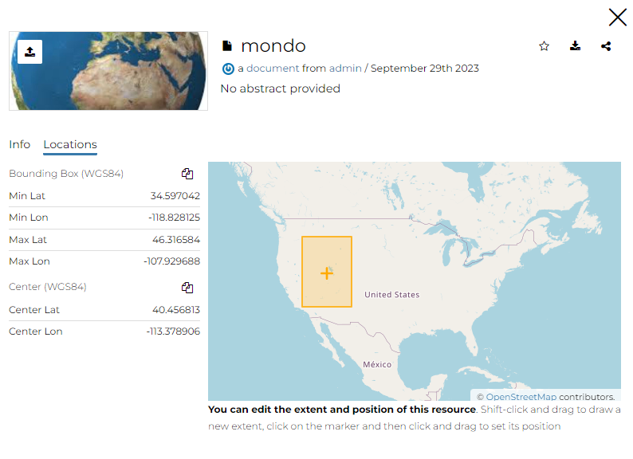

# Document Editing

The `document-info`{.interpreted-text role="ref"} page makes available useful menu for document editing. Click on the `Edit`{.interpreted-text role="guilabel"} link then `Edit Metadata`{.interpreted-text role="guilabel"} to see editing forms.

## Setting the Document Thumbnail

From the *Metadata Form*, it is possible to *Set the Thumbnail* of the document. Click on `Choose file`{.interpreted-text role="guilabel"} to open the *Thumbnail Uploading* page and chose the image that will illustrate your document. Once this is done, click on the ok button and save. If the thumbnail has been successfully uploaded you can see it by coming back to the document list.

<figure>

<figcaption><em>Upload Document's Thumbnail</em></figcaption>
</figure>

If no errors occur, the new selected thumbnail will be shown.

<figure>

<figcaption><em>Uploading success</em></figcaption>
</figure>

## Editing the Document Metadata

You can edit the metadata of your document as described in the `document-metadata`{.interpreted-text role="ref"} section or by using THe *Advanced Metadata* option below.

{.align-center}

Some information are mandatory such as the *Title* or the *Category* the document belongs to, some others are optional.

<figure>

<figcaption><em>Editing Metadata</em></figcaption>
</figure>

In the example shown in the picture above, the information inside the red rectangles have been changed. To save the changes click on `Update`{.interpreted-text role="guilabel"}, you will be redirected to the document page.

## Editing the Document Info

You can edit the information of your document by clicking on the `Info`{.interpreted-text role="guilabel"} button.

From the Info panel, it is possible to upload the **Thumbnail** of the document.

<figure>

<figcaption><em>Upload Thumbnail</em></figcaption>
</figure>

If you want this document in your **Favorites** (see `editing-profile`{.interpreted-text role="ref"}), click on the start icon.

<figure>

<figcaption><em>Favorite document</em></figcaption>
</figure>

You can directly **Download** the document and **Share** the document url by clicking the buttons on the top-right of the panel.

<figure>

<figcaption><em>Share and Download document</em></figcaption>
</figure>

By clicking the document **Title**, you can change it.

<figure>

<figcaption><em>Document Title</em></figcaption>
</figure>

From the `Locations`{.interpreted-text role="guilabel"} tab, you can manage the spacial extent of the document.

<figure>

<figcaption><em>Document Title</em></figcaption>
</figure>

Here numerical fields and a map show the spatial extent (WGS 84) for the document and you can edit it by Shift+click and drag to draw the new extent on the map and change its location by clicking the marker and drag.

<figure>

<figcaption><em>Document Title</em></figcaption>
</figure>

::: note
::: title
Note
:::

The *Location* tab is also available for `dashboard`{.interpreted-text role="ref"} and `geostory`{.interpreted-text role="ref"}
:::
