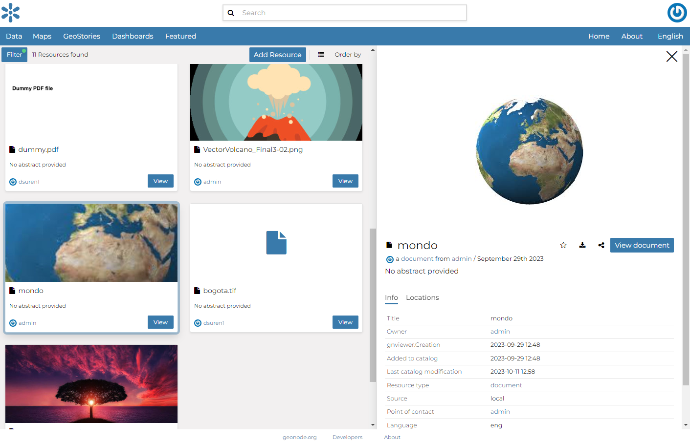
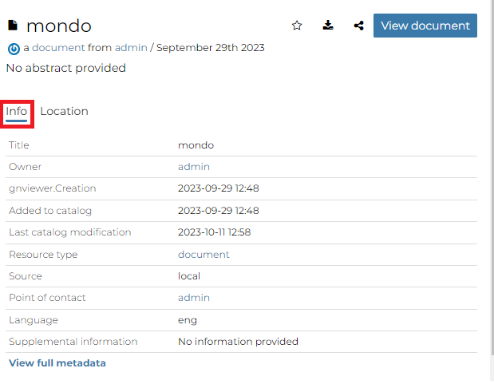
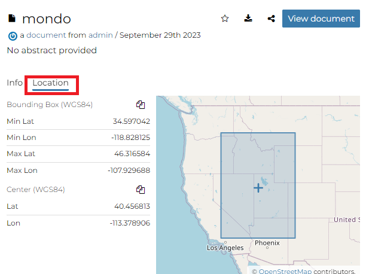
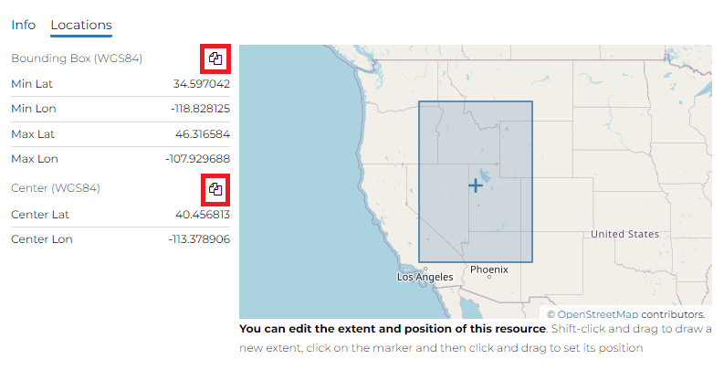
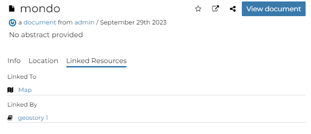
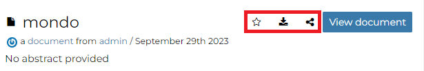
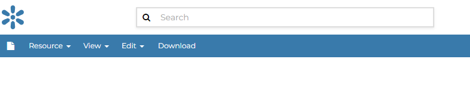
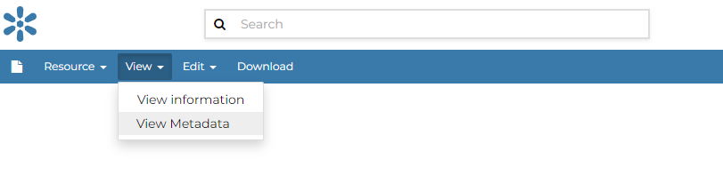
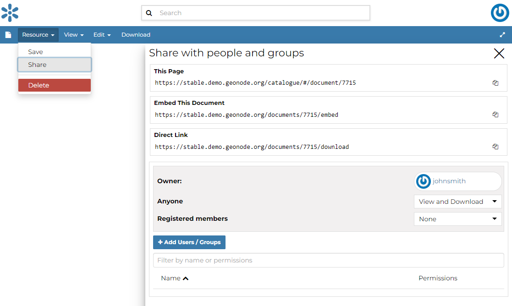
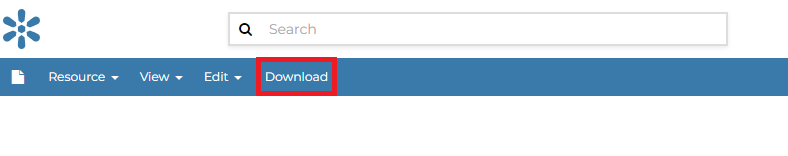

# Document Information {#document-info}

From the *Documents Search Page* (see `finding-data`{.interpreted-text role="ref"}) you can select the document you are interested in and click on its name to see an overview about it.

{.align-center}

The information panel reports:

-   The **Info** tab is active by default. This tab section shows some document metadata such as its title, the abstract, date of publication etc. The metadata also indicates the document owner, what are the topic categories the document belongs to and which regions are affected.

<figure>

<figcaption><em>Document Information tab</em></figcaption>
</figure>

-   The **Location** tab shows the spacial extent of the document.

<figure>

<figcaption><em>Document Location tab</em></figcaption>
</figure>

By clicking on the copy icons you have a copy of the current *Bounding Box* or the *Center* in the clipboard which once pasted will be a WKT text.

<figure>

<figcaption><em>Bounding Box and Center</em></figcaption>
</figure>

::: warning
::: title
Warning
:::

From the `document-info`{.interpreted-text role="ref"} the *Location* tab is in read only mode, to edit it see the `document-editing`{.interpreted-text role="ref"}
:::

-   The *Linked Resources* tab shows the resources, that can be *Datasets*, *Maps*, *GeoStories* and *Dashboards*, linked to the document.

<figure>

<figcaption><em>Document Linked Resources tab</em></figcaption>
</figure>

::: note
::: title
Note
:::

When a resource is [linked from]{.title-ref} the document the link is under the *Linked by* list while when a resource is [linked to]{.title-ref} the document the link is under the *Used by* list
:::

::: warning
::: title
Warning
:::

From the `document_metadata`{.interpreted-text role="ref"} it is possible edit the document *Linked Resources*
:::

From the right toolbar on the **Info** panel it is possible:

<figure>

<figcaption><em>Document Info toolbar</em></figcaption>
</figure>

-   Add document in your *Favorites* (see `editing-profile`{.interpreted-text role="ref"}), clicking on star icon.
-   Directly *Download* the document oh [ShapeFile]{.title-ref} format
-   *Share* the document url
-   Change the document *Title* by clicking on it

You can access the document details page by clicking on *View document* in the overview panel.
That page looks like the one shown in the picture below.

<figure>

<figcaption><em>Document page</em></figcaption>
</figure>

On the page of a document, the resource is either directly displayed on the page or accessible by clicking on the link provided under the title.

Exploring the Document detail menu Sections
\-\-\-\-\-\-\-\-\-\-\-\-\-\-\-\-\-\-\-\-\-\-\-\-\-\--

As soon as a document is opened, the **Info** panel is shown. It reports the document metadata such as its title, abstract, date of publication etc. The metadata also indicates the user who is responsible for uploading and managing this content, as well as the group to which it is linked.

{.align-center}

> *Document Info*

Selecting *View Metadata* from the `View`{.interpreted-text role="guilabel"} button it is possible to visualize the metadata of the document

<figure>

<figcaption><em>Document Metadata</em></figcaption>
</figure>

Under the `Resource`{.interpreted-text role="guilabel"} button, it is possible to select the *Share* option to provides the document link to share.

<figure>

<figcaption><em>Document Sharing</em></figcaption>
</figure>

If you want to download the document, click on the `Download`{.interpreted-text role="guilabel"} button and the document will be downloaded automatically.

<figure>

<figcaption><em>Document Metadata download</em></figcaption>
</figure>
