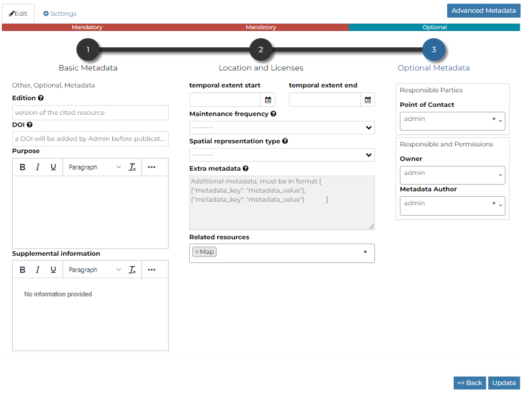

# Filling the Document Metadata {#document-metadata}

You can open the Metadata form by clicking on the *Edit* link in the document details menu and then *Edit Metatadata* Link.

> <figure>
> 
> <figcaption><em>Edit Metadata Link</em></figcaption>
> </figure>

Metadata contains all the information related to the document: they are its ID card. They provide essential information for its identification and its comprehension. Metadata also make the document more easily retrievable through search by other users.

Editing a document\'s metadata is done in three steps (*Basic Metadata*, *Location and Licenses*, *Optional Metadata*). The first two steps are mandatory (no documents will be published if the required information are not provided) whereas the last one is optional.

1.  On the **Basic Metadata** page, the essential information that has to be filled is:

> -   *Title* of the document, which should be clear and understandable;
> -   *Abstract* of the document;
> -   *Creation/Publication/Revision* dates which define the time period that is covered by the document;
> -   *Keywords*, which should be chosen within the available list. The contributor search for available keywords by clicking on the searching bar, or on the folder logo representing, or by entering the first letters of the desired word. Key-words should be relevant to the imported document;
> -   *Category* in which the document belongs;
> -   *Group* to which the document is linked.
>
> <figure>
> 
> <figcaption><em>Document Basic Metadata</em></figcaption>
> </figure>
>
> Once all the fields are filled, click on the blue button `Next >>`{.interpreted-text role="guilabel"} in the bottom right corner of the page.

2.  On the **Location and Licenses** page, the following information should be filled:

> -   *Language* of the document;
> -   *Regions*, which informs on the spatial extent covered by the document. Proposed extents cover the following scales: global, continental, regional, national;
> -   *Data Quality statement* (general explanation of the data producer\'s knowledge about the lineage of a dataset);
> -   Potential *Restrictions* to sharing the document should be provided in the Restrictions box.
>
> <figure>
> 
> <figcaption><em>Document Location and Licenses</em></figcaption>
> </figure>
>
> Click on the blue button `Next >>`{.interpreted-text role="guilabel"} to go ahead to the next step.

3.  On the **Optional Metadata** page, complementary information can be added:

> -   *Edition* to indicate the reference or the source of the document;
> -   *Purpose* of the document and its objectives;
> -   *Supplemental information* that can provide a better understanding of the uploaded document;
> -   *Maintenance frequency* of the document;
> -   *Spatial representation type* used.
> -   *Related resources* to link one or multiple resources to the document. These will be visible inside the `document-info`{.interpreted-text role="ref"} panel
>
> *Responsible Parties*, *Owner* and *Share options* are listed on the right side of the page, you can edit them.
>
> <figure>
> 
> <figcaption><em>Document Optional Metadata</em></figcaption>
> </figure>
>
> | If all the mandatory information is filled out the document can be published, if not the `Completeness` progress bar warns you that something is missing.
> | Click on the blue button `Update`{.interpreted-text role="guilabel"} to save information on the system.
