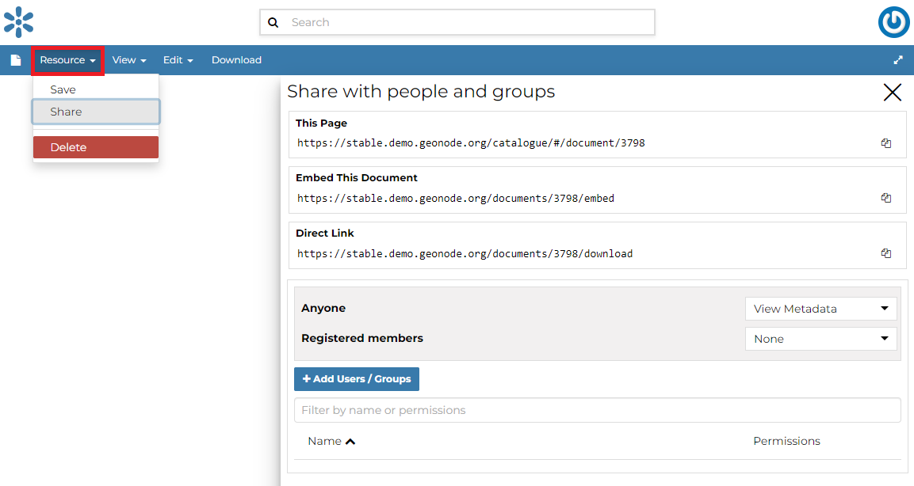
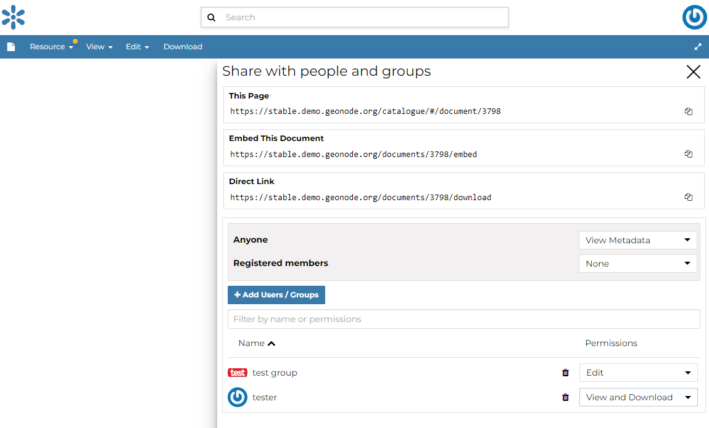

# Share Options {#edit-document-permissions}

GeoNode encourages to publicly, share and make available for download information uploaded on the platform. By default, anyone can see and download a document. However, the document responsible can choose to limit access to the document to some contributors and/or groups.

Through the *Share* Link shown in the menu it is possible to manage the document share options. it opens a form where set up who can:

-   None (the document is not visible).
-   View Metadata (allows to view the document).
-   View and Download (allows to view and download the document).
-   Edit (allows to change the document metadata and attributes).
-   Manage it (allows to update, delete, change share options, publish/unpublish).

{.align-center}

See an example in the picture below.

::: note
::: title
Note
:::

After making changes, always save them with the *Save* Link in the menu
:::

<figure>

<figcaption><em>Changing the Document share options</em></figcaption>
</figure>

Usually those with options of editing metadata and the management of a document are in charge and responsible of the document, i.e. the contributor who uploaded it has those options by default.

Once the share options are set, click `Save`{.interpreted-text role="guilabel"} link in the menu to save them.
