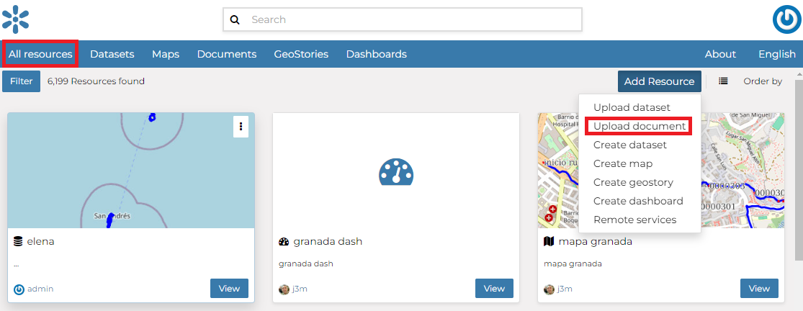
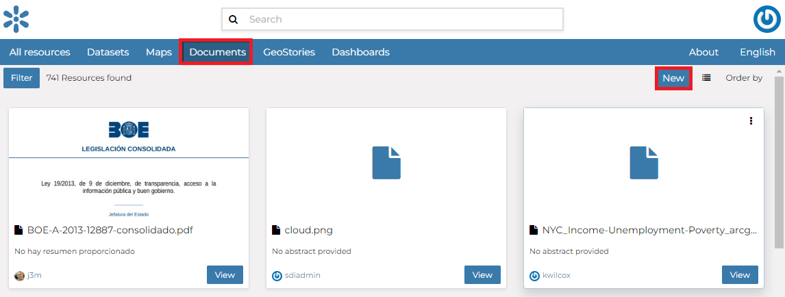
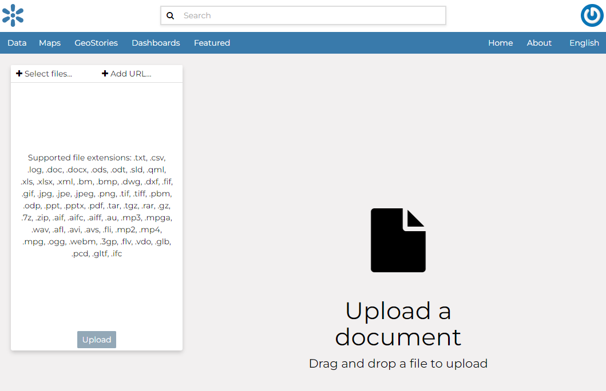
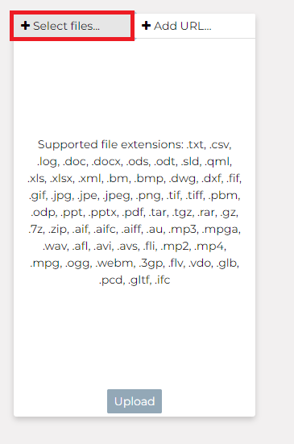
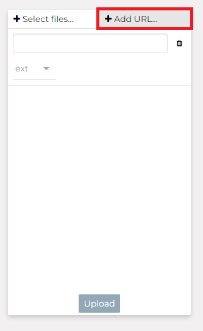

::: {#uploading-documents}
Upload/Add Documents
===================
:::

GeoNode allows to share reports, conceptual notes, posters, spreadsheets, etc. A wide range of documents files can be hosted on the platform, including text files (.doc, .docx, .txt, .odt), spreadsheets (.xls, .xlsx, .ods), presentations (.ppt, .pptx, .odp), images (.gif, .jpg, .png, .tif, .tiff), PDF, zip files (.rar, .zip, .gz), SLD, XML, QML files or as External URL.

::: warning
::: title
Warning
:::

Only authenticated users can upload data into GeoNode.
:::

It is possible to upload a *Documents* in two ways:

-   From the `All Resources`{.interpreted-text role="guilabel"} page, by clicking *Add Resource* which displays a list including [Upload document]{.title-ref} link:

    <figure>
    
    <figcaption><em>Document Upload from All Resources page</em></figcaption>
    </figure>

-   From the `Documents`{.interpreted-text role="guilabel"} page, by clicking on *New* button.

<figure>

<figcaption><em>Document Upload from Documents page</em></figcaption>
</figure>

The *Document Upload* page looks like the one shown in the picture below.

> <figure>
> 
> <figcaption><em>Document Upload page</em></figcaption>
> </figure>

On *GeoNode* documents can be:

-   Upload from the **Local file**
-   Created with reference to **External URL**

In order to upload a document from the **Local file**, you need to:

1.  Click on `Select files`{.interpreted-text role="guilabel"} button
2.  Select a file from your disk.
3.  Click the `Upload`{.interpreted-text role="guilabel"} button

> <figure>
> 
> <figcaption><em>Upload document from the select files option</em></figcaption>
> </figure>

| A document may refer to a remote document, without making a local copy of the remote resource.
| To add a document that references an **External URL** you need to:

1.  Click on `Add URL`{.interpreted-text role="guilabel"} button
2.  Select an URL
3.  Select an extension from the drop-down menu
4.  Click the `Upload`{.interpreted-text role="guilabel"} button

> <figure>
> 
> <figcaption><em>Add document from the add URL option</em></figcaption>
> </figure>

At the end of the uploading process, by clicking on the View button, you will be driven to the document page with the Info panel open. Here it is possible to view more info, edit metadata, share, download, and delete the document. See the next section to know more about Metatadata.

::: note
::: title
Note
:::

If you get the following error message:

`Total upload size exceeds 100.0 MB. Please try again with smaller files.`

This means that there is an upload size limit of 100 MB. An user with administrative access can change the upload limits at the [admin panel](../../admin/upload-size-limits/index.html#upload-size-limits).
:::
