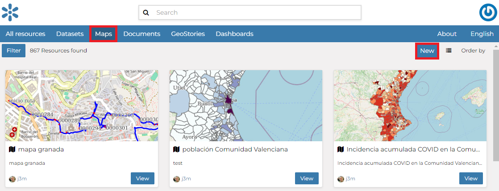

# Creating Maps {#creating-map}

In this section, we'll create a *Map* using some uploaded datasets, combine them with some other datasets from remote web services, and then share the resulting map for public viewing.

In order to create new maps you can use:

-   The `Create map`{.interpreted-text role="guilabel"} listed after clicking the `Add Resource`{.interpreted-text role="guilabel"} button on the *All Resources* list page.

    <figure>
    
    <figcaption><em>The Create Map from All Resources page</em></figcaption>
    </figure>

-   The `New`{.interpreted-text role="guilabel"} button after clicking the `Maps`{.interpreted-text role="guilabel"} button on the menu bar.

    <figure>
    
    <figcaption><em>The Create Map from Maps page</em></figcaption>
    </figure>

-   The `Create map`{.interpreted-text role="guilabel"} link in the *Dataset Page* (it creates a map using a specific dataset)

    <figure>
    
    <figcaption><em>The Create map from dataset</em></figcaption>
    </figure>

The new *Map* will open in a *Map Viewer* like the one in the picture below.

<figure>

<figcaption><em>The Map Viewer</em></figcaption>
</figure>

Using the `Add dataset`{.interpreted-text role="guilabel"} link, you can add a layer by clicking on one of the layers listed in the catalog.
In the upper left corner the *TOC button* button opens the `toc`{.interpreted-text role="ref"} of the *Map*. It allows to manage all the datasets associated with the map and to add new ones from the `Add dataset`{.interpreted-text role="guilabel"}.
The *TOC* component makes possible to manage datasets overlap on the map by shifting their relative positions in the list (drag and drop them up or down in the list).
It also allows to hide/show datasets ( {.align-middle width="30px" height="30px"} and {.align-middle width="30px" height="30px"} ), to zoom to datasets extents ( {.align-middle width="30px" height="30px"} ) and to manage their properties ( {.align-middle width="30px" height="30px"} ).
Once the map datasets have been settled it is possible to save the *Map* by clicking on the `Save as`{.interpreted-text role="guilabel"} under the `Resources`{.interpreted-text role="guilabel"} link in the map toolbar.

If you followed the steps above, you have just created your first *Map*.
Now you should see it in the *Explore Maps* page, see `map-info`{.interpreted-text role="ref"} for further details.

We will take a closer look at the *Map Viewer* tools in the `exploring-maps`{.interpreted-text role="ref"} section.
