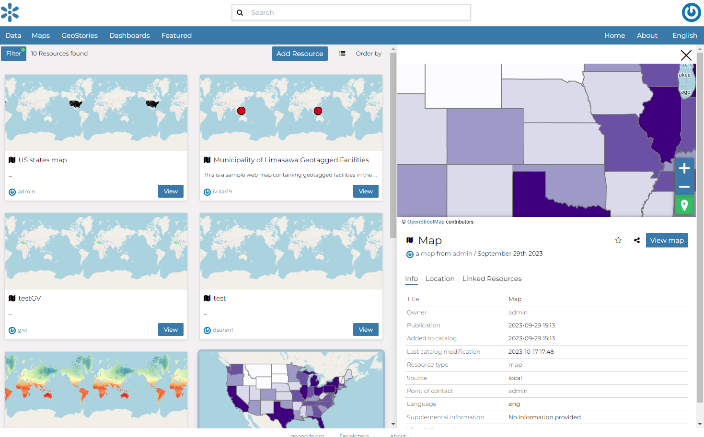
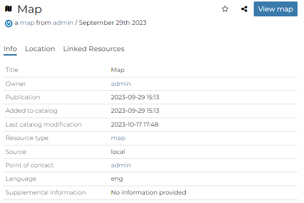
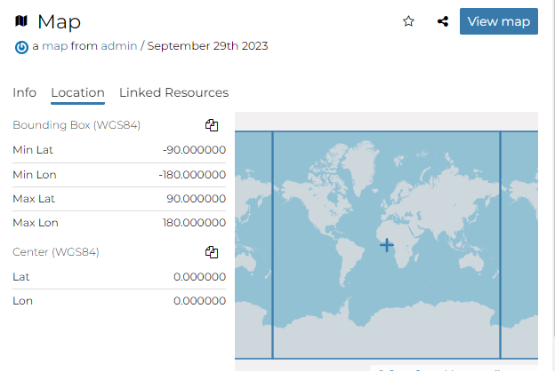
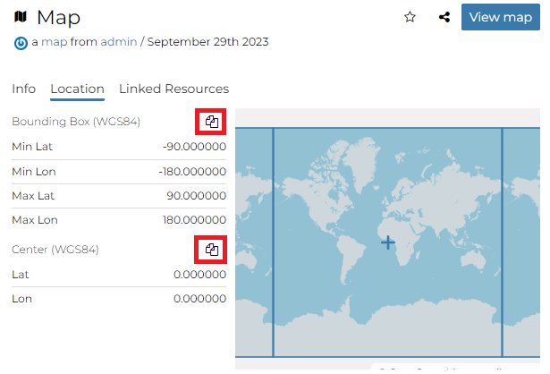
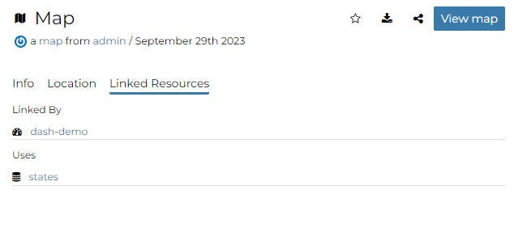
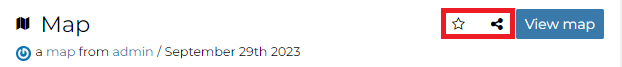
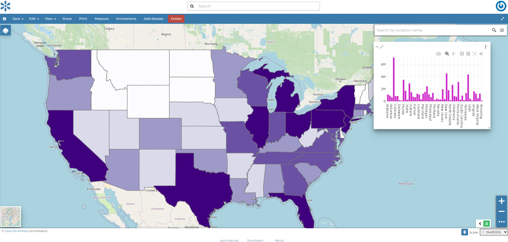

# Map Information {#map-info}

From the *Map Search Page* (see `finding-data`{.interpreted-text role="ref"}) you can select the map you are interested in and click on its name to see an overview about it.

{.align-center}

The information panel reports:

-   The *Info* tab is active by default. This tab section shows some map metadata such as its title, the abstract, date of publication etc. The metadata also indicates the map owner, what are the topic categories the map belongs to and which regions are affected.

<figure>

<figcaption><em>Map Info tab</em></figcaption>
</figure>

-   The *Location* tab shows the spacial extent of the map.

<figure>

<figcaption><em>Map Location tab</em></figcaption>
</figure>

By clicking on the copy icons you have a copy of the current *Bounding Box* or the *Center* in the clipboard which once pasted will be a WKT text.

<figure>

<figcaption><em>Bounding Box and Center</em></figcaption>
</figure>

-   The *Linked Resources* tab shows resources, that can be *Documents*, *Datasets*, *GeoStories* and *Dashboards*, linked to the map.

<figure>

<figcaption><em>Map Linked Resources tab</em></figcaption>
</figure>

::: note
::: title
Note
:::

When a resource is [linked from]{.title-ref} the map the link is shown under the *Linked by* list while when a resource is [linked to]{.title-ref} the map the link is shown under the *Used by* list
:::

From the right toolbar on the **Info** panel it is possible:

<figure>

<figcaption><em>Map Info toolbar</em></figcaption>
</figure>

-   Add map in your *Favorites* (see `editing-profile`{.interpreted-text role="ref"}), clicking on star icon.
-   *Share* the map url
-   Change the map *Title* by clicking on it

You can access the map details page by clicking on *View map* in the overview panel.
That page looks like the one shown in the picture below.

<figure>

<figcaption><em>Map page</em></figcaption>
</figure>

The *Map Viewer* shows the map with very basic functionalities:

-   the *Base Map Switcher* that allows you to change the base map;
-   the *Zoom in/out* tool to enlarge and decrease the view;
-   the *Zoom to max extent* tool for the zoom to fit the datasets extents;
-   the *Query Objects* tool to retrieve information about the map objects by clicking on the map;
-   the *Print* tool to print the preview.
-   the *Measure* tool to measure Distances, Areas and the Bearing of lines.
-   the *Annotations* tool to add an annotation to the map
