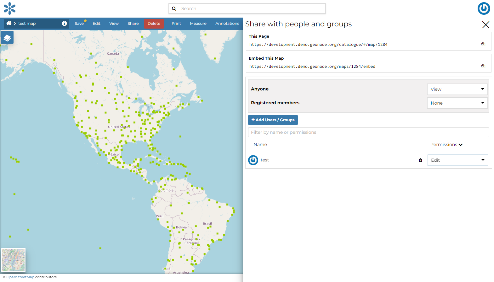

# Share Options {#map-permissions}

In GeoNode the share options management system is indeed more complex.
Administrators can choose who can do what for each map.
Users can manage only the maps they own or the maps which they are authorize to manage.

By default only owners can edit and manage maps, and anyone can view them.

In order to modify the *Map Share Options* settings you can click the `Share`{.interpreted-text role="guilabel"} link in the *Map Detail Page*.

Through the *Share Options Settings Panel* you can add or remove options for users and groups. The picture below shows an example.

<figure>

<figcaption><em>Map Share options settings for users and groups</em></figcaption>
</figure>

You can set the following options:

-   *View* (allows to view the map).
-   *Download* (allows to view and download the map).
-   *Edit* (allows to change the map\'s metadata);
-   *Manage* allows to update, delete, change share options, publish and unpublish the map.

::: warning
::: title
Warning
:::

When assigning options to a group, all the group members will have that option. Be careful in case of editing them.
:::

Click on `Save`{.interpreted-text role="guilabel"} link in the menu to save these settings.
