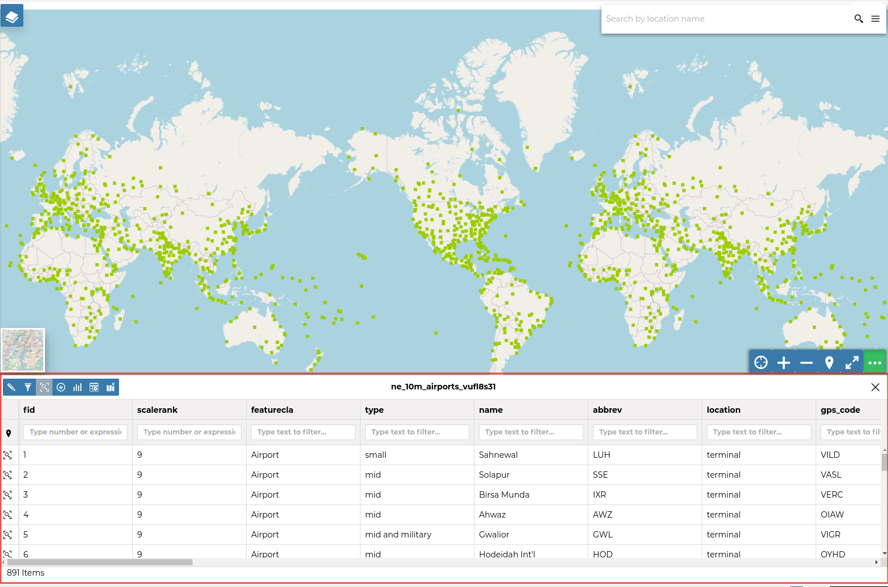
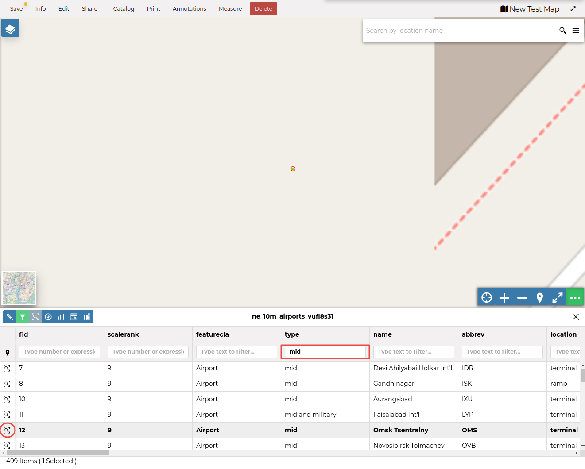
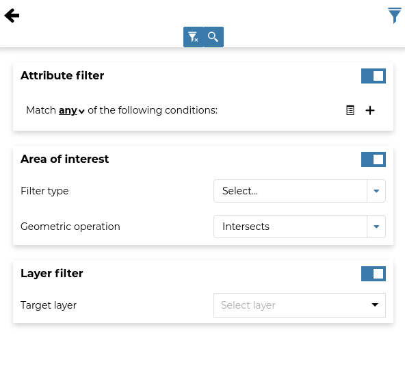
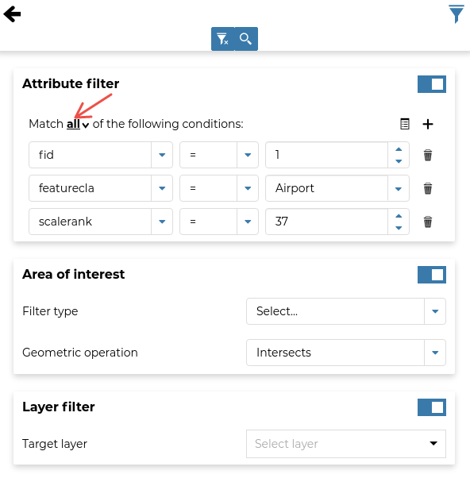
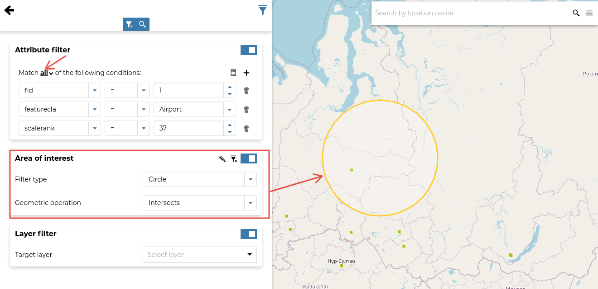
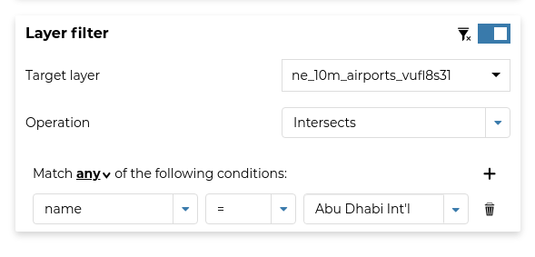

# Attributes Table

When clicking on the {.align-middle width="30px" height="30px"} button of the `toc`{.interpreted-text role="ref"}, the *Attributes Table* panel opens at the bottom of the *Map* page.

<figure>

<figcaption><em>The Attributes Table Panel</em></figcaption>
</figure>

In that panel you can navigate through the features of the dataset, zoom to their geometries by clicking on the {.align-middle width="30px" height="30px"} icon and explore their attributes.

| The *Attribute Tables* has a row for each feature belonging to the dataset and a column for each attribute that describes the feature.
| Each column has a *Filter* input field through which you can filter the features basing on some value or expression (depending on the data type of the field).

<figure>

<figcaption><em>Filtering Features by Attribute</em></figcaption>
</figure>

The *Attributes Table* panel contains a *Toolbar* which makes you available some useful functionalities.

<figure>

<figcaption><em>The Attributes Table Toolbar</em></figcaption>
</figure>

Those functionalities are:

-   | *Edit Mode*
    | By clicking on you can start an editing session. It permits you to add new features, to delete or modify the existing ones, to edit geometries. See the `dataset-data-editing`{.interpreted-text role="ref"} section for further information.

-   | *Advanced Search*
    | Click on , a new panel opens. That panel allows you to filter features in many different ways. This functionality will be explained in depth in the `advanced-search`{.interpreted-text role="ref"} section.

-   | *Zoom to page extent*
    | Click on to zoom to the page extent.

-   | *Export Data*
    | Click on to open the export/download data form.

-   | *Hide/show columns*
    | When clicking on another panel opens inside the *Attributes Table*. Through that panel you can choose what columns you want to see.

-   | *Create a chart*
    | Through the button you can open the *Chart Widgets* panel where many functionalities to describe and visualize the dataset data are available (see `creating-widgets`{.interpreted-text role="ref"}).

-   | *Sync map with filter*
    | Click on the icon to synchronize the map with the filter.

## Advanced Search

As mentioned before, GeoNode allows both an attribute based and spatial filtering.
When clicking on from the dataset *Attributes Table* the *Advanced Search* panel opens and shows you three different filtering functionalities:

<figure>

<figcaption><em>Advanced Search</em></figcaption>
</figure>

-   In the **Attribute Filter** section you can compose a series of conditions about the attributes of the dataset.
    Click on to insert a new empty condition.
    Select the attribute you are interested in, select an operator and type a comparison value.
    You can group conditions through the *Add Group* button.
    Click on to perform the search.

    <figure>
    
    <figcaption><em>Filtering by Attributes</em></figcaption>
    </figure>

    You can also decide if *All* the conditions have to be met, if only *Any* or *None* of them (see the red arrow in the picture above).

-   | The \*\* Area of interest\*\* filtering allows you to filter features that have some relationship with a spatial region that you draw on the map.
    | Select the *Filter Type* (Circle, Viewport, Polygon or Rectangle), draw the spatial region of interest on the map, select a *Geometric Operation* (Intersects, Bounding Box, Contains or Is contained) and then click on .

    <figure>
    
    <figcaption><em>Filtering by Area Of Interest</em></figcaption>
    </figure>

-   Through the **Dataset Filter** you can select only those features which comply with some conditions on other datasets of the map. You can also add conditions on attributes for those datasets.

    <figure>
    
    <figcaption><em>Dataset Filtering</em></figcaption>
    </figure>

You can read more about the *Attributes Table* and the *Advanced Search* on the [MapStore Documentation](https://docs.mapstore.geosolutionsgroup.com/en/latest/user-guide/filtering-layers/#query-panel).
