# Creating Widgets

*Widgets* are graphical elements that describe the datasets data. They can be of different types such as *Charts*, *Texts*, *Tables* and *Counters*.
Through the 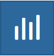{.align-middle width="30px" height="30px"} button of the `toc`{.interpreted-text role="ref"} you can open the *Widgets* panel.

<figure>
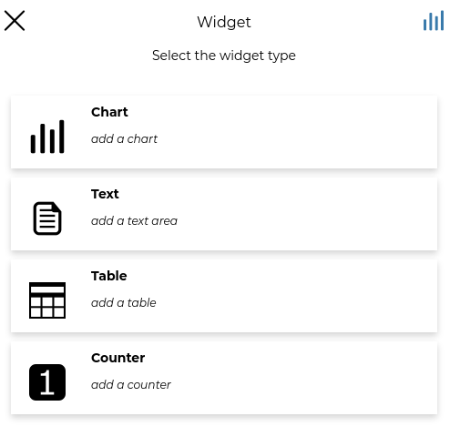
<figcaption><em>Creating Widgets</em></figcaption>
</figure>

## Chart Widgets

*Chart Widgets* are graphical representations of the dataset data. They can be *Bar Chart*, *Pie Chart* or *Line Chart* as shown in the picture below.

<figure>
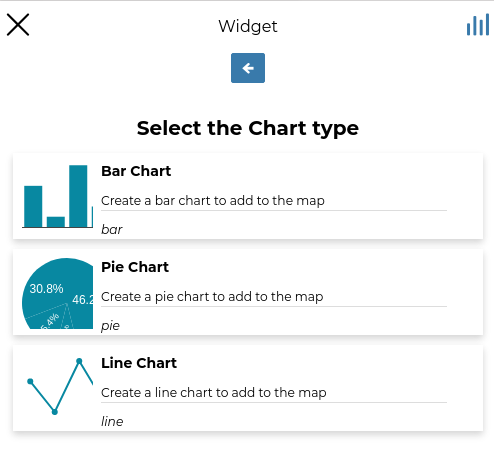
<figcaption><em>Chart Widgets</em></figcaption>
</figure>

| Lets create a new **Bar Chart**.
| Click on *Bar Chart* then select the *X Attribute*, the *Y Attribute*, the *Operation* and the *Color* do you prefer. You can also display the *Legend*, *Hide the Y axis*, *Hide the grid* and decide what *Label* display into the legend.
| Now you can filter the data to be considered for the chart by clicking on {.align-middle width="30px" height="30px"}. We don\'t need any filter so click {.align-middle width="30px" height="30px"} to configure other widget options. Insert a *Title* and a *Description* and click on *Save* {.align-middle width="30px" height="30px"}.

<figure>
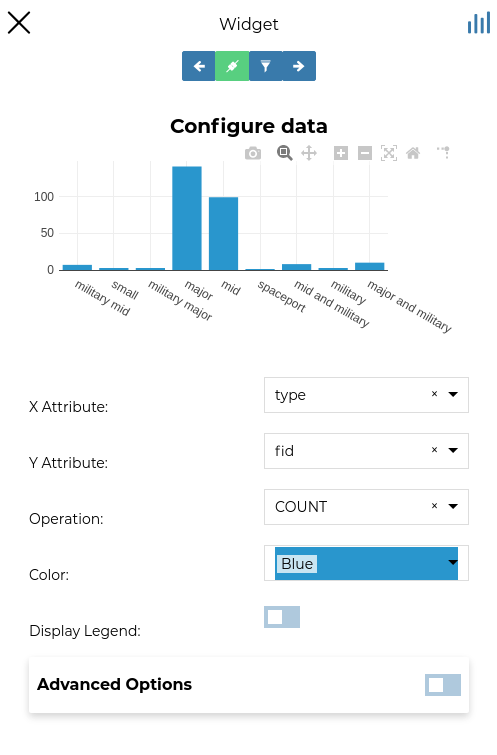
<figcaption><em>Chart Widgets Creation</em></figcaption>
</figure>

The green {.align-middle width="30px" height="30px"} icon means that the chart is connected to the viewport.

At the top of the bar chat, there is the options menu of the widget where you can *Download grapg as png*, *Zoom the wigets* and *Reset axes*.

<figure>
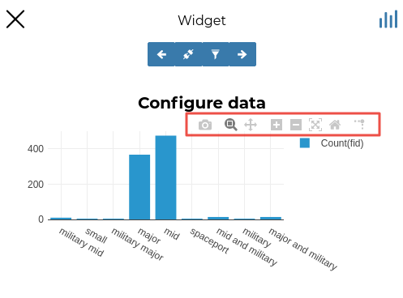
<figcaption><em>Chart Widgets Options</em></figcaption>
</figure>

## Text Widgets

If you select *Text* on the *Widgets* panel you can create *Text Widgets*. Add a *Title* and the desired descriptive text, then click on {.align-middle width="30px" height="30px"}.

<figure>
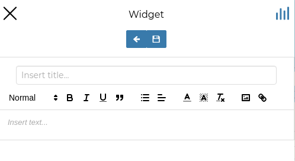
<figcaption><em>Text Widgets Creation</em></figcaption>
</figure>

The resulting widget looks like the following.

<figure>
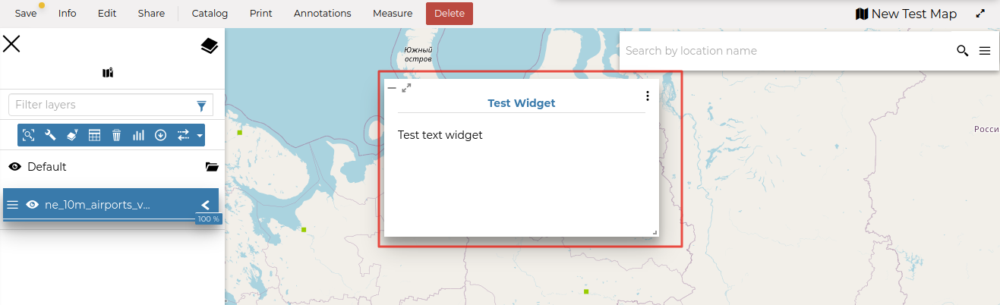
<figcaption><em>My Text Widget</em></figcaption>
</figure>

## Table Widgets

| Through the *Table Widgets* you can add the `attributes-table`{.interpreted-text role="ref"} of the dataset to the map. You can decide to show a subset of the features, through filters, and you can select one or more columns/attributes.

You can also enter a *Title* for each column to be displayed as the table header in place of the Name of the layer field and enter a *Description* for each field to be displayed as a tooltip, visible moving the mouse on the column header.
\| So, choose what attributes you are interested in and click on {.align-middle width="30px" height="30px"}.

<figure>
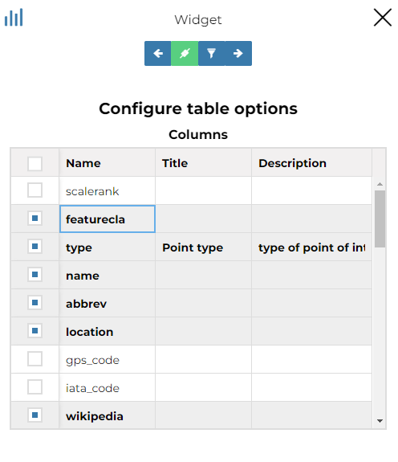
<figcaption><em>Table Widgets Columns</em></figcaption>
</figure>

Insert *Title* and *Description* (optional) and click on {.align-middle width="30px" height="30px"}. The example below shows the *Table Widget* on the map.

<figure>
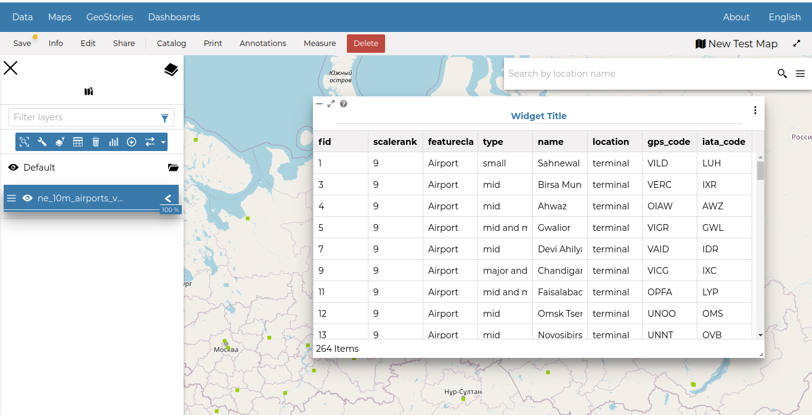
<figcaption><em>Table Widget</em></figcaption>
</figure>

## Counter Widgets

*Counter Widgets* are numeric representations of some attributes. For example you can represent the average speed limit on a road network.

<figure>
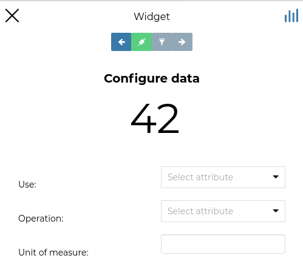
<figcaption><em>Counter Widget Creation</em></figcaption>
</figure>

Click on {.align-middle width="30px" height="30px"}, insert *Title* and *Description* then click on {.align-middle width="30px" height="30px"}.

<figure>
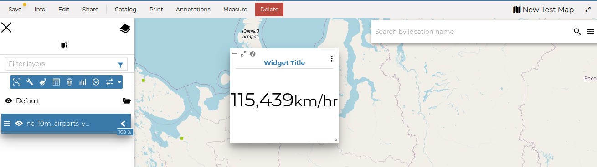
<figcaption><em>Counter Widget</em></figcaption>
</figure>

The GeoNode map viewer is [MapStore](https://mapstore2.geo-solutions.it/mapstore/#/) based, see the [MapStore Documentation](https://docs.mapstore.geosolutionsgroup.com/en/latest/user-guide/widgets/) for further information.
