::: {#getfetureinfo-templates}
Customizing The Datasets\' GetFeatureInfo Templates
================================================
When "clicking" over a feature of a dataset into a GeoNode Map, an info window popups showing a formatted representation of the raw data identified by the coordinates (see Fig. 1)
:::

<figure>
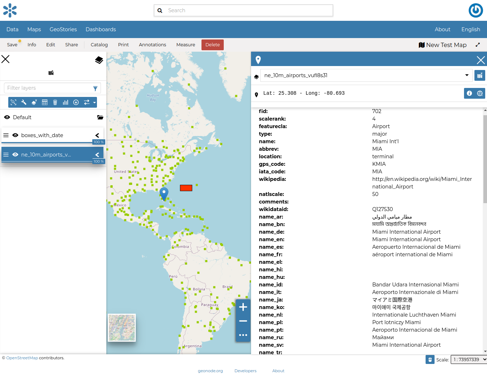
<figcaption><em>Fig. 1</em></figcaption>
</figure>

The way how such information is presented to the user is defined by what we call "GetFeatureInfo Template". The latter is basically an HTML snippet containing some placeholders and special inline codes that instruct GeoServer on how to generate the raw data output.

The outcome is a rendered HTML snippet with the real values replacing the placeholders of the Template.

Currently, GeoNode allows a very simple mechanism to customize the "GetFeatureInfo Template" of a dataset.

It is possible, through the dataset Metadata Editor, to assign a name, a label and also set the attributes we want to display on the GetFeatureInfo output.

As an instance, by using the example above, we can customize a bit the dataset Metadata as shown in Fig. 2

<figure>
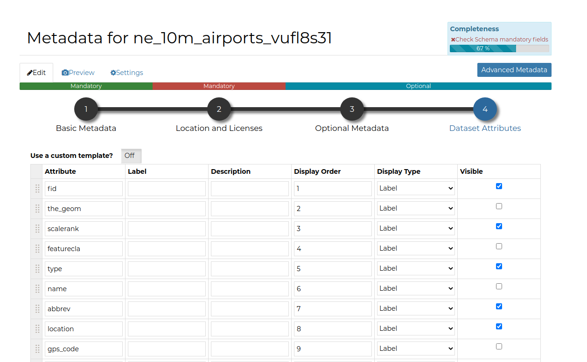
<figcaption><em>Fig. 2</em></figcaption>
</figure>

The "GetFeatureInfo" output will change accordingly as shown in Fig. 3

<figure>
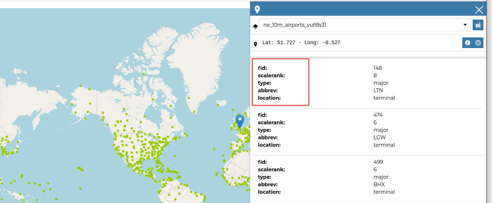
<figcaption><em>Fig. 3</em></figcaption>
</figure>

# Simple Template: Assigning A Media-Type To Attribute Values

The easiest way to render a different media-type (`image`{.interpreted-text role="guilabel"}, `audio`{.interpreted-text role="guilabel"}, `video`{.interpreted-text role="guilabel"} or `iframe`{.interpreted-text role="guilabel"}) to a property value, is to change it from the `Metadata Edit`{.interpreted-text role="guilabel"} attributes panel.

By changing the `Display Type`{.interpreted-text role="guilabel"} of an attribute from this panel as shown in Fig. 4

<figure>
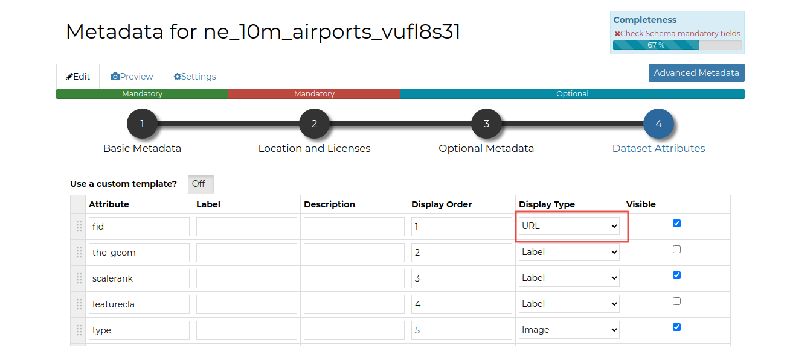
<figcaption><em>Fig. 4</em></figcaption>
</figure>

GeoNode will create automatically the HTML media type when rendering by using the **value** of the selected property.

So, as an example, if, in the figure above, the attribute `NAME` contains values representing some `links` to other resources, GeoNode will create those links automatically for you when clicking over a geometry.

<figure>
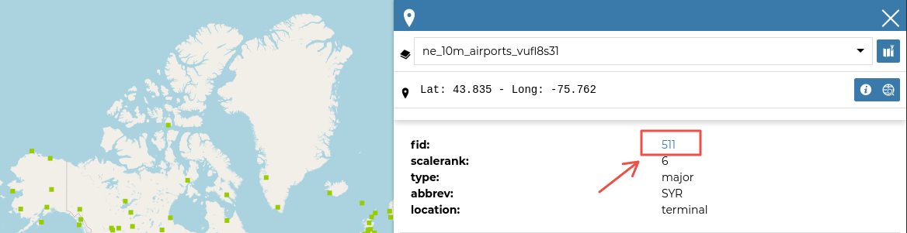
<figcaption><em>Fig. 5</em></figcaption>
</figure>

Selecting `image`{.interpreted-text role="guilabel"} as media-type (Fig. 6)

<figure>
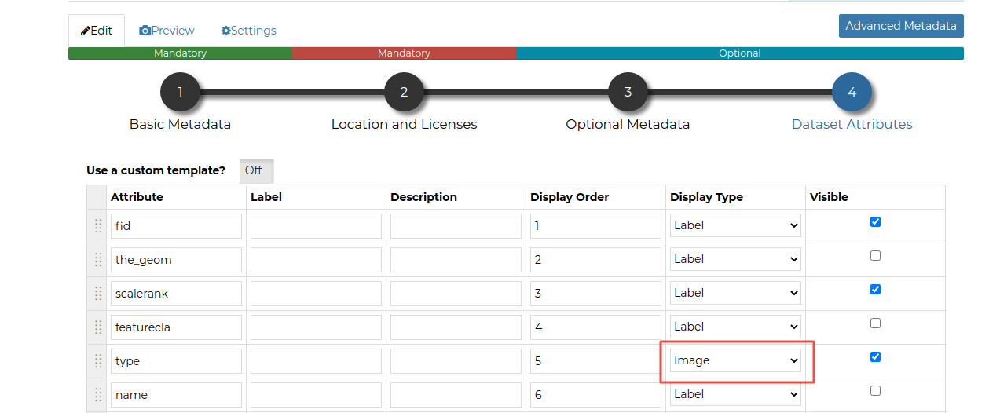
<figcaption><em>Fig. 6</em></figcaption>
</figure>

and editing the contents accordingly (Fig. 7)

<figure>
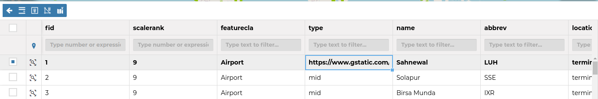
<figcaption><em>Fig. 7</em></figcaption>
</figure>

you will get a nice effect as shown in Fig. 8

<figure>
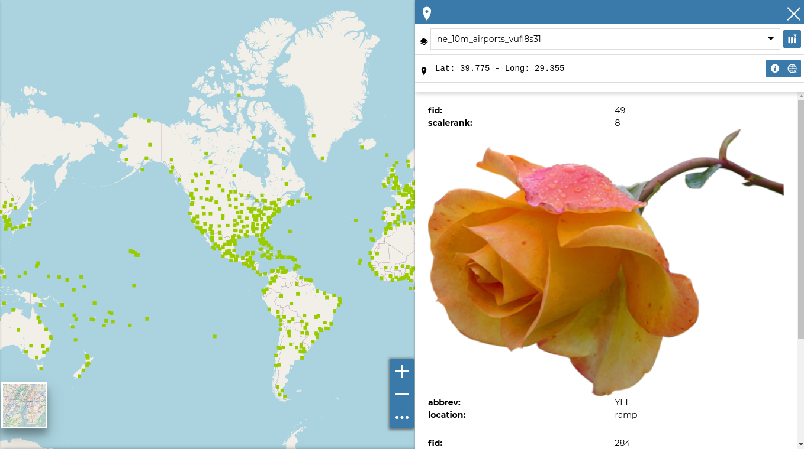
<figcaption><em>Fig. 8</em></figcaption>
</figure>

# Advanced Template: Use A Custom HTML Template

By selecting the option `Use a custom template?`{.interpreted-text role="guilabel"} as shown in Fig. 9

<figure>
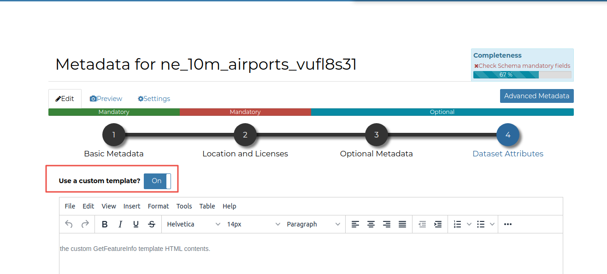
<figcaption><em>Fig. 9</em></figcaption>
</figure>

You will be able to provide your own custom HTML Template for the Feature Info output.
Attributes from the dataset can be represented inside the template using `${properties.ATTRIBUTE}`, where `ATTRIBUTE` is the name of an attribute (field) from your dataset.

The example below uses the `wikipedia` and the `name` attributes to show the name of the airport as a link to the Wikipedia page:

<figure>
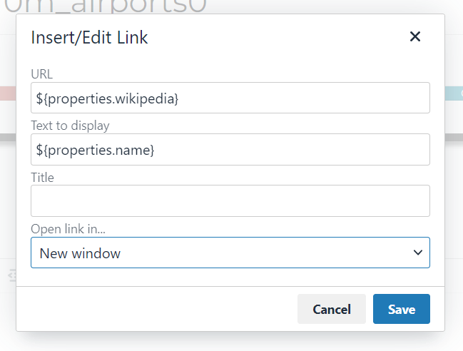
<figcaption><em>Fig. 10</em></figcaption>
</figure>

<figure>
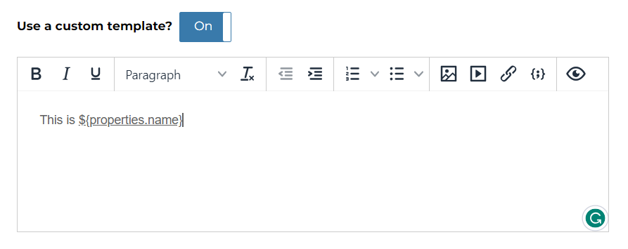
<figcaption><em>Fig. 11</em></figcaption>
</figure>

This is the result shown when you click on an airport

<figure>
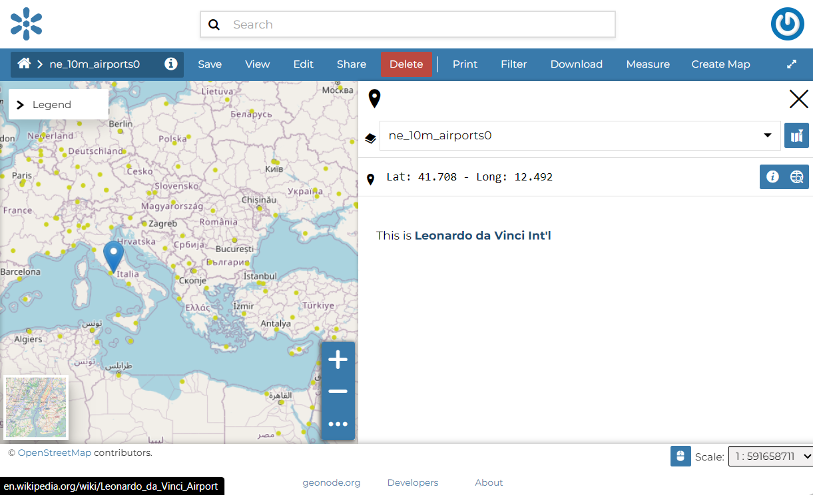
<figcaption><em>Fig. 12</em></figcaption>
</figure>

# Optional: Customizing the HTML WYSIWYG Editor Menu Bar

The `Menu Bar`{.interpreted-text role="guilabel"} and `Tool Bar`{.interpreted-text role="guilabel"} of the HTML Editor, can be easily customized by overriding the `TINYMCE_DEFAULT_CONFIG` variable on `settings.py`{.interpreted-text role="guilabel"} (see `tinyMCE Default Config Settings`{.interpreted-text role="ref"})

There are many plugins and options allowing you to easily customize the editor and also provides some predefined *templates* to speed up the editing.

For more information about the Javascript tool, please refer to <https://www.tiny.cloud/>
