# Map tools and configuration[]{#exploring-maps} {#asemap-switcher}

In this section, we are going to explore all tools provided on the Map View page. From the list of available maps, you can select the map you are interested in and click *View map*, the map will look like this.

<figure>
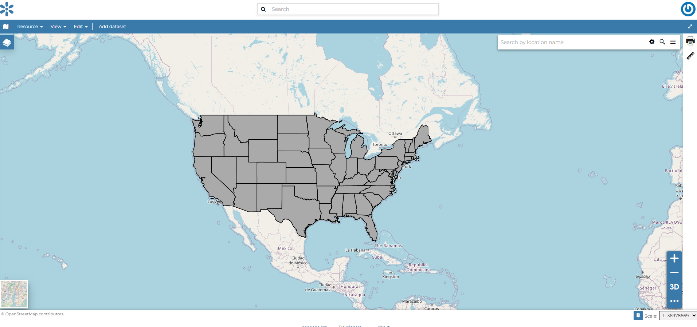
<figcaption><em>The Map View</em></figcaption>
</figure>

The Map View (based on [MapStore](https://mapstore2.geo-solutions.it/mapstore/#/)) provides the following tools:

-   the `toc`{.interpreted-text role="ref"} to manage the map contents;
-   the *Basemap Switcher* to change the basemap (see the next paragraphs);
-   the *Search Bar* to search by location, name and coordinates (see the paragraph below);
-   the `options-menu-tools`{.interpreted-text role="ref"} which contains the link to the datasets *Catalog*;
-   the *Sidebar* which contains, by default, the link to the *Print* tool and to the *Measure* tool;
-   the *Navigation Bar* and its tools such as the *Zoom* tools, the *3D Navigation* tool and the *Get Features Info* tool;
-   the *Footer Tools* to manage the scale of the map, to track the mouse coordinates and change the CRS (Coordinates Reference System).

A map can be configured to use a custom `map-viewers`{.interpreted-text role="ref"}, with which the lsit of tools available in the map can be customized.

::: {.toctree hidden="" maxdepth="1"}
map_viewers
toc
attribute_table
creating_widgets
timeline
options_menu
get_fetureinfo
:::

## Search Bar

| The *Search Bar* of the map viewer allows you to find point of interests (POIs), streets or locations by name.
| Lets type the name of some place then select the first record.

<figure>
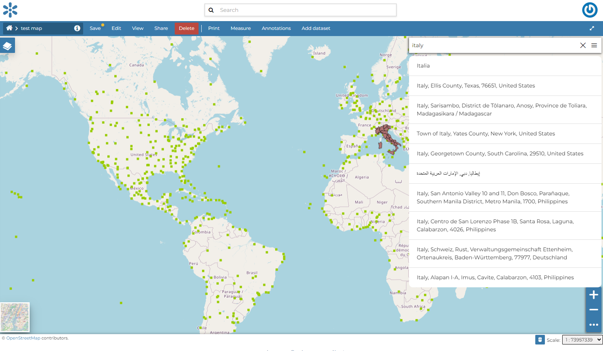
<figcaption><em>The Search Bar</em></figcaption>
</figure>

The map will automatically re-center on that area delimiting it by a polygon in the case of an area, by a line in the case of a linear shape (e.g. streets, streams) and by a marker in the case of a point.

<figure>
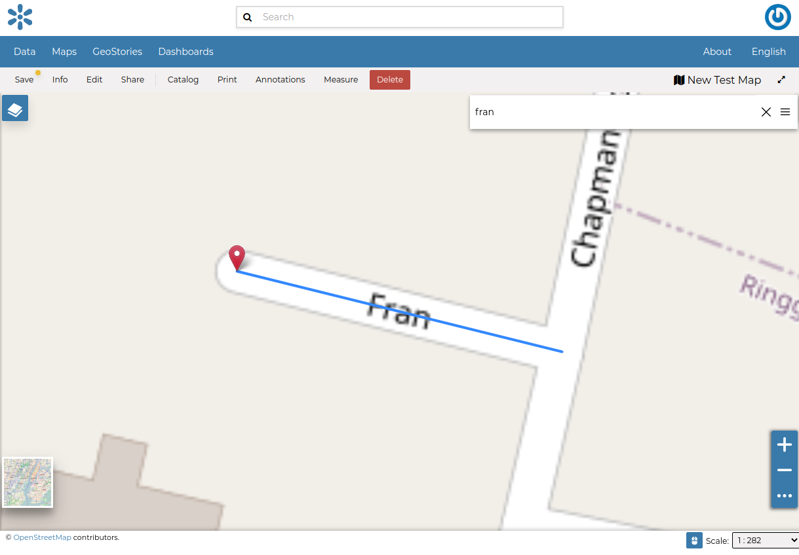
<figcaption><em>Result of a Search</em></figcaption>
</figure>

::: {#sidebar}
Navigation bar
\-\-\-\-\-\-\-\-\-\-\-\--
:::

| The *Map Viewer* makes also available the *Navigation bar*. It is a navigation panel containing various tools that help you to explore the map such as tools for zooming, changing the extent and querying objects on the map.
| By default the *Navigation bar* shows you the zooming buttons {.align-middle width="30px" height="30px"}, 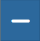{.align-middle width="30px" height="30px"} and 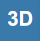{.align-middle width="30px" height="30px"}, other options can be explored by clicking on {.align-middle width="30px" height="30px"} which expands/collapses the toolbar.\|

<figure>
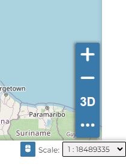
<figcaption><em>The Default Navigation bar</em></figcaption>
</figure>

<figure>
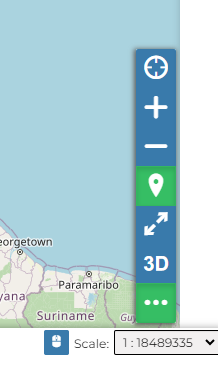
<figcaption><em>The Expanded Navigation bar</em></figcaption>
</figure>

The *Navigation bar* contains the following tools:

-   The *Query Objects on map* allows you to get feature information through the {.align-middle width="30px" height="30px"} button.
    It allows you to retrieve information about the features of some datasets by clicking them directly on the map.

    <figure>
    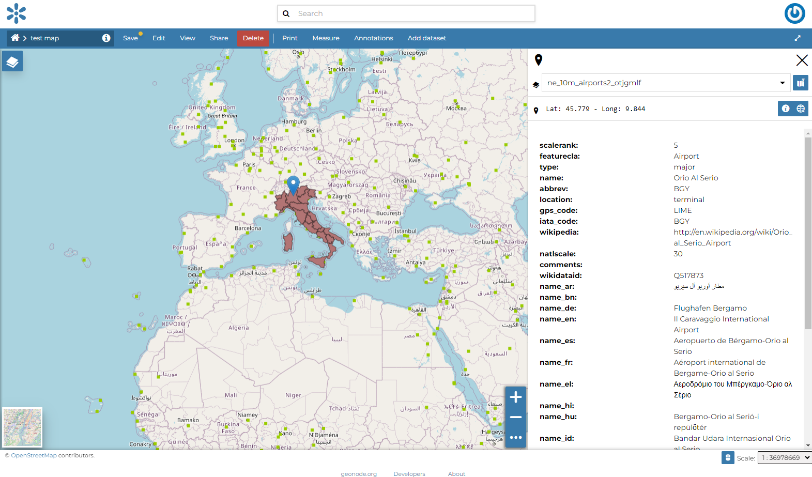
    <figcaption><em>Querying Objects on map</em></figcaption>
    </figure>

    When clicking on map a new panel opens. That panel will show you all the information about the clicked features for each active loaded dataset.

-   You can *Zoom To Max Extent* by clicking {.align-middle width="30px" height="30px"}.

## Basemap Switcher

By default, GeoNode allows to enrich maps with many world backgrounds. You can open available backgrounds by clicking on the map tile below:

-   *OpenStreetMap*
-   *OpenTopoMap*
-   *Sentinel-2-cloudless*

<figure>
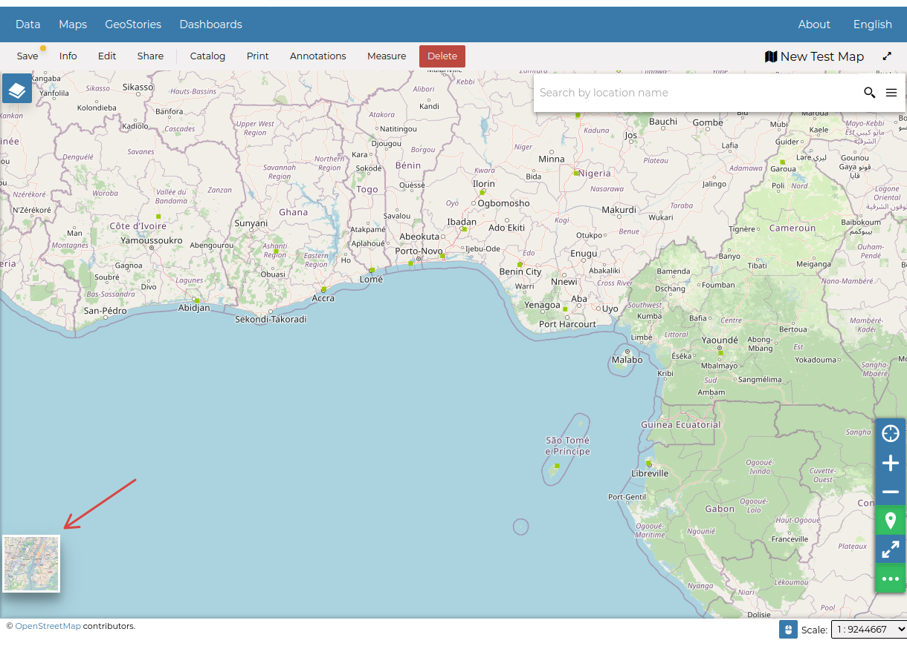
<figcaption><em>The Basemap Switcher Tool</em></figcaption>
</figure>

You can also decide to have an *Empty Background*.

<figure>
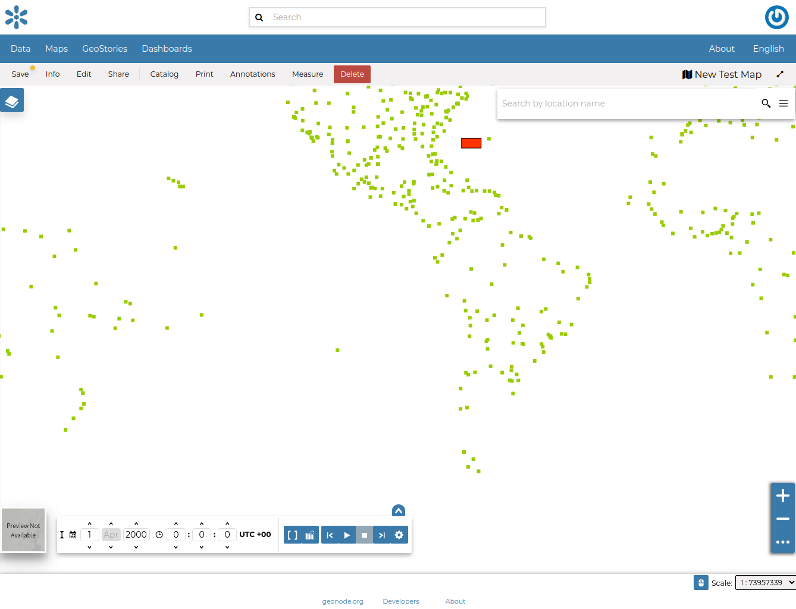
<figcaption><em>Switching the Basemap</em></figcaption>
</figure>

## Footer Tools

At the bottom of the map, the *Footer* shows you the *Scale* of the map and allows you to change it.

<figure>
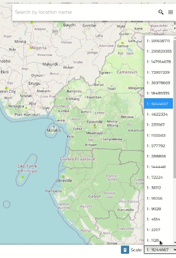
<figcaption><em>The Map Scale</em></figcaption>
</figure>

The {.align-middle width="30px" height="30px"} button allows you to see the pointer *Coordinates* and to change the Coordinates Reference System (CRS), WGS 84 by default.

<figure>
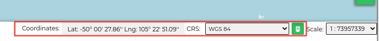
<figcaption><em>The Pointer Coordinates and the CRS</em></figcaption>
</figure>

- [map_viewers](map_viewers.md)
- [toc](toc.md)
- [attribute_table](attribute_table.md)
- [creating_widgets](creating_widgets.md)
- [timeline](timeline.md)
- [options_menu](options_menu.md)
- [get_fetureinfo](get_fetureinfo.md)

