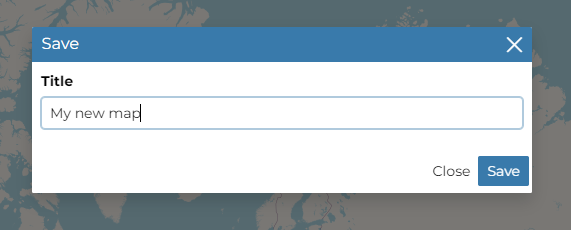
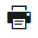
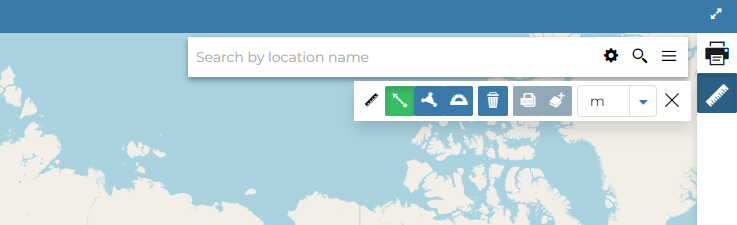
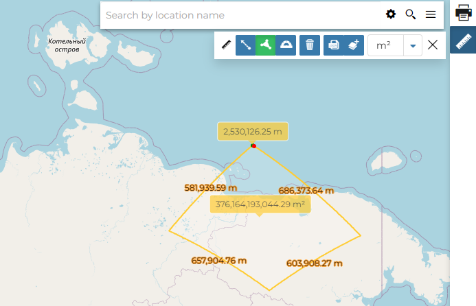

# Other Menu Tools {#options-menu-tools}

At the top of the *Map* and on the *SideBar* of the map there are more menu items which we are are going to explain in this section.

## Add dataset

All the datasets available in GeoNode, both uploaded and remote, can be loaded on the map through the *Catalog*.
Click on the `Add dataset`{.interpreted-text role="guilabel"} option of the *Menu* to take a look at the catalog panel.

<figure>

<figcaption><em>The Datasets Catalog</em></figcaption>
</figure>

You can navigate through datasets and look at their *Thumbnail* images, *Title*, *Description* and *Abstract*.
Click on a dataset to load it into the map, it will be also visible in the `toc`{.interpreted-text role="ref"}.

## Saving a map

| Once all the customizations have been carried out, you can *Save* your map by clicking on the `Save`{.interpreted-text role="guilabel"} option under the `Resources`{.interpreted-text role="guilabel"} options of the *Menu*.

A new popup window will open.

<figure>

<figcaption><em>Saving as Map option</em></figcaption>
</figure>

The current map title is filled by default, You can change it to the prefered naming then click on `Save`{.interpreted-text role="guilabel"}. The page will reload and your map should be visible in the `finding-data`{.interpreted-text role="ref"} list.

## Printing a map

| The [MapStore](https://mapstore2.geo-solutions.it/mapstore/#/) based map viewer of GeoNode allows you to print the current view with a customizable layout.

Click the {.align-middle width="30px" height="30px"} button from the *SideBar*, the **Printing Window** will open.

<figure>

<figcaption><em>The Printing Window</em></figcaption>
</figure>

From this window you can:

-   enter *Title* and *Description*;
-   choose the *Resolution* in dpi;
-   select the format
-   select the coordinate
-   add the scale
-   add grid with label
-   customize the *Layout*
    -   the *Sheet size* (A3, A4);
    -   if include the legend or not;
    -   if to put the legend in a separate page;
    -   the page *Orientation* (Landscape or Portrait);
-   customize the *Legend*
    -   the *Label Font*;
    -   the *Font Size*;
    -   the *Font Emphasis* (bold, italic);
    -   if *Force Labels*;
    -   if use *Anti Aliasing Font*;
    -   the *Icon Size*;
    -   the *Legend Resolution* in dpi.

To print the view click on `Print`{.interpreted-text role="guilabel"}.

## Performing Measurements

Click on the {.align-middle width="30px" height="30px"} button from the *SideBar* to perform a measurement.
As you can see in the picture below, this tool allows you to measure *Distances*, *Areas* and the *Bearing* of lines.

<figure>

<figcaption><em>The Measure Tool</em></figcaption>
</figure>

| To perform a measure draw on the map the geometry you are interested in, the result will be displayed on the left of the unit of measure select menu (this tool allows you to change the unit of measure also).

<figure>

<figcaption><em>Measuring Areas</em></figcaption>
</figure>
