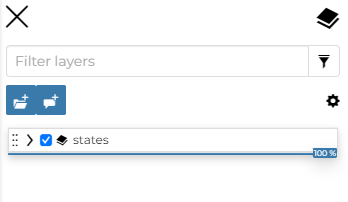
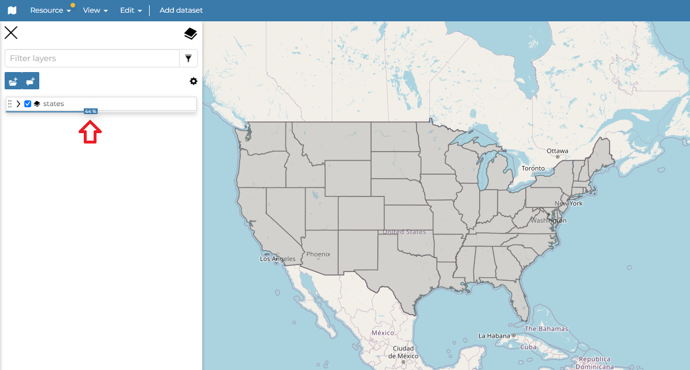
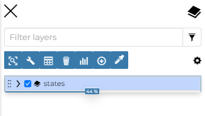
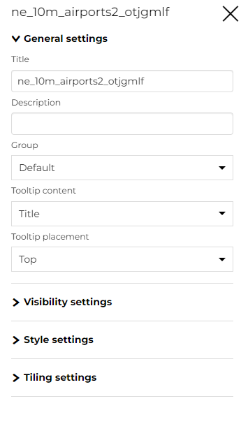
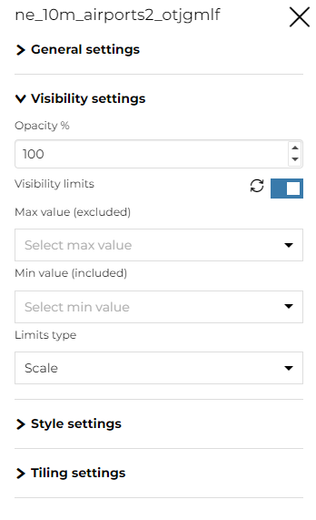
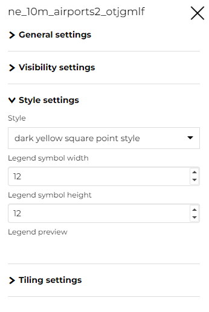
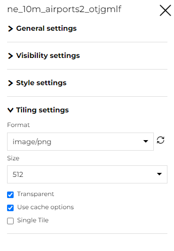
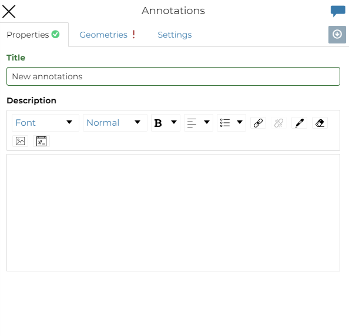
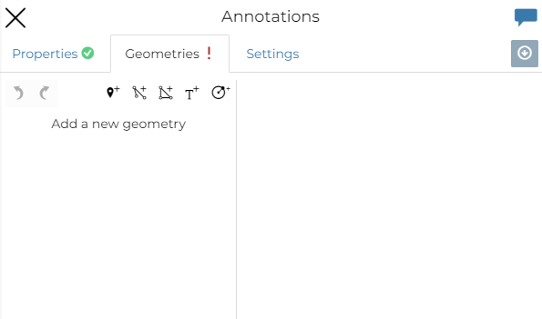

# Table of Contents (TOC) {#toc}

In the upper left corner, click on {.align-middle width="30px" height="30px"} to open the *Table Of Contents*, briefly *TOC* from now on, of the map.
The *TOC* shows all the datasets involved with the *Map* and allows to manage their properties and representations on the map.

<figure>

<figcaption><em>The Table Of Contents (TOC)</em></figcaption>
</figure>

From the *TOC* you can:

-   manage the *TOC Settings* (click on {.align-middle width="30px" height="30px"}) (See the [MapStore Documentation](https://docs.mapstore.geosolutionsgroup.com/en/latest/user-guide/toc/#toc-settings-and-toolbar/) for more information.)
-   manage the datasets *Overlap*;
-   filter the datasets list by typing text in the *Filter Datasets* field;
-   manage the datasets properties such as *Opacity* (scroll the opacity cursor), *Visibility* (click on {.align-middle width="30px" height="30px"} to make the dataset not visible, click on {.align-middle width="30px" height="30px"} to show it on map);
-   add and manage *Annotations* (click on {.align-middle width="30px" height="30px"})
-   manage the *Dataset Settings*, see the next paragraph.

<figure>

<figcaption><em>Scrolling the Dataset Opacity</em></figcaption>
</figure>

Select a *Dataset* from the list and click on it, the *Dataset Toolbar* should appear in the *TOC*.

<figure>

<figcaption><em>The Dataset Toolbar</em></figcaption>
</figure>

The *Toolbar* shows you many buttons:

-   the **Zoom to dataset extent** button allows you to zoom to the dataset extent;
-   the **Filter layer** button that acts directly on a layer with WFS available and filter its content;
-   the **Attribute Table** button to explore the features of the dataset and their attributes (more information at `attributes-table`{.interpreted-text role="ref"});
-   the **Delete** button to delete datasets (click on `Delete Dataset`{.interpreted-text role="guilabel"} to confirm your choice);
-   the **Widgets** button to create Widgets (see `creating-widgets`{.interpreted-text role="ref"}).
-   the **Export data** button;
-   the **Settings** button drives you through the dataset settings customization (see the next paragraph);
-   the **Compare tool** button to *Swipe* or *Spy* the selected layer
-   the **Edit Style** button;

Managing Dataset Settings
\-\-\-\-\-\-\-\-\-\-\-\-\-\-\-\-\-\-\-\-\-\--

The *Dataset Settings* panel looks like the one below.

<figure>

<figcaption><em>The Dataset Settings Panel</em></figcaption>
</figure>

The *Dataset Settings* are divided in three groups:

1.  *General* settings
2.  *Visibility* settings
3.  *Style* settings
4.  *Tiling* settings

In the **General** tab of the *Settings Panel* you can customize the dataset *Title*, insert a *Description*, change/add the *Dataset Group* and change the *Tooltip content* and the *Tooltip placement*.

The **Visibility** tab where you can Change the *Opacity* of the layer and add the *Visibility limits* to display the layer only within certain scale limits

<figure>

<figcaption><em>The Visibility tab on Settings Panel</em></figcaption>
</figure>

The **Style** tab allows you to select the style from the available layer styles and change the *Width* and the *Height* of the *Legend*.

<figure>

<figcaption><em>The Style tab on Settings Panel</em></figcaption>
</figure>

Click on the **Tiling** tab to change the output *Format* of the WMS requests, the *Tile Size* and enable/disable the *Trasparent*, the *Use cache options* and the *Single Tile*.

<figure>

<figcaption><em>The Tiling tab on Settings Panel</em></figcaption>
</figure>

Add an Annotation
\-\-\-\-\-\-\-\-\-\-\--Click on the {.align-middle width="30px" height="30px"} button from the *TOC Toolbar* to enrich the map with special features which expose additional information, mark particular position on the map and so on.
From here the editor can insert a *Title* and a *Description*.

<figure>

<figcaption><em>Annotations panel</em></figcaption>
</figure>

To begin, from the annotation panel, the editor add new annotation by selecting the `Geometries`{.interpreted-text role="guilabel"} tab.

<figure>

<figcaption><em>Add an Annotations</em></figcaption>
</figure>

Here the user can choose between five different types of *Geometries*:

1.  *Marker*
2.  *Line*
3.  *Polygon*
4.  *Text*
5.  *Circle*

See the [MapStore Documentation](https://docs.mapstore.geosolutionsgroup.com/en/latest/user-guide/annotations/) for more information.
