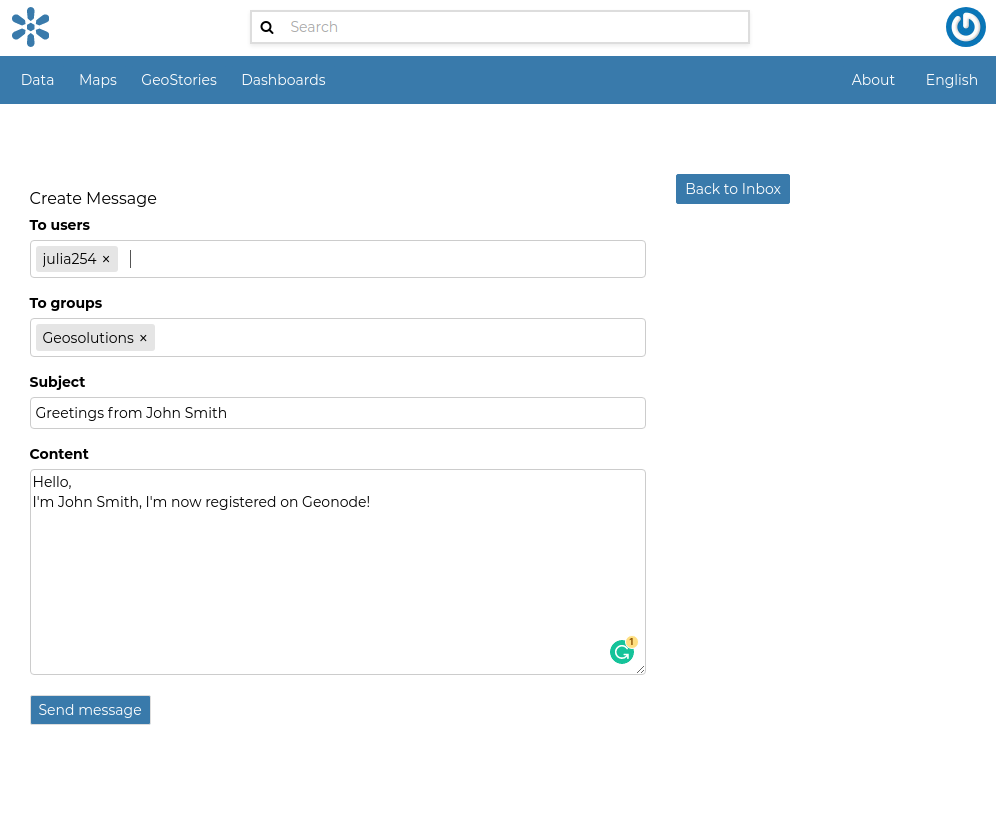
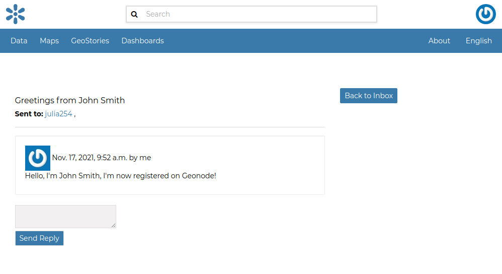
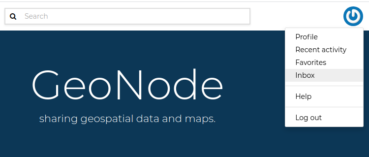
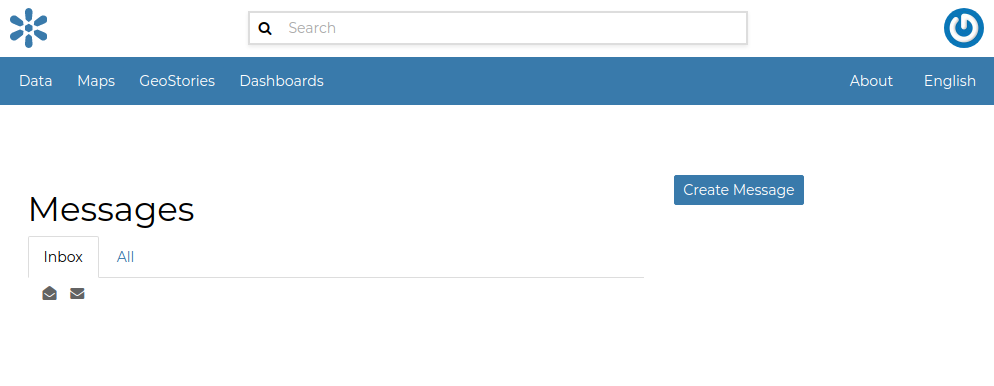
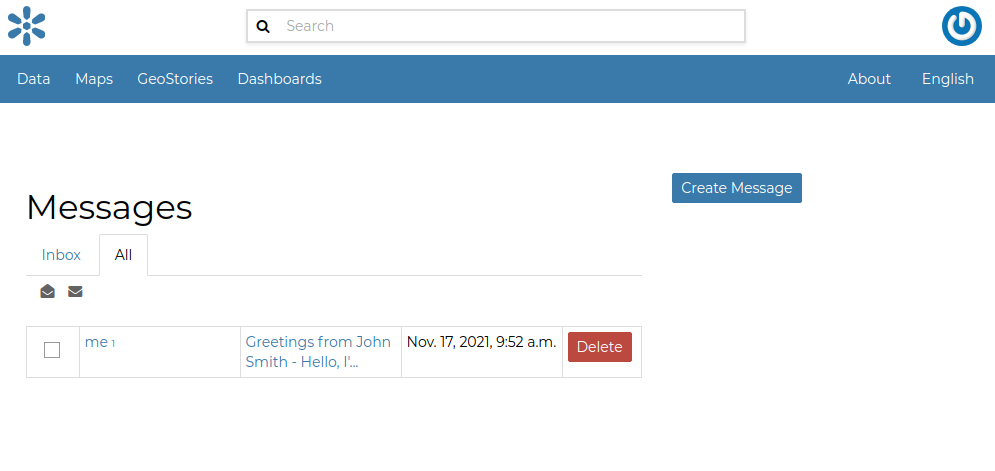
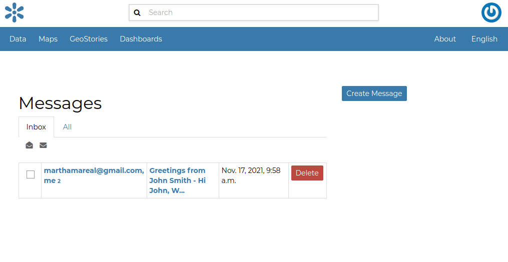
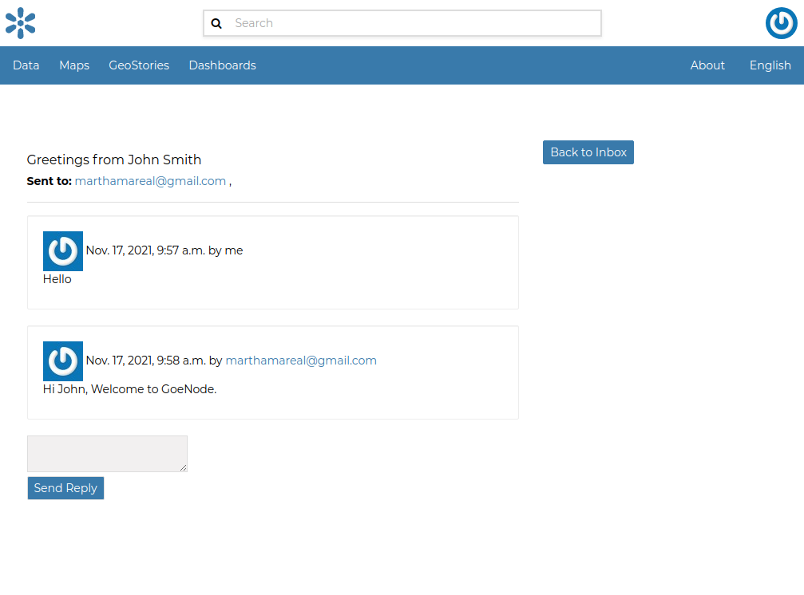

# Contacting other users

| GeoNode allows you to communicate by message with other registered users and groups.
| To send a message to some user and/or groups you can follow the link `Message User`{.interpreted-text role="guilabel"} from your *Profile* page (see `editing-profile`{.interpreted-text role="ref"}) or from the *Profile* details page (see the previous section `user-info`{.interpreted-text role="ref"}) of that user.

<figure>

<figcaption><em>Send message to users and groups</em></figcaption>
</figure>

| Insert your content, type a subject and click on `Send message`{.interpreted-text role="guilabel"} to send the message to the users and groups you have selected.
| You will be redirected to the *Conversation* details page related to the subject.

<figure>

<figcaption><em>Your message</em></figcaption>
</figure>

## The Inbox page

You can view your conversations in your *Inbox* page, reachable through the `Back to inbox`{.interpreted-text role="guilabel"} button (see the picture above) or from the `Inbox`{.interpreted-text role="guilabel"} link of the user menu.

<figure>

<figcaption><em>Inbox link</em></figcaption>
</figure>

The picture below shows how your *Inbox* page should look like.

<figure>

<figcaption><em>Inbox page</em></figcaption>
</figure>

In *Inbox* all the unread messages are listed. You haven\'t received any message yet so your *Inbox* is empty. If you switch to the *All* tab you can see all the conversations you are involved in.

<figure>

<figcaption><em>All your conversations</em></figcaption>
</figure>

When some user send a reply to your message your *Inbox* shows it, see the picture below for an example.

<figure>

<figcaption><em>A reply to your message</em></figcaption>
</figure>

You can open the *Conversation* details by clicking on the *Subject* link.

<figure>

<figcaption><em>Conversation details</em></figcaption>
</figure>

As you can see in the picture above, in the *Conversation* page you have the ability to write a quick reply. Type your message in the text box and click on `Send Reply`{.interpreted-text role="guilabel"} to do that.

In the *Inbox* page there is also the `Create Message`{.interpreted-text role="guilabel"} button that provides you a quick link to the message creation form.
