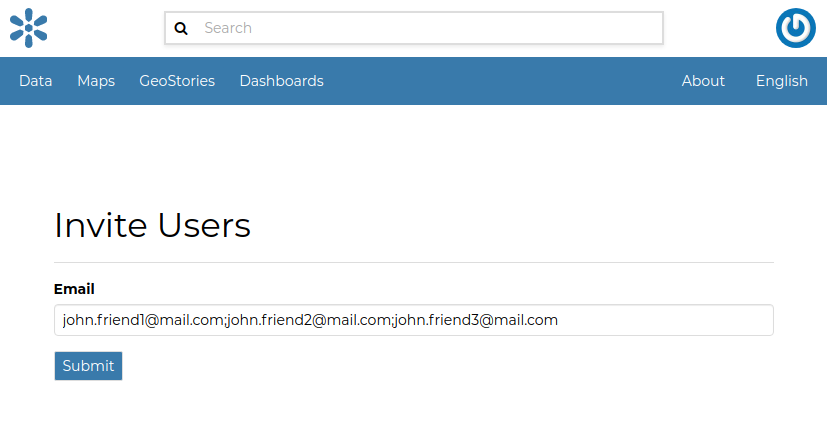

# Interacting with Users and Groups

The GeoNode platform allows you to communicate by message with other GeoNode users and groups of users.

| You can also invite external users to join your GeoNode. In order to do that, click on `Invite Users`{.interpreted-text role="guilabel"} in the *Profile* page (see `editing-profile`{.interpreted-text role="ref"}) or in the `About`{.interpreted-text role="guilabel"} menu in the *Home* page.
| You can invite your contacts typing their email addresses in the input field as shown in the picture below. Click on `Submit`{.interpreted-text role="guilabel"} to perform the action.

<figure>

<figcaption><em>Invite users to join GeoNode</em></figcaption>
</figure>

A message will confirm that invitations have been correctly sent.

<figure>

<figcaption><em>Invitations confirm message</em></figcaption>
</figure>

::: note
::: title
Note
:::

You can invite more than one user at the same time by typing the email addresses inline with a semi-colon separator.
:::

The next sections will show you how to view information about other users and how to contact them.

::: {.toctree maxdepth="1"}
users_info
contacting_users
:::

- [users_info](users_info.md)
- [contacting_users](contacting_users.md)

