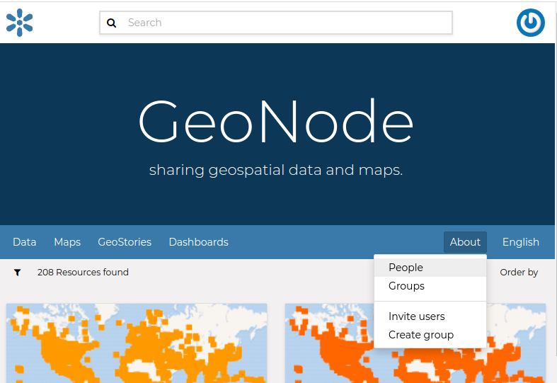
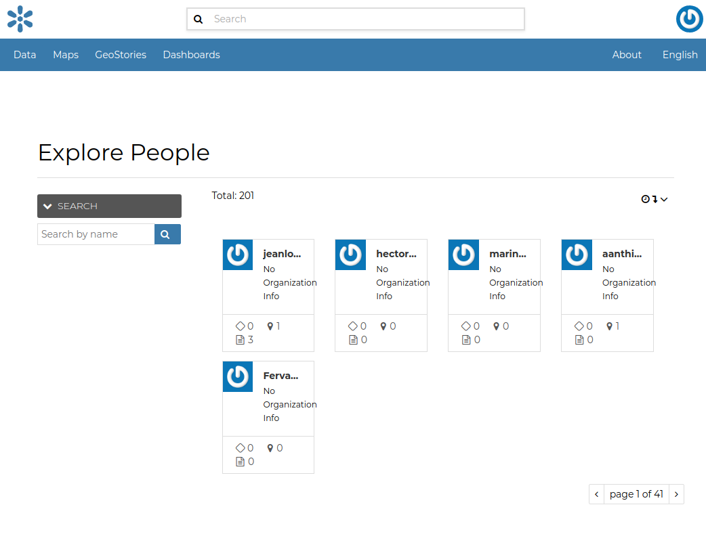
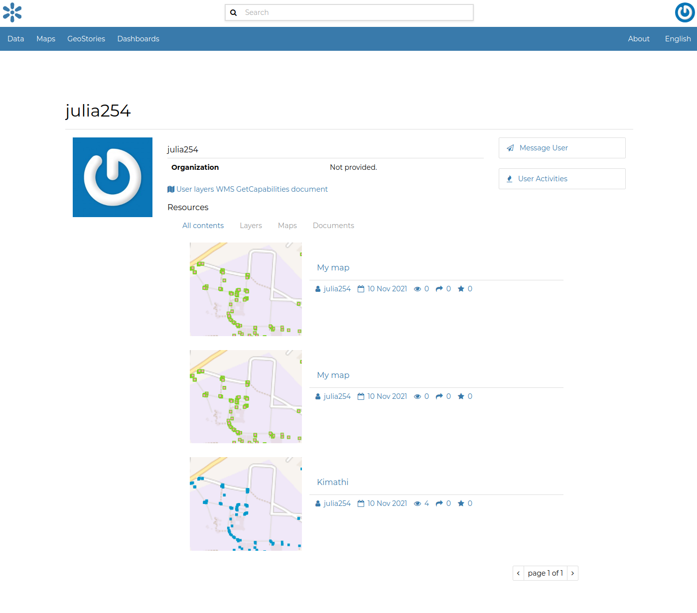
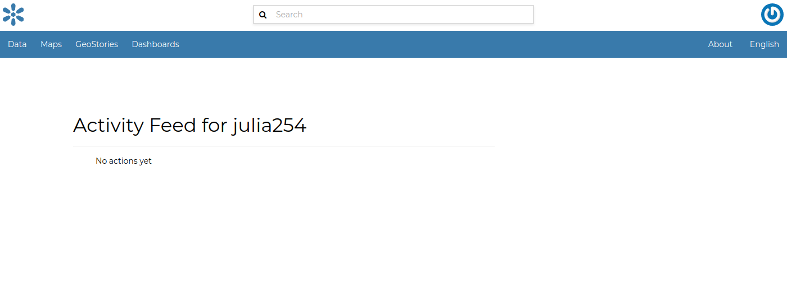
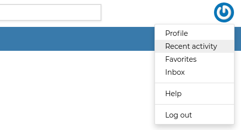
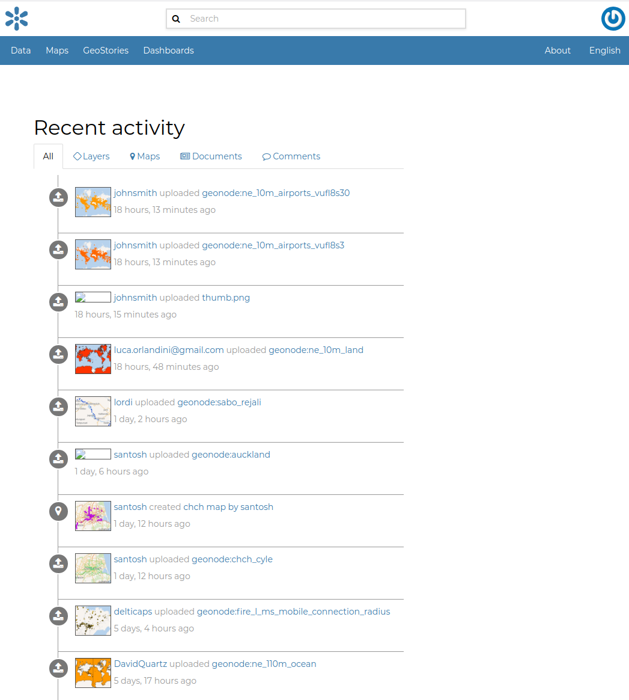

# Viewing other users information {#user-info}

| Once your account is created, you can view other accounts on the system.
| To see information about other users on the system, click the `People`{.interpreted-text role="guilabel"} link of the `About`{.interpreted-text role="guilabel"} menu in *Home* page.

<figure>

<figcaption><em>About menu - People link</em></figcaption>
</figure>

You will see a list of users registered on the system.

<figure>

<figcaption><em>List of the registered users</em></figcaption>
</figure>

| The *Search* tool is very useful in case of many registered users, type the name of the user you are looking for in the input text field to filter the users list.
| Select a user and click on its *username* to access to the user details page.

<figure>

<figcaption><em>User details</em></figcaption>
</figure>

In this page the main information about the user are shown: personal information (organization) and the resources the user owns (datasets, maps, documents and other apps).

Through the `User Activities`{.interpreted-text role="guilabel"} link, in right side of the page, it is possible to visualize all the activities the user has been done.

<figure>

<figcaption><em>User activities</em></figcaption>
</figure>

The `Message User`{.interpreted-text role="guilabel"} link lets you to contact other users, see the next section to read more about that.

It is also possible, in GeoNode, to see the recent activities of all users through the `Recent Activities`{.interpreted-text role="guilabel"} link of the user menu.

<figure>

<figcaption><em>Recent Activities link</em></figcaption>
</figure>

In the picture below an example.

<figure>

<figcaption><em>Recent Activities</em></figcaption>
</figure>

As you can see, you can decide whether to see only the activities related to datasets or those related to maps or comments by switching the tabs.
