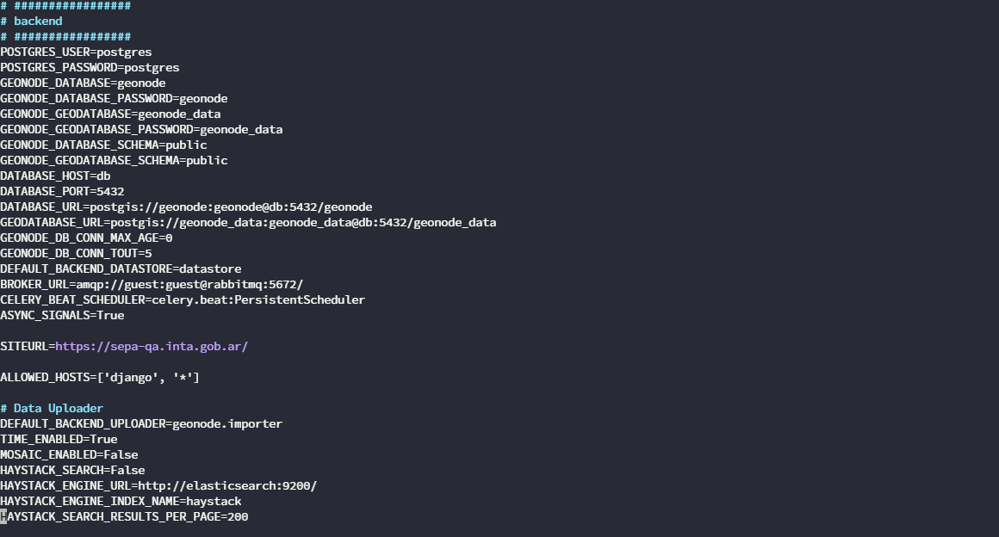

.. _geonode-upgrade:

========================================
Upgrade Process from GeoNode 3.x to 4.x
========================================

The purpose of this document is to detail the process that we will implement to upgrade GeoNode from version 3.x to version 4.x. This document is proposed to ensure that the upgrade process is efficient and understandable for everyone.

The objective of this document is for everyone to understand the processes and steps necessary to carry out the migration.

Table of Contents

* Migration Procedure
* Possible Issues

Version Migration Procedure
===========================

1. Download the New Version
---------------------------

With the following command, we will download the new version of GeoNode from the official source or the corresponding repository:

::

    git clone https://git.kan.com.ar/kan/productos/geoportal express.git -b 4x

It is recommended to do this in a separate directory to keep the previous version intact in case of need.

* Directory of the previous version:

::

    C:\Users\berna\geonode3>

* Directory of the new version:

::

    C:\Users\berna\geonode4>

2. Stop the Current GeoNode
---------------------------

Run the following command in the directory where the current GeoNode is deployed to stop the associated Docker containers:

::

    docker-compose down

3. Modify the GeoNode .env File
-------------------------------

Open the ``.env`` file of the new GeoNode in a text editor:

::

    nano .env

Adjust the environment variables to match the configuration of the previous GeoNode version. This may include variables related to the database, URLs, ports, etc.

4. Start the GeoNode Containers
-------------------------------

Once you have made the necessary changes to the ``.env`` file, run the following command to start the GeoNode containers in the new version:

::

    docker-compose up -d

Possible Issues
===============

The version upgrade of GeoNode also involves changes in some of its components, which can generate various issues. Below, we list some common problems and their possible solutions:

PostgreSQL Container in Constant Restart
----------------------------------------

**Logs:**

::

    2024-02-21 18:06:14.056 UTC [1] FATAL:  database files are incompatible with server

    2024-02-21 18:06:14.056 UTC [1] DETAIL:  The data directory was initialized by PostgreSQL version 13, which is not compatible with this version 15.4.</strong>

**Cause:** The PostgreSQL version of the original GeoNode was lower than the current one.

**Solution:** Downgrade the PostgreSQL version to match the previously installed version in the GeoNode ``docker-compose.yml`` file.

Nginx Container in Constant Restart
-----------------------------------

**Logs:**

::

    2024/02/21 18:11:49 [emerg] 1#1: host not found in "$HTTP_PORT" of the "listen" directive in /etc/nginx/nginx.conf:25

    nginx: [emerg] host not found in "$HTTP_PORT" of the "listen" directive in /etc/nginx/nginx.conf:25

**Cause:** Nginx is having issues replacing the port variables from the ``nginx.conf.envsubst`` file.

**Solution:** Manually replace those variables with the corresponding ports once in the ``nginx.conf.envsubst`` file. After this, Nginx should work correctly and replace the variables normally in the future.
